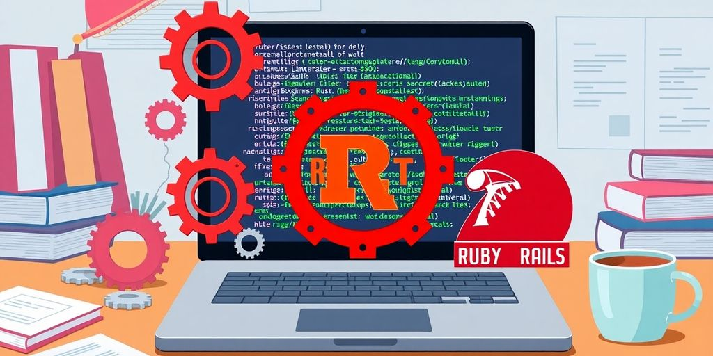
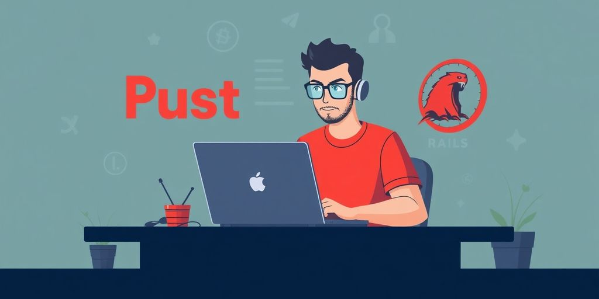

In recent years, the tech world has seen a growing interest in Rust, especially among solo developers. With its promise of performance and safety, Rust is becoming a viable alternative to traditional frameworks like Ruby on Rails. This article will explore why Rust on Rails is gaining traction, how to get started, its key features, and what the future holds for this exciting combination.

### Key Takeaways

*   Rust on Rails combines the best of both worlds: Rust's performance and Rails' developer-friendly features.
*   Setting up a Rust on Rails environment is straightforward, allowing developers to hit the ground running.
*   The framework offers built-in authentication and easy scaffolding to accelerate development.
*   Rust's type safety helps catch errors early, making code more reliable.
*   While there’s a learning curve, the community support for Rust on Rails is growing, making it easier for newcomers.

## Why Rust on Rails Is Gaining Popularity

### The Shift from Ruby to Rust

For years, Ruby on Rails was _the_ choice for rapid web development. It let you build things fast. But times change. Developers are now looking for better performance and safety. Rust offers both. Some developers are moving from Ruby to Rust. They want the speed and reliability of Rust, but they still like the Rails way of doing things. It is a big shift, but it makes sense for many projects.

### Benefits of Rust's Performance

Rust is fast. Really fast. **Its performance is close to C and C++.** This means your web apps can handle more users and do more complex tasks. Ruby is slower. This can be a problem for big apps. Rust also uses memory better. This can save you money on servers. Plus, faster apps make users happy. And happy users stick around. Rust's performance is a big win.

### Community Support and Growth

The Rust community is growing fast. More and more developers are learning Rust. There are now many libraries and tools for Rust web development. This makes it easier to build apps with Rust. The community is also very helpful. If you have a question, someone will answer it. The [community support](https://jetthoughts.com/blog/tags/beginners/) is a big reason why Rust on Rails is becoming popular. It is easier to learn and use when you have a lot of help.

> Rust on Rails is still new, but it has a lot of potential. The combination of Rust's performance and Rails' ease of use is very appealing. As the community grows and more tools become available, Rust on Rails will become an even more attractive option for web development. It is worth keeping an eye on.

## Getting Started with Rust on Rails

So, you're ready to jump into the world of Rust on Rails? Awesome! It might seem a little daunting at first, but trust me, it's not as scary as it looks. Think of it like learning a new recipe. You might mess up the first time, but eventually, you'll be cooking up a storm. Let's get started!

### Setting Up Your Environment

First things first, you need to get your environment ready. This is like gathering all your ingredients before you start cooking. You'll need to have Rust installed. If you don't have it yet, head over to the official Rust website and follow the instructions. It's pretty straightforward. Next, you'll need a _package manager_ like Cargo, which comes with Rust. Cargo helps you manage your project's dependencies. Think of it as your kitchen assistant, making sure you have everything you need. You'll also want to install a Rust on Rails framework. One option is Loco, which aims to bring the Rails experience to Rust.

### Basic Project Structure

Okay, now that you have your environment set up, let's talk about the basic project structure. This is like understanding the layout of your kitchen. A typical Rust on Rails project will have a few key directories:

*   `src`: This is where all your Rust code lives. It's the heart of your application.
*   `Cargo.toml`: This file is like your recipe book. It lists all the dependencies your project needs.
*   `config`: This directory holds your configuration files, like database settings.

**Understanding this structure is key to keeping your project organized.** It might seem confusing at first, but once you get the hang of it, you'll be navigating it like a pro.

### Creating Your First App

Alright, time to create your first app! This is where the fun begins. With Loco, you can use the command-line tool to generate a new project. It's similar to Rails' scaffolding. This will create a basic application structure for you. Then, you can start defining your models, controllers, and views. Don't worry if you don't know what those are yet. You'll learn as you go. Think of it as building with Lego bricks. You start with the basic blocks and then add more complex pieces as you get better. Remember, the goal is to create a fast, simple, and [cost-effective application prototype](https://jetthoughts.com/blog/how-setup-project-that-can-host-up-1000-users-for-free-heroku-startup/).

## Key Features of Rust on Rails

So, you're thinking about Rust on Rails? Cool. Let's check out what makes it tick. It's not just about the hype; there are some solid features that make it worth considering. It's like that new gadget you're not sure you need, but once you try it, you can't go back.

### Built-in Authentication

Forget rolling your own _authentication_ system. Rust on Rails often comes with built-in solutions. This is a huge time-saver. You don't need to spend ages setting up user accounts, passwords, and all that jazz. It's there, ready to go. Think of it as having a bouncer already at the door of your club.

### Scaffolding Made Easy

**Scaffolding is your friend.** It lets you quickly generate basic code for your models, views, and controllers. This means less boilerplate and more time focusing on the cool stuff. It's like having a template for building your house. You still need to customize it, but the foundation is already there.

### Type Safety and Error Handling

Rust is known for its type safety. This means fewer runtime errors. The compiler catches many mistakes before your app even runs. It's like having a super-strict editor for your code. This can save you from some serious headaches down the road. Rust's error handling is also top-notch. It forces you to deal with errors explicitly. No more ignoring potential problems and hoping they go away.

> Rust on Rails combines the safety and performance of Rust with the rapid development capabilities of Rails. This results in a robust and efficient framework for building web applications.

## Comparing Rust on Rails to Traditional Frameworks

### Rust vs. Ruby: A Performance Showdown

Okay, let's get real. Ruby on Rails is great, but it can be like driving a classic car—stylish, but not exactly built for speed. Rust, on the other hand, is like a Formula 1 race car. It's all about _performance_. **Rust is designed to be fast and efficient, often outperforming Ruby in CPU-intensive tasks.** Think about it: if you are building something that needs to handle a ton of requests, Rust can be a game changer. But, if you're building a simple app, the performance difference might not be a big deal. It really depends on what you're trying to do.

### Why Choose Rust Over Other Languages?

So, why pick Rust over, say, Python or Go? Well, Rust brings a unique blend of speed and safety to the table. Python is easy to learn, but it can be slow. Go is fast, but it doesn't have Rust's focus on memory safety. Rust's _memory safety_ features prevent common bugs, which can save you a lot of headaches down the road. Plus, Rust's type system is pretty awesome. It catches errors at compile time, which means fewer surprises when your app is running. It's like having a super smart assistant that double-checks your work before you ship it. For innovative companies in the rail industry, this can be a huge advantage. [modern technologies](https://jetthoughts.com/blog/innovative-rails-companies-leading-tech-revolution-in-2025/) are key.

### The Learning Curve for New Developers

Alright, let's talk about the elephant in the room: Rust has a steep learning curve. It's not the easiest language to pick up. You will need to wrap your head around concepts like borrowing and lifetimes. But, don't let that scare you off! Once you get the hang of it, Rust can be incredibly rewarding. Plus, the Rust community is super helpful. There are tons of resources available to help you learn. Think of it like this: learning Rust is like climbing a mountain. It's tough, but the view from the top is amazing. And hey, at least you can say you did it!

## Real-World Applications of Rust on Rails

So, you're probably thinking, "Okay, Rust on Rails sounds cool, but does anyone _actually_ use it?" The answer is yes! It might not be as mainstream as some other frameworks, but it's gaining traction in some interesting areas. Let's look at some examples.

### Case Studies of Successful Projects

While Rust on Rails is still relatively new, some projects show its potential. Imagine a startup needing a super-fast API. Rust on Rails could be a great fit. Its speed and safety features make it ideal for applications where performance is critical. **Think of things like real-time data processing or high-frequency trading platforms.**

### How Startups Are Leveraging Rust

Startups often need to move fast and efficiently. Rust on Rails lets them do just that. It gives them the speed of Rust with the rapid development capabilities of Rails. This combo is a game changer. _Startups can build robust applications quickly_, without sacrificing performance. Plus, the type safety of Rust helps prevent bugs early on, saving time and money in the long run.

### Freelancing with Rust on Rails

Okay, so you're thinking about freelancing with Rust on Rails? It could be a smart move. While the demand might not be huge yet, it's growing. Companies are starting to look for developers with Rust skills, and if you can combine that with Rails experience, you'll be in a good spot. You could offer services like building high-performance APIs, optimizing existing Rails applications, or even creating entirely new applications from scratch. Plus, you'll be ahead of the curve, which always looks good to potential clients. Consider building a [robust application](https://jetthoughts.com/blog/innovative-ruby-on-rails-projects-boost-your-development-skills-in-2024/) to showcase your skills.

> Rust on Rails is a good choice for projects that need speed, reliability, and a quick development cycle. It's not a silver bullet, but it's a powerful tool in the right hands. If you're looking to stand out from the crowd and offer something unique, Rust on Rails might be worth exploring.

## Challenges and Considerations

### Common Pitfalls for New Users

Okay, so you're diving into Rust on Rails. Awesome! But let's be real, it's not all sunshine and rainbows. One of the first things you might trip over is the _steeper learning curve_ compared to something like Ruby on Rails. Rust is a different beast, and its borrow checker can feel like a personal attack at times. Don't worry, we've all been there.

Another common issue? Dependency management. Cargo, Rust's package manager, is great, but resolving conflicts can be a headache, especially when you're pulling in a bunch of crates for your Rails-ish parts. **Take your time to understand how Cargo works; it will save you a lot of pain later.**

Here's a quick list of things to watch out for:

*   Borrow checker woes
*   Complicated dependency resolution
*   Understanding lifetimes

### Managing Async Code in Rust

Async programming in Rust is powerful, but it can feel like trying to herd cats. You're juggling futures, executors, and `async`/`.await` keywords. If you're coming from a language where async is simpler, this might feel overwhelming.

One big gotcha is accidentally blocking the executor. If you do any long-running synchronous operations in an async function, your whole application can grind to a halt. So, be mindful of what you're doing. Consider using Tokio or Async-std for [robust async runtime](https://www.bacancytechnology.com/blog/ruby-on-rails-development-challanges).

Here are some tips:

*   Use `async/.await` correctly.
*   Avoid blocking the executor.
*   Learn about futures and streams.

### Community Resources and Learning

Luckily, you're not alone on this journey. The Rust community is fantastic. People are generally helpful and patient, even with total newbies. There are tons of resources out there, from the official Rust documentation to blog posts and online courses.

Don't be afraid to ask questions! Seriously, Stack Overflow and the Rust subreddit are your friends. Also, look for Rust on Rails specific forums or communities; they might have solutions to problems you didn't even know you were going to have. Remember, even the most experienced developers started somewhere. Check out the [Rust documentation](https://www.rust-lang.org/learn) for more information.

> The Rust community is one of the most welcoming and helpful in the programming world. Don't hesitate to reach out for help when you're stuck. Seriously, people are happy to assist.

## The Future of Rust on Rails

### Upcoming Features and Improvements

So, what's next for Rust on Rails? Well, the _community_ is buzzing with ideas. Expect to see more refined tooling. Think better debugging, improved code completion, and even slicker integration with other web technologies. There's also talk about making the framework even more approachable for newcomers. No one wants to spend weeks just setting up a basic project, right?

*   Enhanced ORM (Object-Relational Mapping) capabilities.
*   Better support for WebAssembly (Wasm).
*   More comprehensive guides and tutorials.

### Predictions for the Developer Community

Rust on Rails might just shake things up. More developers could start exploring Rust for web projects. This means more job opportunities and a bigger, more active community. Plus, as Rust gains traction, we might see more companies willing to invest in _Rust-based solutions_. Who knows, maybe your next gig will be building a blazing-fast web app with Rust on Rails!

> The rise of Rust on Rails could also lead to a shift in how web development is taught. Universities and bootcamps might start including Rust in their curricula, preparing the next generation of developers for a world where performance and safety are top priorities.

### How Rust on Rails Fits into the Web Development Landscape

Where does Rust on Rails fit in the grand scheme of things? It's not trying to replace everything. Instead, it offers a compelling alternative for projects where performance and reliability are key. Think high-traffic websites, real-time applications, and anything that needs to scale without breaking a sweat. **Rust on Rails could become the go-to choice for developers who want the best of both worlds: the speed and safety of Rust, and the productivity of a Rails-like framework.** It's like having your cake and eating it too, but with less sugar and more memory safety. For example, [Airbnb uses Rails](https://jetthoughts.com/blog/innovative-companies-using-rails-how-they-leverage-ruby-on-for-success-in-2024/) for rapid feature development.

As we look ahead, [Rust on Rails is set to change the way we build web applications.](https://jetthoughts.com) This powerful combination offers speed and safety, making it easier for developers to create reliable software. If you're curious about how Rust can enhance your projects, visit our website for more insights and resources!

## Wrapping It Up

So, there you have it! Rust on Rails is shaping up to be a game changer for solo developers. If you’re tired of the usual frameworks and want something fresh, give it a shot. Sure, it might take a bit to get used to, but the speed and efficiency you can gain are totally worth it. Plus, with tools like Loco making it easier to transition, you might just find your new favorite setup. Whether you’re building a side project or your next big idea, Rust on Rails could be the way to go. Happy coding!

## Frequently Asked Questions

### What is Rust on Rails?

Rust on Rails is a web development framework that combines the Rust programming language with Rails-like features to help developers build web applications more efficiently.

### Why is Rust becoming popular for web development?

Rust is popular because it offers great performance, safety, and memory management. These features make it a strong choice for building fast and reliable web apps.

### How do I start using Rust on Rails?

To start with Rust on Rails, you need to set up your development environment, create a new project, and follow tutorials to build your first application.

### What are the main features of Rust on Rails?

Rust on Rails includes built-in authentication, easy scaffolding for quick setup, and strong type safety to help catch errors early.

### How does Rust on Rails compare to Ruby on Rails?

Rust on Rails is faster and safer than Ruby on Rails, but it may have a steeper learning curve for beginners who are new to Rust.

### What challenges might I face when using Rust on Rails?

Some challenges include understanding Rust's async programming model, managing dependencies, and finding community resources to help you learn.