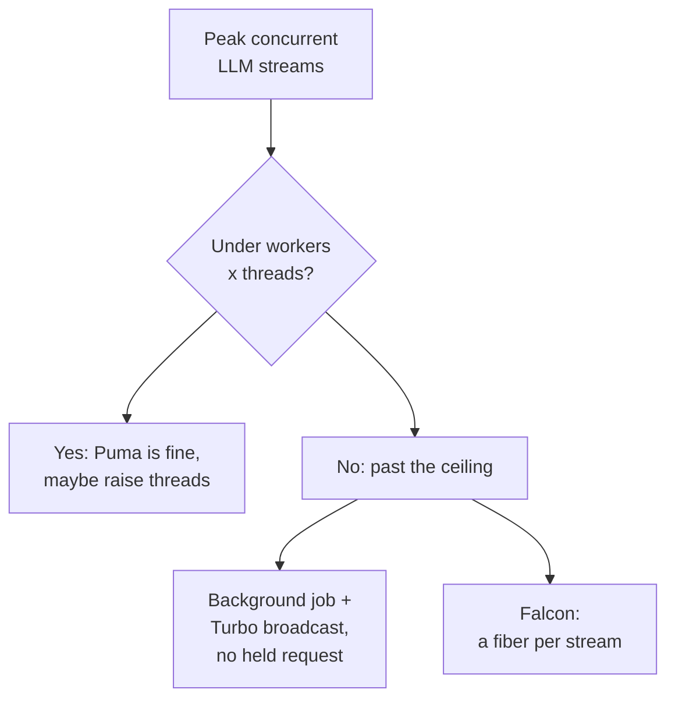

A streamed LLM reply takes somewhere between 10 and 60 seconds to finish, and for the whole of that time the Rails thread serving it does almost nothing. It holds the connection open, writes a token whenever the provider sends one, and waits. Ruby fibers exist for exactly this shape of work, which is why LLM streaming in Rails keeps pulling teams toward the [async](https://github.com/socketry/async) gem and Falcon.

Before you swap web servers, though, it's worth doing the arithmetic. On plenty of apps the boring answer wins.

## Three threads, thirty-second streams

A new Rails 8.1 app ships Puma with 3 threads per worker - a default [Rails cut from 5 back in 7.2](https://guides.rubyonrails.org/7_2_release_notes.html), because on CPU-bound request cycles more threads mostly meant more GVL contention and worse latency. For classic CRUD traffic that was the right call. A request that finishes in 80ms releases its thread 12 times a second, so 3 threads go a long way.

A chat endpoint breaks that assumption. Stream a reply for 30 seconds and the thread is gone for 30 seconds.

Run two Puma workers with the default 3 threads each and you can hold 6 open streams, total, across the whole app. User number seven gets a spinner until someone else's answer finishes. Scale that to 100 concurrent streams and you need 100 threads, which at 3 per worker means 34 worker processes, each one a full copy of your Rails app doing nothing but babysitting sockets.

You can redo that arithmetic for your own app in a minute; the only inputs are the Puma settings you already have and an honest estimate of peak concurrent chats.

This is not a CPU problem: [YJIT speeds up the code your CPU actually executes](/blog/ruby-3-4-yjit-performance-guide/), and here the thread isn't executing anything. Waiting is the workload.

## A parked fiber costs kilobytes, not a thread

A fiber pauses and resumes cooperatively; thousands fit in one thread. Since Ruby 3.0, the [fiber scheduler interface](https://docs.ruby-lang.org/en/3.4/Fiber/Scheduler.html) lets a scheduler hook the moments where Ruby would block: `io_wait`, `kernel_sleep`, DNS resolution.

When a fiber hits a read that isn't ready, the scheduler parks it, runs other fibers, and comes back once the socket has data.

For an LLM stream, that changes the whole cost model. The 30 seconds of waiting becomes a parked fiber, a few kilobytes of state in a table, instead of an occupied thread.

## Falcon runs each request in a fiber

[Falcon](https://github.com/socketry/falcon) is a Rack-compatible HTTP server built on the async gem by Samuel Williams. Its README states the model in one line: "each request is executed within a lightweight fiber and can block on up-stream requests without stalling the entire server process." The async gem underneath it is [built for thousands of clients per process](https://github.com/socketry/async).

Blocking on an upstream request is the entire job of an LLM proxy endpoint.

Your action opens a connection to the provider, reads chunks for half a minute, and relays them, and under Falcon each of those open streams is a parked fiber. The hundred streams that needed 34 Puma workers a section ago fit in a single process.

The production setup is its own post. We've covered [Falcon's benchmarks, config, and migration path](/blog/falcon-web-server-async-ruby-production/) there; this one stays on the LLM-shaped question of what changes in your code and when the switch is worth it.

## What changes in your Rails code

Less than you'd expect. The fiber scheduler hooks Ruby's own I/O, so `Net::HTTP`, and everything built on it, yields automatically inside Falcon. The `pg` driver has cooperated with the fiber scheduler since version 1.3. Your models, controllers, and service objects don't know the difference.

Two settings matter: isolate per-request state by fiber instead of by thread, and raise `pool:` in `config/database.yml` to match the concurrency you actually expect. The first one is a single line:

```ruby
# config/application.rb
config.active_support.isolation_level = :fiber
```

Here's a streaming endpoint using [RubyLLM](https://rubyllm.com/streaming), whose `ask` method yields chunks as they arrive:

```ruby
class MessagesController < ApplicationController
  include ActionController::Live

  def create
    response.headers["Content-Type"] = "text/event-stream"
    sse = SSE.new(response.stream, event: "delta")

    chat = Chat.find(params[:chat_id])
    chat.to_llm.ask(params[:content]) do |chunk|
      sse.write({ text: chunk.content }) if chunk.content
    end
  ensure
    sse&.close
  end
end
```

The same controller runs on both servers. On Puma, [`ActionController::Live` moves the action onto a separate thread](https://api.rubyonrails.org/classes/ActionController/Live.html) from a `Concurrent::CachedThreadPool`, and the docs carry two warnings worth reading twice: you "must call close on your stream" or the socket can stay open forever, and the default `Rack::ETag` middleware "will buffer your response" - set an `ETag` or `Last-Modified` header yourself to opt out of that buffering.

One honest caveat about the code above: `Live` spawns its worker thread unconditionally, on Falcon too. The request stops pinning a server thread, but each open stream still costs a pool thread until you drop `ActionController::Live` and write the response body directly - which is the idiomatic shape under Falcon, since the server itself already streams.

Fibers in a process also share one thread: a CPU-heavy stretch of Ruby, or a C extension doing its own blocking I/O outside Ruby's hooks, stalls every fiber in that worker until it returns.

## Rate limiting the upstream calls

Multiplexing hundreds of streams creates a new failure mode: hundreds of simultaneous calls against your OpenAI or Anthropic account, and a wall of 429 responses.

The async gem ships `Async::Semaphore` for exactly this:

```ruby
LLM_LIMIT = Async::Semaphore.new(5)

def stream_reply(chat, content, &render)
  LLM_LIMIT.acquire do
    chat.to_llm.ask(content, &render)
  end
end
```

Five requests run against the provider at once. Number six parks, costing nothing, until a slot frees up. Compare that with thread-based Rails, where the queueing happens invisibly in Puma's backlog and you can't see or tune it from application code.

## When Puma is fine



Do the division before the migration. Your ceiling is workers times threads, so 3 workers at 3 threads holds 9 concurrent streams, and if your product peaks at 5 people chatting at once, Puma serves them today with zero new operational surface. Raising `RAILS_MAX_THREADS` on an I/O-parked endpoint buys more headroom cheaply, since [Puma's own docs note that blocking I/O is the case where extra MRI threads really do run in parallel](https://github.com/puma/puma).

Or sidestep the question entirely: move the LLM call into a background job and broadcast chunks over Turbo Streams, so no HTTP request stays open at all. The job is a dozen lines - [the RubyLLM post shows it in full](/blog/rubyllm-rails-getting-started/#streaming-into-a-turbo-view).

That pattern runs happily on Puma plus [Solid Queue](/blog/rails-8-solid-queue-migration-guide/), and it's where we start on most client apps because it also survives deploys and page reloads better than a raw SSE socket. Its cost is a job worker held for the stream's duration, so the arithmetic moves to your job concurrency instead of your web threads.

Falcon's costs are real too. Some gems assume thread-local state and thread-sized connection pools, and your team's Puma debugging instincts transfer only partially. Reach for it when concurrent streams are the product, the way they are in the [agent and RAG apps we've been building in Ruby](/blog/getting-started-langchain-ruby-complete-guide/), rather than because fibers sound modern.

## Where to start

Measure your peak concurrent streams for a week. If the number stays under workers times threads, raise a thread count and move on. Past that ceiling, prototype one streaming endpoint on Falcon in staging with `isolation_level = :fiber` set, and watch the database pool, since that's the first thing the extra concurrency exhausts.

If you're adding LLM features to a Rails app and want someone who has shipped this stack in production to look at your traffic profile first, [our Rails team does that assessment](/services/app-web-development/) before any migration work starts.

**Further reading:**

- [Falcon](https://github.com/socketry/falcon) - the fiber-per-request server itself
- [async](https://github.com/socketry/async) - the concurrency framework underneath it
- [Fiber::Scheduler docs](https://docs.ruby-lang.org/en/3.4/Fiber/Scheduler.html) - the interface that makes blocking I/O yield
- [ActionController::Live API docs](https://api.rubyonrails.org/classes/ActionController/Live.html) - both warnings quoted above, in context
- [RubyLLM async guide](https://rubyllm.com/async/) - semaphore rate limiting and fiber-safe usage

<!-- Reference cadence: thoughtbot -->
