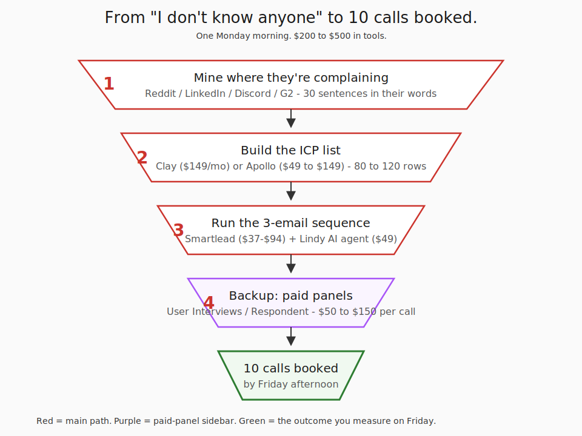
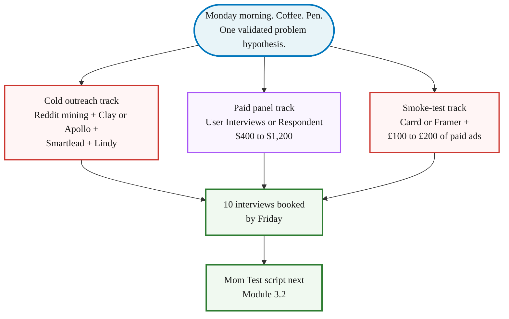
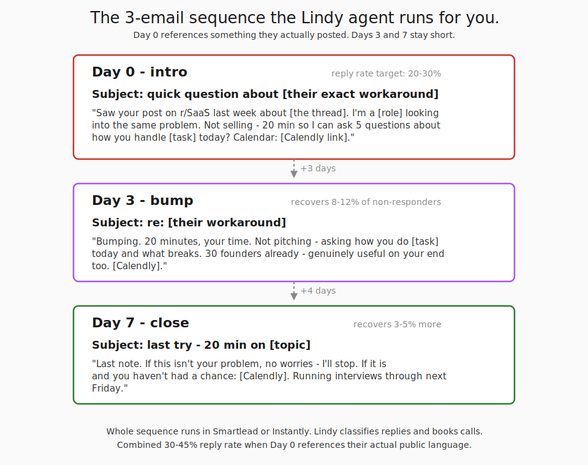

> **Module 3 · Step 1 of 3** · [Tech for Non-Technical Founders 2026](/blog/tech-for-non-technical-founders-2026/) course.
> Input: a validated problem you suspect is real (Module 0 routed you here). Output: 10 ICP interviewees booked for next week.

This is interview recruitment, not sales. You are asking for time and insight, not money. Different message template, different channels emphasized, different reciprocity. Do not use the Module 6 cold email script here - it will scare interview subjects who don't yet know you have a product.

A consumer-app founder we spoke with last month opened with the same plan most non-technical founders try first: "I'll just message my LinkedIn network." She sent 60 polite DMs over a week and booked 3 calls. Two were old colleagues who showed up to be nice. One was real, then ghosted on reschedule. She pivoted to the stack below on a Monday morning - Reddit mining, an Apollo list, a Lindy AI agent, and $400 on a User Interviews panel - and had **12 calls booked by Thursday afternoon**. Same founder, same problem hypothesis, same week. The difference was where she looked and how she opened.

## Why this matters in 2026

A Y Combinator manifesto says you can validate a startup without writing a line of code. It leaves out the hard part: getting the first 10 strangers to spend 30 minutes telling you about their problem. Most non-technical founders quit here. They post once on LinkedIn, ask their network, get three polite "sounds cool" replies, and start building anyway. Then they spend $30K to $80K finding out the problem they assumed was real wasn't. The 2026 outreach stack costs $200 to $500 in tools and panels and ships you 10 honest conversations in one week. Validation isn't the bottleneck anymore. Discipline is.

## Before you start: write three sentences

Outreach without a hypothesis is cold-calling. You need three lines on paper, in your own words, before you open Reddit:

1. **Customer profile (one sentence).** *Who* is this person, in real-world detail? Role, company size, the moment in their week when the pain happens. Not "small-business owners" - "a 12-person law-firm office manager on Friday afternoon trying to invoice ten clients before Quickbooks logs her out."
2. **Business profile (one sentence).** What kind of business are *you* building? B2B SaaS, B2B services, B2C app, marketplace. Free or paid. Self-serve or sales-led. This decides which Reddit, which Apollo filter, which interview question you lead with.
3. **Solution hypothesis (one sentence).** Not a feature list - a sentence about the change. *"I think a one-click invoice export to Stripe and Wave saves the office manager 90 minutes every Friday."* You won't pitch this in the calls (the Mom Test in [Chapter 3.2](/blog/mom-test-ask-about-past-not-future/) forbids it), but you need it written down to know which conversations confirm the hypothesis and which kill it.

If you can't write all three in 10 minutes, do that first. The deeper version of these three lines is the [one-page Product Brief in Module 4](/blog/one-page-product-brief-vibe-prd/) - that's the structured workshop. For Module 3.1 outreach, a napkin draft of the three sentences is enough; you'll refine them in Module 4 after the 10 interviews land.

## The 5-step outreach sequence

The whole stack runs on five steps. Each step picks up where the last one ended. You don't need a network, a personal brand, or a warm intro. You need a Monday morning and a credit card.

### Step 1 - Mine where they're already complaining

The people who have your problem are already typing about it somewhere. Your job is to read for two hours before you write a single message.

Open Reddit and search the exact words your prospect would use. For a typical ICP-E B2B SaaS founder, the productive subreddits are **r/SaaS**, **r/startups**, **r/Entrepreneur**, and one or two niche subs that match the buyer (r/sysadmin if your product touches IT, r/marketing if it touches CMOs, r/smallbusiness if it touches owner-operators). Sort by Top - Past Month. Read the top 50 posts. Look for two things: complaints (the exact wording of the problem) and existing workarounds (what they currently do instead).

LinkedIn search is the second well. Type the problem in quotes and filter to Posts - Past Week. The "loudest 1% of LinkedIn" is your sample - the people willing to complain in public are also the people willing to take a 20-minute call.

Twitter/X search is the third. Search the exact problem phrase and filter by people who've tweeted about it in the last month. DM them directly - the 280-character constraint means their complaints are precise, and a short DM matching that register lands well. The friction is low: no connection request, no email lookup.

Personal network referrals come next and are the cheapest channel founders ignore. Email or text 10 people you already know and ask: "Do you know anyone who does [the painful task] regularly? I'm trying to set up research calls, not sell anything." A warm referral books at 70%+ show rates versus 30% for cold outreach.

Industry Discord servers and Slack communities are the fifth. The Indie Hackers Discord, the Lovable Discord, the No Code Founders Slack - most pillar communities for the 2026 founder have public channels where the daily question is "has anyone else hit X."

G2 and Capterra reviews are the fourth. Pull every 2-star and 3-star review for the closest competitor or workaround tool. The text inside is the exact wording of pain a stranger willingly typed for free.

Reddit needs a separate warning: don't blast a launch post on day one. Read the sub for a week, comment on three threads with real answers, then post your research question. The [self-promotion on Reddit guide](/blog/self-promote-on-reddit-without-getting-banned-promotion/) covers the karma floor and timing that keeps moderators from auto-removing you.

Write down 30 specific sentences in their language. That bank is the raw material for the messages in Step 3. Don't paraphrase - use their words.

### Step 2 - Build the ICP list

Now you turn the language into a list. Two tools matter in 2026.

**Clay** (clay.com, ~$149/mo for the Starter plan in 2026) is the data orchestration layer. You define your ICP filters (job title, company size, industry, tech stack used) and Clay enriches contact rows from 50+ sources at once. It handles the deduplication and the email-verification step. If you need 100 contacts and you want them clean, this is the cheapest hour you'll spend.

**Apollo** (apollo.io, $49 to $149/mo depending on credits) is the budget alternative. Smaller database than Clay, but the search filters are good and the export-to-CSV is one click. For a single morning of list building targeting 50 to 100 contacts, Apollo is enough.

Filter criteria for B2B founders should land on six dimensions: (1) **job title** (the buyer or the user, not both at once), (2) **company size** (50 to 500 employees is the sweet spot for early validation - small enough to reach a decision-maker, big enough to have the problem), (3) **industry** (one vertical first; expand later), (4) **geography** (one timezone, so calls are bookable), (5) **technology used** (if the product replaces or integrates with a specific tool, filter for it), (6) **recent funding or hiring signal** (companies with momentum are more responsive). Export 80 to 120 rows. You'll send to 50, hold 30 in reserve, drop the bottom 40.

For consumer founders, Apollo and Clay don't help much - your buyer is on Reddit and Discord, not a B2B database. Skip to Step 4 (paid panels) and Step 5 (smoke-test landing page) earlier.

### Step 3 - Run the sequence

This is where most founders fail. They write one cold email, send it manually from Gmail, and hit a 2% reply rate. The 2026 stack does better because the sequence runs itself and the AI agent handles the calendar back-and-forth.

**Smartlead** (smartlead.ai, $37 to $94/mo) or **Instantly** (instantly.ai, similar pricing) is the sending layer. You upload the list from Step 2, write a 3-email sequence, and the tool handles deliverability (warmup, rotating inboxes, bounce handling). A single founder running 50 messages a day from one inbox lands in spam by day 4. These tools rotate across 5 to 10 inboxes you set up on Google Workspace or Microsoft 365 and keep the per-inbox volume low enough to survive Gmail filters.

**Lindy** (lindy.ai) is the AI agent layer that came of age in 2025-2026. You configure a Lindy to (a) read replies in your inbox, (b) classify them as "yes / maybe / no / unsubscribe," (c) send the right follow-up template, (d) when a reply says yes, send your Calendly link and confirm the booking in your calendar. The agent handles the 3-day back-and-forth most founders abandon. A founder running Lindy on a 50-message sequence gets 8 to 12 calls in the calendar without touching the inbox after day one. Lindy plans start around $49/mo.

Here is the 3-email sequence to copy. Replace the bracketed parts with your specifics.

**Day 0 - intro.** Subject line: `quick question about [their exact workaround]`. Body:

> Hi [first name],
>
> Saw your post on r/SaaS last week about [the exact thread, paraphrased in their language]. I'm a [your role] looking into the same problem and trying to understand how teams like yours [the specific painful task] today.
>
> Not selling anything. I'm 20 minutes from launching a [thing] for this and I want to make sure I'm building what people actually need. Would you be open to a 20-minute call so I can ask 5 questions about how you handle [the task] now?
>
> If yes, here's my calendar: [Calendly link].
>
> Thanks,
> [Your name]

**Day 3 - bump.** Subject line: `re: [their workaround]`. Body:

> Hi [first name],
>
> Bumping this. 20 minutes, your time of choice. I'm not pitching - I'm asking how you do [the task] today and what breaks when you try. The 30 founders I've already spoken to have made the [thing] meaningfully better, so the call is genuinely useful on your end too.
>
> [Calendly link]
>
> Thanks,
> [Your name]

**Day 7 - close.** Subject line: `last try - 20 min on [topic]`. Body:

> Hi [first name],
>
> Last note from me. If this isn't your problem, no worries - I'll stop. If it is and you just haven't had a chance to look, here's the link one more time: [Calendly]. I'm running interviews through next Friday.
>
> Thanks either way,
> [Your name]

That sequence runs a 30% to 45% reply rate when the Day-0 subject line references something they actually posted. It runs a 1% to 5% reply rate when you use the generic "love to pick your brain" opener. The difference is the second line of research in Step 1. The [cold-email conversion playbook from YC Startup School](/blog/how-convert-customers-with-cold-emails-startup-school/) walks through more variations on the same opener pattern.

The same 3-email pattern works as LinkedIn DMs. Subject line becomes the connection-request note. Skip Day 7 on LinkedIn (too aggressive in the DM context).

### Step 4 - Backup via paid panels

If your ICP is too niche for Clay or Apollo (an executive role at a small set of companies, a regulated industry, a consumer audience), paid panels are the shortcut. You pay a research-recruiting service to find the people for you.

**User Interviews** (userinterviews.com) charges $50 to $150 per interviewee depending on seniority and industry. You write the screener questions, upload your script, set the budget, and they ship you booked calls. A typical 8-person panel for a B2B SaaS validation costs $400 to $1,200 all-in and lands in your calendar in 3 to 5 days.

**Respondent** (respondent.io) is the B2B-leaning sibling, often cheaper for hard-to-reach roles. CFOs, engineering directors, ops leaders - Respondent's panel skews professional.

Run the paid panel in parallel with Step 3, not as a replacement. The two channels select for different people. Cold outreach reaches the people willing to talk to a stranger for free; paid panels reach the people who treat their time as a transaction. Both samples are biased; together they're useful.

### Volume targets

Send 30 to 50 outreach messages to land 10 interviews. That's the math. Target a reply rate of 20% or higher - below that, the opener is too generic or the channel is wrong. Of the replies who say yes, expect 50% or more to actually show for the call. If your show rate drops below 50%, add a 24-hour reminder message and confirm the meeting time the day before.

### Step 5 - The parallel smoke-test landing page

While Steps 1 through 4 book the calls, Step 5 measures whether strangers will give you their email for the thing you described.

Build a one-page landing page on **Carrd** (carrd.co, $19/year) or **Framer** (framer.com, $5 to $15/mo). Headline names the problem in their language (from Step 1). Subhead names the solution in one sentence. One CTA: "Be first on the waitlist." Email capture only. No pricing, no signup, no product screenshot you don't have.

Drive £100 to £200 of paid traffic from Google Ads or LinkedIn Ads, targeting the same keywords you searched in Step 1. Aim for 200 to 500 visitors over 5 days.

The signal you want: **5% or higher email signup rate**. Below 2% means the headline or the offer is wrong - rewrite both before you spend another pound. Between 2% and 5% means you're directionally right but the wording isn't sharp. Above 5% means strangers find the problem real enough to give you an email for a product that doesn't exist yet. Don't read this signal as product-market fit - it isn't. The [stop-looking-for-product-market-fit guide](/blog/stop-looking-for-product-market-fit-startup-tutorial/) covers what the email-capture signal actually means and what it doesn't.

The smoke-test landing page is also the warmest opener for Step 3. "You signed up for the waitlist on [page] last Tuesday - would you be up for a 20-minute call?" runs 60%+ reply rates.

Three tracks. One goal. You don't pick - you run all three in parallel because they fail differently. Cold outreach fails when your message is generic. Paid panels fail when the screener is wrong. The smoke-test landing page fails when the headline doesn't name the pain in their words. Running three tracks gives you a real Friday number even if two of them flop.

## What to do tomorrow

Three actions. Run them in order.

- **Pick the highest-conviction problem hypothesis from your Module 0 routing.** Write it as one sentence: "I think [persona] currently does [task] in [painful way] and would pay $X to do it [better way]." One hypothesis. Not three.
- **Spend Monday morning on Steps 1 and 2 only.** Two hours mining language (Reddit, LinkedIn, Discord, G2). One hour building the Clay or Apollo list. By noon you have the list and the language. By 3pm you have the 3-email sequence written using their words.
- **Run Step 3 on Tuesday morning. Aim for a 30% reply rate by Wednesday afternoon.** If you're under 10%, the Day-0 subject line is generic - rewrite it referencing a specific public post and resend on Thursday. If you're between 10% and 30%, the messaging is directionally right; let the sequence run its 7 days. If you're at 30%+ by Wednesday, you have 10 calls in the calendar by Friday and you're ready for [the Mom Test interview script](/blog/mom-test-interview-script/) in Module 3.2.

The [Outreach Sequence Template](/blog/outreach-sequence-template/) carries the verbatim sequence plus the LinkedIn DM openers, cold-email subject lines, Reddit research-comment template, and Calendly page copy. Print it, paste it into Smartlead Tuesday morning, ship.

Founders who skip this module and start building usually burn 4 to 8 months and a five-figure budget before they discover the problem they assumed was real wasn't. The [pre-PMF founder sales rule](/blog/sales-pre-pmf-should-be-done-by-founders/) - you do this yourself, you don't hire it out - is the same logic. Validation is founder work because the signal disappears when an intermediary handles the conversation.

## Further reading

- Clay, [data orchestration for go-to-market teams](https://www.clay.com/) - the list-building layer of Step 2.
- Apollo, [sales intelligence and engagement](https://www.apollo.io/) - the budget alternative for Step 2.
- Lindy, [AI agents for sales and operations](https://www.lindy.ai/) - the inbox-and-calendar AI of Step 3.
- Smartlead, [cold email infrastructure](https://www.smartlead.ai/) - the deliverability layer of Step 3.
- User Interviews, [participant recruiting for research](https://www.userinterviews.com/) - the paid panel of Step 4.
- Rob Fitzpatrick, [The Mom Test (book site)](https://www.momtestbook.com/) - the past-behavior interview technique for the calls Step 3 books.
- Y Combinator, [Talking to Users (Startup Library)](https://www.ycombinator.com/library/6g-how-to-talk-to-users) - the canonical YC essay on why this conversation has to happen.

---

*Built by [JetThoughts](https://jetthoughts.com) as part of the [Tech for Non-Technical Founders 2026](/blog/tech-for-non-technical-founders-2026/) curriculum.*
