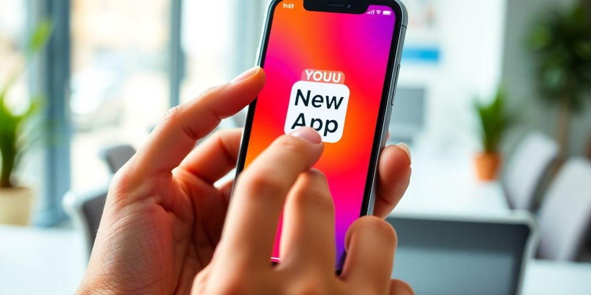

So, you're starting a business, and you know you need an app. That's great! But finding the right app developers for startups can feel a bit like trying to find a specific grain of sand on a huge beach. There are so many choices, and it's easy to get lost. Don't worry, though! This guide is here to help you figure out how to pick the best app developers for startups. It will make sure you find a good partner to help make your app idea real.

### Key Takeaways

*   Figure out what your app needs to do and what it should look like before you start looking.
*   Look at both individual developers and bigger companies to see what fits best for your project.
*   Go to startup events and tech meetups to meet possible developers face-to-face.
*   Use websites like LinkedIn and job boards to find talented people.
*   Always talk openly and set clear rules with your developer from the start.
*   Check their past work and maybe even give them a small test to see their skills.
*   Understand how app development works and pick the right ways to get things done.
*   Plan your money carefully and think about future updates and how you'll tell people about your app.

## Why Picking the Right App Developers for Startups Matters Big Time

Starting a business is tough. You're juggling a million things, and every choice feels like it could make or break you. One of the biggest decisions? Who builds your app. Seriously, it's _that_ important. Let's break down why.

### Your App's Success Hinges on This Choice

Think of your app as the face of your company. A clunky, buggy app? That's like showing up to a meeting with a stain on your shirt. **A great app can boost your brand and bring in customers.** A bad one? It can send them running. It all comes down to the [right mobile app developer](https://jetthoughts.com/blog/essential-strategies-find-developers-for-your/).

### Avoiding Budget Blunders and Missed Marks

Money's tight when you're a startup. You can't afford to throw cash away on a project that goes nowhere. The wrong developers can lead to endless delays and costs. You need someone who can stick to a budget and deliver on time. It's about finding that sweet spot between quality and cost.

### Building a Strong Foundation for Your Vision

Your app isn't just some code; it's your idea brought to life. You need developers who _get_ your vision and can build a solid base for it. This means choosing the right tech and making sure the app can grow as your business does. It's like building a house; you want a strong foundation, not a house of cards.

### Elevating Your Brand with a Great App

In today's world, your app is often the first impression people have of your brand. A well-designed, user-friendly app shows you care about your customers. It tells them you're professional and pay attention to detail. A bad app? It screams, "We don't care!"

### Boosting Customer Engagement Through Design

People use apps that are easy and fun to use. If your app is a pain, they'll ditch it faster than you can say "uninstall." Good developers know how to create an engaging user experience that keeps people coming back for more. It's all about making their lives easier and more enjoyable.

### Making Informed, Strategic Decisions

Good developers don't just code; they offer advice. They can help you make smart choices about features, platforms, and more. They're like having a tech-savvy friend in your corner, guiding you through the confusing world of app development.

### The Mobile App Landscape is Super Competitive

There are millions of apps out there. To stand out, you need something special. That means an app that's not only functional but also innovative and eye-catching. The right developers can help you create an app that rises above the noise and grabs people's attention.

### It's Like Finding a Needle in a Haystack

Okay, maybe it's not _that_ hard, but finding the perfect app developers for startups can feel overwhelming. There are so many options, and it's tough to know who's legit and who's just trying to make a quick buck. But don't worry, we're here to help you sort through the chaos and find the right team for your project.

## Understanding What Your Startup Really Needs

### What Problem Are You Solving?

Before you even start looking at developers, figure out what problem your app will solve. Seriously, what _need_ are you filling? Is it something people actually want, or just a cool idea you had? Knowing this helps you [select the right software development company](https://jetthoughts.com/blog/choosing-right-software-development-company-for-startups-2024-guide/) that gets your vision.

### Defining Your App's Core Functionality

Okay, you know the problem. Now, what's the _solution_? What will your app actually _do_? List the core functions. What's the one thing your app _has_ to do well? Nail that down. **This is the heart of your app.**

### Sketching Out Your User Interface

How will users interact with your app? Sketch out the screens. It doesn't have to be perfect, just a basic idea of the layout. Think about the user flow. How will they move from screen to screen? Make it easy and intuitive. No one wants an app that's confusing to use.

### Writing Down Key Features Clearly

List all the features your app will have. Be specific. Don't just say "social sharing." Say "share to Facebook, Twitter, and Instagram." Prioritize these features. What's essential for launch? What can wait for later? This helps you manage scope and budget.

### Creating User Stories That Make Sense

User stories are simple descriptions of what a user wants to do with your app. For example, "As a user, I want to be able to create an account so I can save my progress." Write these from the user's perspective. It helps you understand their needs and how they'll use the app.

### Knowing Your Ingredients Before Shopping

Think of your app like a recipe. You need to know all the ingredients before you go shopping. This means understanding the features, functionality, and user experience you want. The more prepared you are, the easier it will be to find the right [mobile app developer for your startup](https://jetthoughts.com/blog/choosing-right-software-development-company-for-startups-2024-guide/).

### Communicating Your Vision Effectively

Can you explain your app idea to someone in simple terms? If not, you're in trouble. Practice your pitch. Be clear, concise, and enthusiastic. The better you can communicate your vision, the easier it will be to find developers who get it and want to be a part of it.

### Aligning with Your Startup's Vision

Make sure your developers understand the startup's vision and how their work contributes to it. Communicate the company's goals clearly and regularly. Involve them in the decision-making process and solicit their feedback. A team that’s aligned with the company’s vision is a team that’s more engaged and motivated. Plus, it helps everyone stay focused on what’s important. No one wants to feel like they’re just coding in a vacuum. They want to know they’re building something meaningful.

## Finding Your Ideal App Developers for Startups

Finding the right app developers can feel like a quest. But don't sweat it! With the right approach, you can find a team that gets your vision and can turn it into reality. Let's explore how to find those _ideal_ developers.

### Networking at Startup Events and Meetups

Startup events and tech meetups are goldmines. These events are full of potential developers. Chat with people, share your ideas, and see who vibes with your project. It's like speed dating, but for tech talent. You might find someone who's not just skilled but also passionate about startups.

### Scouting Online Platforms Like LinkedIn

LinkedIn is your friend. It's a huge pool of talent. Search for developers with startup experience. Check their profiles, see their skills, and read recommendations. It's a great way to find people who have the skills you need. You can also use [hiring platforms](https://www.cleveroad.com/blog/how-to-find-an-app-developer/) to find the right talent.

### Checking Out Job Boards for Talent

Don't forget job boards. Sites like Indeed and AngelList often have listings for app developers. Be specific in your search. Look for developers who understand startup culture. A well-crafted job posting can attract the right candidates.

### Tapping Into Professional Networks

Ask around! Your network can be a great resource. Talk to other founders, advisors, and investors. They might know some talented developers. Referrals can be super helpful. People often recommend those they trust.

### Exploring Startup Incubators for Connections

Startup incubators are hubs of innovation. They often have connections to developers. Reach out to incubators in your area. See if they can recommend anyone. Incubators often work with developers who understand the startup world.

### Finding Developers Who Get Startups

**Look for developers who understand the startup life.** Startups move fast. They need developers who can keep up. Find people who are flexible, adaptable, and ready to hustle. It's not just about coding; it's about understanding the mission.

### Looking Beyond Just Technical Skills

Technical skills are important, but they're not everything. Look for developers with good communication skills. They should be able to explain complex ideas clearly. Teamwork is key. You want someone who can collaborate well with others.

### Seeking Collaborative Success Stories

Check their past projects. Look for examples of teamwork. See if they've worked on successful apps. A track record of collaboration is a good sign. It shows they can work well with others to achieve a common goal.

> Finding the right app developer is a big deal. It's about more than just code. It's about finding someone who shares your vision and can help you build something amazing. Take your time, do your research, and choose wisely.

## What to Look for in App Developers for Startups

So, you're on the hunt for app developers? Awesome! It's more than just finding someone who can write code. You need a partner who gets your startup vibe. Let's dive into what makes a great app developer for a startup.

### Beyond Just Technical Know-How

Sure, coding skills are important, but that's just the start. You want someone who can think outside the box. Look for developers who understand _design principles_ and can contribute to the overall strategy of your app. Can they see the big picture? That's what you need.

### A Mix of Creative and Strategic Thinking

Your app developer should be both creative and strategic. They should be able to come up with innovative solutions and think about how those solutions fit into your overall business goals. It's about more than just making an app; it's about making an app that helps your startup succeed. This is where [user experience](https://www.expertappdevs.com/blog/boost-your-startups-success-with-mobile-apps) comes in.

### Someone Who's a Bit of a Risk-Taker

Startups are all about taking risks. Your app developer should be comfortable with that. They should be willing to try new things and experiment with different approaches. A developer who's afraid to take risks probably isn't the right fit for your startup.

### An Impressive Portfolio and Expertise

Okay, technical skills _do_ matter. Check out their portfolio. Do they have experience building apps similar to yours? Do they have a strong understanding of the technologies you need? A solid portfolio is a good sign that they know what they're doing.

### A Track Record of Teamwork

App development is rarely a solo effort. Your developer needs to be a team player. Can they communicate effectively? Can they collaborate with designers, marketers, and other developers? Teamwork makes the dream work, as they say.

### Agility and Foresight in Their Work

Startups move fast. Your app developer needs to be agile and able to adapt to changing requirements. They should also have foresight and be able to anticipate future needs. Can they think on their feet? That's a huge plus.

### A Penchant for Engaging User Experiences

Let's face it: a clunky app is a dead app. Find developers who obsess over user experience. They should understand how to create an app that's not only functional but also enjoyable to use. If users love your app, they'll keep coming back for more.

### Understanding Startup Demands and Timelines

Startups operate under unique constraints. Your app developer needs to understand those constraints. They should be able to work within tight budgets and timelines. A developer who's used to working on large, corporate projects might not be the best fit for your startup. **They need to get the startup hustle.**

> Finding the right app developer is like finding the right co-founder. It's a crucial decision that can make or break your startup. Take your time, do your research, and choose wisely.

## Evaluating Potential App Developers for Startups

So, you've got a list of potential app developers. Awesome! Now comes the fun part: figuring out who's actually worth their salt. Don't just go by gut feeling. Let's get into how to properly check these folks out.

### Conducting Thorough Interviews

Think of this as your chance to play detective. Interviews are key. You want to get a real sense of their _expertise_, communication skills, and how they tackle problems.

*   Ask about past projects.
*   Discuss their development approach.
*   Gauge their interest in your vision.

> Remember, you're not just hiring a coder; you're potentially bringing on a partner. Make sure their personality and work style mesh with your team.

### Asking About Their Past Projects

Dig into their history. What apps have they built? What were the challenges? How did they overcome them? Don't just look at the pretty interface; ask about the nitty-gritty details. Did they deliver on time and within budget? This is where you start to see if they can handle the heat. You want to [find MVP developers](https://jetthoughts.com/blog/choosing-right-mvp-developers-key-factors/) who have a proven track record.

### Discussing Their Development Approach

Do they use Agile? Waterfall? Some other fancy term you've never heard of? It's not just about the buzzwords. Understand _how_ they approach building an app. How do they handle changes? How do they communicate progress? A clear, well-defined process is a good sign.

### Gauging Their Interest in Your Vision

Are they just looking for a paycheck, or are they genuinely excited about your idea? Do they ask thoughtful questions? Do they offer suggestions? You want someone who's invested in your success, not just churning out code. Passion is contagious, and it can make a huge difference in the final product.

### Checking References and Reviews

Time to play detective again! Don't just take their word for it. Check references. Read reviews. See what other people have to say about working with them. A few bad reviews might be a fluke, but a consistent pattern is a red flag.

### Talking to Former Clients Directly

If possible, go straight to the source. Talking to former clients can give you invaluable insights. Ask about their experience working with the developer. Were they responsive? Did they deliver on their promises? Would they hire them again? This is where you get the real dirt.

### Assessing Technical Skills and Portfolios

Of course, technical skills matter. Review their portfolio. Look at the apps they've built. Do they look good? Do they function well? If you're not a tech expert, get someone who is to help you evaluate their skills. A shiny portfolio doesn't always mean they're the real deal.

### Considering Coding Challenges

Want to really put them to the test? Give them a coding challenge. It doesn't have to be anything crazy, but it should be relevant to your project. This will give you a firsthand look at their coding skills, problem-solving abilities, and how they approach a task. Plus, it's a great way to see if they can actually walk the walk.

## Making Sure Your App Developers for Startups Are a Good Fit

Finding app developers is only part of the battle. You need to make sure they actually _fit_ with your startup. A bad fit can cause problems. It can lead to delays, [budget overruns](https://www.entrepreneur.com/leadership/hiring-your-first-team-heres-how-not-to-screw-up-diversity/491835), and a final product that just isn't right.

### Open Communication is Key

Communication is super important. You and your developers need to talk openly and honestly. If something is wrong, you need to be able to say it. They need to be able to tell you if your ideas are crazy.

### Setting Clear Expectations from the Start

Make sure everyone knows what's expected. What are the deadlines? What are the deliverables? What's the budget? Write it all down. This helps avoid misunderstandings later.

### Understanding Their Problem-Solving Skills

Developers are problem solvers. Watch how they approach challenges. Do they give up easily? Or do they keep trying to find a solution? You want someone who can think on their feet.

### Do They Understand Your Market?

Your developers need to know who your users are. They need to understand the market you're in. If they don't, they might build an app that nobody wants.

### Do They Get Your User Base?

It's not enough to know the market. They need to understand your _specific_ users. What do they want? What do they need? What makes them tick? If your developers understand your user base, they can build an app that people will love.

### Are They Responsive to Feedback?

Feedback is a gift. Your developers need to be able to take it. They need to be willing to change things based on what you and your users say. If they're not, you're in trouble.

### Do They Share Your Startup Ethos?

Does the developer's work style mesh with your team? Are they comfortable with your startup’s pace and level of [collaboration](https://www.entrepreneur.com/leadership/hiring-your-first-team-heres-how-not-to-screw-up-diversity/491835)?

### Can They Translate Your Vision?

**The best developers can take your crazy ideas and turn them into reality.** They can see what you see. They can understand what you want to build. If they can't, you're going to have a hard time.

> Finding developers who understand startups is key. They get the elastic nature of startup demands and timelines. They're not just coders; they're partners in your vision.

## The Role of App Developers for Startups

### They're the Architects of Your App

Think of app developers as the master builders of your digital world. They don't just write code; they craft the very structure, functionality, and user experience of your app. It's like they're taking your blueprint and turning it into a fully functional building. Finding the right [mobile app developers](https://www.businessofapps.com/app-developers/startup/) is key.

### Bringing Your Vision to Life

Your vision is the heart of your app. Developers are the ones who translate that vision into a tangible product. They take your ideas, understand your goals, and then use their skills to make it all real. It's not just about coding; it's about understanding what you want to achieve and making it happen.

### Ensuring Your App is Functional

Functionality is king. A beautiful app that doesn't work is like a sports car with a flat tire. Developers make sure every button, every feature, and every interaction works smoothly. They're the ones who ensure your app does what it's supposed to do, every single time.

### Making Your App User-Friendly

User experience is everything. If your app is confusing or difficult to use, people will abandon it faster than you can say "uninstall." Developers work to create an intuitive, easy-to-use interface that keeps users engaged and coming back for more. They often work with UX/UI designers to make this happen.

### Guiding Your Technical Vision

Sometimes, you might have a great idea but not know how to execute it technically. That's where developers come in. They can guide you through the technical aspects of your project, offering advice on the best technologies, approaches, and solutions. They help you make smart decisions that align with your goals and budget.

### Accelerating Team-Building Efforts

Developers often work as part of a larger team, collaborating with designers, marketers, and project managers. Their ability to work effectively with others can significantly accelerate the team-building process. They bring technical expertise and a collaborative spirit to the table, helping to create a cohesive and productive team.

### Improving Development Operations

Development operations, or DevOps, is all about streamlining the development process. Developers play a key role in improving DevOps by automating tasks, implementing best practices, and ensuring smooth deployments. This leads to faster development cycles, fewer bugs, and a more reliable app.

### Navigating the Mobile App Landscape

The mobile app landscape is constantly changing. New technologies, platforms, and trends emerge all the time. Developers stay up-to-date with these changes and help you navigate this complex landscape. They ensure your app is built with the latest technologies and is optimized for the current market. **This ensures your app is competitive and relevant.**

> A skilled developer is more than just a coder; they are a strategic partner who understands your business goals and helps you achieve them. They bring technical expertise, problem-solving skills, and a collaborative spirit to the table, making them an invaluable asset to any startup.

Here are some key things developers do:

*   Solve problems and find technical solutions.
*   Ensure your app can handle growth.
*   Keep your app secure from threats.

## Choosing the Right Tech Stack for Your App

Choosing the right _tech stack_ [tech stack](https://fullscale.io/blog/top-5-tech-stacks/) is like picking the perfect set of tools. You want tools that play nice together, are reliable, and can handle the job. For a startup, this choice can be a game changer. It affects everything from how fast you can build to how well it scales later. So, let's get into it.

### Why React Native is a Smart Choice

React Native lets you build apps for both iOS and Android from a single codebase. This can save you time and money. Plus, it's based on JavaScript, which many developers already know. It's a solid choice if you want to get your app out there quickly without sacrificing too much performance.

### Ensuring Your App is Responsive

Responsiveness is key. No one likes a slow, clunky app. Make sure your tech stack can handle complex calculations, process large amounts of data, and provide real-time updates. A game might need a different stack than a simple to-do list app. **Performance is king.**

### Adapting to User Feedback and Trends

The tech world moves fast. What's hot today might be old news tomorrow. Stay updated with the latest trends and technologies. This doesn't mean you have to jump on every new bandwagon, but be aware of new tools and techniques that could help your startup. Follow industry blogs, attend conferences, and network with other developers to stay in the know.

### Facilitating Post-Launch Evolution

Your app isn't done when it launches. You'll need to update it, fix bugs, and add new features. Choose a tech stack that makes this easy. A good stack will let you make changes quickly and efficiently, without breaking everything.

### Making Smart Technology Decisions

Native or cross-platform? That is the question. Native development means building apps specifically for one platform, like iOS or Android. This often results in better performance and a more seamless user experience. Cross-platform development, on the other hand, allows you to write code once and deploy it on multiple platforms. Think of it as a universal translator for your app. It can save time and money, but might come with some performance trade-offs. The choice depends on your priorities and resources.

### Building for Scalability

Think big! Your startup might be small now, but what about in a year or two? Will your tech stack be able to handle increased traffic and new features? Scalability is crucial for long-term success. Choose technologies that can grow with your business. Cloud-based solutions like AWS or Google Cloud can provide the flexibility and scalability you need.

### Considering Future Updates

Frameworks and libraries are like pre-built Lego sets for developers. They provide ready-made components and structures that speed up the development process. Frameworks offer a complete structure for building an application, while libraries provide specific tools or functions. Popular frameworks include React Native, Angular, and Vue.js. Libraries like Lodash and Moment.js offer utility functions that simplify common tasks. Understanding these tools can significantly boost your development efficiency.

### Optimizing for Performance

> Choosing the right tech stack is a critical decision for any startup. It impacts development speed, performance, scalability, and long-term success. By carefully considering your needs, evaluating different options, and staying updated with trends, you can set your startup up for success.

## Budgeting and Planning for Your App Development

### Budgeting Wisely from the Start

Okay, so you're ready to build an app. Awesome! But before you get too excited, let's talk about money. You need a budget. A _realistic_ budget. This isn't just a number you pull out of thin air. It's a detailed plan of how much you expect to spend on [mobile app development costs](https://topflightapps.com/ideas/app-development-costs/). Think of it as your financial roadmap. Without it, you're driving blind.

### Planning for Future Updates

Your app isn't a one-and-done deal. It's a living, breathing thing that will need updates. Plan for these updates now. The app world changes fast. New features, bug fixes, and design tweaks will be needed to keep users happy. Don't get caught off guard. Set aside some cash for the future. It's like saving for a rainy day, but for your app.

### Allocating Funds for Marketing Efforts

Building a great app is only half the battle. Nobody will download it if they don't know it exists. You need to market your app. This means setting aside a chunk of your budget for marketing. Social media ads, influencer outreach, and app store optimization are all important. Don't make the mistake of thinking a great app will magically market itself. It won't. Trust me.

### Understanding Mobile App Funding

So, where does the money come from? Unless you're swimming in cash, you'll need to find funding. There are a few options. You could bootstrap it, meaning you fund it yourself. Or, you could look for angel investors or venture capital. Each option has its pros and cons. Do your homework and figure out what's best for you. It's like choosing the right fuel for your rocket ship. Choose wisely.

### Rigorous Planning is Essential

Planning is key. I mean, really key. The more you plan upfront, the smoother the development process will be. Sketch out your app's user interface. Write down the key features. Create user stories. The clearer your vision, the easier it will be to communicate your needs to potential developers. Think of it as creating a detailed blueprint before building a house. You wouldn't build a house without a blueprint, would you?

### Iterative Refinement Based on Feedback

App development isn't a straight line. It's a journey of learning, adapting, and improving. Embrace the challenges, listen to your users, and never stop iterating. Your app will thank you for it. It's like sculpting a masterpiece. You start with a rough idea and refine it over time.

### Avoiding Budget Overruns

Nobody wants to go over budget. It's stressful and can derail your entire project. To avoid this, be realistic about your costs. Get multiple quotes from developers. Have a clear scope of work. And, most importantly, have a contingency plan. Things will go wrong. Be prepared.

### Investing in Long-Term Success

Think of your app as a long-term investment. It's not just about getting it launched. It's about maintaining it, updating it, and growing it over time. This means investing in quality development, marketing, and support. It's like planting a tree. You need to nurture it to see it grow.

## Navigating the App Development Process

So, you're ready to build an app? Awesome! It's like planning a road trip. You need a map, a destination, and maybe some snacks. Let's break down the app development journey.

### Understanding the Development Stages

Think of app development as a series of steps. Each step is important. Skipping one can lead to problems later. These stages include:

*   Ideation: This is where you brainstorm and figure out what your app will do.
*   Design: Here, you plan how your app will look and feel. _UI/UX_ is key.
*   Development: This is where the coding happens. It's where the app comes to life.
*   Testing: You need to make sure your app works. Find those bugs!
*   Deployment: Time to launch! Get your app into the world.
*   Post-launch: Keep improving your app. User feedback is gold.

### Choosing the Right Methodologies

There are different ways to build an app. It's like choosing how to cook a meal. Do you want to follow a strict recipe, or do you want to experiment? Two popular methods are Agile and Waterfall.

### Agile vs. Waterfall Approaches

Agile is flexible. You build the app in small chunks. You test and get feedback often. It's great for startups that need to adapt quickly. Waterfall is more rigid. You plan everything upfront. Then, you build the app step by step. It's good for projects with clear requirements. At Uptech, they base their development efforts on [the Agile principle](https://appwrk.com/mobile-app-development-process).

### Importance of Regular Check-ins

Imagine building a house without checking in with the architect. Regular check-ins are vital. They keep everyone on the same page. They help catch problems early. Communication is key.

### Managing Project Timelines

How long will it take to build your app? Setting a realistic timeline is important. Don't rush things. But don't take forever either. **A well-defined timeline helps manage expectations.** Be sure to factor in time for design, development, testing, and deployment.

### Handling Unexpected Challenges

Things don't always go as planned. Bugs happen. Features need to change. Be prepared to adapt. Have a plan for dealing with problems. It's like having a spare tire for your car.

### Ensuring Quality Assurance

Quality assurance (QA) is crucial. It's how you make sure your app works well. Test everything. Use real users. Get feedback. Fix bugs. Make sure your app is functional, secure, and compliant.

### Preparing for Launch

Launch day is exciting! But it's not the end. Prepare your marketing materials. Get ready to support users. Monitor your app's performance. Keep improving it. You're making your [mobile app development process](https://appwrk.com/mobile-app-development-process) a success!

## Finding Top App Development Companies in the USA

So, you're on the hunt for the best app development companies in the USA? It can feel like a wild goose chase, but don't sweat it. Let's break down how to find those beacons of innovation that can turn your startup dreams into reality.

### Companies Catering to Startups

Some app development companies specifically focus on startups. These firms get the unique challenges and needs that come with building something from scratch. They're not just coders; they're partners who understand the startup hustle. Look for companies that highlight their experience with early-stage ventures.

### Beacons of Innovation in the Industry

Certain companies stand out as leaders in mobile app innovation. They're the ones pushing boundaries, experimenting with new technologies, and setting trends. Keep an eye out for firms that have won awards, received recognition, or are frequently featured in industry publications. These are often the [best app developers](https://clutch.co/us/app-developers) to consider.

### Honing Skills for Startup Needs

Developing apps for startups requires a specific skill set. It's not just about technical know-how; it's about understanding the fast-paced, ever-changing nature of startups. Look for companies that emphasize _agility_, adaptability, and a willingness to learn. They should be able to pivot quickly when your needs change.

### Offering Tailored Services

One size doesn't fit all, especially in the startup world. The best app development companies offer services tailored to your specific vision. They take the time to understand your goals, target audience, and unique value proposition. Avoid firms that push cookie-cutter solutions; you want a partner who can craft a custom app that truly reflects your brand.

### Meticulously Weaving in Your Vision

Your app is an extension of your vision, and the development company should treat it as such. They should be deeply invested in understanding your goals and translating them into a functional, user-friendly app. Look for companies that prioritize communication, collaboration, and a shared understanding of your vision.

### Distinguished in the Market

Some companies have set themselves apart in the crowded app development market. They've built a reputation for quality, reliability, and innovation. Check out their client testimonials, case studies, and online reviews to get a sense of their track record. A company with a strong reputation is more likely to deliver a successful app.

### Focusing on Dynamic Needs

Startups are dynamic, and their needs can change rapidly. The app development company you choose should be able to adapt to these changes. They should be flexible, responsive, and willing to adjust their approach as needed. Avoid firms that are rigid or inflexible; you want a partner who can roll with the punches.

### Proven Track Records

Ultimately, the best way to gauge a company's capabilities is to look at its past work. Review their portfolio, check out their case studies, and talk to their former clients. A company with a proven track record of success is more likely to deliver a high-quality app that meets your needs. **Don't be afraid to ask tough questions and dig deep into their past projects.**

> Finding the right app development company is a critical step in launching a successful startup. Take your time, do your research, and choose a partner who understands your vision and has the skills and experience to bring it to life.

## Key Takeaways for Startup App Development

### Diligently Pursue Proficient Developers

Don't just grab any coder off the street. You need someone who knows their stuff. **Find developers who are not only skilled but also understand the startup hustle.** It's like finding a teammate who's as invested in your vision as you are.

### Combine Innovation with Technical Prowess

It's not enough to have a cool idea. You need the tech skills to back it up. _Innovation_ without execution is just a daydream. Make sure your team can actually build what you're dreaming up.

### Vigilance in Tech Stack Selection

Choosing the right tech is like picking the right ingredients for a recipe. Mess it up, and the whole dish is ruined. Think about what you need now and what you might need later. For example, [React Native's benefits](https://appinventiv.com/blog/how-to-run-startup-mobile-app-industry/) can be a game-changer for cross-platform development.

### Clear Understanding of Funding

Money makes the world go 'round, and it definitely makes apps go live. Know how much you have, how much you need, and where it's all coming from. Budgeting isn't just a suggestion; it's survival.

### Rigorous Planning and Development

Winging it might work for some things, but not for app development. Plan every step, from the first line of code to the final launch. A solid plan keeps you on track and helps you avoid costly mistakes.

### Iterative Refinement is Crucial

Your first version won't be perfect. Get ready to tweak, adjust, and improve based on user feedback. It's a never-ending cycle, but it's what makes your app better and better.

### Anchoring Success in a Competitive Market

Standing out in the app store is tough. You need a clear value proposition and a solid marketing strategy. Don't just build it; make sure people know it exists.

### Focusing on User Feedback

Your users are your best critics. Listen to what they say, and use their feedback to make your app better. After all, they're the ones who will be using it every day.

> Think of your app as a living thing. It needs constant care, attention, and a whole lot of love to thrive. Don't neglect it, and it will reward you.

## Next Steps for Aspiring App Entrepreneurs

### Leveraging Expert Resources

Don't go it alone! There are tons of resources out there to help you on your app-building journey. Think of them as your trusty sidekick. These resources can give you insights and help you dodge common mistakes. It is important to [hire developers](https://jetthoughts.com/blog/essential-strategies-hire-developers-for-your-startup-in-2025/) that can help you with your project.

### Gaining Invaluable Insights

Knowledge is power, especially in the app world. Learn from those who have been there, done that. Read case studies, attend webinars, and soak up all the info you can. Understanding the market and user behavior is key to making smart decisions.

### Empowering Your Startup Mobile App

Your app is your baby, so treat it that way! Give it the tools it needs to grow and thrive. This means investing in the right technology, design, and marketing. A well-equipped app has a much better chance of success. **Make sure your app is ready for the world!**

### Continuous Learning from Industry Leaders

The app world never stands still, so neither should you. Keep learning about new trends, technologies, and strategies. Follow industry leaders, attend conferences, and stay curious. The more you know, the better equipped you'll be to adapt and innovate.

### Investing in Meaningful Partnerships

Building an app is rarely a solo mission. Surround yourself with talented people who share your vision. This could include developers, designers, marketers, and mentors. Strong partnerships can make all the difference.

### Employing Digital Tools for Success

There's a digital tool for just about everything these days, so take advantage of them! Use project management software to stay organized, analytics tools to track your progress, and marketing automation tools to reach your audience. These tools can save you time, money, and headaches. _Digital tools_ are your friends.

### Embracing the Transformative Potential

Mobile apps have the power to change the world, or at least make a small dent in it. Embrace the potential of your app to solve problems, connect people, and make a positive impact. A purpose-driven app is more likely to resonate with users.

### Leading Towards Expansion and Recognition

Your app's journey doesn't end at launch. Plan for the future by thinking about how you'll scale your app, reach new markets, and build a strong brand. With the right strategy, your app can achieve great things.

> Post-launch is all about iteration. You launched your MVP, now it’s time to listen to your users, analyze the data, and make your app even better. Don’t be afraid to experiment and learn from your mistakes. The goal is to create an app that people love and use every day.

## Making Your App Stand Out in the Crowd

### Focusing on Unique Selling Points

What makes your app _different_? Seriously, why should anyone download it instead of the other million apps out there? **Nail down your unique selling points (USPs).** Is it a groundbreaking feature? A niche audience? A hilarious mascot? Whatever it is, shout it from the digital rooftops. Don't be shy; be proud.

### Crafting an Engaging User Experience

People use apps to solve problems or be entertained. If your app is clunky, confusing, or just plain ugly, they'll bounce faster than a rubber ball. Invest in a smooth, intuitive, and engaging user experience [UX and UI](https://jetthoughts.com/blog/finding-best-app-developers-for-startups/). Make it a joy to use, not a chore. Think of it as designing a digital playground, not a digital prison.

### Designing for Intuitive Navigation

Imagine your app is a house. Is it easy to find the kitchen? The bathroom? Or is it a maze designed by a sadist? Intuitive navigation is key. Users should be able to find what they need without a treasure map. Keep it simple, keep it clear, and for the love of all that is holy, don't hide important features behind cryptic menus.

### Prioritizing Performance and Speed

Nobody likes a slow app. It's like waiting for dial-up in 2025. Optimize your app for speed and performance. Reduce loading times, streamline processes, and make sure it runs smoothly on a variety of devices. A fast app is a happy app, and happy apps get used more often.

### Ensuring Robust Security Measures

In today's world, security isn't optional; it's mandatory. Protect your users' data like it's your own. Implement robust security measures to prevent breaches, hacks, and other digital nastiness. Be transparent about your security practices and build trust with your users. After all, nobody wants their personal info floating around the dark web.

### Gathering User Feedback for Improvements

Your users are your best source of information. Listen to their feedback, both good and bad. Use it to improve your app, fix bugs, and add new features. Engage with your community and show them that you care about their experience. Plus, responding to reviews makes you look like a rockstar.

### Staying Ahead of Market Trends

The app world moves fast. What's hot today might be old news tomorrow. Stay on top of market trends, new technologies, and emerging platforms. Adapt your app to stay relevant and competitive. Don't be afraid to experiment and try new things. Just don't jump on every bandwagon that comes along.

### Building a Strong Brand Identity

Your app is more than just code; it's a brand. Develop a strong brand identity that reflects your values, your mission, and your personality. Use consistent branding across all your marketing materials, your app store listing, and your in-app experience. A strong brand helps you stand out from the crowd and build a loyal following. Think of it as your app's digital fingerprint.

## Common Pitfalls to Avoid When Hiring App Developers

### Not Clearly Defining Requirements

Ever tried ordering food without knowing what you want? It's a recipe for disaster. Same goes for app development. **Not defining your app's requirements clearly is a major pitfall.** _Ambiguity_ leads to miscommunication, wasted time, and a final product that misses the mark. Sketch out your app’s user interface. Write down the key features. Create user stories. The clearer your vision, the easier it will be to communicate your needs to potential developers. Think of it as creating a detailed blueprint before building a house.

### Ignoring Communication Styles

Communication is key. Seriously, don’t skip this part. It can make or break your project. Think of it as the oil that keeps the engine running smoothly. Without it, things get squeaky and eventually grind to a halt. You don’t want that, do you? Ignoring [communication styles](https://www.digittrix.com/blogs/avoid-these-mistakes-before-hiring-a-mobile-app-developer-for-your-business) can lead to misunderstandings and frustration.

> Good communication is about more than just talking; it's about actively listening and working together towards a common goal. It’s the foundation of a successful app development project.

### Overlooking Portfolio Quality

Don't just glance at a portfolio. Really _look_ at it. Does the developer have experience with similar projects? Is the code clean and well-documented? A strong portfolio speaks volumes. Time to do some digging! A developer’s portfolio is like their resume, but way more interesting. Look for projects that are similar to yours in terms of complexity and functionality. Don’t just look at the pretty pictures; try to understand the underlying code and architecture. If possible, reach out to previous clients and ask about their experience working with the developer.

### Skipping Reference Checks

Think of reference checks as your chance to play detective. Talking to former clients can reveal a lot about a developer's work ethic, communication skills, and ability to deliver on promises. See what other clients have to say about their experience. Look for patterns in the feedback. Are they consistently praised for their communication skills? Do they deliver projects on time? Or are there red flags that you should be aware of? It’s like reading Yelp reviews before trying a new restaurant.

### Focusing Only on Price

Let’s talk money. App development isn’t cheap, but it doesn’t have to break the bank either. Be realistic about what you can afford and what you’re willing to spend. Get quotes from multiple developers and compare their rates. Remember, the cheapest option isn’t always the best. Quality often comes at a price.

### Not Having a Clear Contract

A clear contract protects both you and the developer. It should outline the scope of work, payment terms, timelines, and ownership of intellectual property. Think of it as a prenup for your app development project.

### Failing to Plan for Maintenance

An app isn't a "one and done" deal. You need to plan for ongoing maintenance, updates, and bug fixes. Failing to do so can lead to a buggy, outdated app that users abandon. Make sure your app stays up-to-date with the latest features and security patches.

### Underestimating Marketing Needs

Building a great app is only half the battle. You also need to market it effectively to reach your target audience. Don't underestimate the importance of marketing and allocate sufficient resources to promote your app. Rigorous planning is essential. Iterative refinement based on feedback.

## Building a Long-Term Partnership with Your Developers

Think of your app developers as more than just hired help. You want a real partnership, right? It's like any good relationship—it takes work. Here's how to make it last.

### Fostering Open and Honest Communication

Communication is key. No surprise there! Be upfront about your expectations, and encourage your developers to do the same. Regular check-ins are a must. Don't let small issues fester. Address them head-on. This helps avoid big problems later. Think of it as relationship maintenance. You want to [find the right mobile app development partner](https://appinventiv.com/blog/best-mobile-app-development-partner-for-startup/) who values open communication.

### Establishing Mutual Trust and Respect

Trust and respect go hand in hand. Value their expertise, and listen to their advice. They're the tech wizards, after all. Show them you trust their judgment. Treat them as equals. A little respect goes a long way. It makes for a much smoother working relationship.

### Setting Up Regular Feedback Loops

Feedback is a gift. Give it often, and be open to receiving it too. Regular feedback loops help keep everyone on the same page. It's a chance to course-correct and make sure the project is heading in the right direction. Don't wait until the end to voice concerns. Address them early and often.

### Collaborating on Future Updates

Your app isn't a one-and-done deal. Plan for future updates and improvements. Involve your developers in the planning process. They can offer valuable insights and suggestions. Plus, it keeps them engaged and invested in the project's long-term success.

### Celebrating Milestones Together

Don't forget to celebrate the wins! Acknowledge milestones and achievements. It boosts morale and shows your appreciation. A simple "thank you" can go a long way. Celebrate as a team. It reinforces the sense of partnership and shared success.

### Addressing Issues Promptly

Problems happen. It's inevitable. The key is to address them quickly and efficiently. Don't let issues linger. Tackle them head-on. Open communication is crucial here. Work together to find solutions. A problem shared is a problem halved, right?

### Understanding Their Work Style

Everyone works differently. Take the time to understand your developers' work styles. Are they morning people or night owls? Do they prefer detailed instructions or more autonomy? Knowing their preferences can help you work together more effectively. It's all about finding a rhythm that works for everyone.

### Being a Good Client

Being a good client is just as important as finding good developers. Be responsive, provide clear feedback, and pay on time. Treat them with respect and value their expertise. A good client-developer relationship is a win-win for everyone involved. **It sets the stage for a successful and lasting partnership.**

## The Importance of User Experience (UX) and User Interface (UI)

So, you're building an app? Awesome! But have you thought about how people will actually _use_ it? That's where User Experience (UX) and User Interface (UI) come in. Think of it like this: UX is how your app feels, and UI is how it looks. Both are super important.

### Why Great Design Matters

Great design isn't just about making your app look pretty. It's about making it _useful_. A well-designed app is easy to navigate and understand. Users should be able to find what they need without getting frustrated. If your app looks like it was designed in the 90s, good luck getting anyone to use it.

### Creating an Intuitive User Journey

Think about the path a user takes through your app. Is it smooth and logical? Or is it a confusing maze? You want to create a journey that feels natural and intuitive. Map out the steps a user takes to complete a task and make sure each step is clear and easy to follow. This is where [MVP prototyping](https://jetthoughts.com/blog/tags/agile/) comes in handy.

### Making Your App Visually Appealing

Looks matter! Your app's visual design can make or break it. Use colors, fonts, and images that are pleasing to the eye and consistent with your brand. A visually appealing app is more likely to grab users' attention and keep them engaged.

### Ensuring Ease of Use

Ease of use is key. If your app is difficult to use, people will give up. Make sure your app is simple, straightforward, and easy to understand. Use clear labels, intuitive icons, and a logical layout. Test your app with real users to identify any areas that are confusing or difficult to navigate.

### Driving User Engagement

**Good UX keeps users engaged.** Make your app fun and interesting. Use animations, rewards, and other tricks to keep people coming back. If your app is boring, people will leave. Think of it like a party. You want people to have a good time so they stick around.

### Reducing User Frustration

Nobody likes a frustrating app. Avoid common pitfalls like slow loading times, confusing navigation, and frequent crashes. Test your app thoroughly to identify and fix any issues that could frustrate users. A happy user is a loyal user.

### Building Brand Loyalty

A great UX can help you build brand loyalty. When users have a positive experience with your app, they're more likely to trust your brand and recommend it to others. Think of your app as a [digital tool](https://jetthoughts.com/blog/tags/agile/) for building relationships with your customers.

### Standing Out from Competitors

In a crowded app store, a great UX can help you stand out from the competition. If your app is easier to use and more enjoyable than your competitors', users are more likely to choose yours. Invest in UX to give your app a competitive edge. Consider [effective task management](https://jetthoughts.com/blog/tags/agile/) to stay ahead.

## Testing and Launching Your Startup App

Alright, so you've poured your heart and soul into building this app. Now comes the moment of truth: getting it out there! Launching isn't just about uploading it to the app store and hoping for the best. It's a process. Let's walk through it.

### Thorough Quality Assurance is Key

Before you even _think_ about launching, make sure your app works. I mean _really_ works. This isn't the time to cut corners. QA [testing is key](https://jetthoughts.com/blog/choosing-right-mvp-app-development-company/). Get a team (or even just a friend) to bang on it, try to break it, and generally abuse it. Find those bugs before your users do!

### Beta Testing with Real Users

Beta testing is like a sneak peek for your app. You let a small group of real users try it out before the big launch. This is gold for getting feedback.

*   Find your target audience.
*   Get honest opinions.
*   Fix issues before launch.

### Gathering Pre-Launch Feedback

Feedback is your friend. Listen to what your beta testers are saying. What do they love? What do they hate? What's confusing? Use this feedback to make your app even better. Don't be afraid to make changes. It's better to fix things now than to get bad reviews later.

### Preparing for App Store Submission

Submitting to the app store can be a pain. Each store has its own rules and guidelines. Read them carefully! Make sure you have all the required assets, like screenshots and descriptions. And for Pete's sake, test your app on multiple devices before submitting. You don't want to get rejected because it crashes on an old iPhone.

### Crafting a Compelling App Description

Your app description is your sales pitch. It's what convinces people to download your app. Make it clear, concise, and compelling. Highlight the key features and benefits. Use keywords that people will search for. And don't forget to proofread! Typos make you look unprofessional.

### Planning Your Marketing Strategy

**Launching an app without a marketing plan is like throwing a party and not inviting anyone.** How are people going to find out about your app? You need a plan. Social media, paid ads, PR, content marketing – there are tons of options. Figure out what works for your target audience and your budget.

### Monitoring Post-Launch Performance

Once your app is live, the work isn't over. You need to track how it's performing. How many downloads are you getting? How many active users? What's the retention rate? Use analytics tools to monitor these metrics. This data will help you make informed decisions about future updates and marketing efforts.

### Iterating Based on User Data

Your app is never truly finished. You should always be looking for ways to improve it. Use user data and feedback to identify areas for improvement. Add new features, fix bugs, and optimize the user experience. The more you iterate, the better your app will become. Think of it as a continuous cycle of improvement. This is how you build a successful app in the long run. Don't be afraid to [select an MVP app development company](https://jetthoughts.com/blog/choosing-right-mvp-app-development-company/) to help you with this process.

> Launching an app is a marathon, not a sprint. Be prepared for the long haul. It takes time, effort, and a little bit of luck to build a successful app. But if you're persistent and passionate, you can do it!

## Staying Agile in App Development for Startups

So, you want to stay agile? Smart move. It's like being a ninja in the app world—quick and adaptable. Let's break down how to keep your development nimble.

### Embracing Change and Flexibility

Things change fast. Your app development needs to change with it. Be ready to pivot. Don't get stuck on old ideas. **Flexibility is your friend.** It's like being a yoga instructor for your [startup mobile app](https://neklo.com/blog/software-development-for-startups-guide)—bend, don't break.

### Responding to Market Shifts Quickly

The market moves fast. You need to watch trends. What's hot? What's not? Don't be afraid to change direction. It's better to adjust than to crash and burn. Keep your eyes peeled and your code flexible. Think of it as [app maintenance](https://neklo.com/blog/software-development-for-startups-guide).

### Prioritizing Iterative Development

_Iteration_ is key. Don't wait months to release updates. Small, frequent changes are the way to go. It lets you fix problems fast and add new features without a huge overhaul. Plus, it keeps users engaged.

### Adapting to User Feedback

User feedback is gold. Seriously. Listen to what people say. What do they love? What do they hate? Use that info to make your app better. Don't ignore them. They're the ones using your app, after all.

### Minimizing Risk with Small Releases

Small releases are less risky. Big releases can be a disaster. If something goes wrong, it's easier to fix with a small release. Think small, not big. It's like eating a cupcake instead of a whole cake—less to regret.

### Fostering Continuous Improvement

Always look for ways to improve. What can you do better? How can you make your app faster? How can you make it more user-friendly? **Continuous improvement is a must.**

### Encouraging Team Collaboration

Teams work better together. Encourage communication. Share ideas. Help each other out. A team that works well together can do amazing things. It's like a band—everyone needs to play their part.

### Staying Lean and Efficient

Don't waste time or money. Focus on what's important. Cut out the fluff. Be efficient. A lean approach will help you stay agile. Think of it as decluttering your code—less is more.

> Staying agile is not just a process; it’s a mindset. It’s about being ready to adapt, learn, and improve. It’s about embracing change and using it to your advantage. It’s about building an app that users love, and that means being flexible enough to give them what they want.

## Future-Proofing Your Startup's App

### Designing for Scalability

Think long term. Can your app handle a million users? Plan for growth from day one. Design your app's architecture to scale easily. This means choosing the right databases and server infrastructure. Don't get caught off guard when your app becomes a hit. Consider using cloud services for [scalable architecture](https://jetthoughts.com/blog/checklist-for-non-tech-founder-agile/).

### Considering Future Technologies

Tech changes fast. What's hot today might be old news tomorrow. Keep an eye on emerging technologies. Think about how they might impact your app. Could AI or blockchain play a role? Staying informed helps you adapt. Don't be afraid to experiment with new ideas.

### Building with Maintainability in Mind

Write clean, well-documented code. It makes future updates easier. Use a modular design. This lets you change parts of the app without breaking everything. Choose a tech stack that's easy to maintain. **Your future self will thank you.**

### Planning for Regular Updates

Apps are never truly finished. Plan for regular updates and improvements. This keeps your app fresh and engaging. It also lets you fix bugs and add new features. Set aside a budget for ongoing development. _Continuous improvement_ is key.

### Ensuring Compatibility Across Devices

Test your app on different devices and screen sizes. Make sure it looks and works great on everything. Use responsive design techniques. This adapts your app's layout to different screens. Don't alienate users with older devices.

### Protecting Against Obsolescence

Avoid using outdated technologies. They can become a security risk. They can also be difficult to maintain. Keep your app up-to-date with the latest security patches. Regularly review your tech stack. Replace old components with newer ones.

### Investing in Robust Infrastructure

Your app's infrastructure is its foundation. Invest in reliable servers and databases. Use a content delivery network (CDN) to speed up delivery. Implement monitoring tools to track performance. A solid infrastructure ensures a smooth user experience.

> It's important to have a clear scope of work document. This document should detail the budget, timeline, feature list, and app flow. This ensures everyone is on the same page and reduces the risk of unexpected costs.

### Staying Ahead of the Curve

Follow industry trends. Attend conferences and workshops. Read blogs and articles. Network with other developers. The more you know, the better prepared you'll be. Don't get left behind. Here are some things to consider:

*   Monitor user feedback.
*   Analyze market trends.
*   Integrate technological advancements.

Making sure your startup's app stays great for a long time is super important. You want it to keep working well, even as new tech comes out. This means building it smart from the start. Want to learn how to [make your app strong for the future](https://jetthoughts.com)? Check out our website for more tips!

## Wrapping It Up: Your Journey Starts Here

So, there you have it! Finding the right app developers for your startup doesn’t have to be a headache. Sure, it can feel overwhelming at times, but if you keep your eyes peeled for the right mix of skills, communication, and a good vibe, you’ll be on the right track. Remember, every successful app started with a solid team behind it. Don’t rush the process—take your time to find folks who get your vision and can help you turn it into reality. With the right crew by your side, your app could be the next big thing. Now go out there and make it happen!

## Frequently Asked Questions

### How can I find the right app developer for my startup?

You can find the right app developer by checking their past work, looking at reviews, and making sure they understand what you want for your project.

### What skills should I look for in app developers?

Look for developers who are good at solving problems, communicate well, and have a strong portfolio of apps they've built. They should also understand your business goals.

### How important is communication with app developers?

It's important to have clear talks, set up regular check-ins, and make sure everyone is on the same page about how the project is going.

### Why is a developer's portfolio important?

A good portfolio shows what they've done before and if their style fits what you need. It's like looking at an artist's previous paintings to see if you like their work.

### Should I check references for app developers?

Yes, it's a good idea to talk to their past clients. This helps you get real feedback about their work and how they handle projects.

### How much does it cost to hire an app developer for a startup?

The cost can change a lot depending on how complex your app is, where the developers are located, and how much experience they have. Always get a clear price breakdown.

### How important are user experience (UX) and user interface (UI) design?

It's super important! A well-designed app that's easy to use will keep people coming back. It makes your app stand out and keeps users happy.

### What does 'agile development' mean for startups?

Agile means being flexible and able to change plans quickly based on feedback. This is great for startups because things often change as you learn more about your users.

### Why is testing my app before launch so important?

Testing helps find and fix problems before your app goes live. It makes sure your app works well and gives users a smooth experience.

### How do I find top app development companies in the USA?

You can find top companies by looking at industry awards, reading reviews, and asking for recommendations from other startups. Many specialize in working with new businesses.

### How do I choose the right technology for my app?

Choose a tech stack that fits your app's needs, allows for future growth, and has good support from the developer community. React Native is popular for its flexibility.

### Do I need to budget for app maintenance after it's launched?

Yes, you need to budget for ongoing updates, fixing bugs, and making sure your app stays fresh and secure. It's not a one-time cost.
