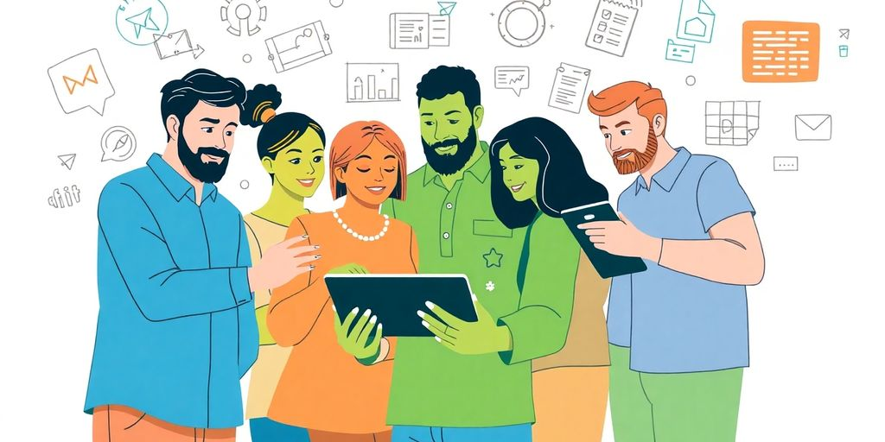

When you're diving into the world of startups, finding the right app developer can feel like searching for a needle in a haystack. With so many options out there, it’s easy to get overwhelmed. But don’t worry! This guide will help you navigate the process of finding the best app developers for startups, ensuring you have a strong partner to bring your app vision to life.

### Key Takeaways

*   Clearly define your app's vision and requirements before starting your search.
*   Evaluate both freelancers and agencies to find the right fit for your project.
*   Attend startup events and tech meetups to network with potential developers.
*   Use online platforms like LinkedIn and job boards to discover talent.
*   Ensure open communication and set clear expectations with your developer.
*   Assess technical skills through portfolios and coding challenges.
*   Understand the development process and choose the right methodologies.
*   Budget wisely and plan for future updates and marketing efforts.

## Finding Your Ideal App Developer

### Understanding Your Startup Needs

Before you even think about browsing developer profiles, take a good, hard look at your startup. What problem are you _really_ trying to solve? What's the core functionality of your app? Knowing this inside and out will help you [select the right software development company](https://jetthoughts.com/blog/choosing-right-software-development-company-for-startups-2024-guide/) that aligns with your vision. It's like knowing what ingredients you need before heading to the grocery store.

### Defining Your App Vision

Okay, you know what problem you're solving. Now, what does the solution _look_ like? Sketch out your app's user interface. Write down the key features. Create user stories. The clearer your vision, the easier it will be to communicate your needs to potential developers. Think of it as creating a detailed blueprint before building a house.

### Identifying Key Skills

Not all developers are created equal. Some are front-end wizards, others are back-end gurus, and some are mobile app maestros. Figure out what _specific_ skills your project requires. Do you need someone with experience in iOS, Android, or both? What about specific frameworks or libraries? Knowing the required tech stack will narrow down your search significantly.

### Evaluating Developer Portfolios

Time to do some digging! A developer's portfolio is like their resume, but way more interesting. Look for projects that are similar to yours in terms of complexity and functionality. Don't just look at the pretty pictures; try to understand the underlying code and architecture. If possible, reach out to previous clients and ask about their experience working with the developer.

### Setting a Realistic Budget

Let's talk money. App development isn't cheap, but it doesn't have to break the bank either. Be realistic about what you can afford and what you're willing to spend. Get quotes from multiple developers and compare their rates. Remember, the cheapest option isn't always the best. Quality often comes at a price.

### Establishing a Timeline

How quickly do you need your app up and running? Setting a realistic timeline is crucial for keeping your project on track. Be sure to factor in time for design, development, testing, and deployment. Communicate your timeline clearly to potential developers and make sure they can meet your deadlines. Don't be afraid to push back if their proposed timeline seems unrealistic. **A well-defined timeline helps manage expectations and avoid delays.**

## Exploring Different Hiring Models

So, you're ready to find some app developers? Awesome! But before you jump in, let's talk about how you can actually _hire_ these folks. There are a few different ways to go about it, each with its own set of pros, cons, and price tags. Think of it like ordering pizza – you've got your solo slice (freelancer), your family-sized pie (agency), and your DIY kit (in-house). Let's explore these options.

### Freelancers vs. Agencies

Freelancers are like the _solo artists_ of the app development world. They're independent, often more affordable, and can be great for specific tasks. Agencies, on the other hand, are like bands. They bring a whole team of specialists to the table, from designers to testers.

*   **Freelancers:** Good for smaller projects, tight budgets, and when you need a specific skill.
*   **Agencies:** Better for complex projects, when you need a full team, and when you want someone to handle the whole process.
*   **Things to consider:** Freelancers might need more management from your end, while agencies usually come with higher costs.

### In-House Development Pros and Cons

Building an in-house team is like starting your own orchestra. You have complete control, but it requires a lot of investment. You're responsible for salaries, benefits, office space, and keeping everyone happy. It's a big commitment, but it can pay off if you need constant development and have the resources. If you want full control over your project, you must work with a [well-recognized startup app development company](https://appinventiv.com/blog/hire-developers-for-startup/).

*   **Pros:** Full control, dedicated team, deep understanding of your product.
*   **Cons:** High costs, time-consuming to build, requires management expertise.

### Outsourcing to Offshore Teams

Outsourcing is like hiring a construction crew from another country. It can save you money, but you need to be careful about communication and quality control. Offshore teams can be a great option if you're on a tight budget and don't mind working with different time zones. Tekrevol knows how to provide [off-shore talent](https://appinventiv.com/blog/hire-developers-for-startup/) to companies.

> Just remember to do your homework and find a reputable team with a proven track record.

### Hybrid Models for Flexibility

A hybrid model is like mixing and matching your band members. You might have a core in-house team and then bring in freelancers or an agency for specific projects. This can give you the best of both worlds: control and flexibility.

*   **Example:** Keep your core developers in-house and hire a freelancer for UI/UX design.
*   **Benefit:** Adapt to changing needs without the overhead of a full in-house team.

### Choosing the Right Model for Your Needs

So, how do you pick the right model? It depends on your project, your budget, and your long-term goals. Ask yourself these questions:

1.  What's the scope of my project?
2.  What's my budget?
3.  How much control do I want?

### Understanding Cost Implications

Each hiring model comes with different cost implications. Freelancers are usually cheaper per hour, but you might need to pay for more hours overall. Agencies have higher hourly rates, but they often work more efficiently. In-house teams are the most expensive in the short term, but they can be more cost-effective in the long run. It’s always better to analyze the type of app idea that you’re working on, which means determining the platform it will be based on or whether it will be a [cross-platform app](https://appinventiv.com/blog/hire-developers-for-startup/) followed by some other concerns. **Consider all the costs before making a decision.**

## Networking to Find Developers

Finding the right developers can feel like searching for a needle in a haystack. But guess what? Networking can seriously boost your chances. It's all about connecting with people who know people. Think of it as your secret weapon in the quest for app development greatness. Let's explore some ways to get out there and mingle!

### Leveraging Startup Events

Startup events are like developer playgrounds. Seriously, they're packed with talent eager to jump on board with exciting projects. **These events offer a casual environment** where you can chat with developers, designers, and even potential co-founders. Plus, you get to hear about the latest trends and technologies. It's a win-win!

### Attending Tech Meetups

Tech meetups are more focused than general startup events. They usually center around specific technologies or programming languages. This means you're more likely to find developers with the exact skills you need. Don't be shy! Ask questions, share your vision, and collect business cards like they're going out of style. You might even find someone who's been dreaming of building an app just like yours. Check out local meetups to [hire top mobile app developers](https://appinventiv.com/blog/best-mobile-app-development-partner-for-startup/).

### Utilizing Online Communities

Online communities like GitHub, Reddit, and Stack Overflow are goldmines. These platforms are where developers hang out, share code, and solve problems. Engage in discussions, ask for advice, and showcase your project. You can find developers who are passionate about what they do and eager to contribute. Just remember to be respectful and offer value to the community. No one likes a spammer!

### Engaging with Local Incubators

Local incubators and accelerators are hubs for startups. They often have connections with developers looking for opportunities. Reach out to these organizations and see if they can connect you with talent. Incubators often host events and workshops where you can meet developers face-to-face. Plus, being associated with an incubator can add credibility to your startup.

### Building Relationships with Universities

Universities are breeding grounds for fresh talent. Computer science students are always looking for real-world projects to work on. Partner with a local university to offer internships or sponsor hackathons. This is a great way to find young, enthusiastic developers who are eager to learn and contribute. Plus, you might just discover the next coding prodigy.

### Using Social Media Effectively

Social media isn't just for sharing cat videos. Platforms like LinkedIn and Twitter can be powerful tools for finding developers. Use targeted searches to find developers with the skills and experience you need. Engage in relevant conversations, share your project, and reach out to potential candidates. _Social media_ can help you build relationships and find the perfect developer for your startup.

> Networking is not just about collecting contacts; it's about building relationships. The more people you know, the more opportunities will come your way. So get out there, be social, and start connecting with the amazing developers who can help bring your app to life.

## Utilizing Online Platforms

So, you're on the hunt for app developers? Great! Let's talk about using online platforms. It's like fishing, but instead of fish, you're catching coders. And instead of a lake, you've got the entire internet. Let's see how to cast that net effectively.

### Exploring Freelance Marketplaces

Freelance marketplaces are a solid starting point. Think of sites like Upwork, Toptal, and Fiverr. These platforms host tons of developers with different skill sets and rates. **You can find someone who fits your budget and project requirements.** Just be ready to sift through profiles. Read reviews, check portfolios, and maybe even give a small test project to potential candidates. It's like a first date, but with code.

### Finding Talent on LinkedIn

LinkedIn isn't just for finding your next corporate gig. It's also a goldmine for finding app developers. You can search for developers by skills, experience, and location. Plus, you can see their professional history and get recommendations from previous employers. It's like having a digital resume right at your fingertips. Use [LinkedIn effectively](https://jetthoughts.com/blog/essential-strategies-find-developers-for-your/) to find the right talent.

### Using Job Boards for Startups

Don't forget about job boards specifically for startups. Sites like AngelList and Indeed often have listings tailored to the startup world. These boards can be great for finding developers who are excited about working on innovative projects and are willing to take a chance on a new company. It's like finding someone who's as passionate about your idea as you are.

### Evaluating Developer Profiles

Okay, you've found some potential developers. Now what? Time to evaluate those profiles. Look beyond the fancy titles and buzzwords. Check for specific skills that match your project needs. See if they have experience with the _technologies_ you're using. And don't be afraid to ask for examples of their work. It's like checking references before making a hire.

### Reading Reviews and Testimonials

Reviews and testimonials can give you a sense of a developer's reliability and work ethic. See what other clients have to say about their experience. Look for patterns in the feedback. Are they consistently praised for their communication skills? Do they deliver projects on time? Or are there red flags that you should be aware of? It's like reading Yelp reviews before trying a new restaurant.

### Connecting with Industry Experts

Don't be afraid to reach out to industry experts for recommendations. Ask your network if they know any talented app developers. Attend online events and connect with people in the tech community. You never know where you might find your next star developer. It's like getting a referral from a trusted friend.

## The Importance of Communication

Communication is _super_ important when you're working with app developers. Seriously, don't skip this part. It can make or break your project. Think of it as the oil that keeps the engine running smoothly. Without it, things get squeaky and eventually grind to a halt. You don't want that, do you?

### Setting Clear Expectations

**Make sure everyone knows what's up from the start.** Don't assume your developers are mind readers. Spell out exactly what you want, what you expect, and when you expect it. This includes everything from features to deadlines. The clearer you are, the fewer surprises you'll encounter down the road. Think of it like ordering coffee: you wouldn't just say "coffee," you'd specify the size, type, and any extras. Same deal here.

### Establishing Regular Check-Ins

Set up regular meetings. These don't have to be long, drawn-out affairs. Even a quick 15-minute chat can keep everyone on the same page. It's a chance to ask questions, address concerns, and make sure the project is moving forward as planned. Think of it as a pit stop during a race. Quick, efficient, and essential.

### Using Collaboration Tools

Use tools that help everyone stay connected. Slack, Asana, Trello—whatever works for your team. These tools make it easy to share updates, ask questions, and track progress. It's like having a central hub for all project-related information. No more endless email chains or lost documents. [UI/UX designing](https://jetthoughts.com/blog/essential-strategies-hire-developers-for-your-startup-in-2025/) expertise is key here.

### Encouraging Open Feedback

Create a culture where everyone feels comfortable sharing their thoughts. Encourage developers to speak up if they see a problem or have a better idea. The best solutions often come from unexpected places. It's like brainstorming: the more ideas, the better the chance of finding a winner.

### Navigating Language Barriers

If you're working with a team that speaks a different language, be patient and understanding. Use simple language, avoid jargon, and be prepared to explain things in multiple ways. Visual aids can also be helpful. It's like learning a new language: it takes time and effort, but it's worth it in the end. You can [hire mobile app developers](https://jetthoughts.com/blog/essential-strategies-hire-developers-for-your-startup-in-2025/) that speak your language.

### Building a Trusting Relationship

Trust is key to any successful partnership. Be honest, transparent, and respectful. Show your developers that you value their expertise and appreciate their hard work. It's like any relationship: the stronger the bond, the better the outcome.

> Good communication is more than just talking. It's about listening, understanding, and working together towards a common goal. It's the foundation of a successful app development project.

Here are some ways to build trust:

*   Be reliable. Do what you say you'll do.
*   Be transparent. Share information openly.
*   Be respectful. Treat everyone with courtesy.

## Assessing Technical Skills

Okay, so you've found some developers who seem promising. Now it's time to see if they can actually _code_. Don't worry, you don't need to be a tech whiz to figure this out. Here's how to assess their technical skills:

### Understanding Required Technologies

First, nail down the _tech stack_ needed for your app. Is it iOS, Android, or both? What about backend technologies? Knowing this helps you focus your assessment. If you're building a data-heavy app, experience with specific databases is key. No need to test them on stuff they won't even use.

### Evaluating Coding Proficiency

Look at their past projects. Can you see the code? Is it clean and well-documented? Messy code is a red flag. Ask them to explain their approach to a particular coding challenge. Their explanation should be clear and logical. If they can't explain it, they probably don't understand it.

### Testing Problem-Solving Abilities

Give them a small coding problem to solve. It doesn't have to be super complex, but it should test their ability to think logically and write code efficiently. Watch how they approach the problem. Do they ask clarifying questions? Do they break the problem down into smaller parts? This is more important than just getting the right answer.

### Reviewing Past Projects

Dig into their portfolio. What kind of apps have they built? Do those apps have good reviews? Don't just look at the pretty interface. Try to understand the underlying architecture. A solid portfolio shows they can deliver. Analyzing their [software development for startups](https://jetthoughts.com/blog/tags/hiring/) will help you determine their capabilities in general.

### Conducting Technical Interviews

Technical interviews can be intimidating, but they're essential. Ask about their experience with specific technologies. Present common coding scenarios and see how they would handle them. Don't be afraid to ask follow-up questions. The goal is to gauge their depth of knowledge.

### Utilizing Coding Challenges

Coding challenges are a great way to assess skills in a standardized way. There are many online platforms that offer coding challenges in various languages and difficulty levels. Use these challenges to compare candidates objectively. Just remember, coding challenges aren't everything. Some developers perform poorly under pressure, even if they're skilled.

> Remember, you're not just looking for someone who can write code. You're looking for someone who can solve problems, communicate effectively, and learn new things. Technical skills are important, but they're only one piece of the puzzle.

## Understanding the Development Process

So, you're ready to build an app? Awesome! But before you jump in headfirst, it's good to know what you're getting into. Think of the development process as a journey, not just a destination. It has twists, turns, and maybe a few unexpected detours. Let's break it down so you know what to expect.

### Agile vs. Waterfall Methodologies

Okay, picture this: Agile is like building with LEGOs. You start small, test it out, and keep adding more blocks. Waterfall is like baking a cake. You follow the recipe step-by-step, and if you mess up one thing, the whole cake is ruined. **Agile is flexible and iterative**, while Waterfall is rigid and sequential. Most startups prefer Agile because it lets you adapt to changes quickly. It's all about being nimble and responsive.

### Importance of MVPs

MVP stands for _Minimum Viable Product_. It's the most basic version of your app with just enough features to attract early users and validate your idea. Think of it as a prototype. It helps you test the waters without spending a ton of money. It's better to launch a simple app that works well than a complex app that's buggy and confusing. Plus, you get real user feedback early on.

### Iterative Development Explained

Iterative development is all about building in cycles. You develop a small part of the app, test it, get feedback, and then improve it. Repeat. It's like sculpting. You start with a rough shape and gradually refine it until it's perfect. This approach lets you catch problems early and make changes along the way. It's way better than waiting until the end to find out something doesn't work. This is a key part of [mobile app startup](https://appinventiv.com/blog/how-to-run-startup-mobile-app-industry/).

### User Testing and Feedback

User testing is where you let real people use your app and tell you what they think. It's like showing your painting to your friends and asking for their honest opinions. You'll learn what works, what doesn't, and what needs improvement. Don't be afraid of negative feedback. It's a chance to make your app even better.

### Post-Launch Support

Launching your app is just the beginning. You'll need to provide ongoing support to your users. This means fixing bugs, answering questions, and adding new features. Think of it as tending to a garden. You need to water it, weed it, and prune it to keep it healthy and growing.

### Scaling Your App

So, your app is a hit? Congrats! Now you need to make sure it can handle all the new users. Scaling your app means making it bigger and stronger. It's like upgrading from a bicycle to a car. You'll need better servers, more bandwidth, and a solid infrastructure. Plan ahead so you're ready for success.

> The development process is not a straight line. It's a journey of learning, adapting, and improving. Embrace the challenges, listen to your users, and never stop iterating. Your app will thank you for it.

## Budgeting for App Development

### Estimating Development Costs

So, you want an app? Awesome! But before you start dreaming of millions of downloads, let's talk money. Figuring out how much your app will cost is the first big step. Costs depend on complexity, features, and who you hire. A basic app might be cheaper than a game with all the bells and whistles. Remember, you often get what you pay for. Don't skimp too much, or you might end up with a buggy mess.

### Understanding Hidden Fees

Watch out for sneaky hidden costs! It's not just about the initial development. Think about server costs, [app maintenance](https://www.businessofapps.com/app-developers/research/app-development-cost/), and those pesky third-party integrations. What about design changes mid-project? Those add up fast. Always ask for a detailed breakdown of costs. A good developer will be upfront about potential extra charges.

### Allocating Funds for Marketing

Building it is only half the battle. Nobody will download your app if they don't know it exists. Set aside a chunk of your budget for marketing. Social media ads, influencer outreach, and good old app store optimization (ASO) are all important. Don't make the mistake of thinking a great app will magically market itself. It won't.

### Planning for Maintenance Costs

Apps are like cars; they need maintenance. Bugs pop up, operating systems update, and user expectations change. Factor in ongoing maintenance costs. Ignoring this is like driving a car without oil. It will break down eventually. A good rule of thumb is to budget 15-20% of the initial development cost annually for maintenance.

### Budgeting for Future Updates

Your first version is just the beginning. Plan for future updates and new features. The app world moves fast. You'll need to keep your app fresh and relevant to keep users engaged. This means more development costs down the road. Think of it as investing in your app's future.

### Finding Cost-Effective Solutions

Okay, so how do you save money? Consider using _cross-platform_ development to target both iOS and Android. Prioritize features for your initial launch. You can always add more later. Shop around and compare quotes from different developers. Don't be afraid to negotiate, but remember that the cheapest option isn't always the best. Sometimes, paying a bit more upfront saves you headaches (and money) later on.

> It's important to have a clear scope of work document. This document should detail the budget, timeline, feature list, and app flow. This ensures everyone is on the same page and reduces the risk of unexpected costs.

## Legal Considerations for Startups

Starting a business is exciting, but don't forget the legal stuff. It's not the most fun part, but it's super important. Let's break down some key legal considerations for your startup.

### Understanding IP Rights

_Intellectual property (IP)_ is a big deal. It's about protecting your ideas and creations. Make sure you understand who owns what. Did your developer create something unique for your app? You need to figure out who owns the [IP rights](https://jetthoughts.com/blog/choosing-right-mvp-developers-key-factors/). This usually involves patents, trademarks, and copyrights. Get this sorted out early to avoid headaches later.

### Drafting Contracts with Developers

Contracts are your friend. A solid contract with your developers spells out everything clearly. It should cover things like:

*   Scope of work: What exactly are they building?
*   Payment terms: How much and when do they get paid?
*   Ownership of code: Who owns the final product?
*   Confidentiality: Keeping your secrets safe.

**A well-written contract protects both you and the developer.** Don't skip this step!

### Navigating Non-Disclosure Agreements

Got a brilliant idea you don't want anyone stealing? An NDA, or Non-Disclosure Agreement, is what you need. It's a legal contract that keeps people from blabbing about your confidential information. Before you share your secret sauce with anyone, make them sign an NDA. It's like a pinky promise, but with legal teeth.

### Protecting Your Idea

Your idea is precious. Besides NDAs, think about other ways to protect it. Can you patent parts of your app? Should you trademark your logo? These steps can help you build a moat around your business and keep copycats away. It's like putting a security system on your brain.

### Ensuring Compliance with Regulations

Every industry has rules. Make sure your app follows them. This could mean data privacy laws, accessibility guidelines, or industry-specific regulations. Ignoring these rules can lead to fines, lawsuits, or even getting shut down. Do your homework and stay compliant. It's better to be safe than sorry.

### Consulting Legal Experts

When in doubt, talk to a lawyer. Legal stuff can be confusing, and a good lawyer can guide you through it. They can help you draft contracts, protect your IP, and make sure you're following all the rules. Think of them as your legal superheroes. It's an investment that can save you a lot of trouble down the road.

> Legal issues can be a real drag, but they're a necessary part of starting a business. Don't try to wing it. Get the right advice and protect yourself. It's like flossing – nobody wants to do it, but you'll be glad you did.

## Building a Strong Team Culture

So, you're building an app, huh? Cool. But remember, it's not just about the code. It's about the people writing it. A strong team culture can make or break your startup. Let's dive into how to make sure your team is vibing and thriving.

### Fostering Collaboration

Collaboration is key. No lone wolves here. Encourage your developers to share ideas, help each other out, and work together on problems. Pair programming? Hackathons? Team lunches? All good stuff. Make sure everyone feels comfortable contributing. A team that communicates well builds better apps. Think of it as a jam session, but with keyboards instead of guitars. You want everyone riffing off each other, creating something awesome together. Don't forget to [choose the right hiring model](https://jetthoughts.com/blog/essential-strategies-for-building-high-performance-software-development-team-in-2024/) to ensure team compatibility.

### Encouraging Innovation

**Innovation is the lifeblood of any startup.** You want your developers to think outside the box, experiment with new technologies, and come up with creative solutions. Give them the freedom to explore, make mistakes, and learn from them. Set aside time for personal projects or research. A bored developer is a dangerous developer. Keep things fresh and exciting. Maybe even a little weird. The best ideas often come from the strangest places.

### Creating a Positive Work Environment

A positive work environment is crucial. No one wants to work in a toxic atmosphere. Be respectful, supportive, and appreciative. Celebrate successes, learn from failures, and create a space where everyone feels valued. Offer flexible hours, remote work options, and other perks that make life easier. Happy developers are productive developers. Plus, who wants to spend their days dreading going to work? Make it fun, make it engaging, and make it a place people actually _want_ to be.

### Recognizing and Rewarding Efforts

Don't forget to recognize and reward your developers for their hard work. A simple "thank you" can go a long way. Offer bonuses, raises, or other incentives for outstanding performance. Publicly acknowledge their contributions and celebrate their achievements. Let them know their work matters. A little appreciation can boost morale and motivation. Plus, who doesn't love getting a pat on the back (or a gift card)?

### Promoting Continuous Learning

_Technology_ never stands still, and neither should your developers. Encourage them to stay up-to-date with the latest trends, learn new skills, and expand their knowledge. Provide access to online courses, conferences, and other learning resources. Host workshops or training sessions in-house. A team that's constantly learning is a team that's constantly improving. Plus, it keeps things interesting. No one wants to be stuck using the same old tools and techniques forever.

### Aligning Team Goals with Startup Vision

Make sure your developers understand the startup's vision and how their work contributes to it. Communicate the company's goals clearly and regularly. Involve them in the decision-making process and solicit their feedback. A team that's aligned with the company's vision is a team that's more engaged and motivated. Plus, it helps everyone stay focused on what's important. No one wants to feel like they're just coding in a vacuum. They want to know they're building something meaningful.

> Building a strong team culture takes time and effort, but it's worth it. A happy, engaged, and motivated team will build better apps, solve problems more effectively, and help your startup succeed. So, invest in your people, create a positive work environment, and watch your team thrive.

## Evaluating Developer Fit

Finding a developer with the right skills is only half the battle. You also need someone who gels with your startup's vibe. A developer who doesn't fit can throw off the whole team. It's like trying to fit a square peg in a round hole—frustrating for everyone involved.

### Assessing Cultural Compatibility

Does the developer's work style mesh with your team? Are they comfortable with your startup's pace and level of [collaboration](https://www.ptolemay.com/post/your-essential-guide-to-choosing-the-perfect-app-development-company)? A good fit means smoother workflows and fewer headaches. It's about finding someone who enjoys working the way your team does.

### Understanding Work Ethic

_Work ethic_ matters. Does the developer take initiative? Are they reliable and committed to deadlines? You need someone who's not just skilled but also dedicated to getting the job done right. A strong work ethic can make all the difference in a fast-paced startup environment.

### Evaluating Problem-Solving Approaches

How does the developer tackle challenges? Do they think creatively and find innovative solutions? **Problem-solving skills are essential for any developer, especially in a startup where unexpected issues pop up all the time.** You want someone who can think on their feet and come up with effective solutions.

### Looking for Passion and Drive

Is the developer genuinely excited about your project? Do they show a real interest in your company's mission? Passion and drive can fuel creativity and commitment. A developer who cares about your project is more likely to go the extra mile.

### Considering Long-Term Potential

Are you looking for someone who can grow with your company? Can they take on new responsibilities and adapt to changing needs? Thinking long-term can save you time and money in the future. It's about finding someone who can evolve with your startup.

### Conducting Reference Checks

Always check references. Talk to previous employers or clients to get a sense of the developer's skills, work ethic, and overall reliability. This step can provide valuable insights and help you avoid potential problems. It's like doing your homework before a big exam—essential for success.

> Finding the right developer is like finding the perfect co-founder. It takes time and effort, but the payoff is huge. Don't settle for someone who just meets the technical requirements. Look for someone who truly fits your team and shares your vision.

## Finding the Right Tech Stack

Choosing the right tech stack is like picking the perfect set of tools for a specific job. You want tools that work well together, are reliable, and can handle the task at hand. For a startup, this decision can be a game-changer. It impacts everything from development speed to long-term scalability. So, let's get into it.

### Choosing Between Native and Cross-Platform

Native or cross-platform? That is the question. Native development means building apps specifically for one platform, like iOS or Android. This often results in better performance and a more seamless user experience. Cross-platform development, on the other hand, allows you to write code once and deploy it on multiple platforms. Think of it as a universal translator for your app. It can save time and money, but might come with some performance trade-offs. **The choice depends on your priorities and resources.**

### Understanding Frameworks and Libraries

Frameworks and libraries are like pre-built Lego sets for developers. They provide ready-made components and structures that speed up the development process. Frameworks offer a complete structure for building an application, while libraries provide specific tools or functions. Popular frameworks include React Native, Angular, and Vue.js. Libraries like Lodash and Moment.js offer utility functions that simplify common tasks. Understanding these tools can significantly boost your development efficiency. For non-tech founders, understanding your [tech stack](https://jetthoughts.com/blog/checklist-for-non-tech-founder-agile/) is key.

### Evaluating Performance Needs

Performance is king. No one likes a slow, clunky app. Before choosing your tech stack, consider the performance requirements of your app. Will it handle complex calculations? Does it need to process large amounts of data? Will it require real-time updates? These factors will influence your choice of technologies. For example, a game might need a different tech stack than a simple to-do list app.

### Considering Future Scalability

Think big! Your startup might be small now, but what about in a year or two? Will your tech stack be able to handle increased traffic and new features? Scalability is crucial for long-term success. Choose technologies that can grow with your business. Cloud-based solutions like AWS or Google Cloud can provide the flexibility and scalability you need.

### Aligning Tech Choices with Business Goals

Your tech choices should support your business goals. It sounds obvious, but it's easy to get caught up in the latest trends and forget what you're actually trying to achieve. If your goal is to launch quickly and validate your idea, a rapid development framework might be the best choice. If your goal is to build a complex, feature-rich app, you might need a more robust and scalable tech stack.

### Staying Updated with Trends

The tech world moves fast. What's hot today might be old news tomorrow. It's important to stay updated with the latest trends and technologies. This doesn't mean you have to jump on every new bandwagon, but it does mean being aware of new tools and techniques that could benefit your startup. Follow industry blogs, attend conferences, and network with other developers to stay in the know.

> Choosing the right tech stack is a critical decision for any startup. It impacts development speed, performance, scalability, and long-term success. By carefully considering your needs, evaluating different options, and staying updated with trends, you can make informed choices that set your startup up for success.

## The Role of User Experience

User experience (UX) is super important. It's how people feel when they use your app. A good UX keeps users happy and coming back. A bad UX? Well, let's just say they won't stick around. Think of it like this: your app is a house, and UX is how comfy and easy it is to live in. You want it to be a place people enjoy spending time in, right?

### Importance of UI/UX Design

UI/UX design is _critical_. It makes your app easy and fun to use. Good design means users can find what they need without getting frustrated. It's about making things intuitive. If your app looks good and works well, people will actually use it. If it looks like it was designed in 1995, good luck with that. A well-designed interface can significantly boost [startup success](https://jetthoughts.com/blog/tags/agile/).

### Conducting User Research

User research helps you understand what your users want. Talk to them. Watch them use similar apps. Find out what annoys them. This info helps you make better design choices. Don't just guess what people want. Actually, _ask_ them. It's like trying to cook a meal without knowing what ingredients people like.

### Creating User Personas

User personas are like fake users. You give them names, ages, and backstories. This helps you think about different types of users when you design your app. It's easier to design for "Sarah, the busy mom" than just "users".

### Iterating Based on User Feedback

Get feedback early and often. Show your designs to real users and see what they think. Then, use that feedback to make your app better. This is called _iteration_. It's like sculpting. You start with a rough idea and keep refining it until it's perfect.

### Testing for Usability

Usability testing is where you watch people use your app and see if they can figure things out. Do they get stuck? Do they get confused? This helps you find problems you might have missed. It's like having someone test drive a car before you sell it. You want to make sure the [Minimum Viable Product](https://jetthoughts.com/blog/tags/agile/) works.

### Enhancing User Engagement

**Good UX keeps users engaged.** Make your app fun and interesting. Use animations, rewards, and other tricks to keep people coming back. If your app is boring, people will leave. Think of it like a party. You want people to have a good time so they stick around.

> User experience is not just about making an app look pretty. It's about making it useful, easy to use, and enjoyable. It's about understanding your users and designing an app that meets their needs. It's about creating a product that people love to use.

## Marketing Your App Effectively

So, you've built an app. Awesome! But a great app sitting unseen is like a tree falling in the forest with no one around. Does it make a sound? Does it matter? Time to get the word out!

### Building a Pre-Launch Strategy

Before your app hits the digital shelves, create some buzz. Start teasing features on social media. Get people excited. Think of it like a movie trailer, but for your app. **A solid pre-launch strategy can make or break your initial downloads.**

### Utilizing Social Media

Social media is your friend. Use it! Post engaging content, run contests, and interact with potential users. Find out where your target audience hangs out online and be there. Don't just broadcast; start conversations.

### Engaging with Influencers

Find influencers in your niche and get them on board. A shout-out from the right person can send a flood of new users your way. Just make sure they're a good fit for your brand. Authenticity matters.

### Creating Compelling Content

Content is king, queen, and the whole royal family. Blog posts, videos, infographics—create stuff that people want to see and share. Show off your app's features and benefits in a way that's both informative and entertaining.

### Planning for App Store Optimization

_App Store Optimization_ [ASO](https://jetthoughts.com/blog/choosing-right-mvp-app-development-company/) is like SEO, but for app stores. Optimize your app's title, description, and keywords to improve its visibility. Think about what people will search for when looking for an app like yours.

### Gathering User Reviews

Reviews are social proof. Encourage users to leave reviews. Respond to feedback, both positive and negative. A good rating can significantly boost downloads. Don't be afraid to ask for reviews; most people are happy to help if they like your app.

> Marketing your app is an ongoing process. It's not a one-time thing. Keep experimenting, keep learning, and keep engaging with your audience. The more effort you put in, the more downloads you'll see. And who doesn't want more downloads?

## Learning from Successful Startups

So, you're building an app? Awesome! Let's peek at what others did right (and wrong). It's like having a cheat sheet, but way more ethical. No one wants to reinvent the wheel, especially when someone else already figured out how to make it spin super fast.

### Case Studies of Successful Apps

Let's face it, everyone loves a good success story. Think of apps like Instagram or Slack. They didn't just pop up overnight. They solved problems, and they did it well. Dig into their stories. What were their early challenges? How did they [handle user feedback](https://www.starterstory.com/ideas/mobile-app-development-business/success-stories)? What marketing strategies did they use? Understanding their journey can give you serious insights. For example, check out these mobile app development businesses and their revenue.

### Analyzing What Worked

Okay, so you've read the success stories. Now, break them down. What were the _key ingredients_? Was it a killer UI? A unique feature? Or maybe just perfect timing? Identify the core elements that made these apps thrive. Don't just copy; adapt. Make it your own.

### Identifying Common Pitfalls

Success stories are great, but failures? They're goldmines. What mistakes did other startups make? Did they ignore user feedback? Did they overspend on marketing? Learn from their blunders so you don't repeat them. Trust me, it's cheaper than learning the hard way.

### Understanding Market Trends

The app world moves fast. What's hot today might be old news tomorrow. Stay on top of market trends. What are users looking for? What technologies are emerging? Knowing this helps you build an app that's relevant and in demand. Don't be the startup that's still building a fax app in 2025.

### Learning from User Feedback

User feedback is like free market research. Listen to what your users are saying. What do they love? What do they hate? Use this feedback to improve your app. Iterate, iterate, iterate. Remember, your app is never truly "finished." It's always evolving.

### Applying Lessons to Your Startup

Alright, you've done your homework. Now, put it into action. Take the lessons you've learned and apply them to your startup. Don't be afraid to experiment. Be willing to pivot. And most importantly, never stop learning. The app world is a wild place, but with the right knowledge, you can navigate it like a pro.

> Remember, success leaves clues. Find those clues, learn from them, and build something amazing. And if all else fails, at least you'll have a good story to tell.

## Staying Agile in Development

So, you want to stay agile? Good choice. It's like being a ninja in the app world—quick, adaptable, and ready to strike (or, you know, _iterate_) at a moment's notice. Let's break down how to keep your development nimble.

### Adapting to Market Changes

The market changes faster than my coffee gets cold. You need to watch trends. What's hot? What's not? Don't be afraid to change direction. It's better to adjust than to crash and burn. **Keep your eyes peeled and your code flexible.**

### Incorporating User Feedback

User feedback is gold. Seriously. Listen to what people say. What do they love? What do they hate? Use that info to make your app better. Don't ignore them. They're the ones using your app, after all. Think of it as free [app maintenance](https://moqod.com/blog/fail-fast-fix-faster-agile-for-startups/).

### Iterating Quickly

_Iteration_ is key. Don't wait months to release updates. Small, frequent changes are the way to go. It lets you fix problems fast and add new features without a huge overhaul. Plus, it keeps users engaged.

### Managing Scope Creep

Scope creep is the enemy. It's when the project keeps getting bigger and bigger. It can kill your timeline and your budget. Say no to extra features. Focus on what's important. Keep the scope tight. It's like saying no to that extra slice of pizza—hard, but worth it.

### Balancing Speed and Quality

Speed is good, but quality is better. Don't rush things so much that your app is buggy and unusable. Find a balance. Test everything. Make sure it works. Users will forgive a delay, but they won't forgive a terrible app.

### Fostering a Flexible Mindset

Be open to new ideas. Be willing to change your plans. Be ready for anything. A flexible mindset is essential for staying agile. It's like being a [startup mobile app](https://moqod.com/blog/fail-fast-fix-faster-agile-for-startups/) yoga instructor—bend, don't break.

> Staying agile is not just a process; it's a mindset. It's about being ready to adapt, learn, and improve. It's about embracing change and using it to your advantage. It's about building an app that users love, and that means being flexible enough to give them what they want.

## Preparing for Launch Day

So, you're almost there! Launch day is like the Super Bowl for your app. All that hard work is about to meet the world. Let's make sure you're ready to rumble.

### Final Testing and Quality Assurance

Think of this as the last dress rehearsal. You want to catch any glitches before they become public nightmares. Test _everything_. Seriously. User flows, payment gateways, every button, every screen. Get a fresh pair of eyes on it too. You're too close to the project to see the obvious stuff.

### Creating a Launch Checklist

Lists are your friend. A launch checklist keeps you on track when things get hectic. Include everything from server capacity to marketing materials. Check things off as you go. It's super satisfying and prevents you from forgetting something important. Here are some ideas:

*   Confirm app store listings are complete.
*   Verify analytics are tracking correctly.
*   Schedule social media posts.
*   Prepare customer support responses.

### Coordinating Marketing Efforts

Don't launch in silence! Your marketing team should be ready to shout from the rooftops. Social media, press releases, blog posts—the whole shebang. Make sure your messaging is consistent and compelling. A coordinated effort makes a huge difference. Think of it as your app's grand entrance. You want to make a splash.

### Engaging Early Users

Early adopters are gold. They provide valuable feedback and can become your biggest advocates. Treat them like VIPs. Respond to their comments, fix their issues, and make them feel heard. Their enthusiasm can be contagious. Plus, they'll help you squash bugs before the masses arrive. Consider a [beta program](https://www.dogtownmedia.com/what-businesses-need-to-prepare-before-starting-a-mobile-app-development-project/) to get this feedback early.

### Monitoring Performance Metrics

Launch day isn't the finish line; it's the starting line. Keep a close eye on your app's performance. Track downloads, active users, crash reports, and user engagement. This data tells you what's working and what's not. Use it to make informed decisions about updates and improvements.

### Planning for Post-Launch Support

Things _will_ break. Users _will_ have questions. Be prepared to provide support. Have a system in place for handling bug reports, feature requests, and general inquiries. A responsive support team shows you care about your users. Plus, happy users are more likely to stick around.

> Post-launch support is not an afterthought. It's an integral part of your app's success. Plan for it, budget for it, and make it a priority.

## Post-Launch Strategies

Okay, you've launched your app! Congrats! But the work doesn't stop there. Think of it like this: launching is just the starting gun. Now you need a strategy to win the race. Let's talk about what happens _after_ the big day.

### Gathering User Feedback

**User feedback is gold.** Seriously. It tells you what's working, what's not, and what users actually want. Don't just assume you know. Ask! Use in-app surveys, feedback forms, and social media to get the scoop.

### Implementing Updates and Fixes

Bugs happen. It's a fact of life. When users report them, fix them fast. Regular updates show you care and keep your app running smoothly. Plus, updates give you a chance to add new features and keep things fresh. Think of it as [continuous feedback](https://jetthoughts.com/blog/essential-steps-launching-successful-software-development/) for your app.

### Planning for Future Features

Your initial app is just the beginning. Plan for future features based on user feedback and market trends. What can you add to make your app even better? What problems can you solve? Keep a running list of ideas and prioritize them based on impact and feasibility.

### Engaging with Your User Base

Don't be a stranger! Engage with your users on social media, respond to reviews, and create a community around your app. Run contests, ask questions, and make them feel like they're part of something special. Happy users are loyal users.

### Analyzing Usage Data

Data, data everywhere! Use analytics tools to track how people are using your app. Which features are popular? Where are users dropping off? This data will help you make informed decisions about future development and marketing efforts. It's like having a [tech project strategy call](https://jetthoughts.com/blog/essential-steps-launching-successful-software-development/) with your users, without the awkward small talk.

### Adjusting Marketing Strategies

What worked before launch might not work after. Track your marketing campaigns and see what's driving downloads and engagement. Don't be afraid to experiment with new channels and tactics. The app world is always changing, so you need to stay agile.

> Post-launch is all about iteration. You launched your MVP, now it's time to listen to your users, analyze the data, and make your app even better. Don't be afraid to experiment and learn from your mistakes. The goal is to create an app that people love and use every day.

## Resources for Aspiring Entrepreneurs

So, you're ready to build the next big app? Awesome! But where do you even start besides [app development services](https://www.businessofapps.com/app-developers/startup/)? Don't worry, I got you. Here are some resources to help you on your journey. Think of this as your treasure map to startup success. X marks the spot... for knowledge!

### Books on App Development

Forget bedtime stories; you need books that teach you the ropes. Look for titles covering everything from coding basics to advanced project management. **A good book can be your mentor in paper form.**

*   "The Lean Startup" by Eric Ries (a classic for a reason).
*   "Inspired: How to Create Products Customers Love" by Marty Cagan (product development gold).
*   "Don't Make Me Think" by Steve Krug (UI/UX bible).

### Online Courses and Webinars

YouTube tutorials are great, but structured courses offer a deeper dive. _Platforms like Coursera, Udemy, and edX_ have courses taught by industry experts. Plus, webinars are a great way to learn something new in your pajamas.

*   Check out courses on specific coding languages (Swift, Kotlin, React Native).
*   Look for webinars on app marketing and monetization strategies.
*   Don't forget project management courses to keep your team on track.

### Networking Groups and Forums

Starting a company can feel like you're stranded on a desert island. Networking groups and forums are your rescue boats. Connect with other founders, developers, and investors. Share ideas, ask questions, and maybe even find your co-founder!

*   Join local startup meetups.
*   Participate in online forums like Reddit's r/startups or Indie Hackers.
*   Attend industry conferences (even if it means wearing pants).

### Podcasts for Startup Founders

Got a long commute? Turn it into a learning opportunity. Podcasts are like having a mentor in your ear, sharing insights and stories. Plus, they're free!

*   "How I Built This" with Guy Raz (inspiring stories of successful companies).
*   "The Startup Podcast" by Gimlet (a real-time look at building a startup).
*   "Equity" by TechCrunch (tech news and analysis with a VC spin).

### Blogs and Articles to Follow

Stay updated with the latest trends and best practices by following industry blogs and articles. **Knowledge is power, especially in the fast-paced world of app development.**

*   TechCrunch (for tech news and startup coverage).
*   The official blogs of your chosen development platforms (Android, iOS).
*   Blogs focused on UI/UX design and mobile marketing.

### Tools for Project Management

Don't try to manage your app development project with sticky notes and spreadsheets. Use project management tools to keep everything organized and on schedule. Trust me, your future self will thank you.

*   Asana (great for task management and collaboration).
*   Trello (visual project management with Kanban boards).
*   Jira (popular among software development teams).

> Starting an app isn't easy, but with the right resources, you'll be well-equipped to tackle the challenges ahead. Remember to keep learning, networking, and adapting to the ever-changing landscape. Good luck, and may your app be the next big thing!

If you're dreaming of starting your own business, there are many tools and resources available to help you succeed. From online courses to mentorship programs, you can find support at every step of your journey. Don't wait to turn your ideas into reality! [Visit our website for more tips and resources tailored for aspiring entrepreneurs.](https://jetthoughts.com)

## Wrapping It Up: Your Journey Starts Here

So, there you have it! Finding the right app developers for your startup doesn’t have to be a headache. Sure, it can feel overwhelming at times, but if you keep your eyes peeled for the right mix of skills, communication, and a good vibe, you’ll be on the right track. Remember, every successful app started with a solid team behind it. Don’t rush the process—take your time to find folks who get your vision and can help you turn it into reality. With the right crew by your side, your app could be the next big thing. Now go out there and make it happen!

## Frequently Asked Questions

### How can I find the right app developer for my startup?

You can find the right app developer by checking their past work, looking at reviews, and making sure they understand what you want for your project.

### What skills should I look for in app developers?

Look for developers who are good at coding, have experience with app design, can solve problems, and communicate well.

### Is it better to hire freelancers or an agency for app development?

It depends on your needs. Freelancers might be cheaper and more flexible, while agencies can offer a full team and more resources.

### How much should I budget for app development?

Your budget will depend on the app's complexity, the developer's experience, and other factors like marketing and maintenance.

### What is a minimum viable product (MVP)?

An MVP is a basic version of your app with just enough features to satisfy early users and get feedback for improvements.

### How can I ensure good communication with my developer?

Set clear expectations, schedule regular check-ins, and use tools that help you collaborate effectively.

### What is the importance of user experience (UX) in app development?

Good UX makes your app easy to use and keeps users engaged, which is crucial for your app's success.

### How can I market my app once it’s ready?

You can market your app by creating a buzz before launch, using social media, and getting reviews from users.

### What legal issues should I consider when developing an app?

Make sure you understand intellectual property rights, have contracts with developers, and comply with laws and regulations.

### What are some ways to find app developers?

You can find developers through online platforms, tech meetups, networking events, and referrals from your contacts.

### How do I know if a developer is a good fit for my startup?

Look for developers who share your vision, have a good work ethic, and show passion for their work.

### What is the best tech stack for my app?

The best tech stack depends on your app’s needs, whether you want it to be native or cross-platform, and your long-term goals.
