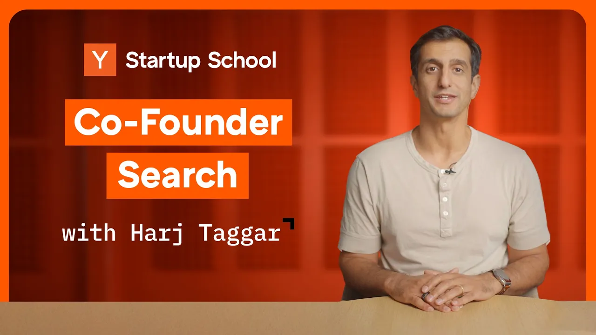

Building a startup is no small feat, especially when you’re trying to break into a competitive market. Having the right co-founder can make all the difference in your journey. In this article, we’ll explore why co-founders are essential, how to find one, and tips for maintaining a strong partnership.

### Key Takeaways

*   **Importance of Co-Founders**: They help share the workload and provide emotional support.
*   **Finding a Co-Founder**: Look within your network and be open to possibilities.
*   **Maintaining Relationships**: Regular communication is key to avoiding conflicts.

### Why You Need A Co-Founder

Starting a company is tough. Here are three reasons why having a co-founder is crucial:

1.  **Shared Workload**: Building a startup requires a lot of work. Two people can accomplish more than one.
2.  **Emotional Support**: The startup journey is filled with ups and downs. A co-founder can provide support during tough times.
3.  **Proven Success**: Many successful startups had co-founders. They often complement each other’s skills, leading to better outcomes.

### Should You Start Without A Co-Founder?

If you’re eager to start but don’t have a co-founder yet, consider these points:

*   **Go Solo If**: You have a specific idea and the skills to start building it.
*   **Wait If**: You lack technical skills and need a technical co-founder.

### What To Look For In A Co-Founder

Finding the right co-founder is essential. Here’s what to consider:

1.  **Stress Management**: They should handle stress well. Working under pressure is common in startups.
2.  **Shared Goals**: Ensure you both have similar motivations for starting a company.
3.  **Growth Potential**: Look for someone who is smart and willing to learn, rather than just focusing on their current skills.

### Where To Find Co-Founders

Finding a co-founder can be challenging, but here are some tips:

*   **Network**: Reach out to people you know. Don’t assume they’re not available.
*   **Projects**: Work on side projects or attend hackathons to meet potential co-founders.
*   **Co-Founder Matching Platforms**: Use platforms designed to connect aspiring founders.

### Getting Started Together

Once you find a potential co-founder, how do you start working together?

*   **Test Compatibility**: Spend time working on small projects together to see if you mesh well.
*   **Have Conversations**: Discuss your goals and expectations openly.

### Common Reasons For Co-Founder Breakups

Even with the best intentions, co-founder relationships can falter. Here are some common reasons:

1.  **Lack of Respect**: If one co-founder feels they can do the other’s job better, it can lead to conflict.
2.  **Leadership Struggles**: Disagreements over who should be the CEO can create tension.
3.  **Different Work Ethics**: Misaligned expectations about work hours and commitment can strain relationships.

### How To Avoid Breakups

To maintain a healthy co-founder relationship:

*   **Communicate Regularly**: Set up regular check-ins to discuss how things are going.
*   **Address Issues Early**: Don’t let disagreements fester. Have tough conversations when needed.

### Conclusion

Finding a co-founder is a vital step in your startup journey. They can help share the workload, provide emotional support, and increase your chances of success. Remember to communicate openly and regularly to maintain a strong partnership. Good luck in your search for the right co-founder!