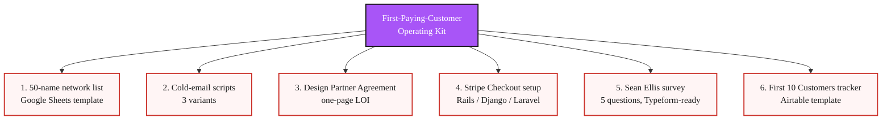
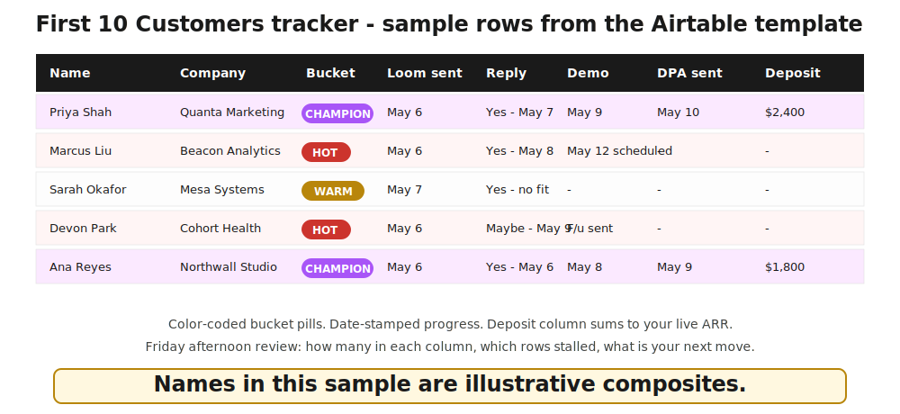

📋 Template companion to [Module 7 of the Tech for Non-Technical Founders 2026 course](/blog/tech-for-non-technical-founders-2026/). Six fill-in-the-blank artifacts you run from Monday to Friday to land your first paid pilot.

# The First-Paying-Customer Operating Kit

*From live MVP to signed paid pilot in 4 weeks - the templates Module 7 runs on.*

## What this bundles

Module 7 of this course walks four chapters: the Sean Ellis 40% test, the personal-network outreach, the paid-pilot contract, and the cold-outbound pipeline. Each chapter references a template. This page bundles all six in one place.

## The 6 components

### 1. 50-name network list template (Google Sheets)

The fill-in spreadsheet from [Chapter 7.2](/blog/first-ten-customers-personal-network/). Six columns - Name, Company, Role, Bucket, Relationship strength, Last contact date - plus four progress columns for tracking replies and demos. Pre-sorted by bucket: 5 champions on top, then 10 hot, 15 warm, 20 cold. Three blank rows in each bucket for week-2 additions.

What it does: turns a vague "I should reach out to people" instinct into 50 named messages going out by Friday EOD.

### 2. Cold-email scripts (3 variants)

The verbatim 4-line scripts from [Chapter 7.4](/blog/outbound-without-sales-team/). Three sector-specific versions:

- **B2B SaaS rescued-Rails context** - the script for founders who got out of an agency burn and are now selling to operators in the same situation.
- **B2B services** - for fractional CTOs, consultancies, and managed-services founders who sell time rather than license.
- **B2C app** - for direct-to-user products where the Loom + claim-link motion replaces a Calendly call.

Each script comes with three sample subject lines that have cleared 25%+ open rates in 2026 founder cold-outbound runs, plus a 3-message follow-up cadence (day 0, day 4, day 11).

What it does: removes the "what do I say in the email" friction so you spend 60-90 seconds per name on personalization, not 20 minutes.

### 3. Design Partner Agreement template (one-page LOI + paid pilot)

The one-page DPA from [Chapter 7.3](/blog/paid-pilot-charge-before-ship/). Six sections plus signature block. Plain English, mutual-edit document, no lawyer required for v1. Comes in three formats: Google Docs (default), PDF (for customers who want to print), DocuSign-import (for customers who want to e-sign with audit trail).

Two annotated examples: a $1,500 B2B SaaS pilot DPA and a $5,000 B2B services pilot DPA, both based on real (anonymized) 2026 founder deals.

What it does: makes the "we run paid pilots" conversation a 15-second handoff instead of a three-week back-and-forth.

### 4. Stripe Checkout setup checklist (Rails / Django / Laravel)

Five steps to a working Stripe payment link, no engineer required. Plus optional Rails / Django / Laravel snippets for founders who want to wire deposits back into their app after the first pilot ships.

The Rails snippet uses `Stripe::Checkout::Session.create` from the official `stripe` Ruby gem. The Django snippet uses `stripe.checkout.Session.create` from `stripe-python`. The Laravel snippet uses `Stripe\Checkout\Session::create()` from `stripe/stripe-php`. All three produce the same hosted checkout URL Stripe Payment Links produces; the difference is whether the deposit row gets logged in your app database in real time or you import the CSV at the end of the month.

What it does: 15-minute payment-link setup so the first deposit arrives Wednesday, not three weeks after kickoff.

### 5. Sean Ellis 40% survey template (5 questions, Typeform-import ready)

The exact 5 questions from [Chapter 7.1](/blog/must-have-segment-pmf-test/), in three importable formats:

- **Typeform JSON** - drag-and-drop into a new Typeform.
- **Tally.so spec** - paste into Tally's import flow.
- **Google Forms** - copy the question list into a new Google Form (Forms does not support import, but the template is short).

Plus a one-tab Google Sheet that computes per-segment must-have % from your CSV export. Pivot the Q1 column by the Q5 segment column and the per-segment number appears in cell B2.

What it does: 24 hours from "I should run the test" to a scored result you can act on.

### 6. The "First 10 Customers" Airtable tracker

The Airtable base from [Chapter 7.4](/blog/outbound-without-sales-team/). Pre-filled columns - Name, Company, Bucket, Loom sent, Reply, Demo, DPA sent, Deposit - with color-coded bucket pills (champion / hot / warm / cold) and date stamps on every progress column. Filters: "Replied this week," "Demo this week," "Pilot landed this month."

What it does: turns Friday afternoon into a 10-minute "what shipped this week" review instead of a 90-minute scroll through Gmail.

## How to use the kit

The kit runs Monday-to-Friday for the four weeks of Module 7. The sequence:

**Week 1 (must-have segment).** Run the Sean Ellis survey (template 5). Compute per-segment must-have %. Pick your target segment.

**Week 2 (personal network).** Fill the 50-name template (template 1). Record Loom. Send champion + hot Monday, warm Tuesday, cold Thursday.

**Week 3 (paid pilot).** Send DPA (template 3) and Stripe link (template 4) to 1-2 warm leads who agreed to demos. Bank first deposit.

**Week 4 (cold outbound).** Filter 30 prospects in Apollo or Sales Navigator. Personalize 60-90 seconds each. Send the script (template 2). Track in the tracker (template 6).

By Friday of week 4, you should have: a segment-isolated persona doc, 50 sent messages with 30+% reply rate, 1-2 signed paid pilots, and 30 cold-outbound prospects with 3-5 booked demos for week 5.

## What this kit is not

The kit is not a substitute for a sales course or a CRM. It will not teach the conversational mechanics of objection-handling, so if you have never run a customer call, read [the Mom Test interview script](/blog/mom-test-interview-script/) and run 10 user calls first. It will not track touch counts past the first 30 customers the way HubSpot, Pipedrive, or Salesforce does - past 30, the Airtable tracker breaks and you graduate to a real CRM. It also does not replace the must-have-segment test from [Chapter 7.1](/blog/must-have-segment-pmf-test/) - if your overall must-have % from template 5 is under 25%, your pipeline will fill, the demos will go fine, and conversions will stall at the deposit conversation. Run the 40% test first; download the kit second.

## How to get the kit

📬 *Bookmark this page. The 6 templates are being assembled for direct download - new templates land here as the course evolves. We are not collecting emails until each template is actually downloadable; we will not promise something we cannot ship today.*

When the templates go live they appear inline above with a direct link. No mailing list, no funnel - just the file.

## Where this fits in the course

This is the lead magnet for Module 7 of the [Tech for Non-Technical Founders 2026](/blog/tech-for-non-technical-founders-2026/) course - the chapter that lands the first paying customer right after the MVP ships. Module 7 runs in four chapters:

- 7.1 [Your First Customer Is Not a Marketing Problem](/blog/must-have-segment-pmf-test/) - run the Sean Ellis 40% test against your 10-30 MVP users.
- 7.2 [The First Ten Come From People Who Already Know You](/blog/first-ten-customers-personal-network/) - 50-name list, 4 buckets, Monday outreach sequence.
- 7.3 [Charge Before You Ship](/blog/paid-pilot-charge-before-ship/) - one-page Design Partner Agreement plus Stripe Checkout setup.
- 7.4 [Going Outbound Without a Sales Team](/blog/outbound-without-sales-team/) - filtered cold outbound for customers 11-20.

The course closes at 7.4. The kit closes the course.

## Built by

[JetThoughts](https://jetthoughts.com), a Rails-first dev shop that has rescued non-technical founders' codebases for 20 years. We published this course because the same five mistakes kept showing up in the rescue calls. The kit ships free for the same reason.
