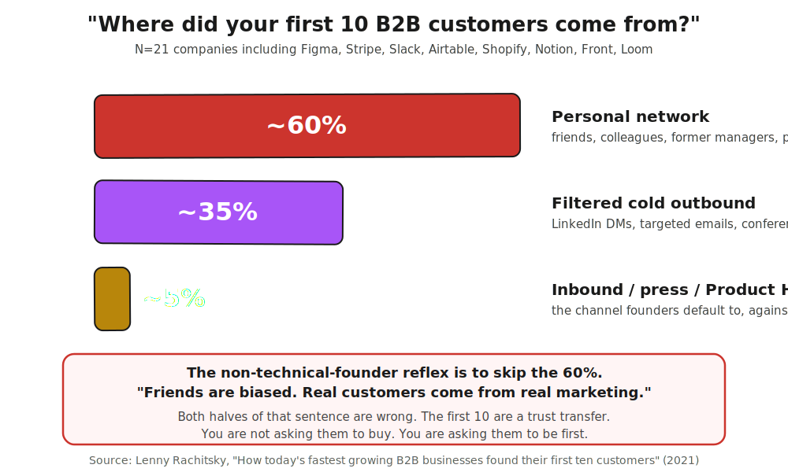
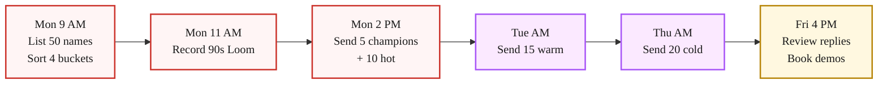

> **Module 7 · Step 2 of 4** · [Tech for Non-Technical Founders 2026](/blog/tech-for-non-technical-founders-2026/) course.
> Input: must-have-user persona + 1 named segment from 7.1. Output: 50 personalized outreach messages sent in week 1, with replies tracked in a spreadsheet.

In 2021, Lenny Rachitsky asked 21 of the fastest-growing B2B companies a simple question: where did your first 10 customers come from? The list was not modest - Figma, Stripe, Slack, Airtable, Shopify, Notion, Front, Loom, and thirteen others at similar scale. He published the answers in [a piece](https://www.lennysnewsletter.com/p/how-todays-fastest-growing-b2b-businesses) every non-technical founder should read before the first ad runs. The headline number: roughly 60% of those first customers came from the founder's personal network, around 35% from filtered cold outbound, and only 5% from inbound, press, or launch events.

The instinct of the founder out of a dev-shop burn is to skip the 60%. Friends feel biased. Former colleagues feel like cheating. The voice in your head says: real customers come from real marketing, and real marketing is paid traffic to a clean landing page. That voice is the same one that told you the MVP would convert if the conversion rate was 0.4%. Both halves of that instinct are wrong. The first 10 customers come from existing trust, not from market discovery, and the people most willing to act on that trust are the people who already trust the founder personally.

This chapter is how you build the list and send the messages by Friday.

## Why this is the right move, even if it feels wrong

The objection comes up in every founder call: "I do not want to ask friends. It feels like begging."

Reframe. You are not asking them to buy. You are asking them to be first to try something that solves a problem they already have, at a steep discount, while you fix the rough edges they catch. That is a favor your network owes you about as much as you owe them when they ask for an intro. The trade is "ten weeks of your time and $500 against a tool that will save you ten hours a week from week one." If they have the problem, they take the trade. If they do not have the problem, they were never your customer, and you cut bait fast and move to the next name.

Four 2026 B2B founders who shipped paid pilots in our rescue queue all closed the first three customers from this exact motion. A recruitment-SaaS founder had eight names in her phone she had not messaged in a year, and three of those names converted in the first two weeks. A HealthTech founder's ex-boss at her last job had been complaining about the exact problem her product solved at lunch in October 2025 - she had not asked him because "it felt awkward." A B2B services founder watched a former Y Combinator batchmate post about the problem her tool solved on LinkedIn in March 2026 and did not respond because she was waiting on her landing-page redesign. Each had a 6-12 month head start on revenue if she had picked up the phone the day she had the lead.

## The 50-name list: 4 buckets

Open a Google Sheet. Six columns: Name, Company, Role, Bucket, Relationship strength, Last contact date. You will fill 50 rows in two hours on Monday.

| Bucket | How many | Definition |
|---|---|---|
| Champions | 5 | Already complained to you about this exact problem. Will pick up your call. |
| Hot | 10 | In the must-have segment from 8.1. Knows you personally. Recent contact under 6 months. |
| Warm | 15 | Adjacent. Knew you 6-24 months ago. Reasonable bet they have the problem. |
| Cold | 20 | Dormant LinkedIn 1st-degree. Unclear if they have the problem. |

**Where to find the names.** Open LinkedIn. Filter your 1st-degree connections by the criteria that define your must-have segment from [Module 7.1](/blog/must-have-segment-pmf-test/). For a B2B-marketer must-have segment, filter on title (Marketing, Growth, Demand Gen, RevOps), company size (50-500 employees), and industry (one vertical first, expand later). Export the filtered list with [LinkedIn's data export](https://www.linkedin.com/help/linkedin/answer/a566336) - free for everyone, takes 24 hours but you can use yesterday's. Cross-reference your phone contacts, your email inbox, your last three jobs' Slack workspaces if you still have access, and your YC or accelerator batchmate list if you have one. The 50 names will assemble faster than you expect once the segment filter is set.

**Champions deserve extra thought.** Five champions is a high bar. If you cannot name five people who have complained to you about this exact problem in the last twelve months, you may not have a must-have segment at all - go back and re-read your verbatim Q2-Q3 quotes from the 10.1 survey. The champions are the people who said those words to you in real life before the survey existed.

## The outreach template (Loom + Calendly + paid-pilot teaser)

Champions and hot get personalized messages with a recorded Loom. Warm and cold get a name-personalized template. The structure is the same for all four buckets - what changes is the opening line and how much you personalize from your shared history.

### The 4-part message

**Part 1: Earn the open with a specific reference.**

For champions: "Hey [name], you mentioned [the exact thing they said] back in [month]. Still happening?"

For hot: "Hey [name], just saw [a specific thing they posted, shipped, or said recently]. Have a question about [the problem]."

For warm: "Hey [name], have not caught up since [the last specific touchpoint]. Working on something I think you might have a take on."

For cold: "Hey [name], [a true one-line reference to your relationship - 'we were both in the Acme batch,' 'you commented on my LinkedIn post about X' - if no real reference exists, move them out of the network outreach and into Module 7.4 cold outbound, not here]."

**Part 2: One line on the problem, in their language.**

Use the verbatim Q3 answers from your 10.1 survey. "I am building a tool that lets B2B marketers run an end-to-end attribution model without an analyst." If the words are not theirs, swap until they are.

**Part 3: A Loom, not a paragraph.**

Record a 90-second Loom on Monday morning. Free Loom account, 25 free videos. The Loom shows your product in 60 seconds and you on camera in the other 30. Founders who skip the Loom and write a paragraph instead get half the response rate. The face matters. The product matters more.

**Part 4: A specific ask - 15 minutes, paid pilot teaser.**

"15 minutes this week to walk you through it and see if it solves the [problem]? Open to a paid pilot if it does. Calendly: [link]."

The "paid pilot" hint is load-bearing. You are flagging that this is not a free favor and not a free trial. The full mechanic of the paid pilot is the subject of [Chapter 7.3](/blog/paid-pilot-charge-before-ship/) - keep the teaser short here.

**Total length:** 5-7 sentences. Anything longer and the recipient skims and forgets.

## The week-1 sequence

You will hear back from 15-25 of the 50 messages by Friday EOD. That is a 30-50% response rate on a properly built personal-network list, and it is the highest response rate you will ever see again as a founder. Use it well.

**Track replies in the same Sheet.** Add four columns to the right: Reply received (date), Reply sentiment (yes/maybe/no/silent), Demo booked (date), Pilot proposed (yes/no). When the demo books, paste the Calendly confirmation date. When the pilot conversation happens, advance the row to Module 7.3.

## What the "no" replies actually tell you

A "no" from a champion is the most expensive single piece of feedback you will get all year. Champions said the problem out loud, you built the thing, and they passed. Always reply with a single question: "Help me understand - what changed since [the original conversation]?"

The answer is one of three:

- **The problem moved.** They solved it some other way. Spreadsheet, internal tool, a hire. Your product just got out-paced by their workaround. Re-read your 10.1 segment-isolation results. This may or may not generalize to your segment.

- **The buying motion is wrong.** They have the problem, but your product is not their decision to make. The CFO buys it, or the CTO, or the VP of Sales. Get the introduction. Your champion just became a referrer.

- **You missed the brief.** What you built does not match what they remember complaining about. This is the most painful and the most useful. You over-solved or under-solved. Edit your Q3 verbatim and your persona accordingly.

A "no" from cold is a non-event. They were never the right name. Move on.

## The hot bucket is where the conversions live

By Friday, you will have a pattern: most of your booked demos came from champions, most of your eventual paid pilots will come from hot. The reason is simple. Champions get on the call out of relationship and curiosity, and they are warm enough to ask hard questions. Hot are still warm but they have less existing context, which forces you to articulate the value cleanly. The articulation that closes them is the articulation that closes everyone after them.

If you have a champion on the call and they say "this would be perfect for [name in hot], do you want an intro," say yes immediately. Champion-routed warm intros convert at 3-4x the cold-warm conversion rate. The cost is one email back to your champion that day.

## When the personal network is genuinely small

Some founders read the bucket structure and panic because their LinkedIn is at 200 connections and their phone has 40 names. The math still works, but the source mix shifts.

If you cannot find 50 names across the four buckets, fill what you have - 25 names of mostly hot and warm - and supplement with two adjacent sources:

- **Your accelerator or YC batchmates.** A YC batchmate list is twice the size of your network and pre-warmed by the shared experience. Slack the batch about your launch.
- **The community you live in.** Indie Hackers, the [r/SaaS](https://www.reddit.com/r/SaaS/) sub, the no-code-founders Slack, the AI-founders Discord. These are not cold outbound - they are public spaces where you have been showing up and complaining about your own problems for months. A B2B services founder closed her first paid pilot in 9 days from a single Indie Hackers post about her MVP that resonated with a member who had been reading her build-in-public thread.

If neither source applies, skip ahead - your first ten will come from [Module 7.4 cold outbound](/blog/outbound-without-sales-team/) and the network outreach in this chapter is a smaller share of the work. The default sequence (network first, cold second) holds when the network is big enough to feed 30+ names. Below that, the order is the same but cold outbound starts in week 2 instead of week 3.

## What to do this week

Monday morning, 9 AM:

1. Open the Google Sheet. Six columns. Fill 50 names across the four buckets.
2. Record one 90-second Loom showing the product and you on camera.
3. Send the 5 champion messages and the 10 hot messages by 2 PM. Personalized opening for each. Same Loom link for all 15.

Tuesday morning:

4. Send the 15 warm messages. Name-personalized opener, template-personalized body.

Thursday morning:

5. Send the 20 cold messages. Hold the bottom 5 for week 2 to soften the volume.

Friday afternoon, 4 PM:

6. Tally the responses. Book 3-5 demos for week 2. Annotate each row with bucket, response, sentiment.

The 50-name list template, the Loom outline, and the 4-message template variants (champion / hot / warm / cold) all ship in [the First-Paying-Customer Operating Kit](/blog/first-paying-customer-operating-kit/).

## Advanced (optional sidebar)

Founders who want to systematize the network motion can layer on the [Y Combinator advice on early sales](https://www.ycombinator.com/library/6g-tactical-advice-for-the-first-sales-hire) (the YC sales library has a deep collection from founders who built their first 100 customers solo) and [Paul Graham's "Do Things That Don't Scale"](http://paulgraham.com/ds.html) - the Stripe example, in particular, where Patrick and John Collison installed the product on the spot for every early customer in person, is the precise expression of the relationship logic in this chapter. The main path above gets you to 10 customers. The advanced version of the playbook extends the same relational rigor to 100.

## Further reading

- Lenny Rachitsky, [How today's fastest growing B2B businesses found their first ten customers](https://www.lennysnewsletter.com/p/how-todays-fastest-growing-b2b-businesses) - the source for the 60/35/5 breakdown and the company-by-company first-10 source data.
- Lenny Rachitsky, [How to win your first 10 B2B customers](https://www.lennysnewsletter.com/p/how-to-win-your-first-10-b2b-customers) - the 7-step playbook from over a hundred B2B founders, including the must-have-user framing.
- Paul Graham, [Do Things That Don't Scale](http://paulgraham.com/ds.html) - the founding text on early-customer manual recruitment, including the Stripe Collison-brothers installation example.
- Steve Blank, [Customer Validation](https://steveblank.com/2010/04/12/why-startups-need-a-less-stupid-process/) - the academic frame underneath the practical playbook. Validation precedes scale.
- First Round Capital, [The First-Round Sales Library](https://review.firstround.com/from-the-first-edition-of-the-founders-handbook-finding-your-first-customers/) - a deep collection of essays from founders on the first-10 motion, useful for sector-specific context.
- Y Combinator Library, [Tactical advice for the first sales hire](https://www.ycombinator.com/library/6g-tactical-advice-for-the-first-sales-hire) - YC's collection on founder-led sales, including when the relationship motion has to give way to a structured pipeline.
