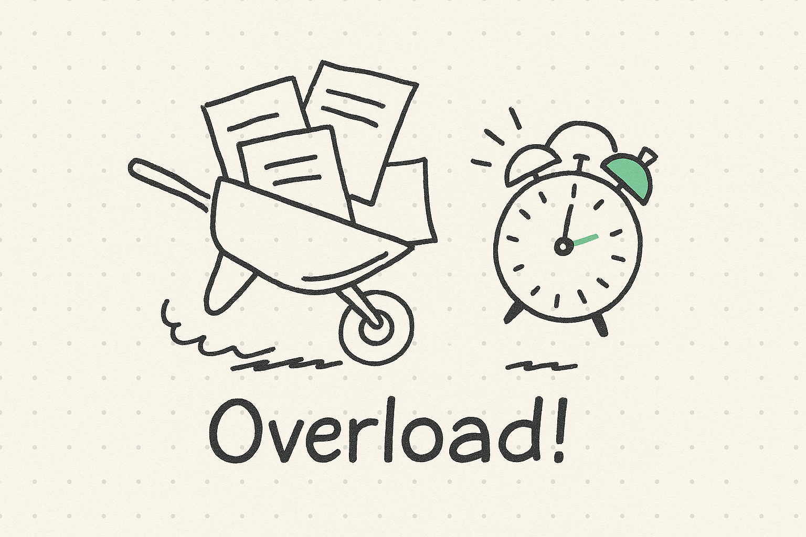
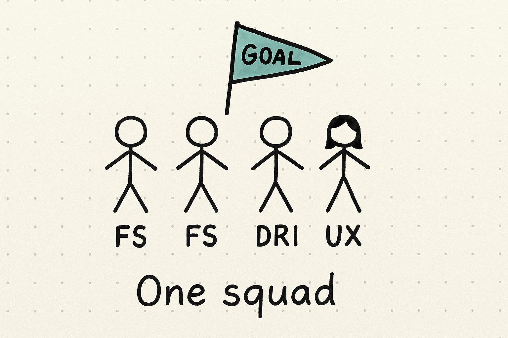
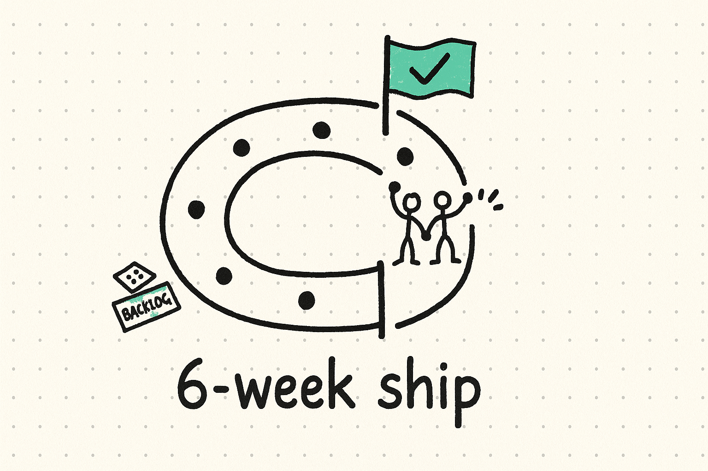
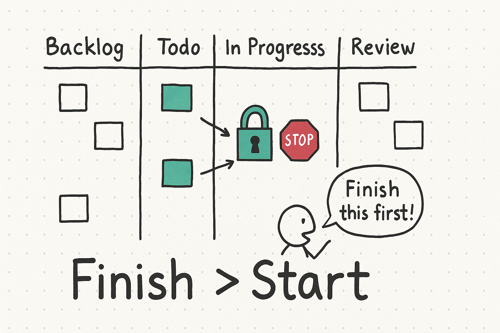
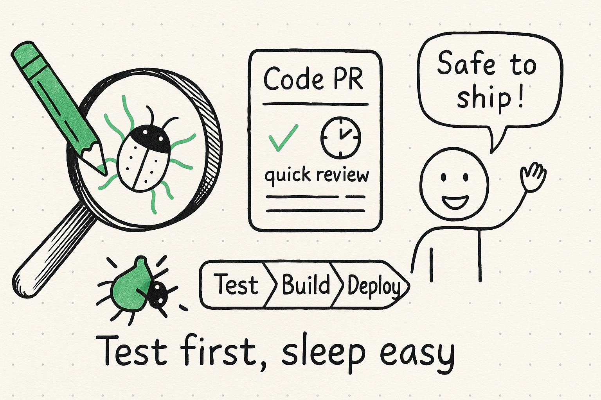
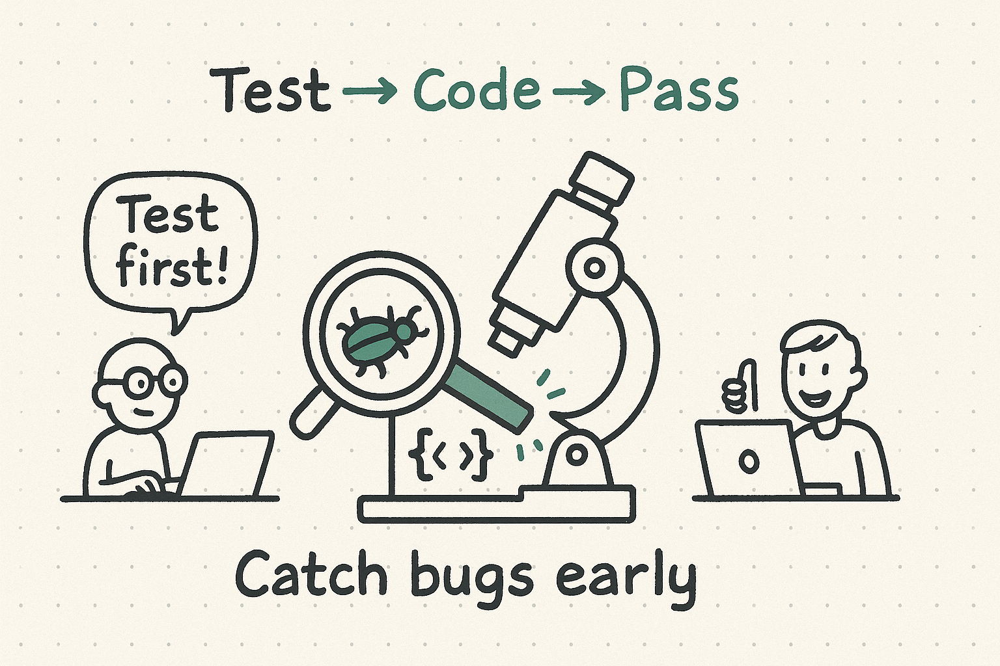
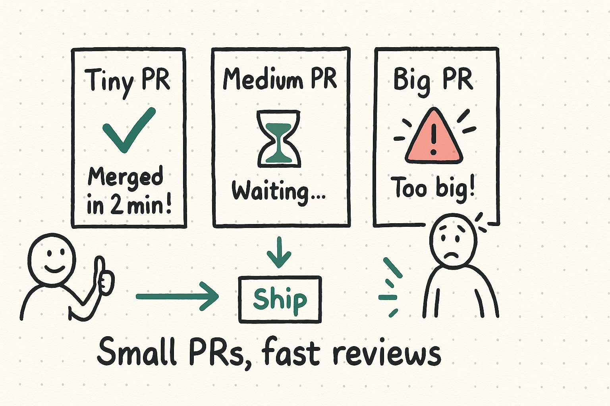
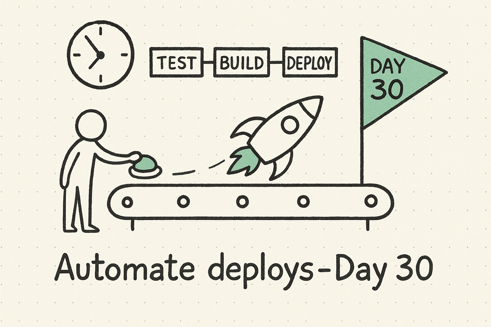
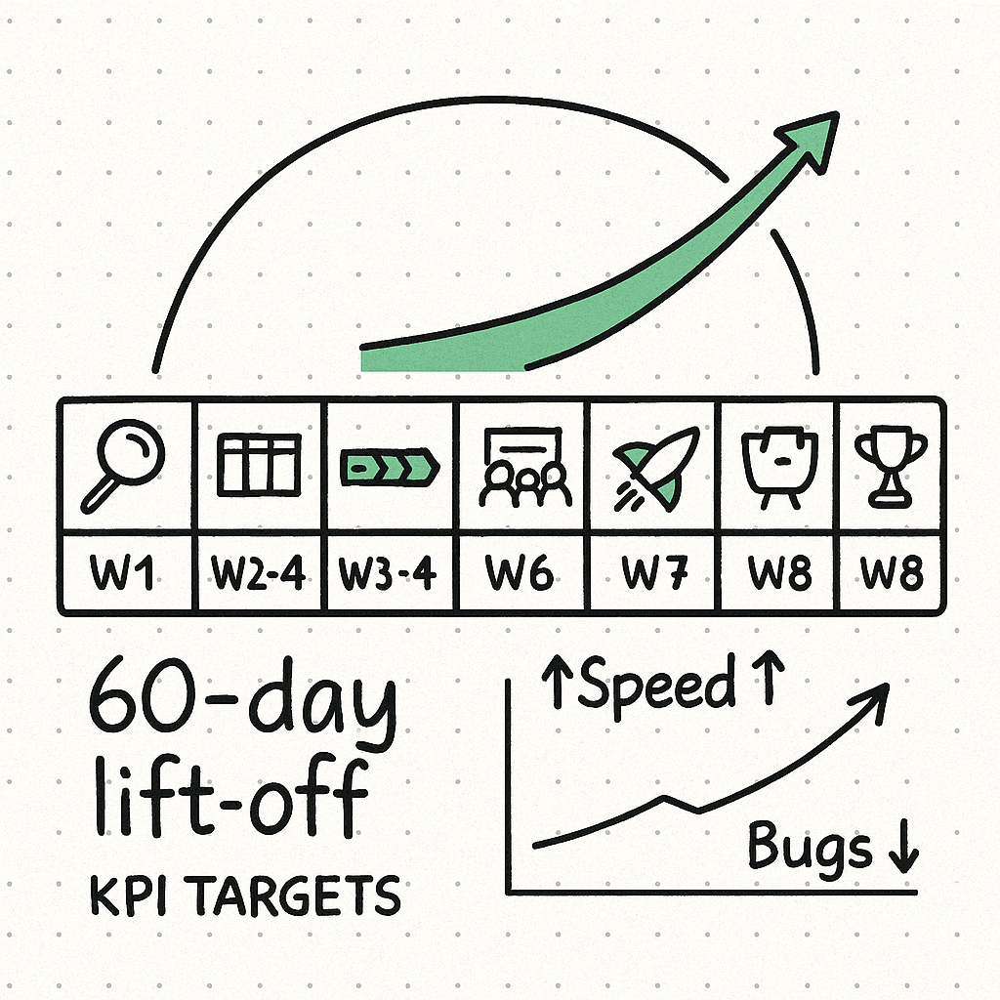

**TL;DR** — Series A companies often stall out after product‑market fit: deadlines slip, vendor hand‑offs pile up, and technical debt snowballs. In **60 days** you can reverse those trends with five proven moves: cross‑functional squads, Shape Up cycles, Kanban flow, TDD, and automated CI/CD.  This guide breaks down the “why” and “how,” bolstered by real metrics, third‑party studies, and a week‑by‑week rollout map.

> **Quick wins:** Most pilots move from **monthly releases** to **daily automated deploys** in under eight weeks, slice defect rates nearly in half, and reclaim multiple developer‑months per quarter — all without adding headcount.

---

## Table of Contents

1. [Why Teams Slow Down After Seed Funding](#why-teams-slow-down-after-seed-funding)
2. [Common Pitfalls & Vendor Headaches](#common-pitfalls--vendor-headaches)
3. [JetThoughts Playbook — The 5 Core Moves](#jetthoughts-playbook--the-5-core-moves)
   1. [Cross‑Functional Value‑Stream Squads](#31-cross-functional-value-stream-squads)
   2. [Shape Up 6‑Week Cycles](#32-shape-up-6-week-cycles)
   3. [Kanban Flow & WIP Limits](#33-kanban-flow--wip-limits)
   4. [Test‑Driven Development & Tiny PRs](#34-test-driven-development--tiny-prs)
   5. [CI/CD by Day 30](#35-cicd-by-day-30)
4. [60‑Day Timeline & KPI Targets](#60-day-timeline--kpi-targets)
5. [Objections—And the Data That Answers Them](#objections—and-the-data-that-answers-them)
6. [Mini‑Case: Fintech Startup in Freefall](#mini-case-fintech-startup-in-freefall)
7. [Cost–Benefit Snapshot](#cost–benefit-snapshot)
8. [Executive Summary](#executive-summary)
9. [Glossary for Busy Execs](#glossary-for-busy-execs)
10. [Next Step](#next-step)

---

## Why Teams Slow Down After Seed Funding

During the MVP phase, hero culture and quick hacks work fine.  Post‑funding, the same tactics **collapse under scale**:

* **Backlog sprawl.**  Hundreds of vaguely defined tickets accumulate. No one knows which matter.
* **Time‑zone‑driven bottlenecks.**  A vendor‑run DevOps team on the other side of the world deploys at 3 a.m. your local time.
* **Bug whack‑a‑mole.**  Every emergency patch introduces two new issues because there are no tests.
* **Scheduling gridlock.**  Daily stand‑ups balloon to 60 minutes. Key contributors attend more meetings than coding hours.

> **Org‑Design Debt vs Tech‑Debt**
> Technical debt is visible in code; org‑design debt hides in calendars, hand‑offs, and unowned outcomes.  The latter usually drives the former.

**Early red‑flag metrics**:

| Metric                   | Healthy  | Warning   | Critical  |
| ------------------------ | -------- | --------- | --------- |
| Deploy frequency         | Daily    | Weekly    | Monthly+  |
| Cycle time (start→prod)  | ≤ 5 days | 6–10 days | 10 + days |
| Defect‑to‑feature ratio  | < 0.25   | 0.25–0.4  | 0.4+      |
| Meeting hrs per dev / wk | < 6      | 6–10      | 10 +      |

If two metrics sit in the “critical” column, it’s time for radical focus.

---

## Common Pitfalls & Vendor Headaches

| Symptom                           | Direct Friction                           | Long‑Term Damage                   | Hidden Cost                        |
| --------------------------------- | ----------------------------------------- | ---------------------------------- | ---------------------------------- |
| Separate web / API / mobile teams | 3–5 slack threads per small change        | Fragmented ownership slows hiring  | Multiple frameworks to maintain    |
| Massive backlog                   | Engineers cherry‑pick → scope chaos       | Morale melts, attrition risk rises | 8–12 hrs/wk backlog grooming       |
| Vendor‑owned DevOps               | Build failures resolved via ticket queues | Security blind spots, slow MTTR\*  | Escalation fees + hard lock‑in     |
| No automated tests                | Release = code freeze + manual QA sprint  | Tech debt compounds exponentially  | 40–50 % dev capacity on hot‑fixes  |
| Meeting overload                  | 0.5 day of context switch per dev         | Burnout, innovation grind to halt  | Lost maker time & opportunity cost |

\*MTTR = Mean Time To Recover

> **Research primers:**
> • *IBM System Science Institute* — found defect‑fix cost multiplies 4 × at each later stage (unit → integration → production).
> • *Google’s DORA* 2024 survey — best‑in‑class deploy risk is **⅛** that of low performers while deploying **973×** more often.

---

## JetThoughts Playbook — The 5 Core Moves

Below you’ll find an expanded dive into each move, plus checklists for immediate execution.

### 3.1  Cross‑Functional Value‑Stream Squads

**Why it works:**  Conway’s Law becomes a lever, not a liability.  When one team owns “Checkout Flow,” its code naturally coalesces.  Less API drift, fewer sync meetings.

**Checklist to launch a pilot squad**

1. **Define a single measurable outcome** (e.g. “increase demo‑to‑paid conversion 15 %”).
2. **Assemble 3–5 contributors.**  Mix Fullstack T-Shape developers, designer, plus a product‑minded lead.
3. **Give them runway.**  Shield from other projects for one full Shape Up cycle.
4. **Set public metrics.**  Cycle time, throughput, and target KPI live on a dashboard.
5. **Rotate observers.**  Let skeptics shadow stand‑ups to witness smoother flow.

> **Pro tip:** Use a *“team canvas”* workshop on day 1: articulate mission, rituals, and working agreements in two hours.

### 3.2  Shape Up 6‑Week Cycles

**Shape Up in 90 seconds**

* *Pitch:* one‑pager that defines the problem, appetite (max time), rabbit‑holes, and solution sketch.
* *Betting table:* stakeholders allocate capacity to 2–3 pitches.
* *6‑week build:* team delivers “must‑haves,” negotiates “nice‑to‑haves.”
* *Cooldown (2 weeks):* bug fixes, retrospective, next shaping.

**Benefits**

* Eliminates backlog grooming overhead.
* Sets hard boundaries, closing “never‑ending project” loops.
* Couples leadership strategy to delivery rhythm.

**Anti‑patterns to avoid**

* Turning pitches into spec docs.
* Adding work mid‑cycle (“scope bleed”).
* Skipping cool‑down — debt piles fast.

### 3.3  Kanban Flow & WIP Limits

Most teams intuitively know “start less, finish more,” yet resist strict limits. Data convinces:

* **Little’s Law** — Lead Time = WIP ÷ Throughput.  Reduce WIP, lead time falls.
* **2019 DevExec Survey** — Teams lowering WIP from 6 to 3 tickets cut cycle time 47 % on average.

**Starter board template**

| Column  | WIP Cap | Exit Criteria                        |
| ------- | ------- | ------------------------------------ |
| Todo    | ∞       | Groomed, acceptance criteria clear   |
| In Dev  | Dev × 1 | Code in PR, tests written            |
| Review  | Dev × 1 | All checks pass, 2 reviewers OK      |
| Staging | 3       | Feature flags toggled off by default |
| Done    | —       | Deployed to prod, metrics tracked    |

> **Continuous flow ritual:** When Review hits its cap, the team swarms reviews before *anyone* starts new code. No exceptions.

### 3.4  Test‑Driven Development & Tiny PRs

**Why TDD in 2025?**  When paired with modern CI, TDD is the cheapest insurance policy:

* Defects found in unit test cost \~$17 on average; in production, > $1,000 (IEEE “Cost of Quality” 2023 update).
* Teams practicing TDD report **15 % fewer critical incidents** per quarter (GitHub Octoverse analytics).

**Tiny PRs** multiply that benefit:

* Review time ↓ 70 % when PR < 300 LOC (CMU empirical study).
* Merge conflicts near‑zero, enabling trunk‑based flow.

**Migration pattern for legacy code**

1. Wrap public APIs with tests first (golden master).
2. Extract seams, refactor internals safely.
3. Gradually raise coverage threshold in CI.

### 3.5  CI/CD by Day 30

Automation is the keystone that locks improvements in place.

**Four levels of pipeline maturity**

| Level | Trigger        | Tests               | Deploy Target     | Rollback                      |
| ----- | -------------- | ------------------- | ----------------- | ----------------------------- |
| L1    | Manual         | None/manual QA      | Prod monthly      | Manual hot‑fix                |
| L2    | Push           | Unit                | Staging daily     | Scripted revert               |
| L3    | Merge to main  | Unit + integration  | Prod daily        | One‑click rollback            |
| L4    | Feature toggle | Observability gates | Canary/blue‑green | Auto rollback on error budget |

**Day 30 goal:** reach L2. **Day 60 goal:** reach solid L3.  L4 comes later but foundations are laid.

---

## 60‑Day Timeline & KPI Targets

| Week | Focus                   | Deliverables                        | Leading KPIs                          |
| ---- | ----------------------- | ----------------------------------- | ------------------------------------- |
| 1    | Audit & kickoff         | Value‑stream map, baseline metrics  | Cycle time, deploy freq, WIP snapshot |
| 2    | Kanban + WIP            | Live board, team canvas             | WIP ≤ 2 × devs                        |
| 3–4  | CI scaffold             | Green builds, failing tests blocked | PR pass‑rate ≥ 70 %                   |
| 5    | Shape Up betting        | 2–3 pitches approved                | Pitch quality score                   |
| 6    | Cycle midpoint          | Demo “must‑have” slice              | 50 % bets complete                    |
| 7    | Daily staging deploy    | Trunk merged daily                  | Lead Time ≤ 2 days                    |
| 8    | First prod daily deploy | Full retrospective                  | Defect rate ↓ 40 %, NPS ↑             |

**Lagging KPIs to track:** customer‑visible defects, customer cycle time (request→live), feature adoption (%), and developer satisfaction (quarterly pulse).

---

## Objections—And the Data That Answers Them

| Objection                          | Evidence‑Based Rebuttal                                                                              | Fast Experiment                                                    |
| ---------------------------------- | ---------------------------------------------------------------------------------------------------- | ------------------------------------------------------------------ |
| *“Writing tests slows delivery.”*  | TDD adds +15–30 % coding time but reduces defect fixing by 40–90 % (IBM, Microsoft). ROI ≥  4 ×.     | Pick one API, run TDD for a week. Compare bug count.               |
| *“Re‑org mid‑project is risky.”*   | Start with a non‑critical but revenue‑tied stream. 70 %+ see blocker drop in 2 sprints.              | 6‑week pilot squad w/ identical headcount.                         |
| *“Off‑shore DevOps owns infra.”*   | CI/CD removes drudgery; vendors focus on infra‑as‑code. Costs fell 15 % in 2 JetThoughts cases.      | Migrate one repo to GitHub Actions in 3 days.                      |
| *“Backlog is our knowledge base.”* | Betting table preserves best ideas; zombie tickets expire automatically. Grooming time ↓ 50 %.       | Archive any ticket untouched for 90 days; watch noise drop.        |
| *“Meetings keep us aligned.”*      | Async daily updates + weekly demos outperform 14‑person stand‑ups. Teams recovered 4–6 focus hrs/wk. | Convert stand‑up to slack thread for one sprint. Track cycle time. |

---

## Mini‑Case: Fintech Startup in Freefall

**Context**

* 35 engineers, 4 silo teams, vendor DevOps.
* Deploys: Monthly → quarterly due to rollback fear.
* P0 on‑call alerts: 7 per month.

**Intervention timeline (JetThoughts)**

| Day | Event                           | Metric Shift              |
| --- | ------------------------------- | ------------------------- |
|  7  | Kanban + WIP enforced           | WIP from 58 → 21          |
|  21 | CI pipeline green               | PR pass‑rate 32 % → 78 %  |
|  35 | First Shape Up demo             | Cycle time 14 d → 8 d     |
|  45 | Daily prod deploys start        | P0 alerts down to 2/month |
|  60 | 2 squads live, fully autonomous | NPS dev 3.2 → 7.8         |

**Financial outcome:** CFO calculated 2.6 engineer‑months recaptured per quarter, outpacing JetThoughts fee by 180 %.

---

## Cost–Benefit Snapshot

| Category                  | Typical Baseline | Post‑60‑Day Pilot         | Annualized Value\* |
| ------------------------- | ---------------- | ------------------------- | ------------------ |
| Dev hot‑fix hours         | 400 hrs/qtr      | 220 hrs/qtr               | +$72 k            |
| Vendor escalation bills   | $6 k/mo         | $2.5 k/mo                | +$42 k            |
| Attrition backfill        | 2 engineers/yr   | 0–1                       | +$60 k            |
| Delay‑driven lost revenue | Hard to quantify | 2–4 weeks sooner features | ++                 |
| **Totals**                |  —               |  —                        | **>$174 k/yr**    |

\*Assumes blended $75/hr engineer cost. Numbers from aggregate JetThoughts engagements.

---

## Executive Summary

* **Problem →** After early traction, engineering slows: silos, vendor bottlenecks, rising defect counts.
* **Solution →** Five‑move playbook: squadify, Shape Up, WIP limits, TDD, CI/CD.
* **Proof →** Daily deploys, half cycle time, 40–60 % defect drop, six‑figure capacity gains.
* **Timeline →** Two weeks to first win, 60 days to new normal.
* **Risk Mitigation →** Start with one pilot stream; expand only once numbers prove out.

---

## Glossary for Busy Execs

* **Cycle Time** — Calendar days from work start to prod deploy. Lower = faster feedback.
* **CI/CD** — Continuous Integration/Continuous Delivery: automated build, test, deploy.
* **Shape Up** — 6‑week build + 2‑week cool‑down model from Basecamp.
* **WIP Limit** — Max items any column/team can hold to cut multitasking.
* **Value‑Stream Squad** — Cross‑functional team owning an end‑to‑end customer outcome.

---

## Next Step

If your roadmap is stalling, a 30‑minute call can surface hidden org‑design debt and craft a 60‑day pilot.

**Book here → \[https://jetthoughts.com/contact-us/]**
We’ll benchmark cycle time, defect velocity, and deploy cadence, then share a customized plan (plus references from founders who’ve made the leap).

> *JetThoughts — We build teams that build products, faster.*