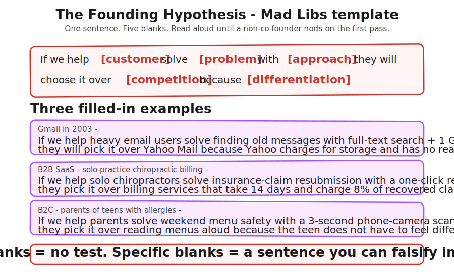
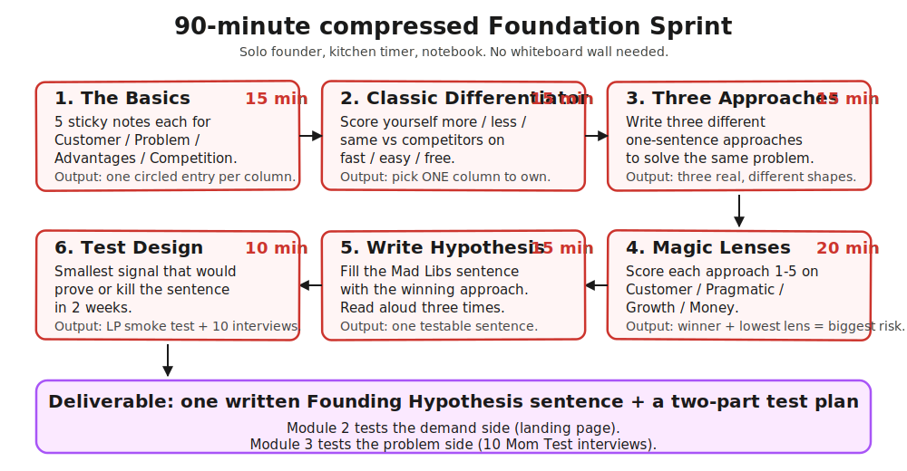
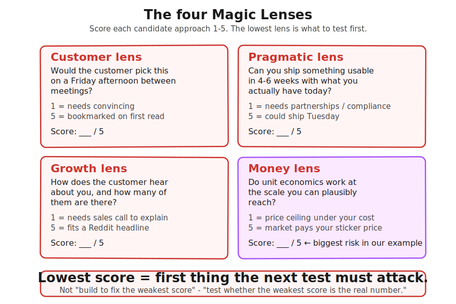

> **Module 1 · Step 1 of 1** · [Tech for Non-Technical Founders 2026](/blog/tech-for-non-technical-founders-2026/) course.
> Input: a rough idea, instinct, or half-built MVP. Output: a one-sentence Founding Hypothesis you can test in the next two modules.

## Don't Talk to Anyone Without a Hypothesis

Everyone has a hypothesis. Few have it written in one sentence. The difference: a vague mental model lets you pitch four different products to 23 customers without noticing; a written sentence forces you to commit before you talk to anyone.

Jake Knapp and John Zeratsky call the written version a Founding Hypothesis. They built a one-day workshop around it (*Click*, 2025). The version below is that workshop compressed to 90 minutes - one notebook, one kitchen timer, run it Monday morning before coffee.

## The Founding Hypothesis (the one sentence everything tests against)

Here is the sentence template, verbatim from *Click* (Knapp and Zeratsky, April 2025):

> *"If we help [customer] solve [problem] with [approach], they'll choose it over [competition] because [differentiation]."*

Five blanks. One sentence. The discipline is in filling all five blanks with specifics, not adjectives. A bad fill sounds like "If we help small businesses solve productivity problems with a smart dashboard, they will choose it over Excel because it is easier to use." Every blank is a category, not a noun. Nobody is buying that.

Compare with what Gmail's founding hypothesis would have read like in 2003: "If we help heavy email users find old messages with full-text search and a gigabyte of storage, they will choose it over Yahoo Mail because Yahoo charges for storage and has no real search." Now every blank is a specific thing. You can test it.

Two more worked examples for the kind of founder reading this:

A B2B SaaS Founding Hypothesis (the one our HealthTech founder landed on):

> *"If we help solo-practice chiropractors solve insurance-claim resubmission with a one-click resubmit workflow, they will choose it over their current billing service because the billing service takes 14 days and charges 8% of the recovered amount."*

A B2C consumer Founding Hypothesis:

> *"If we help busy parents of teens with peanut allergies solve weekend restaurant menu safety with a phone-camera ingredient scan, they will choose it over reading menus aloud at the table because the scan finishes in three seconds and doesn't require the kid to feel different."*

Notice what both have in common. The customer is a specific role with a specific friction. The problem is a verb-noun pair, not a category. The approach is one mechanism, not a feature list.

The competition is the actual thing the customer does today, including "a spreadsheet" or "ask their kid to read the menu." The differentiation is a measurable claim: the 14-day delay drops to **one click**, a **three-second scan** replaces a five-minute interrogation.

The smell test: read the sentence aloud to someone who is not your co-founder. If they say "wait, can you say that again" or "what does X mean," your sentence has a vague blank in it. Rewrite the blank. Read aloud again. Repeat until the listener nods on the first pass. Most founders need three or four reads to get there. That is the work.

## The 90-Minute Compressed Sprint

Knapp and Zeratsky designed the orig Foundation Sprint as a one-day workshop for a founding team. A solo non-technical founder does not have a founding team, a whiteboard wall, or eight uninterrupted hours. The version below compresses the same six moves into 90 minutes you can run alone with a notebook and a kitchen timer.

**Step 1 - The Basics, 15 minutes.** Open four columns in a notebook: Customer, Problem, Advantages, Competition. Write five entries in each column. Five candidate customers (different segments). Five candidate problems for the strongest customer (different jobs-to-be-done). Five things you bring to the table that a generic Lovable build does not (an existing audience, domain knowledge, a contact, a unique data set).

Five candidate things the customer does today instead of your product (which is competition, even when the "competition" is a spreadsheet or doing nothing). Read the column. Circle the one entry you would bet on.

**Step 2 - Classic Differentiator, 15 minutes.** Draw three columns: *fast*, *easy*, *free*. For each, write "more" or "less" or "same" against the strongest competition entry from Step 1. Pick the one column you can credibly own. You cannot own all three. A product that is faster AND easier AND cheaper than the spreadsheet is a product nobody believes exists. Pick one column and write one sentence: "Our product will be the [faster / easier / cheaper] one." That sentence is your differentiator candidate.

**Step 3 - Generate 3 candidate approaches, 15 minutes.** Now write three different one-sentence approaches you could take to solve the circled problem for the circled customer. Three is the right num because two collapse into the safer option and four is procrastination. The HealthTech founder wrote: (a) a one-click resubmit workflow, (b) a Slack bot that nags the billing service weekly, (c) an outsourced claim-resubmission service done by a virtual assistant. Three real, different shapes.

**Step 4 - Magic Lenses lite, 20 minutes.** Score each of the three approaches on a 1-5 scale across four lenses: Customer (would the customer actually want this), Pragmatic (could you ship something in 4-6 weeks), Growth (is the audience big and reachable), Money (do the unit economics work). The lens scores are deliberately rough; the goal is to surface comparison, not to optimize.

After you score, sum each approach. Pick the highest sum. The lens that scored lowest across the winning approach is your biggest risk - the part of the hypothesis most likely to break.

**Step 5 - Write the Founding Hypothesis, 15 minutes.** Open the Mad Libs sentence. Fill in the five blanks using the winning approach from Step 4, the customer and problem you circled in Step 1, the competition you scored against in Step 2, and the differentiator from Step 2. Read it aloud three times. Adjust any blank that sounds vague. Stop when the sentence reads like a thing a friend could repeat back to you.

**Step 6 - Test design, 10 minutes.** Open a fresh page. Write one sentence: "The smallest signal that would prove or kill this hypothesis in two weeks is _____." Most founders default to "ten interviews," which is right but incomplete. The full test is two parts: a smoke-test landing page (Module 2) for demand signal, and ten Mom Test interviews (Module 3) for problem signal. Write both as your test plan. The hypothesis sentence and the two-part test design are the deliverables of this sprint.

The four-column sheet, lens scorecard, Mad Libs blanks, and test-design grid are all embedded in this page. Print it, run the timer, fill in by hand. Software gets in the way of a 90-minute sprint.

## Stress-Test With Magic Lenses

The four lenses are the part of the sprint most founders skip, and they are the part that pays the rent. Each lens forces you to look at the same approach from a different person's seat. The point is not to maximize all four; the point is to see which one scores lowest so you know what to test first.

**Customer lens** asks: would the customer pick this on a Friday afternoon? Not in a survey, not on a podcast - on a Friday when they have 12 minutes between meetings and have already triaged their inbox. If the answer is "they would have to be convinced," the score is 1-2. If the answer is "they would notice this in a Reddit thread and bookmark it," the score is 4-5.

**Pragmatic lens** asks: can you ship something usable in **4-6 weeks** given what you actually have? A non-technical founder shipping with Lovable, Bubble, or a developer they hire has different pragmatic ceilings. Drop the score one point if the approach requires integrating with an API you have never used. Drop it another point if it requires a license, a partnership, or compliance work. A 5/5 here means you could ship Tuesday.

**Growth lens** asks: how does the customer hear about you, and how many of them are there? An approach that needs a sales call to explain itself is 1-2. An approach that fits in a Reddit headline and converts on a landing page is 4-5. The Growth lens punishes complex approaches.

**Money lens** asks: do the unit economics work at the scale you can plausibly reach? A consumer app at $4/mo that needs 10,000 users to clear $40K MRR is a different unit-economics shape than a B2B SaaS at $400/mo that needs 100. The Money lens is the one most non-technical founders score generously on because pricing feels theoretical at this stage; we recommend scoring conservatively here.

A 2026 example from the JT rescue queue: a B2B SaaS founder building a vendor-management tool for procurement teams scored her chosen approach at Customer 4, Pragmatic 4, Growth 4, Money 1. The Money lens scored 1 because the procurement teams she had talked to expected a price under $150/mo and her unit economics needed at least $600/mo to clear hosting and customer-support cost. The score told her the test to run in Module 2 was not "will procurement teams click the ad" - they will. The test was "will procurement teams pay $600/mo."

She designed her **landing-page CTA around the price point**, not the feature set, and learned in 11 days that procurement at that price was a no. She pivoted to a 200-employee-plus mid-market segment where $600/mo was reasonable, re-scored Money to 4, and ran the smoke test again. Two weeks saved versus building first.

The rule is simple: the lowest-scoring lens is the part of your hypothesis the next test must attack. If the Money lens is the lowest, your smoke test is about price. If the Customer lens is the lowest, your interviews are about whether the pain is real. If Pragmatic is the lowest, the first task is a feasibility check, not customer research. If Growth is the lowest, you ad-test the channel before you invest in the build.

## Hand This to the Next Two Modules

The Founding Hypothesis is the asset that makes the next two modules pay off. Without it, Module 2 (smoke-test landing page) and Module 3 (customer interviews) are fishing trips. With it, both modules become tests of one specific sentence.

Module 2 takes your hypothesis sentence and turns it into a landing page headline. The headline names the customer, the problem, and the differentiation - three of the five blanks in the Mad Libs sentence are already written. The CTA tests whether the customer cares enough to click and give you their email. The conversion rate is signal on whether your sentence has a real audience, not just a plausible one.

Module 3 takes the same sentence and turns it into an interview script. The Mom Test rule is "ask about the past, not the future" - you do not ask people whether they would buy your hypothesis, you ask them whether they have ever spent time or money trying to solve the problem your hypothesis names. The hypothesis is what you are confirming or killing; the interview is the instrument. Without a written hypothesis, you cannot run a Mom Test interview because there is nothing to falsify.

Most non-technical founders we joined in 2026 had skipped the hypothesis step and gone straight to "talk to customers." Their interview notes read like a kaleidoscope of pains and ideas. Our first move in the rescue is always the same: stop the interviews, run this 90-minute sprint, write the sentence, and resume interviews with the sentence as the script anchor. The founders who do this on day one of their startup save the six weeks the HealthTech founder lost.

The trade-off worth naming: a written hypothesis can feel premature when you have only an instinct. You will write a sentence on Monday that is wrong by Friday after five interviews. That is the point. A wrong hypothesis killed in five interviews is the cheapest research output you will buy this year. Founders who refuse to write the sentence because "we don't know enough yet" usually spend ten times longer learning the same thing through anecdote.

## Advanced (optional sidebar)

The 90-minute compressed sprint above is the simplest version that works. Founders who have run it once and want to layer on more structure can read these in order of complexity:

**Lean Inception Product Vision** by Geoffrey Moore (via Martin Fowler's site): a one-paragraph product vision template that is the spiritual ancestor of the Mad Libs sentence. Useful when you have a co-founder and want a shared written artifact.

**JTBD Hypothesis Canvas** by Jim Kalbach: a structured worksheet that breaks the customer/problem/approach blanks into five sub-questions each. Most useful for founders who already have a working MVP and are picking which segment to focus on.

**Value Proposition Canvas** (Strategyzer): a two-circle diagram that pairs customer pains and gains against your product's pain relievers and gain creators. Most useful at the product-marketing stage, after the hypothesis is validated.

**Lean Canvas** (Ash Maurya): a one-page business-model canvas covering nine boxes. Most useful once you have product-market fit signal and are planning the path to first revenue.

AI tools that came of age in 2025-2026 also help with the sprint mechanics. **WorthBuild** scrapes Reddit and Hacker News for evidence on your hypothesis sentence and tells you which of the five blanks has the most public discussion. **Validator AI** is a voice-chat advisor that runs the four-lens scoring with you as a Socratic exercise. Both are $25-50/mo and useful if you are run the sprint solo and want a second opinion. The simplest version is a copy-paste prompt into Claude or ChatGPT: "Here is my Founding Hypothesis: [sentence]. Score it 1-5 on each of Customer, Pragmatic, Growth, Money lenses, and tell me which lens is the biggest risk."

None of these are required. The Mad Libs sentence and the 90-minute timer is the main path.
## Further reading

- Jake Knapp and John Zeratsky, [*Click*](https://www.theclickbook.com/) - the book that introduced the Founding Hypothesis Mad Libs and the Foundation Sprint workshop.
- [The Foundation Sprint official site](https://www.thefoundationsprint.com/) - the full one-day workshop format the 90-minute version compresses.
- [Innovation Training's Foundation Sprint guide](https://www.innovationtraining.org/foundation-sprint-workshop-training-guide/) - facilitator-grade walkthrough of every move in the sprint, useful if you want to run the long version with a team.
- Lenny Rachitsky, [Introducing the Foundation Sprint](https://www.lennysnewsletter.com/p/introducing-the-foundation-sprint) - Lenny's writeup of how Knapp and Zeratsky landed on the Foundation Sprint format and what early teams found useful.
- Geoffrey Moore via Martin Fowler, [Write the Product Vision](https://martinfowler.com/articles/lean-inception/write-product-vision.html) - the older Lean Inception product-vision template that informs the Mad Libs blanks.
- Jim Kalbach, [JTBD Canvas 2.0](https://jtbdtoolkit.medium.com/jtbd-canvas-2-0-75cdbb5c4c68) - the structured JTBD worksheet for founders who want to deepen the customer/problem blanks after the sprint.
- Strategyzer, [The Value Proposition Canvas](https://www.strategyzer.com/library/the-value-proposition-canvas) - the pains-and-gains pairing diagram for product-marketing after validation.
- [WorthBuild AI](https://worthbuild.io) - Reddit and HN evidence aggregator for hypothesis stress-testing.
- [Validator AI](https://validatorai.com) - voice-chat advisor that runs the four-lens score with you.

---

*Built by [JetThoughts](https://jetthoughts.com) as part of the [Tech for Non-Technical Founders 2026](/blog/tech-for-non-technical-founders-2026/) curriculum.*
