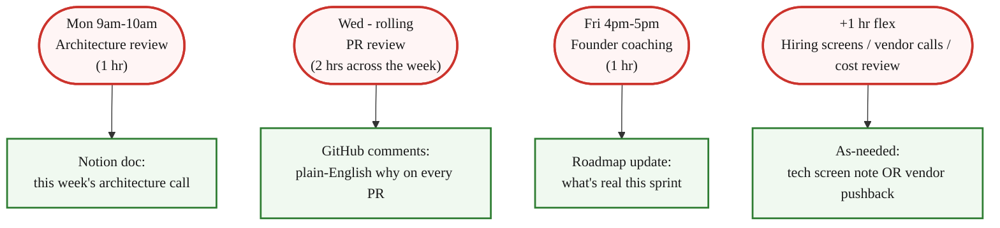

> **Module 3 · Step 2 of 2** · [Tech for Non-Technical Founders 2026](/blog/tech-for-non-technical-founders-2026/) free course.
> Input: a Module 3.1 decision-tree result that points to "Fractional CTO bridge." Output: a 5-question criteria sheet for hiring one + a Week-1 onboarding ritual.

Open your Calendly. Look at the recurring Tuesday 4pm slot. The name in that slot is a Fractional CTO you do not have yet. Your build keeps drifting because nobody senior has read the contractor's last three pull requests. You do not need a co-founder. You need that 30-minute slot filled by someone whose only job, for $400 to $600 a week, is to read the code and tell you when the architecture is about to break.

## Why this matters in 2026

Y Combinator's [official 2026 position](https://www.ycombinator.com/library/) is that the technical-co-founder-with-50%-equity model has stopped being mandatory. Tools like Lovable, Cursor, and Supabase let a non-technical founder ship a working MVP in weeks. What does not change in 2026 is the moment month four arrives, the contractor proposes a microservices migration, and you have nobody senior in the room to push back. The Fractional CTO is the role you actually need: 5 hours a week of architecture review, PR review, hiring tech-screen, and vendor BS detection. $400 to $600 per week, paid in cash, terminable on 30 days' notice. The same job a co-founder would have done. None of the equity dilution, none of the multi-year marriage, none of the buy-back drama if it does not work out.

## The 5 jobs the Fractional CTO does

Pre-seed founders hire on instinct ("I need a CTO"). They almost never write down what the CTO would actually do hour by hour. The breakdown below is the one to print and tape to your monitor before the first intro call.

### Architecture review (1 hr/wk)

Every Monday morning, the Fractional CTO opens the codebase and reads what shipped last week. They look at the data model, the route table, the queue setup, and the third-party integrations. They tell you, in one paragraph in a Notion doc: "this should be Rails, not microservices; here is why." They catch the moment your contractor proposes an over-engineered split: a separate React frontend talking to a Node API talking to a Python ML service for an app with 18 paying users. They protect you from the resume-driven architecture pitch.

### PR review (2 hrs/wk)

Every pull request your contractor opens passes through the Fractional CTO before merge. They catch the API key checked into the repo, the n+1 query in line 47, the missing CSRF token, the auth bypass on the admin route, the abstraction nobody asked for. The Veracode [GenAI Code Security Report 2025](https://www.veracode.com/blog/genai-code-security-report/) found 45% of LLM-generated code shipped at least one exploitable security flaw. PR review is the one thing that catches this before production. A contractor reviewing their own PRs catches nothing.

### Hiring filter (1 hr/wk during hiring sprint)

When you go to hire your first contractor or full-time engineer, the Fractional CTO runs the tech screen. They read the candidate's last three GitHub commits. They ask the four technical questions you can't ask. They tell you who is real and who is selling. The cost of one wrong-fit hire at month three is two months of runway. The cost of the Fractional CTO doing the screen is one hour at $80 to $120.

### Vendor BS detection (as needed)

When the agency proposes Kubernetes for 200 users, the Fractional CTO sits in the call and says "why?" When the contractor proposes GraphQL because "REST is old," the Fractional CTO says "show me the monorepo plan." When the AI vendor pitches their $40K-a-year platform, the Fractional CTO asks the technical questions that puncture the demo. They are the senior voice in a room where you are otherwise the only buyer in front of three people pitching.

### Founder coaching (1 hr/wk)

Every Friday, 30 to 60 minutes, the Fractional CTO sits with you and your roadmap. They translate "the queue is backed up because Resque is dropping jobs" into "promise the May demo for May 12, not May 5." They make the engineering reality legible to your roadmap. The reverse is also true: they hear you describe the customer's pain and tell you which feature is one day of work and which is three weeks. The roadmap stops being a wish list.

## 5 criteria for hiring a Fractional CTO

Most "Fractional CTO" listings on LinkedIn are either career CTOs in transition (overpriced for pre-seed) or junior engineers padding their title (under-skilled for the role). The five criteria below filter the actual fit.

### 1. 10+ years engineering at Series A-C startups

Big-tech-only resumes (Google, Meta, Amazon for 10 years) solve different problems. They know how to scale to a billion users. They do not know how to keep a 200-user app alive on a Heroku bill of $89/mo. The Fractional CTO you want has shipped at startups where the budget was real, the team was 3 to 12 engineers, and the stack was opinionated. Series A-C is the sweet spot. The pre-seed work feels familiar to them.

### 2. First engineer at 2+ startups

The "first engineer" experience is the closest analog to what your Fractional CTO will do for you. They have set up the GitHub org from scratch. They have picked the database. They have written the deployment script. They have argued with a non-technical founder about the roadmap. Two times of doing this is enough; one time is luck. Three or more is the goal.

### 3. Will commit to a recurring weekly slot

"Available when needed" is the failure mode. The Fractional CTO who answers your Slack at 11pm on Wednesday is the one who has not protected their calendar from the rest of their clients. You want a recurring 30-minute slot for architecture review every Monday and a 60-minute slot for founder coaching every Friday. Both blocks on their calendar. If the candidate is not willing to commit to recurring slots in the first call, they are pricing in your churn.

### 4. References from non-technical founders specifically

Other founders are the natural client of a Fractional CTO. If the candidate's references are all engineering managers or VPs of engineering, you are about to hire a senior engineer who happens to consult, not a Fractional CTO. Ask for two non-technical-founder references. Call both. Ask: "Did the Fractional CTO ever push back on a feature you wanted to ship? What happened?" If the answer is "they always shipped what I asked for," that is a no-hire signal.

### 5. Affordable: $400-600/wk for 5 hrs is the 2026 market range

[Bolster's marketplace data](https://bolster.com/marketplace/fractional-cto/) and the rates you will see on Toptal Fractional Executives put the 2026 range at $80 to $120 per hour for a competent Fractional CTO. 5 hours per week lands at $400 to $600. Above $1,000 per week for the same 5-hour block, you are paying for a name brand or a CTO who is over-spec for pre-seed. Below $300 per week, you are buying a junior engineer with the title inflated. The window is narrow on purpose.

## Where to find one

Five places, in roughly the order I would search them.

- **LinkedIn searches**: `"Fractional CTO" + your industry + your city`. Filter to "open to work" if available. Send 10 short DMs that name the project and the budget. Reply rate is around 30%.
- **Y Combinator alumni network**: post in the founder Slack ("YC alumni → YC founder Slack"). Even non-YC founders can reach in via warm intros. The talent pool here is the densest in the world.
- **Specific platforms**: [Toptal Fractional Executives](https://www.toptal.com/fractional/cto), [Bolster](https://bolster.com/marketplace/fractional-cto/), [GoCoFound](https://gocofound.com/), [Parlay](https://www.parlay.app/). Each platform pre-screens. You pay a markup, you save a week of vetting.
- **The Indie Hackers Fractional channel**: free, slower, founder-to-founder. Best for SaaS micro-startups. The candidates here know the Stripe + Postgres + Heroku stack cold.
- **Your investor network**: often the fastest path. One email to your lead angel saying "I am hiring a Fractional CTO for 5 hours a week, $400 to $600 budget" produces 2 to 4 warm intros within 48 hours. Use this last only because investors get attention-scarce; use it first only if you have one investor whose value-add is exactly this.

## Week 1 onboarding ritual

Sign the MSA on Day 0. Then run the seven days below verbatim. Skip a step and the Fractional CTO drifts into being a coder instead of a guard.

- **Day 1**: share the [Validated Problem Statement](/blog/validated-problem-statement-template/) and the [Vibe PRD](/blog/vibe-prd-template/) you built in Modules 1 and 2. The Fractional CTO reads both before the first call. They cannot do architecture review without knowing the customer.
- **Day 1**: add them to the private GitHub org with `code reviewer` permissions. Not `admin`. Not `write`. Read + comment + approve PRs is the right scope. Same for the AWS console (read-only) and the Stripe dashboard (read-only).
- **Day 3**: first 30-minute architecture review. They read the existing codebase and the data model. They write one paragraph in a shared Notion doc: "what I would change, what I would leave alone." This document becomes the running architecture log.
- **Day 7**: first PR review. The Fractional CTO comments in plain English so you understand the trade-off. ("This adds a Redis dependency. Cost: $15/mo. Benefit: faster session lookup. Trade-off: one more service to monitor. Verdict: defer until you hit 500 active sessions.") If their PR comments are all jargon and you cannot follow, the hire is wrong.
- **End of Week 4**: ask them the Friday-coaching question. "Should I hire any contractors yet?" The answer they give you tells you whether the 5 hours a week have produced a clearer picture of the build than you had on Day 0. If the answer is "yes, here's the role and here's the budget," the relationship is working. If the answer is hand-wavy, you have hired wrong; replace.

## The Rails / Django / Laravel angle

The first big argument with the Fractional CTO will be the framework. A good Fractional CTO will tell you to use Rails, Django, or Laravel for the production app. Not the framework your contractor wants to learn on your dime. Pre-seed startups do not need microservices. They do not need an over-engineered split with a separate React frontend talking to a Node API talking to a Python ML service. They need one full-stack codebase that one engineer can ship end-to-end on a Tuesday afternoon. DHH calls Rails the [one-person framework](https://world.hey.com/dhh/the-one-person-framework-711e6318) for a reason: when the brief names the job and the framework hides the plumbing, one developer ships in a week what the resume-driven path ships in a month. Django's batteries-included philosophy and Laravel's full-stack defaults follow the same logic. The Fractional CTO catches this argument in the first PR. We covered the same shape in [Five Tech Words to Stop Nodding At](/blog/five-tech-words-stop-nodding-at/): the bigger the architecture word your contractor proposes, the smaller the validated problem they are usually building it for.

## What to do tomorrow

Three actions, in order. None take longer than 20 minutes.

- **Post in 1 founder community asking for Fractional CTO recommendations.** Pick the one where you already lurk: LinkedIn (your network), Indie Hackers (#fractional channel), or Y Combinator founder Slack if you have access. Post: "Looking for a Fractional CTO, 5 hrs/wk, $400-600 budget, [your industry]. Recommendations welcome." Reply rate within 24 hours: 5 to 12 DMs.
- **Schedule 3 intro calls this week.** Not 6, not 1. Three is the number where you can compare. Each call is 30 minutes. Use the same 4-question script: (1) describe your last fractional engagement, (2) walk me through one architecture call you made that pushed back on the founder, (3) what is your recurring weekly slot, (4) two references from non-technical founders.
- **Reject any candidate above $800/wk for 5 hrs.** Above $800 is over-spec for pre-seed. Above $1,000 you are paying for a name brand. Set the budget hard. The right candidate exists in the $400-600 range; raise only if all 3 introduction calls produced no fit.

> Stop looking for a co-founder with 50% equity. Hire a Fractional CTO for 5 hours a week at $400-600. Same architecture review, same PR safety, $0 equity, replaceable in 30 days. The 2026 default.

The 5-hour week is enough because the bottleneck at pre-seed is not coding capacity. It is the senior judgment to push back when the contractor proposes a stack nobody actually needs. The Fractional CTO supplies that judgment for the cost of a single contractor sprint. They are the senior voice you rent until you have the buyers to justify hiring your own.

Founders who skip this hire are the founders who, six months later, ship the [salvage-or-rebuild question](/blog/salvage-vs-rebuild-decision-tree/) about a vibe-coded MVP that grew faster than the architecture could hold. The Fractional CTO is the cheap insurance against that exact failure.

## Continue the course

This is **Module 3 · Step 2 of 2** in the free [Tech for Non-Technical Founders 2026](/blog/tech-for-non-technical-founders-2026/) course - 8 modules from idea to first paying users. Module 3 closes here. Next up: Module 4A (self-serve build) or Module 4B (hire a team), based on your decision-tree result from [Module 3.1](/blog/should-you-hire-2026-decision-tree/).

| # | Module | Output you walk away with |
|---|---|---|
| 0 | Where Are You? | Self-assessment + your starting module |
| 1 | Validate the Problem | One-page validated problem statement |
| 2 | Design the Solution | One-page Product Brief (Vibe PRD) rewritten in outcome shape |
| **3** | **Choose Your Build Path** ← you are here (complete) | **Build decision: validate / self-serve / fractional CTO / hire** |
| 4A | Ship Self-Serve (branch) | Live MVP at a staging URL |
| 4B | Hire & Ship (branch) | Signed SOW, kickoff scheduled |
| 5 | Manage Your Build | Weekly oversight rhythm |
| 6 | When Things Break | Salvage / rebuild decision |
| 7 | Manage AI-Era Risks | AI interrogation system |

**In Module 3 · Choose Your Build Path**: 3.1 [Should You Hire? The 2026 Decision Tree](/blog/should-you-hire-2026-decision-tree/) (complete) · 3.2 **The Fractional CTO Bridge - 5 Hours a Week Beats a Co-founder** ← you are here (Module 3 closes).

Pick your next module by your Module 3.1 verdict. Path 3 (Fractional CTO): you are here, finish the hire by end of month. Path 2 (self-serve): proceed to Module 4A. Path 4 (hire a team): proceed to Module 4B and read [the SOW guide](/blog/reading-sow-clause-by-clause/) before kickoff.

The full course landing page (with all 11 artifacts) publishes after Module 5 ships. Until then, bookmark this post.

## Further reading

- Sophia Matveeva, [*Tech for Non-Technical Founders* membership program](https://techfornontechnicalfounders.com/) - the strategic-management complement to this post. Heavy on the founder-as-orchestrator framing the Fractional CTO operationalizes.
- Drew Falkman, [*Vibe Coding Data-Enabled AI Apps* on Maven](https://maven.com/) - the $1,000 cohort that teaches the self-serve stack (Path 2 from Module 3.1). Recommended for founders who route to self-serve before hiring a Fractional CTO.
- Bolster, [Fractional CTO Marketplace](https://bolster.com/marketplace/fractional-cto/) - the largest curated platform for fractional engineering executives in 2026. Pricing data and candidate profiles.
- Y Combinator, [Co-Founder Matching + Solo Founder Resources](https://www.ycombinator.com/library/) - YC's evolving stance on the technical-co-founder requirement. Read the 2026 manifestos before deciding equity is necessary.
- Toptal, [Fractional CTO Network](https://www.toptal.com/fractional/cto) - alternative platform, vetted talent, higher hourly rate but faster vetting cycle.
- DHH, [The One-Person Framework](https://world.hey.com/dhh/the-one-person-framework-711e6318) - the Rails case for keeping the architecture small enough that one developer ships outcomes end-to-end. The framework argument the Fractional CTO will make in your first PR.
- Veracode, [GenAI Code Security Report 2025](https://www.veracode.com/blog/genai-code-security-report/) - 45% of LLM-generated code shipped at least one exploitable security flaw. The data behind the PR-review job.

---

Built by JetThoughts as part of the free Tech for Non-Technical Founders 2026 curriculum. See the full curriculum at [/blog/tech-for-non-technical-founders-2026/](/blog/tech-for-non-technical-founders-2026/).
