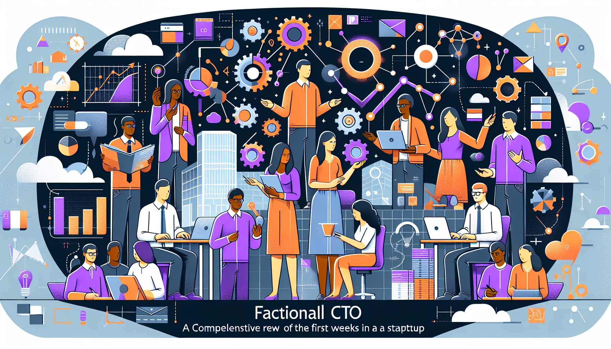

Choosing between a **fractional CTO vs full-time CTO** is one of the most critical decisions for growing companies. With full-time CTO salaries reaching $650,000+ annually plus equity, many businesses are turning to fractional CTO services that deliver the same strategic expertise at 60-80% cost savings.

This comprehensive guide compares fractional and full-time CTO options across cost, commitment, expertise, and practical considerations to help you make the right decision for your company's growth stage and budget.

## Quick Decision Framework

**Choose a Fractional CTO if:**
- Your company has fewer than 50 employees
- Annual budget for technical leadership is under $300K
- You need strategic guidance but not daily oversight
- You're in startup or transition phase
- You require specific expertise for defined projects

**Choose a Full-Time CTO if:**
- Your company has 50+ employees and large tech teams
- You have budget for $400K-$650K+ annual compensation
- You need constant technical leadership and availability
- You're scaling rapidly or preparing for IPO
- Company culture and long-term commitment are priorities

## Comprehensive Comparison Table

| **Factor** | **Fractional CTO** | **Full-Time CTO** |
|------------|-------------------|-------------------|
| **Annual Cost** | $60K - $300K (10-30 hrs/week) | $350K - $650K + equity + benefits |
| **Total Compensation** | No equity required | 20-30% additional equity value |
| **Availability** | 10-30 hours per week | 40+ hours per week, always available |
| **Commitment Level** | Project-based, flexible terms | Long-term employment commitment |
| **Ramp-up Time** | 1-2 weeks | 3-6 months |
| **Expertise Breadth** | Cross-industry experience | Company-specific deep knowledge |
| **Risk Level** | Low risk, easy to change | High hiring risk, difficult to replace |
| **Best for Company Size** | Under 50 employees | 50+ employees |
| **Development Team Size** | Up to 20 developers | 20+ developers |
| **Fundraising Support** | Excellent - external credibility | Good - internal perspective |
| **Strategic Planning** | Expert level | Expert level |
| **Daily Operations** | Limited involvement | Full involvement |
| **Culture Integration** | Minimal integration | Full cultural alignment |
| **Geographic Flexibility** | 100% remote capable | May require on-site presence |

## Cost Analysis: The Financial Reality

### Fractional CTO Investment Breakdown

**Entry Level (10 hours/week): $60K - $120K annually**
- Ideal for: Early startups, technical strategy consulting
- Includes: Monthly strategy sessions, architecture reviews, hiring guidance
- ROI: 300-400% compared to full-time hire

**Standard Engagement (20 hours/week): $120K - $240K annually**
- Ideal for: Growing companies, product development oversight
- Includes: Weekly team meetings, code reviews, vendor management
- ROI: 200-300% compared to full-time hire

**Intensive Support (30 hours/week): $180K - $300K annually**
- Ideal for: Scaling companies, major technology transitions
- Includes: Daily availability, team leadership, investor presentations
- ROI: 150-200% compared to full-time hire

### Full-Time CTO Total Cost of Ownership

**Base Salary Range:** $350K - $500K
- **Geographic Variance:** San Francisco/NYC (+30%), Austin/Denver (-15%)
- **Experience Premium:** 15+ years adds $100K-$150K

**Equity Compensation:** 1.5% - 4% of company value
- **Early Stage:** 2-4% equity package
- **Growth Stage:** 1-2% equity package
- **Public Companies:** Stock options valued at $200K-$500K annually

**Additional Costs:**
- Benefits and healthcare: $25K - $40K
- Recruiting fees: $70K - $100K (20-25% of base salary)
- Onboarding and training: $15K - $25K
- Office space and equipment: $10K - $20K

**Total Annual Investment:** $470K - $815K

### ROI Comparison: Real-World Scenarios

**Scenario 1: Early Stage Startup (10-25 employees)**
- **Fractional CTO (20hrs/week):** $180K/year
- **Full-Time CTO:** $620K/year (including equity value)
- **Savings:** $440K annually (71% cost reduction)
- **Payback Period:** Immediate positive ROI

**Scenario 2: Growth Stage Company (25-50 employees)**
- **Fractional CTO (30hrs/week):** $240K/year
- **Full-Time CTO:** $700K/year
- **Savings:** $460K annually (66% cost reduction)
- **Additional Benefits:** Flexibility to scale engagement

**Scenario 3: Scaling Company (50+ employees)**
- **Full-Time CTO becomes necessary** for daily operations
- **Hybrid Approach:** Start fractional, transition to full-time when team reaches 40-50 people

## When Fractional CTO is the Right Choice

### Perfect Fit Scenarios

**1. Early-Stage Startups**
- **Company Size:** 5-25 employees
- **Development Team:** 2-8 developers
- **Budget Constraints:** Limited runway, need to maximize capital efficiency
- **Growth Stage:** Pre-Series A or early Series A
- **Key Benefits:** Strategic guidance without full-time commitment, cost-effective expertise

**2. Technology Transitions**
- **Digital Transformation:** Traditional companies moving to digital-first
- **Platform Migrations:** Legacy system modernization projects
- **Architecture Overhauls:** Scaling technical infrastructure
- **Timeline:** 3-18 month transformation projects
- **Key Benefits:** Specialized expertise for specific initiatives

**3. Fundraising Preparation**
- **Due Diligence Support:** Technical documentation and presentations
- **Investor Communications:** Credible third-party validation
- **Roadmap Development:** Strategic technology planning
- **Timeline:** 3-6 month fundraising cycles
- **Key Benefits:** External credibility, proven track record

**4. Interim Leadership**
- **CTO Transitions:** Between full-time CTO departures and new hires
- **Acquisition Integration:** Post-merger technology integration
- **Crisis Management:** Technical crisis or major system failures
- **Timeline:** 3-12 month interim periods
- **Key Benefits:** Immediate expertise, no long-term commitment

### Industry-Specific Advantages

**SaaS and Software Companies**
- Rapid prototype development and validation
- Scalable architecture planning for growth
- Technical hiring and team building
- Integration strategy and API development

**E-commerce and Retail**
- Platform selection and customization
- Payment systems integration
- Performance optimization for traffic spikes
- Mobile-first development strategies

**FinTech and Financial Services**
- Regulatory compliance (SOX, PCI-DSS, GDPR)
- Security architecture and risk assessment
- Integration with banking systems and APIs
- Scalable transaction processing systems

**Healthcare and Life Sciences**
- HIPAA compliance and data security
- Electronic health records integration
- Telemedicine platform development
- FDA validation for digital therapeutics

## When Full-Time CTO is Essential

### Must-Have Scenarios

**1. Large Technical Teams**
- **Team Size:** 20+ developers across multiple teams
- **Management Need:** Daily oversight, performance management, career development
- **Coordination:** Complex project dependencies, resource allocation
- **Culture:** Team building, company culture integration
- **Key Benefits:** Dedicated leadership, full-time availability

**2. Rapid Scaling Organizations**
- **Growth Rate:** 100%+ year-over-year growth
- **Hiring Volume:** Adding 2+ developers per month
- **Infrastructure:** Constant architecture evolution and optimization
- **Operations:** 24/7 system monitoring and incident response
- **Key Benefits:** Dedicated focus on scaling challenges

**3. Public Company Readiness**
- **Compliance Requirements:** SOX compliance, audit preparation
- **Investor Relations:** Regular board presentations, strategic planning
- **Risk Management:** Enterprise-grade security and governance
- **Documentation:** Comprehensive technical documentation and processes
- **Key Benefits:** Full accountability, long-term strategic ownership

**4. Deep Domain Expertise Requirements**
- **Industry Specialization:** Highly regulated industries (healthcare, finance)
- **Technical Complexity:** AI/ML, blockchain, or other specialized technologies
- **Long-term Vision:** Multi-year strategic planning and execution
- **Innovation:** Research and development initiatives
- **Key Benefits:** Deep company knowledge, specialized industry expertise

## Hybrid Approach: Best of Both Worlds

### Successful Transition Strategy

**Phase 1: Start with Fractional (Months 1-12)**
- Establish technical foundation and strategy
- Build initial development team (5-15 people)
- Implement core processes and best practices
- Validate product-market fit

**Phase 2: Scale with Fractional (Months 12-24)**
- Expand development team (15-30 people)
- Refine architecture for scale
- Establish technical leadership pipeline
- Prepare for full-time transition

**Phase 3: Transition to Full-Time (Months 24+)**
- Promote internal candidate or recruit external CTO
- Fractional CTO provides transition mentoring
- Maintain relationship for strategic advisory
- Full-time CTO takes operational leadership

### Benefits of Hybrid Strategy

**Risk Mitigation**
- Test leadership approach before full commitment
- Evaluate internal promotion candidates
- Build technical foundation systematically
- Reduce hiring risk through proven relationship

**Cost Optimization**
- Maximize capital efficiency during growth phases
- Scale investment with company growth
- Avoid premature full-time hire mistakes
- Maintain flexibility for strategic pivots

**Knowledge Transfer**
- Seamless transition of institutional knowledge
- Mentoring relationship with incoming full-time CTO
- Established processes and team relationships
- Continued strategic advisory as needed

## Decision Framework: Step-by-Step Guide

### Assessment Questions

**Financial Considerations**
1. What's your annual budget for technical leadership?
2. Can you afford $400K-$650K+ for full-time CTO compensation?
3. How important is equity conservation for future fundraising?
4. What's your runway and cash flow situation?

**Operational Requirements**
1. How many developers are on your team currently?
2. Do you need daily technical oversight and management?
3. How complex are your technical operations and infrastructure?
4. What's your timeline for major technical decisions?

**Strategic Priorities**
1. Are you preparing for fundraising or acquisition?
2. Do you need industry-specific technical expertise?
3. How important is company culture integration?
4. What's your long-term growth trajectory?

**Risk Tolerance**
1. How comfortable are you with shared attention/availability?
2. Can your operations handle part-time technical leadership?
3. Do you have strong internal technical leads to support day-to-day operations?
4. What's your backup plan if the arrangement doesn't work?

### Decision Matrix Scoring

**Score each factor (1-5 scale):**

| Factor | Weight | Fractional Score | Full-Time Score |
|--------|--------|------------------|-----------------|
| Budget Constraints | 25% | 5 | 2 |
| Team Size | 20% | 3 | 5 |
| Growth Stage | 15% | 4 | 4 |
| Availability Needs | 15% | 2 | 5 |
| Expertise Requirements | 15% | 4 | 4 |
| Risk Tolerance | 10% | 4 | 3 |

**Calculate weighted scores to determine optimal choice**

### Common Decision Mistakes to Avoid

**Mistake 1: Hiring Full-Time Too Early**
- **Problem:** Burning cash runway unnecessarily
- **Solution:** Start fractional, transition when team reaches 25-30 people

**Mistake 2: Staying Fractional Too Long**
- **Problem:** Inadequate leadership for large teams
- **Solution:** Plan transition when team reaches 40-50 people

**Mistake 3: Wrong Expertise Match**
- **Problem:** Hiring generalist when specialist needed
- **Solution:** Define specific technical requirements first

**Mistake 4: Ignoring Culture Fit**
- **Problem:** Technical skills without leadership alignment
- **Solution:** Evaluate both technical and cultural contributions

## Real-World Case Studies

### Case Study 1: SaaS Startup Success with Fractional CTO

**Company:** B2B Marketing Analytics Platform
**Team Size:** 12 employees, 4 developers
**Challenge:** Series A fundraising, technical due diligence preparation
**Solution:** 20-hour/week fractional CTO engagement

**Results:**
- **Cost Savings:** $380K annually vs full-time hire
- **Fundraising Success:** $5M Series A raised in 4 months
- **Technical Improvements:** 40% performance increase, improved architecture
- **Team Growth:** Scaled from 4 to 12 developers over 18 months

**Key Success Factors:**
- Clear scope definition and expectations
- Weekly team meetings and monthly strategy sessions
- Strong internal technical lead for day-to-day operations
- Flexible engagement that scaled with company growth

### Case Study 2: E-commerce Company's Full-Time CTO Investment

**Company:** Direct-to-Consumer Fashion Brand
**Team Size:** 85 employees, 25 developers
**Challenge:** Platform scalability, mobile optimization, international expansion
**Solution:** Full-time CTO hire with $520K compensation package

**Results:**
- **Revenue Growth:** 200% increase in 2 years
- **Technical Improvements:** Platform handled 10x traffic growth
- **Team Development:** Built robust technical organization with clear career paths
- **Market Expansion:** Successfully launched in 8 international markets

**Key Success Factors:**
- Daily availability for rapid decision-making
- Deep company culture integration
- Long-term strategic vision and execution
- Full accountability for technical outcomes

### Case Study 3: Failed Full-Time Hire and Fractional Recovery

**Company:** FinTech Startup
**Team Size:** 18 employees, 6 developers
**Initial Mistake:** Hired full-time CTO at $480K total compensation in month 8
**Problem:** Burned through 12 months of runway in 6 months, CTO misaligned with startup pace

**Recovery Solution:**
- Transitioned to fractional CTO (30 hours/week)
- Saved $200K annually in cash flow
- Focused engagement on immediate priorities: product launch, fundraising

**Recovery Results:**
- **Cash Flow:** Extended runway by 8 months
- **Product Launch:** Successfully launched MVP in 3 months
- **Fundraising:** Raised $3M seed round
- **Team Stability:** Retained entire development team

## Making Your Decision: Action Steps

### Immediate Assessment (Week 1)

**1. Financial Analysis**
- Calculate total cost of ownership for both options
- Assess current budget and runway
- Determine maximum affordable investment

**2. Team Evaluation**
- Count current technical team members
- Assess internal technical leadership capacity
- Identify immediate technical needs

**3. Growth Planning**
- Project team growth over next 12-24 months
- Identify major technical milestones
- Assess fundraising timeline and requirements

### Trial Period Approach (Weeks 2-4)

**For Fractional CTO Consideration:**
1. **Define Trial Scope:** 30-90 day engagement with specific deliverables
2. **Set Clear Expectations:** Weekly time commitment, communication frequency
3. **Establish Success Metrics:** Technical improvements, team satisfaction, strategic progress
4. **Plan Evaluation:** Regular check-ins and formal review process

**Trial Engagement Deliverables:**
- Technical architecture assessment and recommendations
- Development team evaluation and optimization
- Strategic technology roadmap (6-12 months)
- Process improvements and best practices implementation
- Key hire identification and interview participation

### Long-term Planning (Month 2+)

**Successful Fractional Engagement:**
- Plan scaling strategy as team grows
- Identify transition points for potential full-time hire
- Develop internal technical leadership pipeline
- Maintain flexibility for changing business needs

**Full-Time Hire Process:**
- Define comprehensive job requirements and compensation package
- Plan 3-6 month recruitment and onboarding process
- Prepare integration strategy for existing team
- Establish performance metrics and accountability framework

## Industry Trends and Future Outlook

### Market Growth Statistics

**Fractional Executive Market:**
- **Market Size:** $2.8B in 2024, projected $4.2B by 2027
- **Growth Rate:** 15% annually
- **Adoption:** 67% of startups have used fractional executives
- **Retention:** 85% client satisfaction rate

**CTO Salary Trends:**
- **Annual Increase:** 8-12% year-over-year
- **Shortage Impact:** 23% increase in compensation due to talent scarcity
- **Geographic Expansion:** Remote work expanding talent pool, moderating costs in some markets

### Technology Impact on CTO Roles

**AI and Automation**
- **Strategic Focus:** Less operational oversight, more strategic technology planning
- **Tool Integration:** AI-powered development tools changing team productivity
- **Decision Speed:** Faster technology iteration requiring more agile leadership

**Remote-First Organizations**
- **Fractional Advantage:** Remote-native fractional CTOs fit distributed teams naturally
- **Full-Time Evolution:** Traditional full-time roles adapting to remote leadership models
- **Communication:** Emphasis on asynchronous communication and documentation

### Future Predictions

**Next 3-5 Years:**
- Fractional CTO market will grow 20% annually
- Hybrid engagement models will become standard
- Specialized industry expertise will command premium pricing
- AI tools will augment but not replace CTO strategic thinking

**Emerging Models:**
- **CTO-as-a-Service:** Comprehensive technical leadership subscription services
- **Rotation Programs:** 6-12 month CTO rotations across portfolio companies
- **Advisory Networks:** Multiple fractional CTOs collaborating on complex challenges

## Conclusion: Making the Right Choice for Your Business

The **fractional CTO vs full-time CTO** decision fundamentally comes down to **company size, budget, and growth stage**. The data clearly shows that **fractional CTOs deliver exceptional value for companies under 50 employees**, providing senior expertise at 60-80% cost savings while maintaining strategic flexibility.

**Key Decision Factors:**
- **Under 25 employees:** Fractional CTO is almost always optimal
- **25-50 employees:** Assess based on team complexity and budget
- **50+ employees:** Full-time CTO typically becomes necessary
- **Specialized needs:** Consider fractional for specific expertise requirements

**Financial Reality:**
With average full-time CTO compensation reaching $620K+ annually, fractional CTOs at $180K-$300K represent significant capital efficiency gains that can extend runway and accelerate growth.

**Success Strategy:**
The most successful companies often start with **fractional CTO engagements** and transition to full-time as they scale. This hybrid approach minimizes risk, maximizes learning, and optimizes investment timing.

Whether you choose fractional or full-time, the key is matching your CTO engagement model to your company's current needs and growth trajectory. The wrong choice can drain resources or limit growth, but the right choice provides the strategic technical leadership essential for startup and scale-up success.

Ready to explore fractional CTO services for your company? [Contact JetThoughts](https://jetthoughts.com/services/fractional-cto/) for a free consultation to discuss your specific technical leadership needs and determine the optimal engagement model for your growth stage.

---

## Additional Resources

- [Fractional CTO Services at JetThoughts](https://jetthoughts.com/services/fractional-cto/)
- [Complete Guide to Hiring Technical Leadership](https://jetthoughts.com/blog/)
- [CTO Salary Benchmarking Tools and Resources](https://jetthoughts.com/)
- [Technical Due Diligence Checklist for Fundraising](https://jetthoughts.com/)

*Last updated: January 2025*