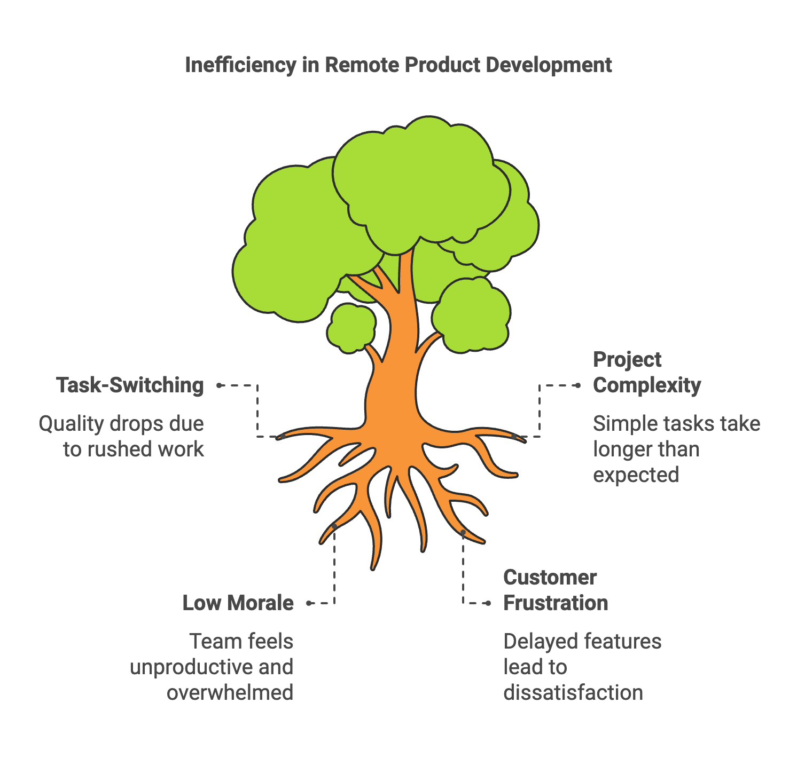
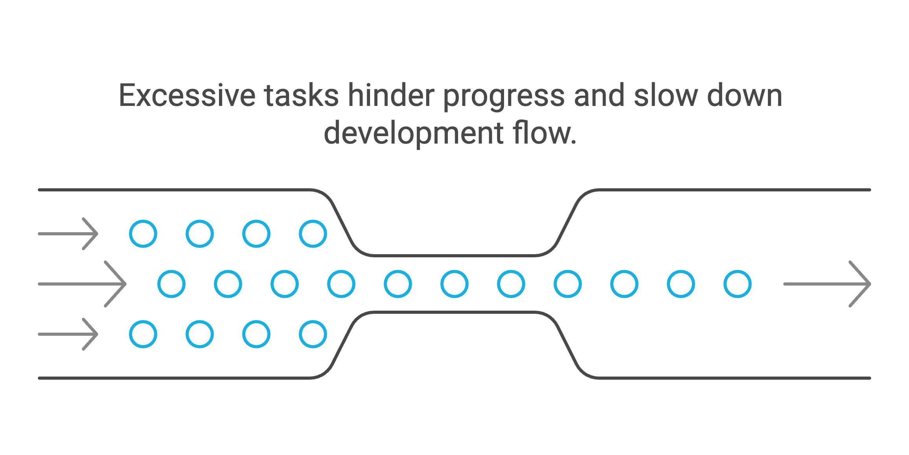
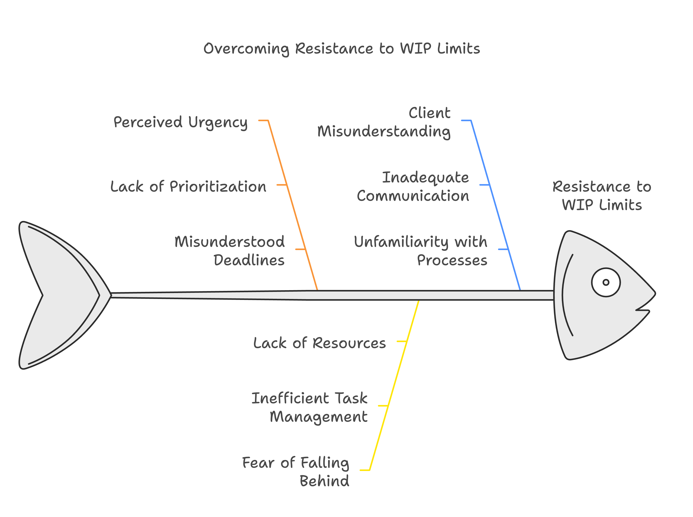

> "I felt like a circus performer spinning plates. Each new project added another wobbling dish. I knew something had to break – either the plates or me."

Sarah shared this with me over coffee. As a founder of a growing SaaS company, she managed three remote development teams across different time zones. Her story might sound familiar to you.

Every morning brought a flood of Slack messages. Developers jumped between tasks. Quality suffered. Deadlines slipped. The board of directors wanted answers. Sarah barely slept.

This is the reality for many non-technical founders. You built your business with a vision. You hired talented people. Yet somehow, your product development feels like steering a ship in a storm.

I've spent two decades helping founders like you navigate these waters. The solution isn't working harder or adding more resources. It's about working smarter through Work-in-Progress (WIP) limits.

# The Hidden Cost of Multitasking

Picture your brain as a computer. Every time you switch tasks, it needs to reload the context. Scientists call this "context switching." It drains up to 40% of your productive time.

The same happens to your development team. A developer deep in coding gets interrupted by an urgent bug fix. Twenty minutes later, they return to their original task. The code that was crystal clear now looks foreign. They spend precious minutes rebuilding their mental model.

This constant task-switching creates a domino effect:
- Quality drops as developers rush between tasks
- Simple projects take weeks longer than planned
- Team morale sinks as nothing seems to get done
- Customers grow frustrated with delayed features

# The WIP Limits Revolution

Enter WIP limits – a simple yet powerful concept. Think of your workflow as a highway. Too many cars cause traffic jams. Too many active tasks cause development bottlenecks.

WIP limits set clear boundaries on how many tasks your team can handle at once. It's like having a bouncer at a club – only letting in as many people as the space can handle.

Here's what happened when Sarah implemented WIP limits:

Week 1: Initial resistance. Teams worried about "falling behind."
Week 2: First signs of flow. Developers completed tasks faster with fewer errors.
Week 3: Predictable delivery. Features moved smoothly from development to testing.
Week 4: Customer satisfaction jumped. Quality improved. Team stress dropped.

# Making WIP Limits Work

Start small. Pick one critical process:

1. Count current tasks in progress
2. Set a limit slightly below this number
3. Track completion times
4. Adjust limits based on results

For Sarah's team, they limited each developer to two active tasks. When a critical bug appeared, they had to finish or pause current work before taking it on.

This created healthy discussions about priorities. Product owners thought twice before marking everything "urgent."

# Real Results, Real Numbers

Let's look at Sarah's metrics after three months:

- Development cycle time: Down 40%
- Code quality issues: Reduced by 60%
- Team satisfaction: Up 45%
- Customer complaints: Down 70%

But numbers tell only part of the story. Sarah's team found their rhythm. They felt proud of their work again. Customers noticed the difference.

# Common Pitfalls and Solutions

You might face resistance:

"But everything is urgent!"
Solution: Create a clear escalation path for true emergencies.

"We'll fall behind!"
Solution: Show how finishing tasks faster leads to higher output.

"Our clients won't understand!"
Solution: Share data showing improved delivery reliability.

# Your Next Steps

1. Map your current workflow
2. Identify bottlenecks
3. Set initial WIP limits
4. Measure results
5. Adjust based on feedback

Start tomorrow. Pick one team or process. Set a simple WIP limit. Watch what happens.

# The Bigger Picture

WIP limits aren't just about managing tasks. They create space for:
- Innovation
- Quality work
- Team growth
- Sustainable pace

Six months after implementing WIP limits, Sarah's company launched their biggest feature release. On time. Without overtime. Without drama.

You can achieve the same results. Your remote teams can deliver better products, faster. Your customers can get the quality they deserve.

The choice is yours. Keep spinning plates until they crash. Or build a system that brings order to chaos.

Take the first step. Your future self will thank you.

---

Got questions about implementing WIP limits in your organization? Share your challenges in the comments. Let's solve them together.