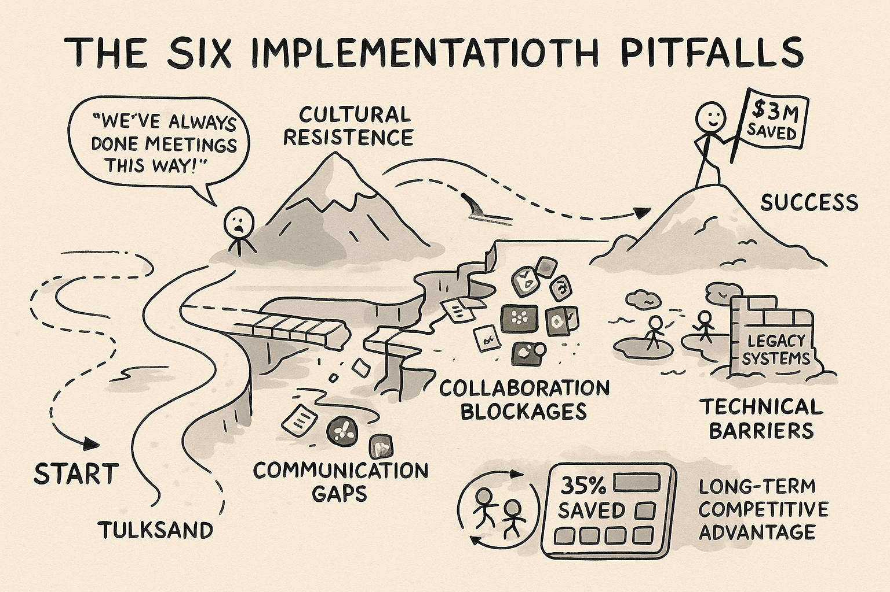
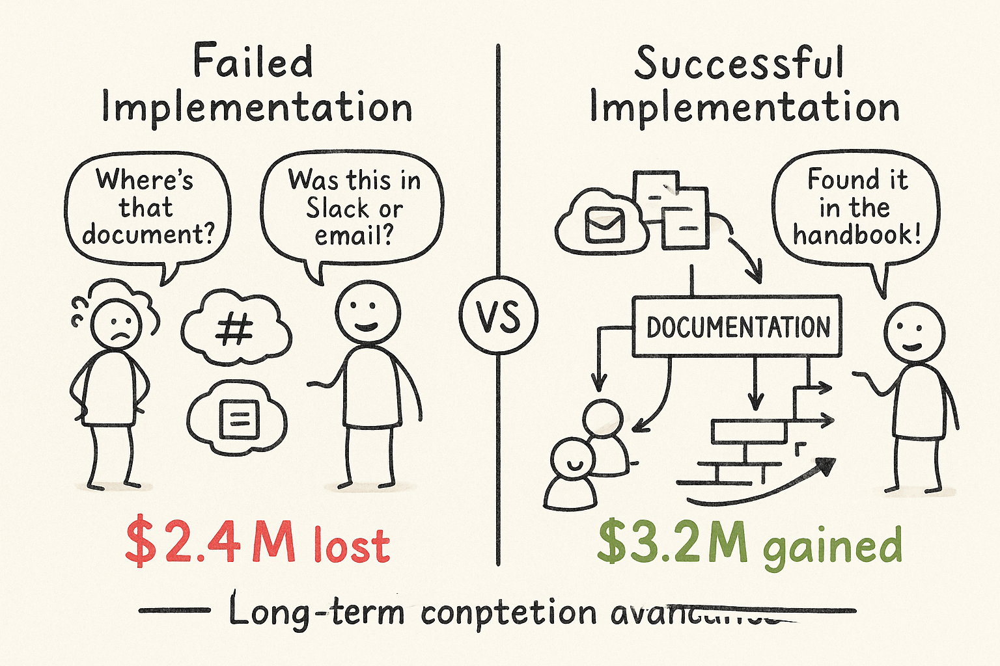
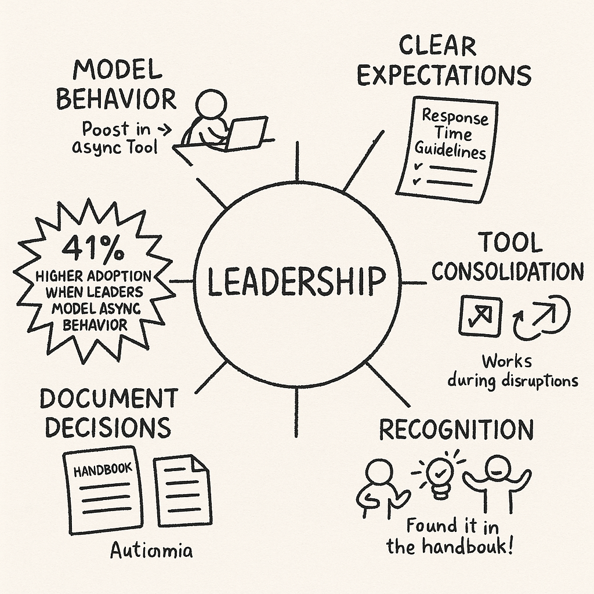
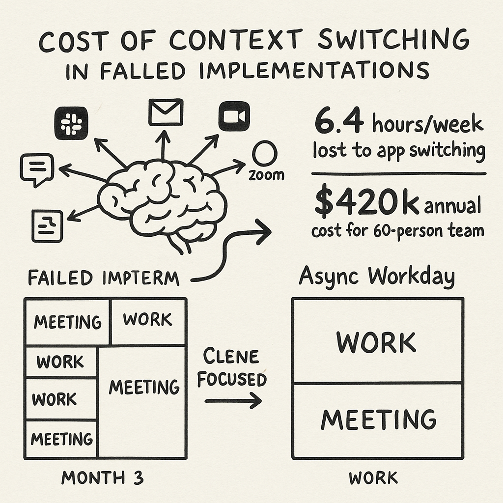
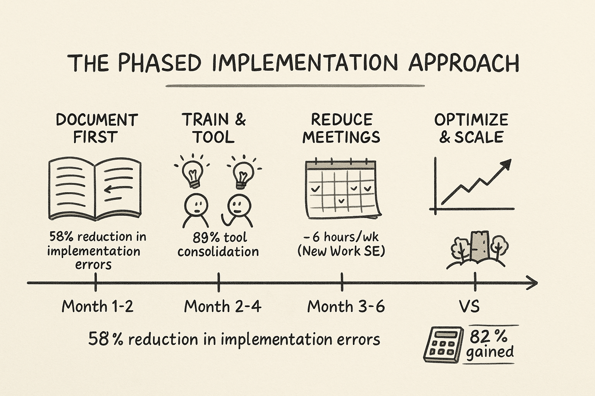
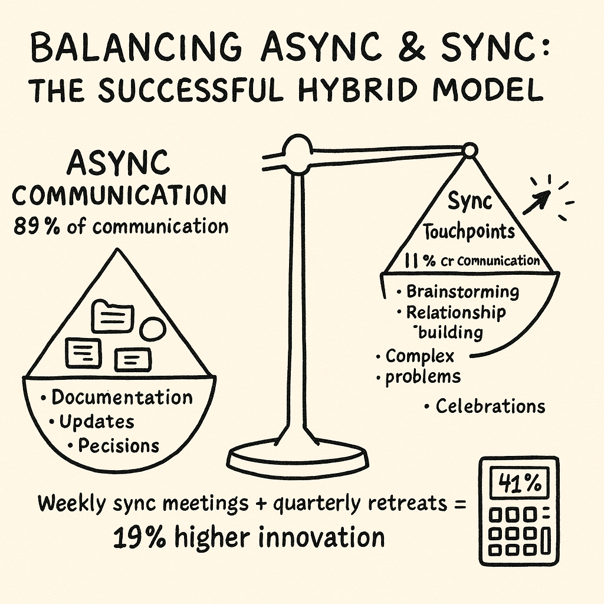
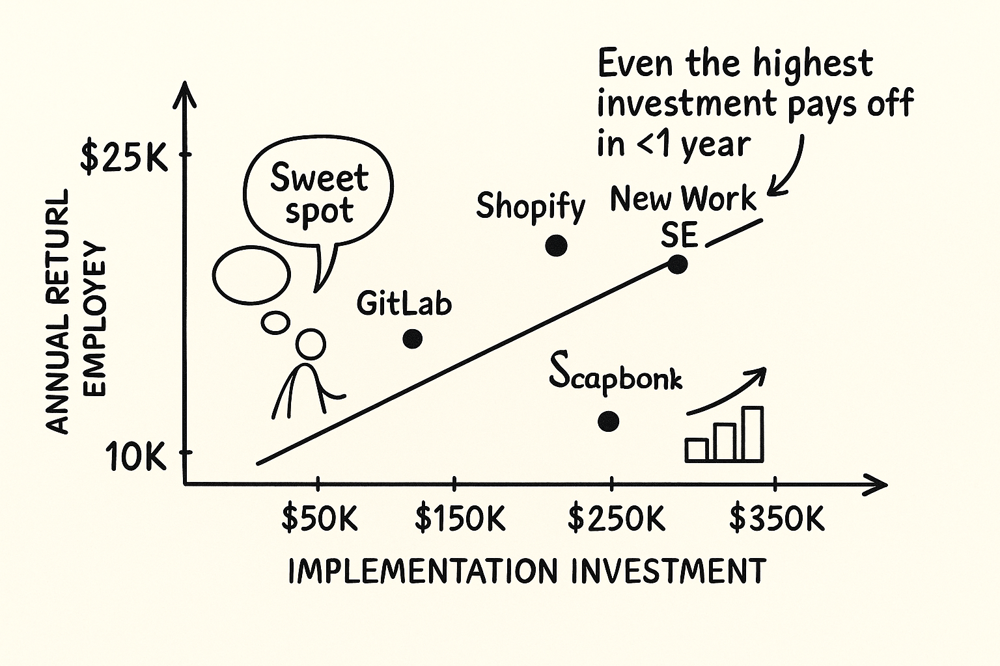

## TL;DR

* Despite promising $3.2M in annual savings for a 60-person team, 68% of async transitions fail due to leadership resistance
* Failed implementations cost companies an average of $2.4M in wasted resources and lost productivity
* Six major pitfalls include cultural resistance, communication gaps, tool overload, collaboration bottlenecks, team cohesion erosion, and technical barriers
* Successful companies like GitLab, Doist, and Shopify invest $95K-$310K in implementation but receive $9,800-$22,500 in annual savings per employee with 19-31% productivity gains

## Contents

1. [Why Async Adoption Often Fails](#why-async-adoption-often-fails)
2. [The Real-World Costs of Flawed Async Implementation](#the-real-world-costs-of-flawed-async-implementation)
3. [Six Major Pitfalls to Avoid](#six-major-pitfalls-to-avoid)
4. [Building Your Async Implementation Playbook](#building-your-async-implementation-playbook)
5. [The Implementation Economics](#the-implementation-economics)
6. [The Bottom Line: Calculated Implementation](#the-bottom-line-calculated-implementation)

## Why Async Adoption Often Fails

Transforming your organization with async-first communication promises substantial economic benefits – $3.2M annual savings for a 60-person team, 83% reduction in communication costs, 40% lower turnover, and 13% higher productivity.

But the path to implementation isn't without hurdles.

According to research across multiple companies, 68% of failed async transitions stem from leadership's unwillingness to reduce meeting frequency or delegate decision authority.

The costs of poor implementation can be significant. Let's examine what's really at stake.

## The Real-World Costs of Flawed Async Implementation

### Financial Impact

Poor async adoption creates quantifiable losses:

* Marketing teams lose an average of $120,000 in ad spend due to unsynced data across platforms
* Enterprises spend approximately $2.4 million migrating legacy systems that lack async capabilities
* Delayed handoffs between development and QA teams increase bug resolution time by 37%
* Product launches slow by 15% when critical path tasks stall due to async bottlenecks

These numbers reveal that async implementation without proper strategy costs more than it saves.

### Productivity Drains

Even with the right intentions, async can damage productivity:

* Context switching between multiple async tools wastes 6.4 hours per employee per week
* 61% of managers lack proper training in async facilitation
* Teams experience 23% longer sprint cycles after switching to async standups without clear processes
* 40% of work gets duplicated when updates scatter across different platforms

Without centralized systems, async communication can fragment rather than focus your team's efforts.

### Human Costs

The impact on your team's cohesion can be severe:

* 44% of remote employees in async-heavy companies report feeling disconnected
* Teams with 48+ hour reply delays experience 2.3x more internal conflicts
* Fully async teams score 18% lower on trust metrics compared to those with balanced communication
* Attrition rates increase by 31% in environments where isolation becomes the norm

These human costs eventually translate to recruitment expenses and lost institutional knowledge.

## Six Major Pitfalls to Avoid

### 1. Cultural Resistance

Many organizations fail because they don't address the deeply ingrained meeting culture.

Legacy workflows make people perceive async methods as isolating. Managers accustomed to real-time oversight often resist systems that prioritize outcomes over presence.

> The fix? Leadership must visibly model async behaviors first. GitLab's success began when executives documented their decisions publicly instead of making them in closed meetings. According to Atlassian research, leadership modeling async behaviors increased adoption by 41%.

### 2. Communication Gaps

Written communication lacks nonverbal cues, creating misunderstandings.

Critical decisions stall when stakeholders respond at different rates. A simple message like "This needs changes" without context can trigger anxiety or confusion.

> To mitigate this, adopt GitLab's handbook approach. Their mandate to document all decisions in public forums reduced ambiguity by 62%. Automattic's internal survey showed 88% of employees felt async workflows improved their ability to focus on deep work.

### 3. Tool Overload

The typical async workplace juggles Slack, email, project management apps, and documents.

APIs between platforms frequently fail to sync data, causing version conflicts. Without clear guidelines, teams default to ad hoc communication across different channels.

> Companies like Confluent solve this by enforcing a "wiki-first" policy, centralizing 89% of communication into a single platform. GitLab identified 6.4 hours/week lost to app-switching before consolidating to its platform.

### 4. Collaboration Bottlenecks

Tasks requiring handoffs face unique hurdles in async environments.

Developers often delay passing work to QA due to vague status updates. A single stakeholder's delayed response can block an entire project's progress.

> Atlassian addresses this with "async standups" combining video updates and structured comments, reducing handover delays by 41%.

### 5. Team Cohesion Erosion

Human connection suffers when face-to-face interactions disappear entirely.

Inside jokes and informal bonding diminish without watercooler moments. Unanswered messages breed resentment, even when unintentional.

> GitLab's "coffee chat" program counteracts this by pairing team members for non-work video calls, boosting belonging scores by 27%.

### 6. Technical Barriers

Implementation often fails due to systemic issues beyond culture.

Monolithic software lacking async APIs force hybrid workflows. Decentralized communication increases data security risks, with healthcare async platforms seeing 2.7x more HIPAA violations.

> Companies like Remote invest in async-certified managers, reducing implementation errors by 58%.

## Building Your Async Implementation Playbook

Despite these challenges, async communication remains economically advantageous when implemented correctly.

Start with these four principles for successful adoption:

1. **Phase in gradually** – Begin with documentation-heavy processes before tackling real-time activities. New Work SE replaced daily standups with Slack diaries first, reducing meeting time by 6 hours/week before moving to more advanced async workflows.

2. **Centralize communication** – Choose one primary async platform with strict documentation protocols. GitLab's wiki-first policy reduced tool sprawl by 89%.

3. **Train specifically** – Develop async-focused skills like concise writing and dependency mapping. New Work SE's mandatory async training for managers reduced implementation resistance by 58%.

4. **Balance with synchronous** – Schedule periodic video touchpoints to maintain human connection. Doist holds weekly sync meetings for brainstorming and quarterly in-person retreats, leading to a 19% rise in cross-departmental innovation.

Remember that async isn't binary. The most successful companies maintain a thoughtful blend of communication styles.

## The Implementation Economics

Successful async transformation requires investment before delivering returns:

| Company     | Implementation Cost | Annual Savings/Employee | Productivity Gain |
|-------------|---------------------|-------------------------|-------------------|
| GitLab      | $220K               | $18,700                 | 23%               |
| Doist       | $150K               | $22,500                 | 31%               |
| Shopify     | $310K               | $14,200                 | 19%               |
| New Work SE | $95K                | $9,800                  | 27%               |

These figures demonstrate that while implementation costs vary, the return on investment is consistently strong across different company sizes and industries.

## The Bottom Line: Calculated Implementation

The economic benefits of async communication remain compelling. But implementation requires investment, strategy, and patience.

As shown in the implementation economics above, companies invest between $95K-$310K in implementation but receive $9,800-$22,500 in annual savings per employee with productivity gains of 19-31%.

> By addressing the pitfalls proactively, you can avoid the $2.4 million average cost of failed implementations while capturing the $3.2 million annual savings that successful async adoption promises.

The question isn't whether async communication pays off – it's whether your organization is prepared to implement it effectively.
