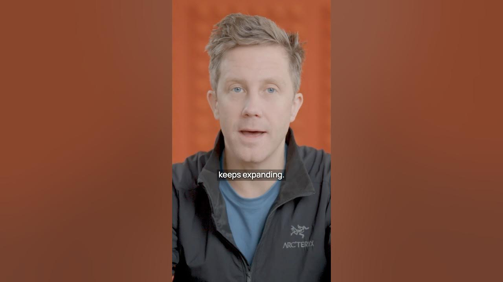

Almost **4 million people** in the US and Europe work in compliance and audit. As regulations grow, so do the costs associated with compliance. From GDPR to DODF, and from AML to ESG reporting, the landscape is always changing. Traditional compliance tasks are often tedious and time-consuming. But what if there was a way to make this easier? Enter AI and automation.

### Key Takeaways

*   Compliance costs are rising due to expanding regulations.
*   Traditional tasks are manual and repetitive.
*   AI can automate many compliance processes.
*   LLMs can analyze vast amounts of data quickly.

## The Growing Need for Compliance

Compliance is not just a buzzword; it’s a necessity. With regulations constantly evolving, companies must keep up. This means more work for compliance professionals. They have to read dense regulations, cross-check policies, and produce reports. It’s a lot of work, and it’s only getting more complicated.

## The Challenges of Traditional Compliance Tasks

Traditional compliance tasks can feel like a never-ending cycle of paperwork. Here are some common challenges:

*   **Reading Regulations**: Regulations are often lengthy and complex. It takes time to understand them fully.
*   **Cross-Checking Policies**: Ensuring that internal policies align with regulations is a manual process.
*   **Sampling Work**: Auditors often sample frontline work, which can miss important issues.
*   **Repetitive Reporting**: Producing reports can be tedious and time-consuming.

These tasks are not just boring; they are also prone to human error. That’s where automation comes in.

## How AI Can Help

AI, particularly **Large Language Models (LLMs)**, can change the game for compliance and audit. Here’s how:

1.  **Automating Document Review**: LLMs can read and analyze regulatory documents, corporate policies, and financial statements. They can highlight issues that need human review.
2.  **Spotting Anomalies**: Instead of manually sifting through data, AI can quickly spot anomalies. This saves time and reduces the risk of missing important details.
3.  **Identifying Incomplete Records**: AI can flag incomplete records, ensuring that nothing slips through the cracks.
4.  **Continuous Auditing**: A well-trained model can audit everything at once. This means no more sampling; every document can be reviewed continuously.

## The Future of Compliance and Audit

The future looks bright for compliance and audit professionals. With AI taking over the more tedious tasks, these professionals can focus on what really matters. They can spend more time on strategy and less time on paperwork.

Imagine a world where compliance is seamless. Companies can operate more efficiently, and compliance professionals can do their jobs without drowning in paperwork.

If you’re in this space, now is the time to innovate. The tools are here, and they’re ready to help.

In conclusion, the rise of AI in compliance and audit is not just a trend; it’s a revolution. Embracing these changes can lead to a more efficient and effective compliance process. So, let’s get ready for a future where compliance is easier and more accurate than ever before!
