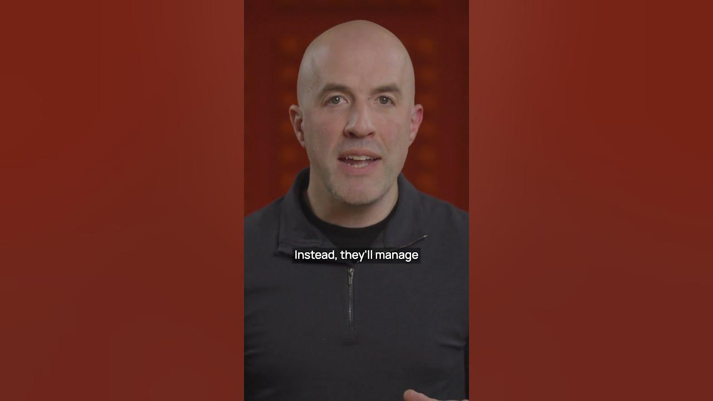

The future of software engineering is here, and it is not what many expect. Artificial intelligence will change how we build software. This shift means we will need more human developers, not fewer. These developers will manage AI agents that do much of the coding work.

## AI and the Cost of Software

AI language models write code well. This will make building software much cheaper. Some think this means fewer jobs for software developers. But the opposite is true. Software will run almost everything. This means we will need more people to manage it.

## The Role of Human Developers

Human developers will not write much code directly. Instead, they will manage teams of AI agents. These agents will build software. They will also do other tasks. This includes quality assurance, deployment, and compliance audits. They will handle translation and operations too.

## Key Takeaways

### What This Means for the Future

*   **More Developers**: We will need more human software engineers.
*   **Management Focus**: Developers will manage AI teams, not just write code.
*   **AI for Tasks**: AI agents will handle many specialized tasks.

## Building Tools for the Future

We want to fund startups that help with this future. These startups should build tools. These tools will let small groups of generalist developers manage large AI teams. These teams will work together to build and ship a lot of software. If you are building tools for the future of software engineering, we want to hear from you.