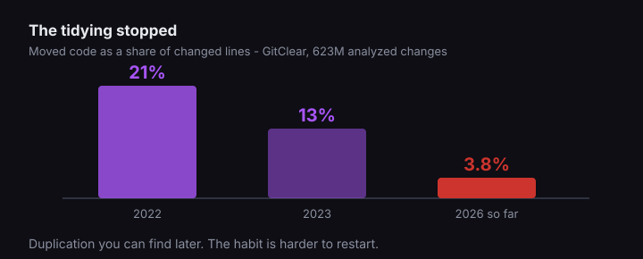

The advice is everywhere, and it always has the same shape. Let the model write the code, then you check it. Sometimes it comes with a seatbelt metaphor. Sometimes it is phrased as trust but verify, which at least admits there is a cost.

Look at the word doing the work: *then*. It puts checking second, and things that come second sound smaller. The sentence is describing a division of labour, and what it actually describes is a transfer.

## Somebody measured where the hours went

Harness surveyed 700 engineering practitioners and managers at large enterprises across five countries this April, through Sapio Research. The finding that should have made more noise:

> 81% say developers spend more time in code review since adopting AI coding tools, with 28% reporting a significant increase of more than 30%.

Four out of five teams. Not "some teams struggled with adoption" and not a complaint about tooling. The step everyone assumed was the light one is where the time landed.

Discount it however you like. It is vendor-commissioned, it is self-reported, and enterprise teams are not your four-person startup. Do that discounting honestly and you still have to explain why the number points the direction it does rather than the other one.

## Reading is not the cheap half, and never was

Anyone who has inherited a codebase already knows this. Writing a function means holding one intention in your head and making the machine agree with it. Reading a function means reconstructing somebody else's intention from the residue, without being sure there was one.

AI review output has a particular flavour of that problem. It is plausible. It compiles, it follows a pattern, it looks like something a competent person wrote, and none of those properties tell you whether it is right for your system.

GitClear has been measuring the residue across 623 million analyzed changes from 2023 to 2026. Two of their findings are modest: two-week code churn is up about 15% against 2022 levels, and block duplication climbed 81% over 2023.

The third one is not modest at all. Moved code - GitClear's proxy for the reorganising work that keeps a codebase coherent - was 21% of changed lines in 2022. It fell to 13% in 2023. It is 3.8% so far in 2026.

That is the part I would worry about if it were my codebase. Duplication you can find later. The habit of going back and tidying is harder to restart once a team stops doing it, and generation does not encourage it: the model is very good at adding a thing and has no opinion about whether the thing should have been added next to the four like it.

## The obvious fix is the one that does not work

If verification is now the expensive step, automate verification. Everyone arrives here, and the tooling exists, and some of it is genuinely good.

It is also the one place where handing the work back to a machine fails in a specific and quiet way. I went through the evidence separately in [what to ask when your dev shop says the code was reviewed](/blog/dev-shop-ai-code-review-what-to-ask/), so I will not re-run it here. The short version is that making an automated reviewer quiet enough for developers to tolerate is the same operation as making it miss things, and it misses them worst in the categories you would least like.

So this is a workflow whose expensive half has no automation path. That is unusual, and it is why "generate then verify" is not a plan.

## What we do instead

None of this is an argument against using the tools. We use them daily. It is an argument against the sentence, and the first thing it changes is what we hand to a model in the first place.

The question we ask is not "can it write this" but "how fast can I tell whether it did":

| Generate freely | Type it yourself |
|---|---|
| A migration you can run against a copy of the database | Business logic where "correct" lives in a stakeholder's head |
| A test you can watch fail before you trust it passing | Anything touching money, auth, or permissions |
| A transformation with a known-correct output to diff against | Code whose failure mode is silent and shows up next quarter |

The pattern on the left is not "easy work." It is work where the check is fast and the blast radius is bounded, which is a different axis entirely.

Two habits carry the rest of it. We say the review number out loud during planning, because a task that is two hours of writing may also be twenty minutes of generating plus ninety minutes of careful reading, and teams get into trouble quoting the twenty. And we keep the tidying in the same pull request rather than in a someday ticket, since a someday ticket is where that 3.8% went.

Then somebody owns the merge by name. Not a rubber stamp, not a bot's approval, a person who read it and would be embarrassed by it later. That was always the rule. It just got much easier to skip.

## What I actually think

I have watched a lot of code get produced very quickly and then get read very slowly, including in this repository. The generating is not the part that takes the day.

If your team has adopted AI tooling and velocity has not moved the way you expected, you are not doing it wrong and the tools are not broken. The work moved to a place nobody was measuring. Start measuring there.

If you would like an outside read on where your time is actually going, [that is what a rescue context call is for](/services/vibe-code-rescue/).

## Sources

- Harness, [State of Engineering Excellence 2026](https://prnewswire.com/news-releases/harness-report-reveals-ai-has-outpaced-how-engineering-organizations-measure-developer-productivity-302770521.html) - 700 practitioners and managers across the US, UK, India, France and Germany, fielded by Sapio Research, April 2026.
- GitClear, [The Maintainability Gap: 2026 AI Code Quality Research](https://www.gitclear.com/the_ai_code_quality_maintainability_gap) - 623 million analyzed changes, 2023-2026.
