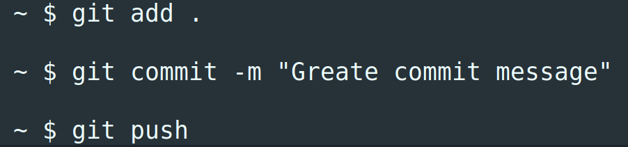

> For beginners who are not familiar with [Git](https://git-scm.com/) or [GitFlow](https://datasift.github.io/gitflow/), we grabbed the most common commands to be effective from the first day.



## Global configurations

Initialize and configure the Git to push the current branch to a branch with the same name on the remote repo. While pushing the code, if branch with your local name does not exist in your remote repo, Git will automatically create it:

```bash
    git init
    git config --global push.default current
```

For [GitHub](https://github.com/), we set up information about the author of commits, like this:

```bash
    git config --global user.name "Sergey Sviridov"
    git config --global user.email "sergey@users.noreply.github.com"
```

## Setup the project

Get the project to your machine:

```bash
    git clone git@github.com:jetthoughts/react-rails-5-starterkit.git
```

## Work with the new changes

If you are working in a team, before starting the new issue, refresh the state of your local master branch using the following commands:

```bash
    git checkout master
    git pull -p --rebase
```

Then create a local branch:

```bash
    git checkout -b <branch-name>
```

Or fetch the remote branch:

```bash
    git checkout <branch name>
```

## Store the changes

Once changes are made, we use:

```bash
    git add -p .
```

This command begins an interactive staging session that would let us choose the portions of a file to add to the next commit. You can read about this option in [the Git Guide](https://git-scm.com/docs/git-add#git-add-patch).

Make sure all the changes are ready to be saved:

```bash
    git status
```

When we are ready to create a commit:

```bash
    git commit -m "Your message"
```

You can check on how to write good commit messages in [the post of Chris Beams](https://chris.beams.io/posts/git-commit/)*.*

Sometimes we want to switch branches, but don’t want to commit what we’ve been working on yet, so we’ll stash the changes. To push a new stash into a stack:

```bash
    git stash
```

We can apply newly stashed code by using the command:

```bash
    git stash pop
```

Finally, for sending it to the remote repository:

```bash
    git push -u
```

## Keep your branch clean

Often the branch has one or several commit messages like “Fix typo” or “WIP”. They are not useful for git history and should be cleaned. One of the ways of solving is:

```bash
    git add .
    git commit --fixup <commit's SHA>
```

‘*commit’s SHA*’ is SHA for commit, the new changes should be merged with. Finally, once all the changes were made, run:

```bash
    git rebase -i --autosquash origin/master
```

It will automatically organize the merging of these ‘*fixup*’ commits and associated normal commits.

## Finish the issue

Download new data from the remote repository and remove any remote-tracking branches which no longer exist within the remote repo:

```bash
    git fetch -p
```

Once you’ve opened a pull request, and your code is commented by others, some fixes might be added. Usually, these changes are not a big deal and these small commits are interesting only while they are seen in a pull request so that the reviewer can check on what and when you’ve changed.

So, when you are ready to merge these commits, it becomes useful to squash them into one thoroughly described commit. It is needed to have a simple and clean history.

Rewrite history relative to origin/master:

```bash
    git rebase -i origin/master
```


As a result, we’ll get the list of our commits and the list of actions to be done further. In our team, we use ‘*squash*’. We leave the first commit immutable with the command ‘*pick*’, and, as for the others, we rewrite them with the command ‘*squash*’, and then save and close. Git stuck the commits and suggests to enter commit-message, then saves and closes it.

If we found an error after the *rebase* action, there is a command that will give us a full history of what happened within the head of our branches. Run it, then find the line which refers to the state you want to get back into:

```bash
    git reflog
    git reset --hard <SOME-COMMIT-ID>
```

After rebasing, our local branch differs from the branch on the server. To fix this, we need to push it with the force option:

```bash
    git push -uf
```

### Rare but must know

While working on a branch with partners, someone can push code with force option. Our changes are not actual and we need to set our branch to exactly match the remote branch:

```bash
    git fetch origin
    git reset --hard origin/<branch_name>
```

To find out the author’s last modified line of a file one by one:

```bash
    git blame
```

For hotfixes, we can use the ‘*cherry-pick*’. Make sure you are on the master branch and get the commit you need to be fixed from the production branch:

```bash
    git cherry-pick <commit-hash>
```

Do the fixes and merge it to the release branch.

In order to form the new release:

```bash
    git merge --no-ff origin/master
```

The **— no-ff** option ensures that a fast-forward merge will not happen and that a new commit object will always be created. It allows you to keep the moment of adding the new feature in commits’ history.

To get detailed changes info per file for each commit:

```bash
    git log -p
```

### Summary

There are a lot of useful Git commands. And we can reach the goal in different ways using different commands. This article is showing our own way polished by the knowledge of our teammates. Feel free to find the approach that will suit your needs. Good luck in gitting :)!

**Sergey Sviridov** is a Software Engineer at [JetThoughts](https://www.jetthoughts.com/). Follow him on [LinkedIn](https://www.linkedin.com/in/sergey-sviridov-83007199) or [GitHub](https://github.com/SviridovSV).
> If you enjoyed this story, we recommend reading our [latest tech stories](https://jtway.co/latest) and [trending tech stories](https://jtway.co/trending).
