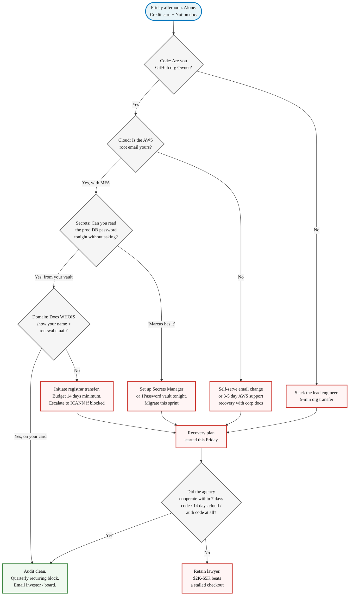

> **Module 5 · Step 5 of 6** · [Tech for Non-Technical Founders 2026](/blog/tech-for-non-technical-founders-2026/) free course.
> Input: a team shipping code. Output: a 45-minute Friday audit confirming you own your code, cloud, and domain (or a recovery plan if you don't).

Open the AWS console. Top-right corner. Click your account name. Read the email address on the root user. Whose inbox does that land in tonight?

A health-tech founder we picked up in Q3 2026 had been billing **$23K a month** with the same agency for fourteen months. She had a Delaware C-corp, a Stripe account in her name, and 1,800 paying clinics on her platform. She did not have the AWS root password. The email on the root was the agency owner's personal Gmail. When that founder asked us to do an emergency rescue after a botched migration, our first hour was not technical. It was three back-and-forth emails to the agency owner asking him to please change the root account email and send the new password to a Notion doc he could not see. He took six days.

## The 2026 hostage situation looks different

The agencies that hold founders hostage in 2026 are not the same shops that did it in 2020. The new pattern: AI-augmented contractors who spin up your entire infrastructure during the Cursor or Claude Code session on Day 1 - GitHub org, AWS account, Vercel project, Supabase database, Stripe integration, Sentry, PostHog - and use whatever email was already logged in. Usually their own. The senior dev who set everything up moves to another client in month four. The junior who inherits your project does not know which credentials live where. Six months later, you are paying for accounts that nobody on the current team can administer.

There is a second pattern, even more common: the **cloud-default-account problem**. A contractor opens a fresh AWS account using the company credit card you handed them, then sets the root email to a shared `dev@` mailbox that the agency owns. AWS treats whichever email is on the root as the legal account holder. Your incorporation paperwork is irrelevant if the root email belongs to someone else. [AWS's own root user documentation](https://docs.aws.amazon.com/IAM/latest/UserGuide/id_root-user.html) is blunt about this: the root user has unrestricted access, and recovering control without the root credentials means filing a support ticket with corporate documents and waiting days.

The financial damage is rarely the headline number on the agency invoice. It is the day production breaks at 9pm and you cannot push a fix because you cannot read the prod database password. It is the week you lose to AWS support recovery while your customers see a maintenance page. It is the $11K legal retainer you pay to escalate when the agency stops answering. None of that hits the budget line that says "engineering."

## The 12 items, in one sentence each

The full audit lives at the [GitHub / AWS / Database Ownership Checklist](/blog/ownership-checklist/) - 12 items, the exact pass criterion for each, the recovery steps when one fails. Here is the one-line summary of each so you know what you are getting:

**Code (3 items):**

1. **GitHub org owner** is your company email, not the agency's.
2. **Repo collaborators** can be removed by you alone, without permission.
3. **Branch protection on `main`** is enabled and you can override in an emergency.

**Cloud (3 items):**

4. **AWS root account email** sits on a domain you control.
5. **Billing card** is yours and you can download every invoice yourself.
6. **IAM admin user** in your name with MFA on, separate from root.

**Secrets and database (3 items):**

7. **Production DB credentials** readable by you tonight without paging an engineer.
8. **Secrets store** (Secrets Manager, Vault, Doppler) administered by you.
9. **Database backups** running nightly with a restore runbook you can execute.

**Domain and external services (3 items):**

10. **Domain registrar** WHOIS shows your name and your renewal email.
11. **DNS provider** logged in under your account with MFA, ready to add an A record now.
12. **Third-party API keys** (Stripe, SendGrid, Twilio, OpenAI, Plaid) on your account, your card.

Three of those are bigger than the rest. The AWS root email is the one that controls whether the agency can lock you out in ten minutes. The production database credentials are the one that determines whether you can rotate access tonight if a developer rage-quits. The domain registrar is the one that turns into a 14-day ICANN-mandated wait if the agency will not release the auth code. The other nine are also important. Those three are existential.

## What good looks like vs what bad looks like

The pattern is the same on every item: an email on a domain you control, billing on a card you own, MFA on a phone in your pocket, and a password in a vault you can read. The pattern of failure is the same too: somebody else's email, somebody else's card, and "let me ask Marcus" as the answer to "who can rotate this?"

Three pairs that come up most often in rescue audits.

**Item #4 - AWS root account email**

> Bad: Root email is `aws@bigdevshop.com`. The bill goes to their AmEx ending 4421. You have an IAM user but have never logged in as root.
> Good: Root email is `aws@mycompany.com`. The password is in your 1Password. MFA is on your phone with backup codes in your office safe. Bill goes to your company card.

If the agency controls the root email, AWS support will treat them as the account holder, not you. The incorporation paperwork in your filing cabinet does not matter to AWS until support has worked through their recovery process - which takes 3-5 business days after you have proven who you are.

![Side-by-side panel showing the AWS root account fields - account email, billing card, your access level, recovery time if the agency disappears - in the bad scenario where everything points at the agency, and the good scenario where everything points at the founder. The Bad column shows aws@bigdevshop.com, agency AmEx, IAM-only access, and a 3-5 day support recovery. The Good column shows aws@mycompany.com, founder AmEx, root password in 1Password with MFA, and same-day recovery by revoking the contractor.](bad-vs-good-email.svg)

**Item #7 - Production database password**

> Bad: "Marcus has it. Slack him and he can DM it to you."
> Good: "I opened AWS Secrets Manager just now and read it myself. I rotated it once in March when we offboarded the previous DBA."

The Marcus answer is the hostage answer. It does not matter whether Marcus is honest, kind, or available - one person holding the prod DB password is one person away from a production outage you cannot fix. The fix is not firing Marcus. The fix is putting the credential in a store you administer and giving Marcus read access from there.

**Item #10 - Domain registrar**

> Bad: Domain renewal notices arrive at `dev@theiragency.com`. You have never logged into Namecheap or GoDaddy in your life.
> Good: Logged into the registrar with your account. WHOIS shows your name. Auto-renew is on, charged to your card, and you have your phone scanned for MFA.

A domain transfer is the slowest recovery on the list. [ICANN's transfer policy](https://www.icann.org/resources/pages/transfers-2024-en) requires a five-day approval window after the auth code is released, and many registrars add a 60-day post-registration lockout window during which transfers cannot start at all. If the agency holds your domain and refuses to cooperate, your customers are looking at a static placeholder for two weeks while you escalate to ICANN's transfer dispute resolution.

## When the audit fails: a recovery plan that takes weeks, not months

Most audit failures are sloppy Day-1 setup, not malice. The agency was moving fast in the kickoff sprint, used whatever email was logged in, and nobody went back to clean it up. The fix follows three steps in this order, and the order matters.

**Step 1: Stop the bleeding.** Get yourself an admin path into every system the agency controls. AWS root password reset to your email. Your name added as GitHub org owner alongside theirs. Your card added as the primary on Stripe, SendGrid, and OpenAI. You are not removing the agency yet. You are giving yourself a parallel key so they cannot lock you out while you sort the rest. Do this on a Friday so you have the weekend before anyone notices.

**Step 2: Extract the IP.** Pull a fresh clone of every repo to a private GitHub org under your account. Export the database to an S3 bucket on an AWS account in your name. Document where every secret currently lives and where it will live after the migration. The point is not to switch off the agency's access yet. It is to make sure you can keep operating if they shut everything down tomorrow morning. Two weeks of work on the existing setup is fine. Two weeks of hostage negotiation while production is down is not.

**Step 3: Legal escalation, only if needed.** If the agency cooperates with email transfers, root password resets, and domain auth codes within a reasonable window - 7 days for GitHub org transfer, 14 days for AWS root, the auth code at all for the domain - you do not need a lawyer. You need a project manager and a follow-up email. If they stall, retain a lawyer for a one-time $2K-$5K letter referencing your contract's IP-assignment clause. Founders who try to negotiate for a month usually lose. The legal fee is cheaper than three more weeks of stalled checkout.

The artifact at [/blog/ownership-checklist/](/blog/ownership-checklist/) walks the exact recovery sequence per item, including the AWS support phone script and the registrar auth-code request template.

## The Rails / Django / Laravel angle: two files leak every secret

Across the three frameworks the founders we work with most often use - Ruby on Rails, Django, and Laravel - the same two files are where contractors leak production secrets. Knowing those two files is enough to ask one question that catches 80% of secrets-leak risk.

**File one: `config/database.yml` (Rails) or `settings.py` `DATABASES` block (Django) or `config/database.php` (Laravel).** This is the production database connection string. In a healthy setup it reads credentials from environment variables - `ENV['DATABASE_URL']` in Rails, `os.environ.get('DATABASE_URL')` in Django, `env('DB_PASSWORD')` in Laravel. In an unhealthy setup the password is hardcoded in plaintext and committed to the repo. Open the file. If you see a literal password sitting next to `password:` or `DB_PASSWORD =`, your prod database password is in your git history forever. [Rails' own credentials guide](https://guides.rubyonrails.org/security.html#custom-credentials) makes this point explicitly: the encrypted credentials file exists because plaintext database passwords in source control are the most common breach vector for small Rails apps.

**File two: `.env` files.** Django and Laravel use `.env` for local development. Rails has `.env` via the `dotenv-rails` gem and shipped Rails 7.2's encrypted credentials as the modern alternative. The leak pattern is the same in all three: a developer commits `.env` with production keys to a public or unauthorized-private repo. [GitGuardian's 2024 State of Secrets Sprawl report](https://www.gitguardian.com/state-of-secrets-sprawl-report-2024) found 12.8 million secrets exposed in public GitHub commits in 2023 alone, with `.env` files among the most common offenders. Ask one question: "What is in `.gitignore` and when was it last reviewed?" If the answer is "I do not know," your `.env` files are probably fine, but check anyway with `git log --all --full-history -- .env`.

The pattern across frameworks is identical because the file names differ but the architecture is the same: secrets enter the application from environment variables, environment variables enter the runtime from a secrets store, and the secrets store is administered by exactly one person - which should be you.

## What to do tomorrow

1. **Block 45 minutes on this Friday afternoon.** Calendar invite to yourself titled "Ownership audit." Treat it like an investor meeting. No interruptions. Coffee on, phone on Do Not Disturb.

2. **Open the AWS console first, before any other system.** Top-right, click the account name, click Account. Read the root user email. If it is not on a domain you control, that one item is your audit's first failure - and the most expensive one to fix later.

3. **Download the [GitHub / AWS / Database Ownership Checklist](/blog/ownership-checklist/) and run the 45-minute audit Friday.** The artifact has the exact pass criterion for each of the 12 items, the recovery sequence per failure, and the one-page summary you forward to your investor or board the same day. If three or more items fail, cross-reference [the eight dev-shop red flags](/blog/dev-shop-red-flags-checklist/) and consider whether you need [the 30-day exit guide](/blog/fire-dev-shop-guide/) next.

## Continue the course

This is **Module 5 · Step 5 of 6** in the free [Tech for Non-Technical Founders 2026](/blog/tech-for-non-technical-founders-2026/) course - 8 modules from idea to first paying users.

| # | Module | Output you walk away with |
|---|---|---|
| 0 | Where Are You? | Self-assessment + your starting module |
| 1 | Validate the Problem | One-page validated problem statement |
| 2 | Design the Solution | One-page Product Brief (Vibe PRD) |
| 3 | Choose Your Build Path | Build decision: self-serve or hire |
| 4A | Ship Self-Serve (branch) | Live MVP at a staging URL |
| 4B | Hire & Ship (branch) | Signed SOW, kickoff scheduled |
| **5** | **Manage Your Build** ← you are here | **Weekly oversight rhythm** |
| 6 | When Things Break | Salvage / rebuild decision |
| 7 | Manage AI-Era Risks | AI interrogation system |

**In Module 5 · Manage Your Build**: 5.1 [The Org Chart Your Dev Shop Won't Draw](/blog/engineering-org-chart-non-technical-founder/) · 5.2 The Friday Demo Rule · 5.3 [Three Questions That Turn a Standup Into Proof](/blog/three-questions-turn-standup-into-proof/) · 5.4 The Plain-English Weekly Dev Report · 5.5 **Who Owns Your GitHub, AWS, and Database?** ← you are here · 5.6 You Asked for a Simple Admin Panel; You Got a Spaceship.

The full course landing page (with all 11 artifacts) publishes after Module 5 ships. Until then, bookmark this post.

## Further reading

- AWS, [AWS Account Root User documentation](https://docs.aws.amazon.com/IAM/latest/UserGuide/id_root-user.html) - the official explanation of why the root email is the master credential and how account recovery works.
- ICANN, [Transfer Policy](https://www.icann.org/resources/pages/transfers-2024-en) - the rules every domain registrar must follow when transferring a domain between accounts, including the 60-day lockout and 5-day approval windows.
- GitGuardian, [The State of Secrets Sprawl 2024](https://www.gitguardian.com/state-of-secrets-sprawl-report-2024) - 12.8 million secrets exposed in public GitHub commits in 2023, with `.env` files as one of the most common leak vectors.
- Rails Guides, [Security: Custom Credentials](https://guides.rubyonrails.org/security.html#custom-credentials) - the canonical Rails answer to the "where do production secrets live?" question, replacing the old `database.yml` plaintext pattern.
- Will Larson (via First Round Review), [Engineering leadership anti-patterns from Stripe, Uber, Carta](https://review.firstround.com/unexpected-anti-patterns-for-engineering-leaders-lessons-from-stripe-uber-carta/) - on ownership and accountability in engineering teams, including who holds the keys to production.
- AWS, [Reset a lost or forgotten root user password](https://docs.aws.amazon.com/IAM/latest/UserGuide/id_credentials_passwords_change-root.html) - the support process and timeline if you need to recover a root account where someone else controls the email.

Built by JetThoughts as part of the free [Tech for Non-Technical Founders 2026](/blog/tech-for-non-technical-founders-2026/) curriculum.
