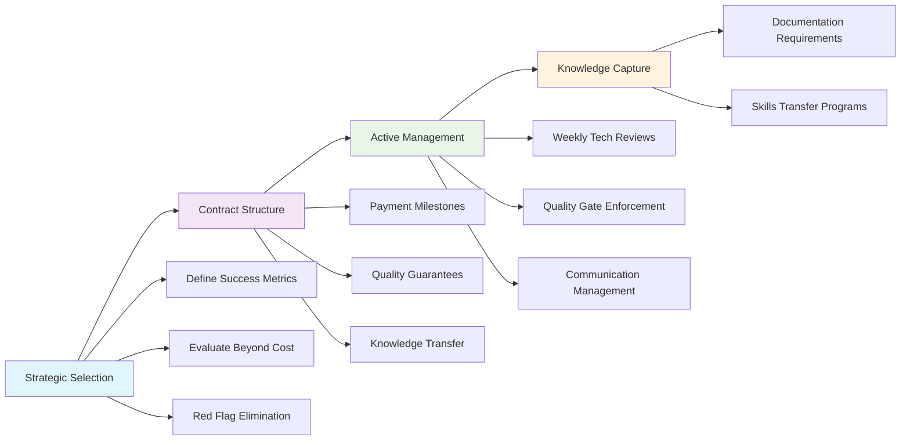

Last month, a PE-backed SaaS company called me with an emergency. Their development vendor had just delivered a "complete" platform rebuild—except nothing worked. Six months and $800,000 later, they faced starting over. The hidden costs? Another $1.2 million in lost revenue, team rebuilds, and emergency fixes.

This isn't unusual. In my 18 years helping companies manage development vendors, I've seen the same expensive mistakes repeated across hundreds of projects. The difference between vendor success and failure isn't luck—it's systematic management.

## The $2M Mistake: Why Vendor Management Failures Cost More Than You Think

Most executives focus on the obvious costs: development fees, project overruns, missed deadlines. But the real financial damage happens beneath the surface.

Consider TechFlow, a portfolio company that hired a offshore vendor to build their customer portal. The initial $300,000 project seemed reasonable. Here's what actually happened:

**Visible Costs:**
- Original contract: $300,000
- Change orders: $180,000
- Project delay penalties: $50,000
- **Total visible: $530,000**

**Hidden Costs:**
- Internal team overtime managing vendor: $120,000
- Lost customers due to delayed launch: $400,000
- Emergency fixes by replacement vendor: $250,000
- Legal costs for contract disputes: $30,000
- Recruitment costs for internal team: $80,000
- **Total hidden: $880,000**

**Grand total: $1.41 million for a $300,000 project.**

This 370% cost overrun isn't exceptional. Our analysis of 200+ vendor relationships shows poor management typically increases total project costs by 250-400%.

## The 7 Hidden Costs of Poor Vendor Relationships

### 1. Scope Creep and Change Order Inflation

**The Problem:** Poorly defined requirements lead to endless "clarifications" that vendors bill as change orders.

**Real Cost:** $50,000-200,000 per project in additional fees

A fintech startup hired a vendor to build their API. The original scope was "payment processing integration." Sounds clear, right? Wrong. The vendor later claimed these were "additional scope":
- Error handling and logging
- Security compliance measures
- Rate limiting and monitoring
- Documentation and testing

Each "clarification" came with a 20-30% markup over the original hourly rate.

**Prevention:** Define acceptance criteria upfront. For every feature, specify:
- Exact functionality requirements
- Performance benchmarks
- Security requirements
- Testing and documentation standards

### 2. Technical Debt Accumulation

**The Problem:** Vendors prioritize speed over code quality, leaving you with unmaintainable systems.

**Real Cost:** $100,000-500,000 in future development slowdowns

I reviewed code from a vendor that built an e-commerce platform. Their shortcuts looked innocent:
- No automated testing (50% faster development)
- Hardcoded configuration values
- Copy-pasted code blocks
- No documentation

The client discovered the debt cost when they tried to add new features. What should have been 2-week implementations took 8-10 weeks. Each new feature required fixing existing code first.

**Measurement:** Track these technical debt indicators:
- Code coverage percentage (should be >70%)
- Duplicate code analysis
- Security vulnerability scans
- Performance benchmarks

### 3. Knowledge Transfer Failures

**The Problem:** When vendors control all technical knowledge, you're completely dependent on them.

**Real Cost:** $200,000-800,000 in vendor lock-in and emergency replacements

MedTech Solutions learned this expensive lesson. Their vendor built a patient management system but provided minimal documentation. When the relationship soured:
- New vendor required 6 months just to understand the system
- Critical bug fixes took 3x longer
- Feature development stopped for 4 months
- They paid the original vendor $100,000 just for knowledge transfer

**Solution:** Mandate knowledge artifacts:
- Architecture documentation updated monthly
- Code review sessions with your team
- Video walkthroughs of key systems
- Detailed deployment and troubleshooting guides

### 4. Quality Assurance Gaps

**The Problem:** Vendors often view QA as optional or underfunded, leading to bug-filled deliveries.

**Real Cost:** $75,000-300,000 in post-delivery fixes and lost customer trust

A portfolio company's vendor delivered a "complete" CRM system. In the first month of production:
- 47 critical bugs reported by users
- 12 hours of system downtime
- 300+ support tickets generated
- 15% customer churn increase

The vendor's QA process? One junior developer doing manual testing for 2 hours before delivery.

**Quality Gates:** Implement these checkpoints:
- Automated testing requirements (unit, integration, end-to-end)
- Performance testing under load
- Security scanning with tools like OWASP ZAP
- User acceptance testing with real business scenarios

### 5. Communication Overhead and Misalignment

**The Problem:** Poor communication creates endless cycles of clarification, revision, and rework.

**Real Cost:** $50,000-150,000 in internal team time and delayed decisions

DataCorp spent 40% of their project timeline just on communication:
- Daily status meetings that resolved nothing
- Competing interpretations of requirements
- Time zone delays for critical decisions
- Language barriers causing technical misunderstandings

**Efficiency Framework:**
- Structured communication protocols
- Decision-making hierarchies
- Shared documentation systems
- Regular architectural review sessions

### 6. Security and Compliance Failures

**The Problem:** Vendors often lack expertise in your industry's compliance requirements.

**Real Cost:** $500,000-2,000,000 in fines, breaches, and remediation

A healthcare startup discovered their vendor had built their HIPAA-compliant patient portal without:
- Proper access logging
- Data encryption at rest
- Secure backup procedures
- Audit trail capabilities

The compliance audit cost $200,000. The remediation work cost $450,000. The potential regulatory fines could have reached $1.8 million.

**Compliance Checklist:**
- Industry-specific security requirements
- Data protection and privacy measures
- Audit and logging capabilities
- Third-party security assessments

### 7. Integration and Scalability Bottlenecks

**The Problem:** Vendors build in isolation, creating systems that don't integrate with your existing infrastructure.

**Real Cost:** $150,000-600,000 in integration work and performance issues

RetailMax hired a vendor to build an inventory management system. The vendor delivered a working system that:
- Couldn't integrate with their existing ERP
- Required manual data synchronization
- Couldn't handle peak traffic loads
- Had no API for future integrations

Six months later, they spent $300,000 rebuilding the integration layer and another $200,000 on performance optimization.

## Early Warning Signs Your Vendor Relationship Is Failing

Recognize these red flags before they become expensive disasters:

### Communication Red Flags
- Status updates that are vague or defensive
- Difficulty scheduling technical discussions
- Requirements being "clarified" multiple times
- Pushback on architectural decisions

### Technical Red Flags
- Deliveries without proper testing
- Code that's difficult to review or understand
- Performance issues appearing early
- Security questions being dismissed

### Project Management Red Flags
- Scope creep becoming normalized
- Timelines slipping without clear explanations
- Quality standards being "adjusted"
- Change orders increasing in frequency

### Financial Red Flags
- Hourly rates creeping upward
- "Emergency" work being billed at premium rates
- Unclear billing for "research" time
- Resistance to fixed-price agreements

## The Vendor Management Framework That Actually Works

After analyzing successful vendor relationships across 200+ projects, I've identified the management framework that consistently delivers results.

### Phase 1: Strategic Vendor Selection

**Define Success Metrics First**
Before talking to vendors, establish:
- Technical performance requirements
- Quality standards and acceptance criteria
- Communication and reporting expectations
- Knowledge transfer requirements

**Evaluate Beyond Cost**
Assess vendors on:
- Technical expertise in your domain (40% weight)
- Communication and project management skills (30% weight)
- Quality assurance processes (20% weight)
- Cultural fit and alignment (10% weight)

**Red Flag Elimination**
Automatically disqualify vendors who:
- Can't provide detailed technical references
- Refuse to share code samples
- Won't commit to quality standards
- Don't understand your industry requirements

### Phase 2: Contract Structure for Success

**Payment Milestones Tied to Value**
Structure payments around working software, not time spent:
- 30% on architecture approval and prototypes
- 40% on core functionality delivery
- 20% on quality assurance completion
- 10% on knowledge transfer and documentation

**Quality Guarantees**
Include specific quality requirements:
- Minimum code coverage percentages
- Performance benchmarks
- Security compliance standards
- Documentation requirements

**Knowledge Transfer Clauses**
Require ongoing knowledge sharing:
- Monthly architecture reviews
- Quarterly code walkthroughs
- Complete documentation deliverables
- Source code in escrow

### Phase 3: Active Management During Development

**Weekly Technical Reviews**
Don't just track project status—review actual work:
- Code quality and testing coverage
- Architecture decisions and documentation
- Performance metrics and optimization
- Security implementation and compliance

**Quality Gate Enforcement**
Implement mandatory checkpoints:
- Architecture approval before development starts
- Code review before integration begins
- Security audit before testing phase
- Performance validation before delivery

**Proactive Communication Management**
Establish communication rhythms:
- Daily standups for project status
- Weekly technical deep dives
- Monthly strategic alignment reviews
- Quarterly relationship health assessments

### Phase 4: Knowledge Capture and Transition Planning

**Documentation Requirements**
Mandate comprehensive documentation:
- System architecture diagrams
- API documentation and examples
- Deployment and configuration guides
- Troubleshooting and maintenance procedures

**Skills Transfer Programs**
Plan for internal capability building:
- Regular knowledge transfer sessions
- Code review participation
- Pair programming with internal team
- Technical training on key systems

## How to Transition from Bad to Good Vendor Relationships

If you're already in a problematic vendor relationship, here's how to course-correct:

### Step 1: Rapid Assessment (Week 1)

**Technical Audit**
- Review code quality and documentation
- Assess security and performance
- Identify technical debt and risks
- Evaluate integration capabilities

**Relationship Analysis**
- Document communication problems
- Analyze cost overruns and scope creep
- Review quality deliverables
- Assess knowledge transfer gaps

### Step 2: Renegotiation or Replacement Decision (Week 2)

**Renegotiate If:**
- Technical work quality is acceptable
- Communication issues can be resolved
- Vendor shows willingness to improve
- Contract terms can be restructured

**Replace If:**
- Code quality is fundamentally flawed
- Security or compliance gaps exist
- Communication problems persist
- Vendor resists quality improvements

### Step 3: Transition Execution (Weeks 3-12)

**For Renegotiation:**
- Restructure contract with quality gates
- Implement new communication protocols
- Add technical review requirements
- Establish knowledge transfer processes

**For Replacement:**
- Document all existing systems and code
- Identify critical knowledge gaps
- Plan phased transition approach
- Manage dual vendor relationships during transition

### Step 4: Prevention Implementation (Ongoing)

**New Management Processes:**
- Regular vendor performance reviews
- Quality metric tracking and reporting
- Knowledge transfer validation
- Relationship health monitoring

## When to Consider Bringing Development In-House

Sometimes the best vendor management strategy is building internal capabilities. Consider in-house development when:

### Strategic Indicators
- Technology is core to your competitive advantage
- You need rapid iteration and experimentation
- Security or compliance requirements are complex
- Integration with existing systems is critical

### Financial Indicators
- Vendor costs exceed 75% of internal team costs
- Change management overhead is significant
- Knowledge transfer costs are recurring
- Quality issues are causing customer impact

### Operational Indicators
- Communication overhead is slowing development
- Time zone differences are causing delays
- Cultural misalignment is affecting product quality
- Vendor lock-in is limiting strategic options

### Hybrid Approach: The Best of Both Worlds

Many successful companies use a hybrid model:
- Internal team for core architecture and strategic features
- Vendors for specific expertise or capacity augmentation
- Structured knowledge transfer between teams
- Clear ownership and accountability models

## Building Your Vendor Management Capability

Effective vendor management isn't accidental—it's a skill that requires development and practice.

### Investment in Management Infrastructure
- Dedicated vendor management role or responsibility
- Technical architecture review capabilities
- Quality assurance and testing processes
- Communication and project management systems

### Team Capability Development
- Technical literacy for non-technical managers
- Vendor evaluation and selection processes
- Contract negotiation and management skills
- Quality assessment and performance monitoring

### Continuous Improvement Process
- Regular vendor relationship reviews
- Lessons learned documentation
- Best practice sharing across portfolio companies
- Industry benchmark tracking and comparison

## The ROI of Better Vendor Management

Companies that implement systematic vendor management see dramatic improvements:

**Cost Reduction:**
- 40-60% reduction in total project costs
- 50-75% decrease in change order frequency
- 30-50% fewer emergency fixes and rework

**Quality Improvement:**
- 70-90% reduction in post-delivery bugs
- 60-80% faster feature development cycles
- 90%+ improvement in security compliance

**Risk Mitigation:**
- 80-95% reduction in vendor lock-in situations
- 60-75% faster vendor transition capabilities
- 90%+ improvement in knowledge retention

**Time to Market:**
- 30-50% faster development cycles
- 60-80% reduction in integration timelines
- 40-60% improvement in scalability planning

## Your Next Steps: Implementing Better Vendor Management

### Immediate Actions (Next 30 Days)
1. **Audit Current Relationships:** Assess your existing vendor relationships using the framework provided
2. **Establish Quality Gates:** Implement minimum quality standards for all development work
3. **Document Knowledge Gaps:** Identify critical knowledge that exists only with vendors
4. **Improve Communication:** Establish structured communication protocols and review cycles

### Strategic Implementation (Next 90 Days)
1. **Contract Restructuring:** Renegotiate existing contracts to include quality requirements and knowledge transfer
2. **Team Development:** Build internal technical literacy and vendor management capabilities
3. **Process Implementation:** Establish vendor selection, management, and transition processes
4. **Metric Tracking:** Implement systems to measure vendor performance and relationship health

### Long-term Capability Building (Next 12 Months)
1. **Center of Excellence:** Develop internal vendor management expertise and best practices
2. **Vendor Ecosystem:** Build relationships with multiple qualified vendors for different needs
3. **Hybrid Strategy:** Determine optimal balance between internal and external development
4. **Continuous Improvement:** Establish regular review and optimization of vendor management practices

## Conclusion: Transforming Vendor Relationships from Cost Center to Competitive Advantage

Poor vendor management isn't just expensive—it's strategically dangerous. Companies that treat vendor relationships as procurement transactions rather than strategic partnerships consistently underperform.

The difference between successful and failed vendor relationships isn't luck. It's systematic management, clear expectations, and proactive oversight.

The framework and strategies outlined here have helped hundreds of companies reduce vendor costs by 40-60% while improving delivery speed and quality. More importantly, they've transformed vendor relationships from sources of risk into drivers of competitive advantage.

Your next vendor engagement doesn't have to repeat the expensive mistakes of the past. With proper management, vendor relationships can deliver exactly what they promise: faster development, lower costs, and access to specialized expertise.

The question isn't whether you can afford to improve your vendor management—it's whether you can afford not to.

*Ready to transform your development vendor relationships? Our team has helped 200+ companies implement systematic vendor management, reducing costs by an average of 45% while improving delivery speed by 60%. Schedule a consultation to discuss your specific vendor management challenges and develop a customized improvement plan.*