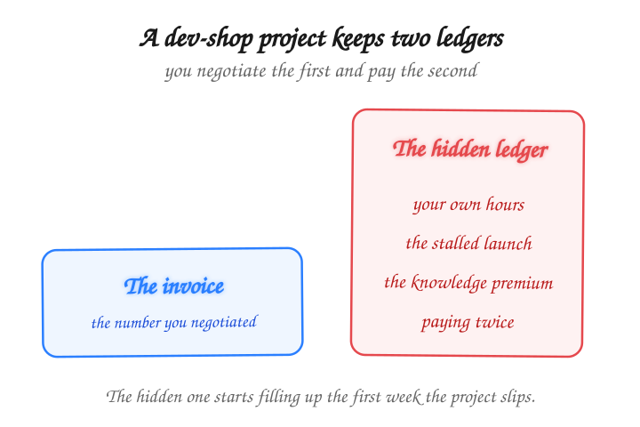
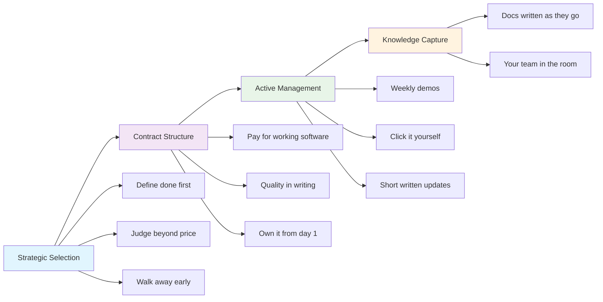

A dev-shop engagement keeps two ledgers. The visible one is the invoice, and founders negotiate it hard. The hidden one starts filling up the first week the project slips: the hours you spend chasing status, the launch that moves a quarter while payroll keeps running, the emergency rates you pay a second team to understand what the first team built.

We have been taking over troubled vendor projects since 2008, and the same four lines keep showing up - nobody is surprised by the invoice; the hours, the slips, and the second team's bill are the surprise.

The scale is well documented. The [Standish Group's CHAOS research](https://www.projectsmart.co.uk/white-papers/chaos-report.pdf) has tracked project outcomes for decades: roughly two-thirds of software projects come in late, over budget, missing features, or not at all. What the research can't show you is where your money goes when it happens to you. That's the hidden ledger, and it has four recurring lines.

## The hidden ledger

**Your own hours.** A vendor who needs daily direction turns you into an unpaid project manager. You chase updates, re-explain the same requirement to a rotating cast of developers, and mediate between "done" and "working." None of it appears on any invoice, and all of it comes out of the time you'd otherwise spend selling. If you want to know your number, open last month's calendar and count the vendor-shaped blocks.

**The stalled launch.** The most expensive line never shows up as a payment at all. Every month the delivery slips is a month of payroll and rent spent standing still, and a month for a competitor to sign the customers who were waiting on your checkout being "almost done." The schedule is just where you notice the burn.

**The knowledge premium.** When the architecture lives only in the vendor's heads, every future decision routes through them, at their price. A dev shop holding your only mental map has leverage, and they price accordingly. It gets worse when they hold the accounts too - the [Day-1 ownership audit from our free course](/course/tech-for-non-technical-founders-2026/github-aws-database-ownership-checklist/) and the [contract clauses that actually transfer code ownership](/blog/dev-shop-contract-code-ownership/) exist for exactly this line of the ledger.

**Paying twice.** When the relationship fails, the replacement team bills for archaeology before it can bill for progress: reading undocumented code, reconstructing why that workaround exists, fixing the foundation under every new feature. Quality debt behaves the same way even without a breakup - each new feature ships slower than the last, which is usually the first signal a founder can [see from outside the code](/blog/code-quality-evaluation-non-technical-founders/).

None of this requires a bad vendor - a standard engagement pays for hours logged and status narrated, and drift is what those incentives produce even from a competent team. If you suspect your project is already deep in the hidden ledger, run it against the [eight red flags checklist](/blog/dev-shop-red-flags-checklist/) - it's the fastest way to tell normal friction from a failing engagement.

## The four phases where you control the cost

```mermaid
graph LR
    A[Strategic Selection] --> B[Contract Structure]
    B --> C[Active Management]
    C --> D[Knowledge Capture]

    A --> A1[Define done first]
    A --> A2[Judge beyond price]
    A --> A3[Walk away early]

    B --> B1[Pay for working software]
    B --> B2[Quality in writing]
    B --> B3[Own it from day 1]

    C --> C1[Weekly demos]
    C --> C2[Click it yourself]
    C --> C3[Short written updates]

    D --> D1[Docs written as they go]
    D --> D2[Your team in the room]

    style A fill:#e1f5fe
    style B fill:#f3e5f5
    style C fill:#e8f5e8
    style D fill:#fff3e0
```

Vendor management breaks into four smaller skills, applied in order, and each has a moment where the fix is cheap and a later moment where the same fix is far more expensive. The diagram is the map; here is what each phase is for, with the deep checklist linked where it lives.

### Selection happens before the contract

Selection goes wrong when "what does done look like" gets decided after the contract instead of before it - every undefined requirement becomes a change order later. Decide the acceptance criteria, then shop. The [five questions that expose how a dev shop actually operates](/blog/hiring-dev-shop-questions/) and the [interview script from the course](/course/tech-for-non-technical-founders-2026/hiring-interview-script/) do the heavy lifting here.

### Two contract clauses do most of the work

The contract shapes behavior for months after anyone stops reading it. What matters most: payment tied to working software rather than time, and ownership of code and accounts in your name from day one - not escrowed, not "transferred at the end," which is exactly when a soured relationship makes transfer expensive. The [code ownership clauses](/blog/dev-shop-contract-code-ownership/) and [SLA requirements](/blog/dev-shop-sla-requirements-checklist/) posts carry the specific language.

### Replace status meetings with demos

Status meetings reward narration; demos reward software. The single highest-leverage change in a running engagement is replacing the weekly status call with a short demo of working software you click yourself - the [Friday demo rule](/course/tech-for-non-technical-founders-2026/friday-demo-rule-founder-progress/) is the full ritual, and [three standup questions](/course/tech-for-non-technical-founders-2026/three-questions-turn-standup-into-proof/) apply the same idea daily. You don't need to read code to run either.

### Stay exit-ready from month one

Every engagement ends - well or badly. Documentation the vendor writes while building, walkthroughs your team attends, and accounts you already own make the ending an ordinary handover on your terms. The [safe transition guide](/blog/switch-dev-shops-safely-transition-guide/) shows what exit-ready looks like in practice.

## Already in a bad engagement?

Two decisions, in this order. First: is the code worth keeping? That's a technical verdict, and the [salvage-vs-rebuild decision tree](/course/tech-for-non-technical-founders-2026/salvage-vs-rebuild-decision-tree/) turns it into a thirty-minute structured call instead of a feeling. Second: is the relationship worth keeping? If not, [fire them safely](/blog/fire-dev-shop-guide/) - secure your access before you send the letter. Reverse the order, and you pay the knowledge premium at its maximum rate.

## When in-house wins

Sometimes the honest answer to vendor management is to stop needing it. When the product is the company - when you iterate daily and the technology is your edge - the coordination overhead of any external team eventually costs more than an internal one. That's a staffing decision with its own [decision tree](/course/tech-for-non-technical-founders-2026/should-you-hire-2026-decision-tree/), and there are [warning signs that you need technical leadership](/blog/5-warning-signs-your-startup-needs-technical-leadership/) more than you need another vendor. Most companies land in between: a small internal core that owns the architecture, vendors for bounded, well-specified work. That split works precisely because it keeps the knowledge premium off the ledger.

## Three moves this week

1. **Count your hidden hours.** Go through last month's calendar and add up the time spent managing, chasing, or untangling the vendor. That number is your first hidden-ledger line, and it usually settles the "is this working" debate on its own.
2. **Check who owns what.** GitHub organization, cloud account, domain registrar. If any of them is not in your name, fixing that today costs an email; after a dispute it costs a lawyer.
3. **Ask for a link, not a report.** This Friday, ask your vendor for one URL where the week's work is running, and click through it yourself. The answer - and how long it takes to arrive - tells you which ledger your project is on.

If the hidden ledger reads like your last six months, we do a free 45-minute audit: one senior developer looks at your codebase and vendor setup and writes a plain-English assessment of where you stand. No contract, no follow-up calls unless you ask. [Get an honest audit](https://jetthoughts.com/contact-us/).
