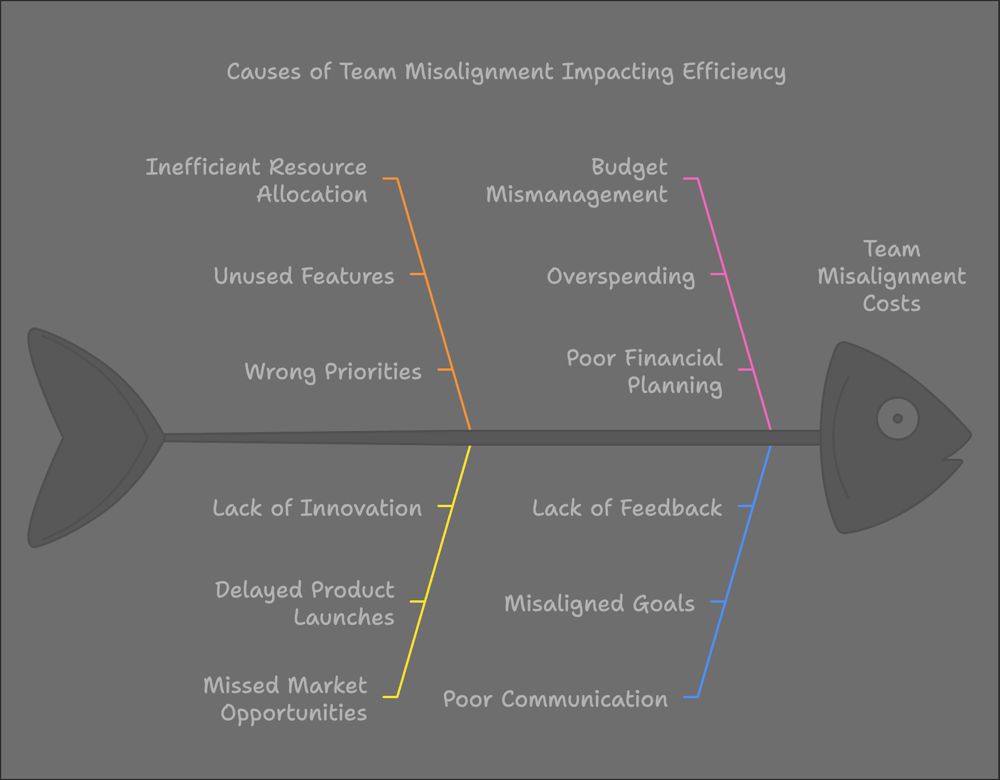
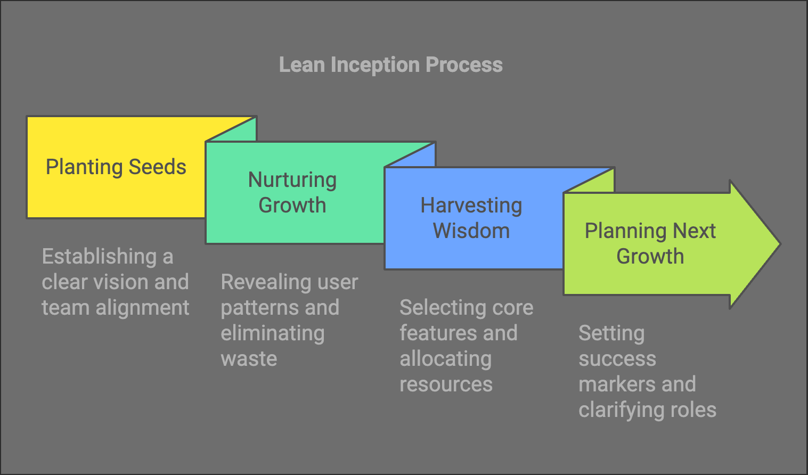

Think about the last time you watched a garden grow. No one tells a seed how to become a flower. The magic lies in creating the right conditions. Your product development journey follows the same natural law.

## Beyond the Traditional Approach

Most founders push their products forward like rolling a boulder uphill. They exhaust themselves fighting gravity. They burn through resources. They miss the simple truth: success flows naturally when you design the right environment.

Let me share what I've seen work.

## The Real Cost of Chaos

Every week your team stays misaligned costs you:
- Developer hours spent on unused features
- Market opportunities slipping away
- Budget draining into the wrong priorities

Like a garden choked by weeds, your product loses vital nutrients to things that don't matter.

> Pause and Consider:
> - What's your weekly burn rate?
> - How many features have you built that users rarely touch?
> - What would focusing on the right things be worth?

## The Natural Path to Profit

[Lean Inception](https://martinfowler.com/articles/lean-inception/) isn't just another framework. It's a shift in how value flows through your product development. Think of it as designing a sustainable ecosystem where:

- Teams align naturally, saving 30-40% of development time
- Features emerge from real user needs, not assumptions
- Progress flows measurably, week after week

One founder I know saved $50,000 in just two months by cutting features that weren't serving their core value. Another doubled their user engagement by focusing on what actually mattered.

## The Four-Day Investment

Like planting a garden, Lean Inception requires an initial investment of care. But the returns are profound:

**Day 1: Planting Seeds**
- Clear vision that everyone understands
- Aligned team moving in one direction
- Focused energy on what matters

**Day 2: Nurturing Growth**
- User patterns revealed
- Waste eliminated before it starts
- Natural pathways identified

**Day 3: Harvesting Wisdom**
- Core features selected with confidence
- Resources allocated efficiently
- Clear path to market value

**Day 4: Planning Next Growth**
- Measurable success markers
- Actionable next steps
- Team roles clarified

## Real Results, Real Numbers

Sarah's story shows the tangible impact:

Before Lean Inception:
- 6 months of scattered development
- $120,000 spent on unused features
- Team confusion and stress

After four days of Lean Inception:
- Development time cut by 40%
- Core features launched in 8 weeks
- First paying customers within 3 months

She didn't just save money. She created momentum.

## The Natural Return on Investment

Think about your current development costs:
- Developer salaries
- Project delays
- Feature rework
- Lost market opportunities

Now imagine:
- Teams aligned on priorities
- Features users actually want
- Faster time to market
- Clear measurement of success

The math becomes simple. Four days of focused work can save months of waste.

## Your First Step

Starting is simpler than you think. Like planting a garden, you begin with one seed:

1. Gather your team
1. Block four days
1. Follow the natural process
1. Watch value grow

The framework works because it follows natural laws of growth. No forcing. No pushing. Just clear direction and measured progress.

## Why This Matters Now

In today's market:
- Resources are precious
- Time is critical
- Competition is fierce

You can't afford to guess. You need a proven path.

## The Investment That Pays Back

Consider the cost of not acting:
- How many more features will you build that no one uses?
- How many more weeks will your team spend misaligned?
- How much longer will you wait to see real results?

Lean Inception isn't an expense. It's an investment that pays back in weeks, not years.

## Your Next Move

You have three options:

1. Continue as you are
2. Try another complex methodology
3. Give Lean Inception four days to prove its worth

Like watching a garden grow, you'll see results emerge naturally. But unlike a garden, these results show up in your bottom line.

> Pause and Consider:
> - What would 40% faster development mean for your business?
> - How would clear direction change your team's productivity?
> - What's the cost of waiting another month?

## Time to Grow

Every successful product starts with a moment of decision. This is yours.

1. Four days.
1. Clear direction.
1. Measurable results.

Your product garden awaits. Time to let it thrive.

---

Ready to see how Lean Inception can transform your product development? Let's talk about your specific challenges and how this framework can turn them into opportunities for growth.

Because in the end, success isn't about forcing growth. It's about creating the conditions where value flows naturally.

Your next step is simple: Give it four days. Watch what grows.