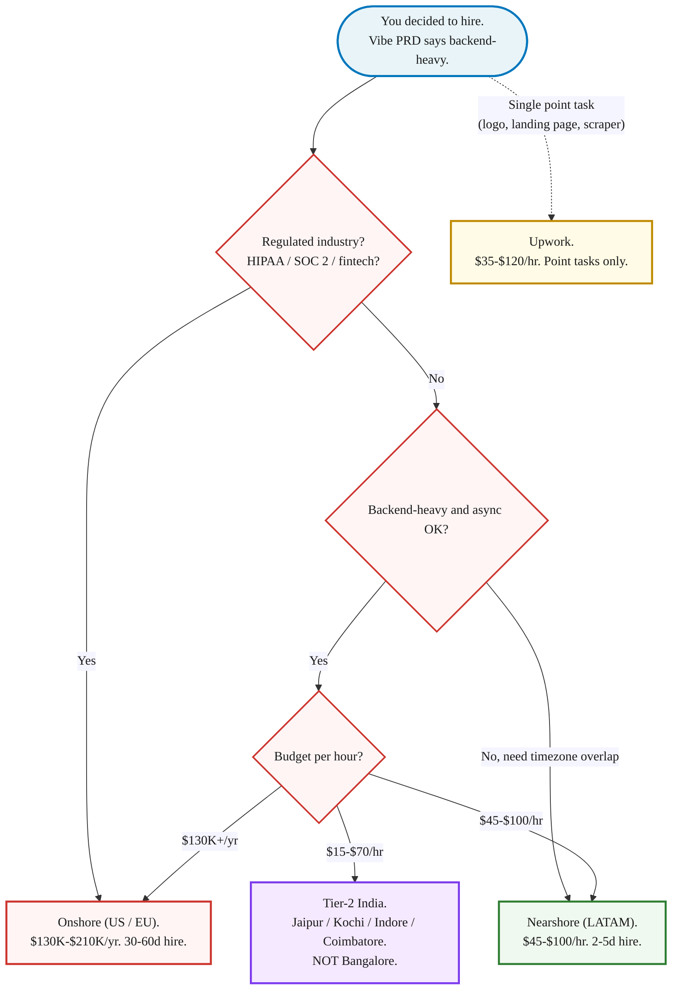

> **Reference content.** This page is supplementary - return when retention from Module 6 is solid AND you have hit the self-serve ceiling. Until then, [Module 5: Build It Yourself](/blog/self-serve-mvp-stack-lovable-supabase-stripe-2026/) is the path.

This page consolidates the hire-track material from the [Tech for Non-Technical Founders 2026](/blog/tech-for-non-technical-founders-2026/) course into one reference. Four topics: who and where to hire in 2026, the Fractional CTO bridge, the interview that catches AI theater, and the SOW clauses that quietly drain your runway. Read the section you need, skip the rest.

---

## Where to find developers in 2026

The developer hiring market reshaped between 2024 and 2026. Algorithm interviews stopped filtering for the skill that ships product - the model passes them. The question now is whether the candidate can own a system, direct AI tools, and put a thoughtful hand on the output before it merges.

### The 2026 AI-Augmented Developer profile

Pre-seed founders still hire on resume signals that stopped predicting outcomes around 2024. Five criteria are the new screen.

**5 to 10 years of shipped engineering experience.** Not 0-3. The Junior who passes algorithm interviews is the Junior the model now replaces. The 5-10 year engineer knows where the load-bearing decisions live, which is the part the model still cannot do alone.

**Daily user of at least one of Cursor, Claude Code, Aider, or Copilot.** Ask them to walk you through their `.cursorrules` file or their CLAUDE.md. If they cannot, they are not directing the tools, they are watching them.

**Has shipped AI-generated code to production AND reviewed someone else's AI-generated code in pull request.** Both halves matter. Shipping alone produces the 45% security-flaw rate Veracode flagged in their [GenAI Code Security Report 2025](https://www.veracode.com/blog/genai-code-security-report/). Reviewing alone produces a senior who never tests the model's claims.

**Can articulate where the AI is wrong.** A real AI-Augmented Developer will tell you, unprompted, that the model invents npm packages (the slopsquatting attack vector), hallucinates database column names, and confidently rewrites authentication code that ships a CSRF hole. If they tell you the model is "amazing" and stop there, the screen is over.

**Salary band: $85K-$120K Junior with Senior productivity, or $100K-$140K for the AI Integration Engineer specialty.** The old Senior at $235K is a luxury, not a necessity for pre-seed.

### Four geographies

The 2026 hire decision is not "remote vs in office." It is which of four regions the role belongs to.

**Onshore (US / EU) - $130K to $210K+ per year.** 30 to 60 day hire cycle. Pick this when the role demands it: regulated industry (HIPAA, SOC 2 with US-data-residency clauses, fintech with state licensing), security clearance, or a board mandate. Otherwise the cost-to-output ratio is the worst on the map.

**Nearshore (LATAM) - $45 to $100 per hour.** Equivalent to $90K to $200K per year. 2 to 5 day hire cycle. Full timezone overlap with US Pacific through Eastern. English fluency at the level needed for daily standups and Slack. The talent pool is dense in Argentina, Brazil, Mexico, and Colombia. The 2026 default for most US founders who do not have a regulated industry mandate.

**Tier-2 offshore India - $15 to $70 per hour.** Equivalent to $30K to $140K per year. 1 to 5 day hire cycle. The structural shift is away from overheated Bangalore (rates compressed by global hyperscaler offices) toward Tier-2 cities: Jaipur, Kochi, Indore, Coimbatore. Senior engineers with seven to ten years of production ships in these cities accept rates 20% to 30% below Bangalore because the local cost-of-living is lower. The catch: async-first culture. You will not get standups at 9am Pacific. You will get pull requests merged overnight, code reviewed against your CLAUDE.md by morning, and a Slack thread with answers to your async questions before you finish coffee. Pick this for backend-heavy work where async is acceptable.

**Mass-market (Upwork) - $35 to $120 per hour.** Self-vetting required: the marketplace does no quality screen, you become the technical interviewer. Acceptable for point tasks only - a single landing page, a logo, a one-off web scraper. Anything load-bearing (payments, auth, multi-tenant data, a third-party integration with retry logic) belongs on one of the three professional platforms above, not Upwork.

### Seven platforms ranked

The hiring market for AI-Augmented Developers in 2026 lives across seven platforms. Pick two based on your geography decision above. Post the role on both, and do not waste a Friday on a tour of all seven.

- **[Toptal Fractional Executives](https://www.toptal.com/fractional/cto)** - Senior + screened, 3-5 day hire cycle, $90-$200/hr. Best for Senior fractional roles where the cost of a wrong hire would dwarf the platform markup.
- **[Bolster](https://bolster.com/marketplace/fractional-cto/)** - the largest curated fractional executive marketplace. Strong for fractional CTO and VP Engineering.
- **[GoCoFound](https://gocofound.com/)** - fractional CTO and fractional product specifically. Smaller pool, sharper match for pre-seed founders.
- **[LatHire](https://www.lathire.com/)** - LATAM nearshore developers, full-time and contract. Pre-screens for English fluency and engineering depth.
- **[AI People Agency](https://aipeople.agency/)** - AI-native engineer screening. Sub-48-hour candidate slates for AI Integration Engineer and AI Quality Engineer roles.
- **[Seedium](https://seedium.io/)** - AI-first software agency. Project work via SOW, not headcount.
- **[Upwork](https://www.upwork.com/)** - mass-market freelance for point tasks only.

**Job description that screens for the right signal:** Five lines: (1) 5-10 years engineering, (2) daily Cursor or Claude Code or Aider user, (3) shipped Rails / Django / Laravel apps to production, (4) reviewed AI-generated code in pull request, (5) can articulate where the model is wrong. Skip "5+ years of React and Node." Skip "Big Tech experience preferred." Both screens filter against the wrong signal in 2026.

---

## The Fractional CTO bridge

You do not need a 50% co-founder. You need 5 hours a week of senior judgment to tell you when the architecture is about to break, the contractor is about to propose a rewrite you do not need, or the PR that just merged shipped a CSRF hole. That job costs $400 to $600 a week, pays in cash, and is terminable on 30 days' notice.

### The 5 jobs the Fractional CTO does

**Architecture review - 1 hr/wk.** Every Monday morning, the Fractional CTO opens the codebase and reads what shipped last week. They look at the data model, the route table, the queue setup, and the third-party integrations. They tell you in one paragraph in a Notion doc: "this should be Rails, not microservices; here is why." They catch the moment your contractor proposes a separate React frontend talking to a Node API talking to a Python ML service for an app with 18 paying users.

**PR review - 2 hrs/wk.** Every pull req your contractor opens passes through the Fractional CTO before merge. They catch the API key checked into the repo, the n+1 query in line 47, the missing CSRF token, the auth bypass on the admin route, the abstraction nobody asked for. [Veracode's GenAI Code Security Report 2025](https://www.veracode.com/blog/genai-code-security-report/) found 45% of LLM-generated code shipped at least one exploitable security flaw. PR review is the one thing that catches this before prod.

**Hiring filter - 1 hr/wk during hiring sprint.** When you go to hire your first contractor or full-time engineer, the Fractional CTO runs the tech screen. They read the candidate's last three GitHub commits. They ask the four technical questions you cannot ask. The cost of one wrong-fit hire at month three is two months of runway. The cost of the Fractional CTO doing the screen is one hour at $80 to $120.

**Vendor BS detection - as needed.** When the agency proposes Kubernetes for 200 users, the Fractional CTO sits in the call and says "why?" When the contractor proposes GraphQL because "REST is old," the Fractional CTO says "show me the monorepo plan." They are the senior voice in a room where you are otherwise the only buyer in front of three people pitching.

**Founder coaching - 1 hr/wk.** Every Friday, 30 to 60 minutes. The Fractional CTO translates "the queue is backed up because Resque is dropping jobs" into "promise the May demo for May 12, not May 5." They make the engineering reality legible to your roadmap. The reverse is also true: they hear you describe the customer's pain and tell you which feature is one day of work and which is three weeks.

### Five criteria for hiring a Fractional CTO

Most "Fractional CTO" listings on LinkedIn are either career CTOs in transition (overpriced for pre-seed) or junior engineers padding their title (under-skilled for the role).

**1. 10+ years engineering at Series A-C startups.** Big-tech-only resumes solve different problems. They know how to scale to a billion users. They do not know how to keep a 200-user app alive on a Heroku bill of $89/mo. Series A-C is the sweet spot.

**2. First engineer at 2+ startups.** The "first engineer" experience is the closest analog to what your Fractional CTO will do for you. They have set up the GitHub org from scratch, picked the database, written the deployment script, and argued with a non-technical founder about the roadmap. Two times is enough; one time is luck.

**3. Will commit to a recurring weekly slot.** "Available when needed" is the failure mode. You want a recurring 30-minute architecture review every Monday and a 60-minute founder coaching every Friday. Both blocks on their calendar. If the candidate is not willing to commit to recurring slots in the first call, they are pricing in your churn.

**4. References from non-technical founders specifically.** Ask for two non-technical-founder references. Call both. Ask: "Did the Fractional CTO ever push back on a feature you wanted to ship? What happened?" If the answer is "they always shipped what I asked for," that is a no-hire signal.

**5. $400-$600/wk for 5 hrs is the 2026 market range.** [Bolster's marketplace data](https://bolster.com/marketplace/fractional-cto/) and Toptal Fractional Executives put the range at $80 to $120 per hour for a competent Fractional CTO. 5 hours per week lands at $400 to $600. Above $1,000 per week you are paying for a name brand or a CTO over-spec for pre-seed. Below $300 you are buying a junior engineer with the title inflated.

### Where to find them

- **LinkedIn**: search "Fractional CTO" + your industry. Send 10 short DMs that name the project and the budget. Reply rate is around 30%.
- **Y Combinator alumni network**: post in the founder Slack. The talent pool here is dense.
- **Platforms**: [Toptal Fractional Executives](https://www.toptal.com/fractional/cto), [Bolster](https://bolster.com/marketplace/fractional-cto/), [GoCoFound](https://gocofound.com/). Each pre-screens. You pay a markup, you save a week of vetting.
- **Indie Hackers Fractional channel**: free, slower, founder-to-founder. Best for SaaS micro-startups.
- **Your investor network**: one email to your lead angel often produces 2 to 4 warm intros within 48 hours.

**Week 1 onboarding:** Sign the MSA on Day 0. Day 1: share the Validated Problem Statement and Vibe PRD. Add them to the private GitHub org with `code reviewer` permissions - not admin, not write. Day 3: first 30-minute architecture review. They write one paragraph in a shared Notion doc: "what I would change, what I would leave alone." Day 7: first PR review. Their comments should be in plain English so you understand the trade-off. End of Week 4: ask them the Friday-coaching question. "Should I hire any contractors yet?" If the answer is hand-wavy, you have hired wrong; replace.

---

## Interviews that catch AI theater

Every engineer claims AI fluency on a 2026 resume. Most are typing prompts, accepting suggestions, and pushing the diff to PR. Veracode measured what that produces: 45% of LLM-generated code shipped at least one exploitable security flaw. The market split into two populations behind the same resume language. The 80% run AI theater - they accept the model's first suggestion, never disagree, and never check the dependency. The 20% direct the model - they read the diff, reject most of it, and catch the hallucinated package before it merges.

Seven questions in 30 minutes split the two populations. The interview structure: 0-5 min for intro and role context, 5-25 min for questions Q1-Q7 (approximately 3 min each, score Pass/Fail in real time), 25-30 min for their questions and close.

### Q1 - The workflow question

> "Walk me through how you take a Jira ticket and end up with merged code, when AI is in the loop. Name the tools, the prompt patterns, and the human review gates. Use a real ticket you closed last week."

**Passes:** Tools named by version (Cursor with Claude 4.5 Sonnet, Claude Code, Aider, Copilot Enterprise). A written sequence: read the ticket, write the failing test first, draft the prompt, generate, run the failing test, review the diff against the spec, open the PR, request a second human review, merge. They cite a real PR number from last week.

**Fails:** "I let Cursor handle the boilerplate." No tool name, no real PR. They shift into a generic monologue about how AI helps them think.

### Q2 - The cost question

> "What does the average dev on your team spend on AI tokens per month, and who pays it? What does a Cursor seat plus your API usage cost you personally last month?"

**Passes:** A per-developer dollar range ($80 to $300/month for Cursor Pro plus Anthropic and OpenAI API spend). They pulled the number off their last receipt before the call.

**Fails:** "My company pays for it." "I don't really track that." A candidate who has never looked at their own AI spend is the candidate who runs your monthly bill from $200 to $4,800 in their first sprint without telling you.

### Q3 - The verification question

> "When AI generates a 200-line PR, what does the senior reviewer actually check? Walk me through one PR you reviewed last week and tell me what you looked for."

**Passes:** They pull up an actual PR on screenshare. They explain: does the diff match the ticket spec? Are there any hardcoded secrets or API keys? Are the tests genuine or AI-generated to pass after the fact? Did the AI introduce new packages, and do those packages exist on Rubygems / PyPI / npm?

**Fails:** "I trust the model most of the time." "We rely on CI to catch issues." A candidate who outsources review to the model is a candidate who will ship the SQL injection vector your ops engineer finds at 3am.

### Q4 - The slopsquatting question

> "In April 2025 a security researcher published findings that AI assistants suggested over 200 package names across Rubygems, PyPI, and npm that did not exist. Attackers register those names and wait for developers to install the typo. How do you prevent installing a hallucinated package in your own work?"

**Passes:** A specific defense: a pre-vetted allowlist, a scanner like Socket or Snyk on every PR, or a manual verification step before any new dependency is added. They use the word "slopsquatting" without prompting.

**Fails:** "I check the package name looks right." "Cursor only suggests real packages." A candidate who has not heard of slopsquatting in 2026 has not read security press for a year.

### Q5 - The accountability question

> "When AI-generated code causes a prod incident, who is on the hook? Walk me through the last AI-generated-code incident you owned."

**Passes:** A specific incident with a date in the last 6 months. A one-paragraph root cause. The workflow change made the week after.

**Fails:** "I have never had an AI-related incident." (Either lying or never shipped.) "We blamed Cursor and moved on." No team-level accountability means no team-level review.

### Q6 - The refactor question

> "Walk me through the last refactor you led. What stayed, what changed, what broke briefly, and how you knew it was safe to ship."

**Passes:** A specific refactor with a named system. They describe what they kept (the public API contract, the test suite), what they changed, and what broke briefly. They name the safety net: green CI on main, a feature flag, a one-button rollback.

**Fails:** "I refactor as I go." "I rewrote the whole module." A candidate who cannot describe a real refactor either has not led one or has shipped the kind of rewrite that kills startups.

### Q7 - The disagreement question

> "Show me a PR review you wrote in the last 30 days where you disagreed with the AI's suggestion. Tell me what the AI suggested, why you disagreed, and what you shipped instead."

**Passes:** They share their screen. They open GitHub. They scroll to a real PR and read the comment they left out loud. Example: "Cursor wanted to add `gem 'jwt-decoder-v2'` for token validation; that gem does not exist on Rubygems and the standard library `OpenSSL::JWT` already does the job."

**Fails:** "I usually agree with the model." Forty seconds of silence and a promise to email a link "when they find one." That promise never lands.

This is the one question that actually splits the population. AI theater candidates accept the suggestion and merge. AI direction candidates read the diff, reject most of it, and ship what they intended.

### Scoring the call

Within five minutes of hanging up, score on three axes. Add the three for a 0-30 total, divide by three for a 1-10 score. Above 7 is a reference-check candidate. Below 5 is a polite no by tomorrow morning.

- **Specificity (0-10):** real PR numbers, real dollar amounts, real incident dates. Hand-waving is a 2. A walkthrough on screenshare with the actual artifact is a 10.
- **System judgment (0-10):** Q6 and Q7 are the two questions that test this directly. A candidate who walks a real refactor and a real PR-review disagreement scores 8+.
- **Communication (0-10):** would they answer your founder questions in plain English on a Tuesday?

Send the polite-no email the same evening, not Friday: "Thank you for the time. We are pausing the search to refine our requirements. We will keep your details on file."

---

## Reading the SOW

*"Vendor shall be deemed to have delivered a milestone upon deployment to the Client-accessible staging environment."* That is the single most expensive sentence a founder will sign this year. It moves the trigger for a milestone payment from "the feature works for users" to "the agency pushed code to a URL." A SaaS founder we worked with in Q1 2026 had $78K of milestone invoices clear under that one line before her fractional CTO opened the staging URL and watched it 500 on the second click.

Her general counsel had cleared the SOW the night before signing. He had flagged liability and the IP assignment, fixed both, and called it done. The milestone-acceptance clause sat three pages later and he had skimmed it. Generalist lawyers cover the catastrophic clauses. Agency templates leak money through the operational ones in between.

### Eight clauses that quietly cost you money

**1. Scope definition.** The agency-favoring version reads "scope to be defined sprint by sprint" or "agile discovery throughout." That sounds collaborative and means the SOW is a blank cheque. Demand a feature list at the level of "a Rails 7 app with sign-up, contractor-match, payments, and a hundred-row admin panel" plus a per-feature day estimate before you sign.

**2. Milestone acceptance.** The agency-favoring version says a milestone is delivered "upon deployment to the Client-accessible staging environment" with a five-day silent-acceptance window. Demand acceptance criteria written into the SOW: the milestone passes when CI is green on main, you have clicked the feature end-to-end on staging, and you have confirmed delivery in writing.

**3. Change-request process.** The agency-favoring version is open-ended hourly billing at $185/hour with verbal approval. Cap change orders at 10% of the SOW value, require a written estimate naming the developer and hours, and strike "verbal approval."

**4. IP and code ownership.** The agency-favoring version transfers ownership "upon receipt of all amounts due under this Agreement," turning any payment dispute into a hostage situation. Demand milestone-based assignment: upon payment of each milestone, the code committed for that milestone is yours, irrevocably.

**5. Third-party dependencies.** The agency-favoring version is pass-through at cost plus 15% with accounts held under the agency's email. Demand that every third-party account (AWS, Stripe, OpenAI) is created on your company email from day one, paid by your card, with the agency on IAM sub-access. Cap monthly pass-through with a founder-approval gate. One founder caught a $4,800 surprise OpenAI line by running her invoice trail against this clause.

**6. Termination triggers.** The agency-favoring version is "terminate only for material breach" with 30 days to cure. Demand a quality trigger (terminate if the agency misses acceptance criteria for two consecutive milestones), a missed-milestone trigger (slip more than 21 days without a revised plan), termination-for-convenience with a defined exit fee, and a 30-day handover obligation.

**7. Post-launch warranty.** The agency-favoring version starts the warranty clock at "Delivery" and runs it 30 days, which means it can expire before users ever see the feature. Anchor the warranty to prod launch instead: the warranty starts the day the deliverables are first served to live, paying users and runs 90 days from there.

**8. Dispute resolution.** The agency-favoring version is binding arbitration in the agency's home county, each party bearing its own costs. Demand a non-binding mediation step before arbitration, a neutral venue, and a prevailing-party fee-shift so the loser pays the winner's attorney fees.

### The milestone-acceptance redline

Of the eight, milestone acceptance is where founders consistently lose the most money, and it is the clause your general counsel is the most likely to skim.

The fix is one paragraph. A milestone is delivered when (a) the acceptance criteria listed in Exhibit B pass in CI, (b) the Founder or her delegate has clicked the feature end-to-end on the staging URL, and (c) the Founder has signed off in writing within seven business days. The acceptance criteria belong in the SOW, not in a Slack message after the work is done. The five-day silent-acceptance window becomes a seven-day active-acceptance window. The invoice does not clear until the Founder signs.

If the agency pushes back on this language, that is the conversation you want to have before signing, not after $78K has been wired.

### When the SOW is already signed

If you have already signed and a few of the eight clauses are tilted against you, the work is recoverable but harder. Put a dollar number next to each clause before the next renegotiation conversation. Which clauses are biting you now (dollar cost from milestones already paid against staging-only delivery), and which can wait (warranty windows that have not yet triggered). Push back on the milestone-acceptance and termination-trigger clauses first - they have the highest dollar exposure per sprint.

---

## Next steps

If you are reading this because you are ready to hire, the sequence is:

1. Pick your geography and two platforms from the hire section above. Post the role this week.
2. If you have budget for it, hire the Fractional CTO before the first developer starts. The $400-$600 per week for architecture review and PR coverage pays back in the first sprint.
3. Run every candidate through the seven-question interview. Score within five minutes of the call. Do not let good conversation scores override a failed Q7.
4. Before you sign any SOW, read the milestone-acceptance clause word by word. If it says "upon deployment to staging," strike it and replace it with the paragraph above.

The [Tech for Non-Technical Founders 2026](/blog/tech-for-non-technical-founders-2026/) course covers the full sequence from problem validation through your first paying customer.
