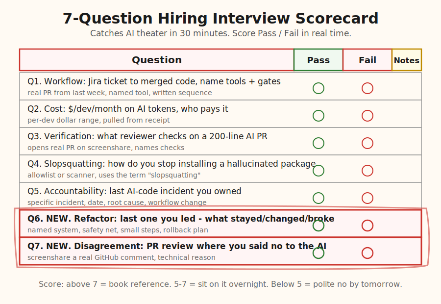
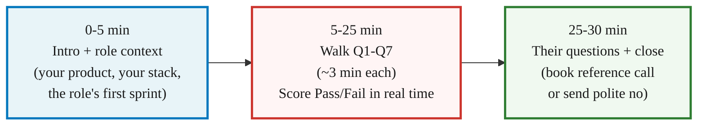

> **Module 4B · Step 2 of 4** · [Tech for Non-Technical Founders 2026](/blog/tech-for-non-technical-founders-2026/) free course.
> Input: a 3-5 person shortlist from Module 4B.1 platforms. Output: a clear hire decision after each 30-min interview, plus 2-3 candidates worth a final reference check.

*"I use AI to ship 3x faster."* Every candidate said it on the first call. *"Show me one PR you reviewed last week where you disagreed with the AI's suggestion."* That was the question I learned to ask after the third $90/hour LATAM hire ghosted PR review for two weeks. Forty seconds of silence on the Zoom call. He shared his screen, opened GitHub, scrolled, scrolled again, then said he would email me a link "when he found one." The link never arrived. That is the moment AI theater breaks. The seven questions below are the script that surfaces it in 30 minutes.

## Why this matters in 2026

Every engineer claims AI fluency on a 2026 resume. Most are typing prompts, accepting suggestions, and pushing the diff to PR. Veracode's [GenAI Code Security Report 2025](https://www.veracode.com/blog/genai-code-security-report/) measured what that produces: 45% of LLM-generated code shipped at least one exploitable security flaw. The market split into two populations behind the same resume language. The 80% are running AI theater - they accept the model's first suggestion, never disagree, and never check the dependency. The 20% are directing the model - they read the diff, reject most of it, and catch the hallucinated package before it merges. The seven questions below are written to surface which population the candidate sits in. Thirty minutes is enough.

## The 7 questions

The script extends the [5-question agency screen](/blog/agency-ai-five-questions/) for hiring individual engineers instead of vetting agencies. Five questions overlap. Two new ones (Q6 and Q7) test the system judgment and AI-direction signals that only matter when one person owns the code.

### Q1 - The workflow question

> "Walk me through how you take a Jira ticket and end up with merged code, when AI is in the loop. Name the tools, the prompt patterns, and the human review gates. Use a real ticket you closed last week."

**What passes:** Tools named by version (Cursor with Claude 4.5 Sonnet, Claude Code, Aider, Copilot Enterprise). A written sequence the candidate has used: read the ticket, write the failing test first, draft the prompt, generate, run the failing test, review the diff against the spec, open the PR, request a second human review, merge. They cite a real PR number from last week.

**What fails:** "I let Cursor handle the boilerplate." "Depends on the ticket." "AI is just one tool in my workflow." No tool name, no real PR. They shift into a generic monologue about how AI helps them think.

**Why this matters in 2026:** A candidate who cannot describe their workflow does not have one. They are improvising in front of the model and shipping whatever compiles. That is the workflow that produces the 45% Veracode flagged.

### Q2 - The cost question

> "What does the average dev on your team spend on AI tokens per month, and who pays it? What does a Cursor seat plus your API usage cost you personally last month?"

**What passes:** A per-developer dollar range ($80 to $300/month for Cursor Pro plus Anthropic and OpenAI API spend). They pulled the number off their last receipt before the call. They have a budget alert on their personal API account. If they are coming from an agency, they describe the pass-through model the agency wrote into the SOW.

**What fails:** "My company pays for it." "I don't really track that." "It's pretty cheap." A candidate who has never looked at their own AI spend is the candidate who runs your monthly bill from $200 to $4,800 in their first sprint without telling you.

**Why this matters in 2026:** AI tokens are now a line item in your engineering budget. The candidate who tracks their own spend will watch yours. The one who does not will surprise you in month two.

### Q3 - The verification question

> "When AI generates a 200-line PR, what does the senior reviewer actually check? Walk me through one PR you reviewed last week and tell me what you looked for."

**What passes:** They pull up an actual PR on screenshare. They read it line by line and explain: does the diff match the ticket spec? Are there any hardcoded secrets, API keys, or database passwords? Are the tests genuine (written by the developer first as failing specs) or AI-generated to pass after the fact? Did the AI introduce new gems or pip packages, and do those packages exist on Rubygems / PyPI / npm?

**What fails:** "I trust the model most of the time." "Cursor catches the obvious stuff." "We rely on CI to catch issues." A candidate who outsources review to the model is a candidate who will ship the SQL injection vector your ops engineer finds at 3am.

**Why this matters in 2026:** [Kernel maintainers' Assisted-by rule](/blog/ai-code-ownership-accountability/) put the human reviewer's name in the commit log on purpose. A reviewer who does not actually look at the code is the reviewer whose name goes next to the bug.

### Q4 - The slopsquatting question

> "In April 2025 a security researcher published findings that AI assistants suggested over 200 package names across Rubygems, PyPI, and npm that did not exist. Attackers register those names and wait for developers to install the typo. How do you prevent installing a hallucinated package in your own work?"

**What passes:** They name a specific defense: a pre-vetted allowlist with a written process for adding new packages, a scanner like Socket or Snyk on every PR that blocks the build until a human approves, or a manual verification step (`gem info <name>` / `pip show <name>` / `npm view <name>`) before any new dependency is added. They use the word "slopsquatting" without prompting and can cite the [Bleeping Computer writeup](https://www.bleepingcomputer.com/news/security/ai-code-suggestions-sabotage-software-supply-chain/) or the [Infosecurity Magazine piece](https://www.infosecurity-magazine.com/news/ai-hallucinations-slopsquatting/).

**What fails:** "I check the package name looks right." "Cursor only suggests real packages." "I have not run into that." A candidate who has not heard of slopsquatting in May 2026 has not read security press for a year.

**Why this matters in 2026:** The supply-chain attack is now AI-driven. Your engineer is the human in the loop who keeps a malicious gem off your production server.

### Q5 - The accountability question

> "When AI-generated code causes a production incident, who is on the hook? Walk me through the last AI-generated-code incident you owned. What happened, when, what you changed afterwards."

**What passes:** A specific incident with a date in the last 6 months. A one-paragraph root cause. The named senior who reviewed the offending PR (often the candidate themselves). The workflow change made the week after. Bonus signal: they reference [the Assisted-by commit footer](/blog/ai-code-ownership-accountability/) or describe a team-level postmortem they led.

**What fails:** "I have never had an AI-related incident." (Either lying or never shipped.) "AI code is the developer's responsibility." (Translation: not mine.) "We blamed Cursor and moved on." (No team-level accountability means no team-level review.)

**Why this matters in 2026:** Every AI-augmented engineer who ships will eventually own a postmortem. The one who has already written one is the one who will write yours when the time comes.

### Q6 - The refactor question (NEW)

> "Walk me through the last refactor you led. What stayed, what changed, what broke briefly, and how you knew it was safe to ship."

**What passes:** A specific refactor with a named system (the contractor-match service, the billing webhook handler, the search index reindex job). They describe what they kept (the public API contract, the test suite as the safety net), what they changed (the internal data model, the database migration, the service boundaries), and what broke briefly (the staging deploy at 4pm, a flaky test they found by accident, a dependent service whose tests they had to update). They name the safety net: green CI on main, a feature flag, a one-button rollback, a canary deploy. They reference [the three-line refactor discipline](/blog/refactor-step-tdd-three-line-discipline-ruby/) or a similar small-step rhythm.

**What fails:** "I refactor as I go." "I rewrote the whole module." "The product team did not let me refactor." A candidate who cannot describe a real refactor either has not led one or has shipped the kind of rewrite that kills startups.

**Why this matters in 2026:** AI-augmented juniors will produce 200-line PRs that the team eventually has to refactor. The candidate who has led a refactor is the candidate who can clean up after the model. The one who has not is the one who will ship the model's mess and call it done.

### Q7 - The disagreement question (NEW)

> "Show me a PR review you wrote in the last 30 days where you disagreed with the AI's suggestion. Tell me what the AI suggested, why you disagreed, and what you shipped instead."

**What passes:** They share their screen. They open GitHub or GitLab. They scroll to a real PR and read the comment they left out loud. The disagreement is technical and specific: "Cursor wanted to add `gem 'jwt-decoder-v2'` for the token validation; that gem does not exist on Rubygems and the standard library `OpenSSL::JWT` already does the job. I asked the developer to use the stdlib." Or: "The model rewrote the User scope to use `find_by` in a loop; I flagged the N+1 and asked for `where(...).includes(:profile)` instead." They have done this many times. The example is one of several they could have picked.

**What fails:** "I usually agree with the model." "I cannot think of one off the top of my head." Forty seconds of silence and a promise to email a link "when they find one." That promise never lands. The candidate who has never disagreed with the model has never read what the model produced.

**Why this matters in 2026:** This is the one question that actually splits the population. AI theater candidates accept the suggestion and merge. AI direction candidates read the diff, reject most of it, and ship what they intended. The disagreement is the work. A candidate who cannot show one is not directing the model; they are watching it.

## The 30-minute interview structure

Run the call on a 30-minute Zoom block. Do not go over.

Five minutes for intro, twenty for the questions, five for their questions and a close. The candidate does not need a long preamble; they already read the role description. You do not need their life story; you need to see them work through the seven questions in real time.

## Score the call 1-10

Within five minutes of hanging up, score the call on three axes. Add the three for a 0-30 total. Convert to 1-10 by dividing by three. Above 7 is a reference-check candidate. Between 5 and 7 is a maybe; sit on it overnight and re-read your notes. Below 5 is a polite no by tomorrow morning.

- **Specificity (0-10):** real PR numbers, real dollar amounts, real incident dates. Hand-waving is a 2. Numbers and names are an 8. A walkthrough on screenshare with the actual artifact is a 10.
- **System judgment (0-10):** Q6 and Q7 are the two questions that test this directly. A candidate who walks a real refactor and a real PR-review disagreement scores 8+. A candidate who deflects either scores below 5.
- **Communication (0-10):** would they answer your founder questions in plain English on a Tuesday? Would the [three-questions standup](/blog/three-questions-turn-standup-into-proof/) format work with this person, or would you spend Thursday decoding a paragraph that should have been a sentence?

If the candidate scores 8+ across all three, book the reference call before you close the laptop. If they score below 5 on any one axis, the polite-no email is one paragraph: "Thank you for the time. We are pausing the search to refine our requirements. We will keep your details on file." Send it the same evening, not Friday.

## The Rails / Django / Laravel angle

Geography is the second filter from [Module 4B.1](/blog/who-where-hire-developer-2026-ai-augmented-offshore/). Framework experience is the first. The interview above filters on AI direction; the framework filter belongs upstream of it. A candidate who says "I do not usually work in Rails but I can pick it up" is the wrong hire for a Rails MVP. Pick someone who has shipped 10+ production Rails apps. Same for Django and Laravel.

DHH calls Rails the [one-person framework](https://world.hey.com/dhh/the-one-person-framework-711e6318) for a reason: the framework hides the plumbing so one engineer can ship outcomes end-to-end. A 7-year Rails engineer who has shipped 12 production apps and directs Cursor at 6 hours a day is the 2026 hire profile. Add Q6 (the refactor question) on top of that and you find out whether they can also clean up what the model produced last sprint. We covered the framework filter in [Five Tech Words to Stop Nodding At](/blog/five-tech-words-stop-nodding-at/): the candidate who proposes a microservice for your 18-paying-user MVP fails the framework filter before you even get to Q1.

The fractional CTO from [Module 3.2](/blog/fractional-cto-bridge-5-hours-week/) is the person who runs the framework filter on your shortlist before the 30-minute calls. Five minutes reading three GitHub PRs from the candidate's last shipped Rails project filters faster than any interview question. Your fractional CTO does this in their PR-review hour every week.

## What to do tomorrow

Three actions.

- **Open the [Hiring Interview Script](/blog/hiring-interview-script/) artifact.** Print it. Lay it next to your laptop. The seven questions, the Pass / Fail signals, the score rubric, and the post-call summary template all sit on one piece of paper.
- **Send the script to your shortlist 24 hours before each interview.** One sentence: "We will work through these together on Tuesday; please come prepared." Do not soften it. The candidates who decline to prepare are telling you the answer to the interview before it starts.
- **Score each call within 5 minutes of hanging up.** Open a Notion doc. Write the candidate's name, the three sub-scores (specificity, system judgment, communication), and the one-line decision: book reference / sit on it / polite no. Five minutes after the call, while the answers are still fresh. Not Friday. Not next week.

> Most engineers in 2026 type prompts and merge output. The 20% who direct AI read the diff, reject most of it, and catch the hallucinated package before it merges. Q7 is the only question that actually splits the two.

The companion artifact for this post is the [Hiring Interview Script](/blog/hiring-interview-script/). Print it Sunday night, send it Monday morning, run the calls Tuesday and Wednesday, and have a hire decision in your hand by Friday.

If your candidate clears the seven questions, [Module 4B.4 - Reading the SOW Clause by Clause](/blog/reading-sow-clause-by-clause/) is the next read. The interview is the people screen. The SOW is the money screen. Both have to clear before you sign.

## Continue the course

This is **Module 4B · Step 2 of 4** in the free [Tech for Non-Technical Founders 2026](/blog/tech-for-non-technical-founders-2026/) course - 8 modules from idea to first paying users. Module 4B (Hire and Ship) starts at platform selection and ends with a signed SOW + kickoff scheduled.

| # | Module | Output you walk away with |
|---|---|---|
| 0 | Where Are You? | Self-assessment + your starting module |
| 1 | Validate the Problem | One-page validated problem statement |
| 2 | Design the Solution | One-page Product Brief (Vibe PRD) |
| 3 | Choose Your Build Path | Build decision: validate / self-serve / fractional CTO / hire |
| 4A | Ship Self-Serve (branch) | Live MVP at a staging URL |
| **4B** | **Hire & Ship (branch)** ← you are here | **Signed SOW, kickoff scheduled, code in YOUR GitHub org** |
| 5 | Manage Your Build | Weekly oversight rhythm |
| 6 | When Things Break | Salvage / rebuild decision |
| 7 | Manage AI-Era Risks | AI interrogation system |

**In Module 4B · Hire & Ship**: 4B.1 [Who You're Hiring in 2026 and Where to Find Them](/blog/who-where-hire-developer-2026-ai-augmented-offshore/) · 4B.2 **The Hiring Interview That Catches AI Theater** ← you are here · 4B.3 When Cheap Developers Get Expensive (next) · 4B.4 [Reading the SOW Clause by Clause](/blog/reading-sow-clause-by-clause/).

The full course landing page (with all 11 artifacts) publishes after Module 5 ships. Until then, bookmark this post.

## Further reading

- Veracode, [GenAI Code Security Report 2025](https://www.veracode.com/blog/genai-code-security-report/) - 45% of LLM-generated code shipped at least one exploitable security flaw. The data behind Q3 (verification) and Q5 (accountability).
- Bleeping Computer, [AI code suggestions sabotage software supply chain](https://www.bleepingcomputer.com/news/security/ai-code-suggestions-sabotage-software-supply-chain/) - the slopsquatting attack vector. The thing your candidate must spot in PR review (Q4).
- Infosecurity Magazine, [AI Hallucinations and Slopsquatting](https://www.infosecurity-magazine.com/news/ai-hallucinations-slopsquatting/) - 200+ hallucinated package names registered by attackers. The April 2025 finding referenced in Q4.
- DHH, [The One-Person Framework](https://world.hey.com/dhh/the-one-person-framework-711e6318) - the Rails case for keeping the architecture small enough that one engineer ships outcomes end-to-end. The framework filter to apply before the interview.
- Linus Torvalds, ["Assisted-by:" tag on Linux kernel commits](https://lore.kernel.org/lkml/CAHk-=wjbiaa7m9aGtw2T-fbmuuiq_-noqfrjEJzbpCSk0FrFkw@mail.gmail.com/) - the kernel rule that puts a human reviewer on the hook by name when AI is in the loop. The accountability standard referenced in Q5.
- Anthropic, [Claude Code documentation](https://docs.claude.com/en/docs/claude-code/overview) - the official reference for one of the tools your candidate should be naming in Q1. Worth skimming so you recognise the workflow language when they describe it.
- Cursor, [How Cursor handles AI-generated PRs](https://docs.cursor.com/editor/overview) - the editor your candidate is most likely using in 2026. Read the docs so the workflow vocabulary is not foreign on the call.

---

Built by JetThoughts as part of the free Tech for Non-Technical Founders 2026 curriculum. See the full curriculum at [/blog/tech-for-non-technical-founders-2026/](/blog/tech-for-non-technical-founders-2026/).
