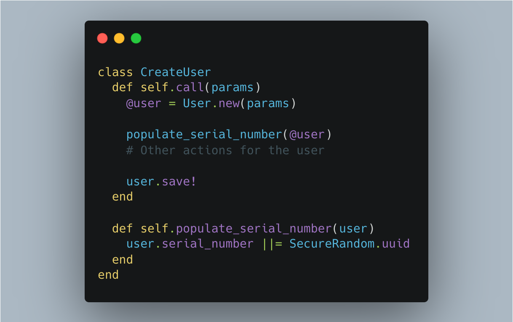

Often, programmers abuse callbacks, not fully understanding that their code will ultimately be confusing and non-obvious. There are several ways to avoid using callbacks. Today, I will tell you how to do this using services.

Let's see on a code:

```ruby
class User < ApplicationController
  def create
    @user = User.new(user_params)
    if @user.save
      redirect_to root_path, notice: "User created!"
    else   
      render :new, error: 'Failed to create user!'
    end
  end
end
class User < ApplicationRecord
  before_create :populate_serial_number
  private
  def populate_serial_number
    self.serial_number ||= SecureRandom.uuid
  end
end
```

## What is the problem with this code?

We get a non-obvious (magical) action. We do not pass any data about the serial number in the parameters or explicitly set this value anywhere. This happens automatically with a callback.

Let’s implement the same thing but using a service.

```ruby
class CreateUser
  def self.call(params)
    @user = User.new(params)
    
    populate_serial_number(@user)
    # Other actions for the user
    
    user.save!
  end
  def self.populate_serial_number(user)
    user.serial_number ||= SecureRandom.uuid
  end
end
class User < ApplicationRecord
end
class User < ApplicationController
  def create
    @user = CreateUser.call(user_params)
    if @user
      redirect_to root_path, notice: "User created!"
    else   
      render :new, error: 'Failed to create user!'
    end
  end
  def user_params
    ...
  end
end
```

## What advantages does this approach give us?

Suppose we have users that can be created from the Admin panel and through the API. Depending on the creation method, we may perform different actions on the user. It is very convenient to create two separate services for creating a user. For example: `Admin::CreateUser` and `Api::CreateUser`
- Such services are accessible to test.
- They are easy to expand.
- The code becomes much more transparent and more predictable.
