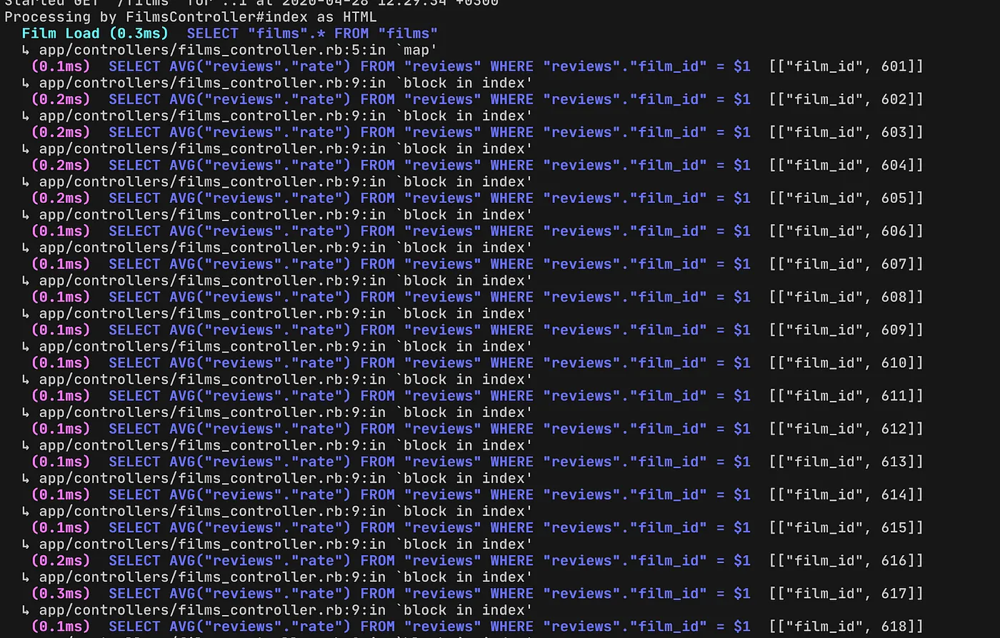

> ## Where to put the logic related to database queries optimization in a Ruby on Rails application. We want to answer this question by showing you the ‘Facade’ approach.


### Outline the problem

There is an application that stores a database of films and reviews. Every review has its own rate value.

```ruby
class Film < ApplicationRecord
  has_many :reviews
end
```

```ruby
class Review < ApplicationRecord
  belongs_to :film
end
```

We can calculate the average rate of each film,

```ruby
class Film < ApplicationRecord
  has_many :reviews

  def avg_rating
    reviews.average(:rate)
  end
end
```

and use this method in controller:

```ruby
class FilmsController < ApplicationController
  def index
    @films = serialized_films
    render json: @films
  end

  def serialized_films
    Film.all.map do |film|
      {
        title: film.title,
        genre: film.genre,
        rate: film.avg_rating
      }
    end
  end
end
```

If we need to show some films with their average ratings, this *avg_rating* method will issue an *avg* query every time it’s called, which will lead to a lot of individual queries.





### How to reduce the query to two

Let’s update the controller to get all the data in just two queries. The first request receives data for all films. The second query uses an aggregation function for receiving an average rating for each movie and stores it in a cached variable.

```ruby

class FilmsController < ApplicationController
  def index
    @films = serialized_films
    render json: @films
  end

  private

  def films_scope
    Film.all
  end

  def serialized_films
    films_scope.map do |film|
      { title: film.title, genre: film.genre, rate: films_rates[film.id] }
    end
  end

  def films_rates
    @films_rates ||= films_scope.includes(:reviews).group(:film_id).average(:rate)
  end
end
```

And now we receive data without N+1 problem:


### Where to store code for receiving data

But should we have this code in the controller? Let’s try to use the Facade pattern, and move the code to a separate *FilmCarrier* class.

```ruby
class FilmCarrier
  delegate_missing_to :@film

  def initialize(film, cached_stats: nil)
    @film = film
    @cached_ratings_stats = cached_stats || calculate_stats(film)
  end

  def avg_rating
    @cached_ratings_stats[:avg_ratings][@film.id]
  end

  def self.wrap(film_scope)
    cache = { avg_ratings: calculate_totals(film_scope) }

    film_scope.map { |film| FilmCarrier.new(film, cached_stats: cache) }
  end

  def self.calculate_totals(films)
    films.includes(:reviews).group(:film_id).average(:rate)
  end

  def calculate_stats(film)
    { avg_ratings: { film.id => film.avg_rating } }
  end
end
```

The class method *wrap *is an implementation of the [Facade](https://en.wikipedia.org/wiki/Facade_pattern) pattern. It returns an array of the *FilmCarrier *instances for each film from the scope with the instance method *avg_rating.*

And now we have clean controller:

```ruby

class FilmsController < ApplicationController
  def index
    @films = serialized_films
    render json: @films
  end

  private

  def films_scope
    Film.all
  end

  def serialized_films
    FilmCarrier.wrap(films_scope).map do |film|
      { title: film.title, genre: film.genre, rate: film.avg_rating }
    end
  end
end
```

## The pros of this way

* Ability to combine data from the different tables

* Group the related logic

* The code is easier to test

**Paul Keen** is an Open Source Contributor and a Chief Technology Officer at [JetThoughts](https://www.jetthoughts.com/). Follow him on [LinkedIn](https://www.linkedin.com/in/paul-keen/) or [GitHub](https://github.com/pftg).
>  *If you enjoyed this story, we recommend reading our [latest tech stories](https://jtway.co/latest) and [trending tech stories](https://jtway.co/trending).*
