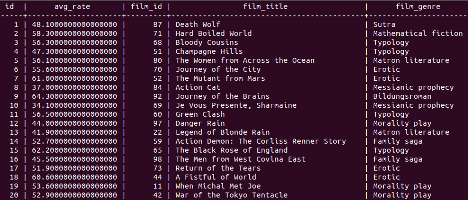
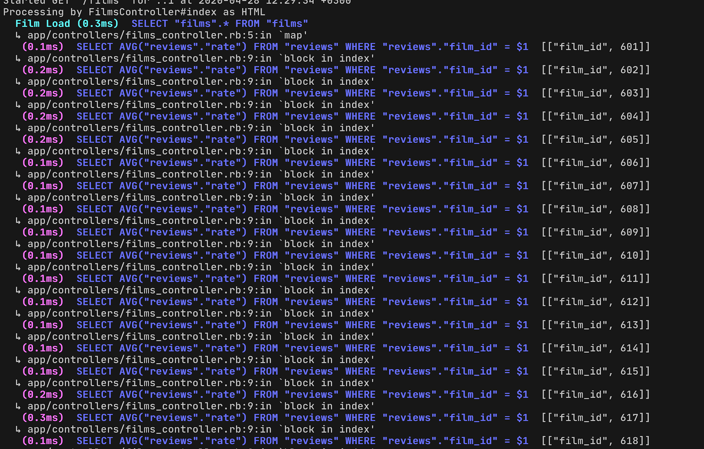

> ### Consider the way to reduce the queries when calculating the average values and find the place where to do it in the Ruby on Rails application

In [the first part](https://jtway.co/how-to-avoid-n-1-and-keep-your-ruby-on-rails-controller-clean-b8589c8c6d39), we considered the solution with extracting logic to the separate class and implementing the Facade pattern. SQL views are another way for solving the N+1 problem when finding the average value in Ruby on Rails application.

### The Problem Setup

There is a Ruby on Rails application with models *Film* and *Review*. Every *Review* has its own *rate* value.

 <iframe src="https://medium.com/media/b64ae2d8e4641a5ff543d0137ceb38e7" frameborder=0></iframe>

 <iframe src="https://medium.com/media/f63b70fd1f1dc17b7bd30daeab4afeb3" frameborder=0></iframe>

We can calculate the average rate of each film:

 <iframe src="https://medium.com/media/e331c9f7446336667bad5cd8510a4a53" frameborder=0></iframe>

But when we need to show the average rates for the batch of films:

 <iframe src="https://medium.com/media/f2e609f6da26cac8a58bafb8a246906d" frameborder=0></iframe>

it will produce a lot of individual queries:

The issue is:
> How to reduce the queries and where to do it?

### Calculate average value on the database level

Another way to reduce the number of DB queries is by utilizing SQL views. An SQL view is a searchable object in a database that is defined by a query. It has some features:

* A view doesn’t store data (Some refer to views as “virtual tables”)

* You can query a view like you can a table

* A view can combine data from two or more tables, using joins, and also just contain a subset of information

This makes them convenient to abstract, or hide, complicated queries.

Our query is looking like:

 <iframe src="https://medium.com/media/48870f241c8a5503cd4f7b82ecf1677a" frameborder=0></iframe>

Now we can hook it up to our Ruby on Rails application:

* wrap our query in a CREATE VIEW statement

* create the migration with raw SQL in it

But it’s not exactly a Rails way. There is a useful tool for dealing with the database views in Ruby on Rails.

### [*Scenic](https://github.com/scenic-views/scenic)* gem

This gem gives us the ability to define migrations that create, update, or drop SQL views, just as we’re used to doing with regular tables in Ruby on Rails. By default Scenic gem supports PostgreSQL, but there are adapters for other databases.

Run in the terminal command:

rails g scenic:view film_rating

It will generate two files *db/views/film_ratings_v01.sql*and *db/migrate/[date]_create_film_ratings.rb.*In the first one, we will place the raw SQL query. The second file will contain the migration to migrate/rollback the creation of our view.

 <iframe src="https://medium.com/media/087563711d22b960c9b141690562725f" frameborder=0></iframe>

materialized: true — makes the view materialized. The difference is that such views save the result of the query to a cached/temporary table. When you query a materialized view, you aren’t querying the source data, rather the cached result.

Now we can create the related model and interact with it as with the usual Ruby on Rails model.

 <iframe src="https://medium.com/media/868034e75d4ca408c81ccb83cec47b48" frameborder=0></iframe>

As soon as materialized views cache the underlying query’s result to a temporary table we have to control when the cache is refreshed. A *refresh* method can be called at any time to update the data.

Now, we will deal with the *FilmRating*in the controller

 <iframe src="https://medium.com/media/cc8d127c8d1de39a324300fb4cfab2ea" frameborder=0></iframe>

the query for getting average rates of all films will look like:

### The pros of this way

* Convenience (all features of Active Record are available).

* Easy to test.

* Performance, all heavy lifting is done by the Database.

* Aggregation values are precalculated in a case when the materialized view is used.

### The cons of this way

* Control when the cache needs to be refreshed

**Sergey Sviridov** is a Software Engineer at [JetThoughts](https://www.jetthoughts.com/). Follow him on [LinkedIn](https://www.linkedin.com/in/sergey-sviridov-83007199) or [GitHub](https://github.com/SviridovSV).
> *If you enjoyed this story, we recommend reading our [latest tech stories](https://jtway.co/latest) and [trending tech stories](https://jtway.co/trending).*
