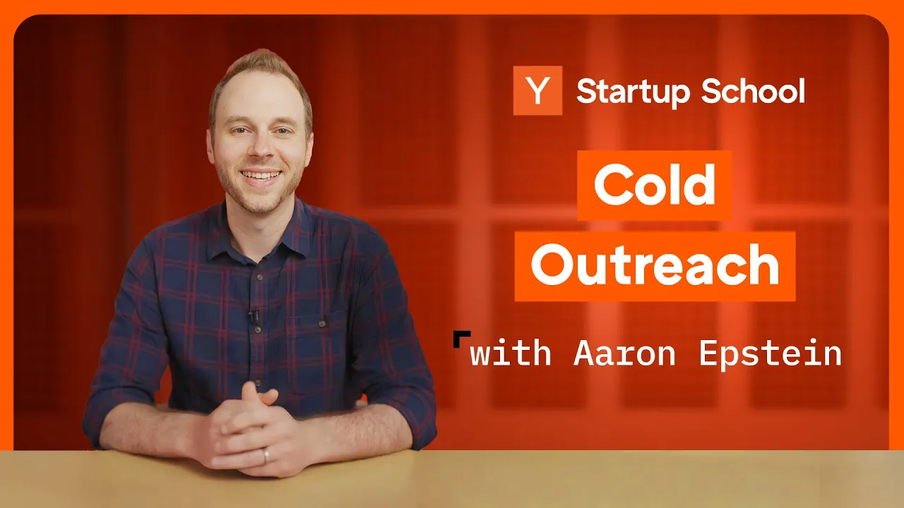

In the world of startups, cold emailing can be a game changer. Whether you're looking to boost sales, recruit talent, or forge new partnerships, knowing how to craft effective cold emails is essential. In this article, we’ll explore key strategies shared by YC Group Partner Aaron Epstein on how to write cold emails that not only get opened but also convert leads into customers.

### Key Takeaways

*   **Warm Introductions Are Key**: Aim for a warm intro whenever possible.
*   **Map Your Funnel**: Understand your conversion rates and work backward from your goal.
*   **Targeting Matters**: Better targeting leads to higher open rates.
*   **Personalization Is Essential**: Make your emails feel personal and relevant.
*   **Follow Up**: Persistence can pay off, but be mindful of not being annoying.

### The Power Of Warm Introductions

The best way to get someone to respond to your cold email? **Get a warm introduction.** This method can increase your response rate significantly—by two to three times! To find warm intros, leverage your network. Check LinkedIn for connections, reach out to friends, or tap into alumni networks. If you can’t get a warm intro, don’t worry; you can still succeed with cold emails.

### Mapping Your Funnel

Before you start sending emails, it’s crucial to **map out your conversion funnel**. Start with your end goal. For instance, if your goal is to acquire one new customer, work backward to determine how many emails you need to send. Here’s a simplified example:

1.  **Goal**: 1 new customer.
2.  **Conversion Rate**: If your demo-to-customer conversion rate is 10%, you need to give 10 demos to get 1 customer.
3.  **Responses Needed**: If 25% of people who respond to your email sign up for a demo, you need 40 responses to get 10 demos.
4.  **Email Opens**: If 10% of people who open your email respond, you need 400 opens.
5.  **Emails Sent**: If 50% of your emails are opened, you need to send 800 emails to get 1 customer.

This means you should be sending dozens of emails daily to see meaningful results. Start by writing these emails manually to learn what works before automating the process.

### Increasing Open Rates

To boost your open rates, focus on **better targeting**. Sending 100 targeted emails is far more effective than blasting out 1,000 untargeted ones. Here are some tips:

*   Use your personal name in the sender field.
*   Keep subject lines short and relevant.
*   Avoid overly salesy language.

### Writing Effective Cold Emails

Once your email is opened, the content matters. Here are **seven principles** to guide your email writing:

1.  **Have a Specific Goal**: Focus on one clear outcome you want from the email.
2.  **Be Human**: Use a conversational tone and express emotions.
3.  **Personalize**: Make your emails feel tailored to the recipient.
4.  **Keep It Short**: Avoid long paragraphs; make it easy to read.
5.  **Establish Credibility**: Mention relevant experiences or connections.
6.  **Focus on the Reader**: Frame your email around their needs, not yours.
7.  **Clear Call to Action**: End with a specific next step for the recipient.

### The Importance Of Follow-Ups

One email often isn’t enough. People are busy, and your email might get lost in their inbox. Plan to follow up two to four times, but space out your emails to avoid being annoying. Get creative with your follow-ups—sometimes a fun subject line can grab attention.

### Examples Of Good And Bad Emails

To illustrate the principles discussed, let’s look at some examples:

*   **Ineffective Email**: A generic email that lacks personalization and clarity.
*   **Effective Email**: A personalized message that references a shared experience or interest, making it feel special.

### Final Thoughts

Cold emailing can be a powerful tool for startups. By focusing on personalization, persistence, and understanding your conversion funnel, you can turn cold emails into valuable customer relationships. Remember, the goal is to be human, be persistent, and do the work. With these strategies, you’ll be well on your way to converting cold leads into loyal customers.
