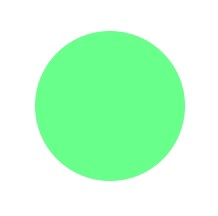
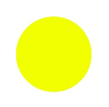

Let's look at a few tricks in CSS able to create basic shapes like circles.
```html
<div class="circle"></div>
```

## Border-Radius
For this case need to use the border-radius property and set the value to 50%. Then combine the height and width properties with a matching value.
```css
.circle {
  width: 100px;
  height: 100px;
  border-radius: 50%;
  background: lightgreen;
}
```


## Circle()
In this, the circle is created using the shape-outside property. You must also apply a clip-path with the appropriate property to make the circle appear.
```css
.circle {
  width: 100px;
  height: 100px;
  clip-path: circle();
  shape-outside: circle();
  background: yellow; 
}
```

  