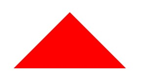
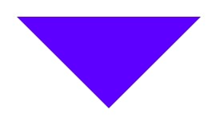
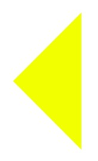
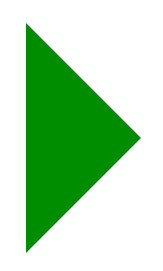

In this post, we are going to see a simple method to draw a triangle in CSS using borders.

```html
<div class="triangle-up"></div>
<div class="triangle-down"></div>
<div class="triangle-left"></div>
<div class="triangle-right"></div>
```

## Triangle Up

Triangle is one of the simplest shapes in geometry. It can be drawn with just three straight lines and a couple of angles.

1. Set a width and height of 0.
2. Set the border color to transparent.
3. Set the top border to 0.
4. Set the side borders to half the width.
5. Set the bottom border to have the full height.
6. Set a color for the bottom border.

```css
.triangle-up {
  width: 0; 
  height: 0; 
  border-left: 15px solid transparent;
  border-right: 15px solid transparent; 
  border-bottom: 15px solid red;
}
```



## Triangle Down

```css
.triangle-down {
  width: 0; 
  height: 0; 
  border-left: 15px solid transparent;
  border-right: 15px solid transparent;
  border-top: 15px solid blue;
}
```



## Triangle Left

```css
.triangle-left {
  width: 0; 
  height: 0; 
  border-top: 15px solid transparent;
  border-bottom: 15px solid transparent; 
  border-right: 15px solid yellow; 
}
```



## Triangle Right

```css
.triangle-right {
  width: 0; 
  height: 0; 
  border-top: 15px solid transparent;
  border-bottom: 15px solid transparent;
  border-left: 15px solid green;
}
```



If you took over a project where the CSS is full of manual shape tricks instead of an icon library or SVGs, that complexity adds up fast. Our [code quality evaluation guide](/blog/code-quality-evaluation-non-technical-founders/) helps you ask the right questions about decisions like these.

If you're using Tailwind, see our dedicated guide on [Tailwind CSS triangles](/blog/how-create-triangles-in-tailwindcss-html-css/). For layout help, check [vertical centering with Tailwind](/blog/vertical-align-with-full-screen-across-tailwind-css-jetthoughts/).
