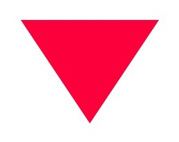
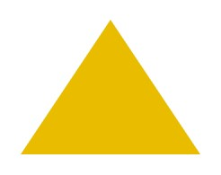

In this post, we are going to see four examples of how to draw a triangle in TailwindCSS using borders.

## Triangle Down

Triangle is one of the simplest shapes in geometry. You can draw it with three straight lines and a couple of angles.

1. Set a width and height of 0 by: `w-0` and `h-0`
2. Set the top border to have the full height and color by: `border-t-[75px] border-t-red-500`
3. Set the side borders to half the width with the color transparent by: `border-l-[50px] border-l-transparent` and `border-r-[50px] border-r-transparent`

```html
<div class="w-0 h-0 
  border-l-[50px] border-l-transparent
  border-t-[75px] border-t-red-500
  border-r-[50px] border-r-transparent">
</div>
```



## Triangle Left

```html
<div class="w-0 h-0 
  border-t-[50px] border-t-transparent
  border-r-[75px] border-r-blue-500
  border-b-[50px] border-b-transparent">
</div>
```


## Triangle Up

```html
<div class="w-0 h-0 
  border-l-[50px] border-l-transparent
  border-b-[75px] border-b-yellow-500
  border-r-[50px] border-r-transparent">
</div>
```



## Triangle Right

```html
<div class="w-0 h-0 
  border-t-[50px] border-t-transparent
  border-l-[75px] border-l-green-500
  border-b-[50px] border-b-transparent">
</div>
```


In this post, we showed examples of a simple equilateral triangle. If you need a triangle with different sides, you can play with the width of the border `[*px]`.
