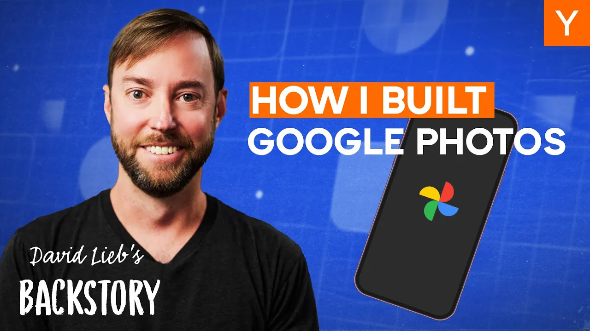

In a world where tech startups rise and fall, David Lieb's journey stands out. He co-founded Bump, an app that allowed users to share photos and contact info by bumping their phones together. Despite initial success, the app struggled to find a sustainable business model. However, Lieb's perseverance led him to pivot and ultimately create Google Photos, a product that has changed how we store and share memories.

### Key Takeaways

*   **Commitment is Key**: Success rarely follows a straight path.
*   **Listen to Your Users**: Understanding user needs can lead to better products.
*   **Embrace Failure**: Mistakes are part of the journey.
*   **Stay Agile**: Be ready to pivot when necessary.

### The Early Days

David Lieb grew up in a suburb of Dallas, Texas. He was always into math and science, thanks to his engineer dad and teacher mom. After excelling in school, he went to Princeton, where he majored in electrical engineering and computer science. He then pursued a PhD in artificial intelligence at Stanford but soon realized academia wasn’t for him.

After dropping out, he took a job at Texas Instruments. It was there that he saw two young entrepreneurs sell YouTube for a billion dollars. This moment sparked a thought: if they could do it, why couldn’t he?

### The Birth of Bump

While pursuing an MBA at the University of Chicago, Lieb had a lightbulb moment. During a class, he noticed how cumbersome it was to exchange contact information. Why not just bump phones together? This idea led to the creation of Bump.

Lieb and his friend Andy worked on the app during nights and weekends. They submitted it to the App Store, and it quickly gained traction. Within days, it went from tens of downloads to thousands. Word of mouth was powerful, and Bump became a sensation.

### The Rollercoaster Ride

Despite its popularity, Bump faced challenges. Users didn’t keep coming back. Lieb realized they were in the low-frequency, low-value box. They had no solid plan for monetization and made classic startup mistakes, like hiring too quickly and raising too much money too soon.

After burning through millions, Lieb decided to talk to users. He reached out to the top 100 users and learned they primarily used Bump to share photos, not contacts. This insight led to the development of a new app called Flock, aimed at improving photo sharing.

### The Pivot to Google Photos

Unfortunately, Flock didn’t take off either. With dwindling funds, Lieb sought advice from Paul Graham at Y Combinator. Graham suggested they aim higher: replace the iPhone’s photos app. Initially, Lieb thought it was a crazy idea, but the more he considered it, the more it made sense.

They built a prototype called Photo Roll, but it never launched. Instead, they focused on selling Bump. Eventually, Google showed interest, and Lieb’s team was acquired. The plan was to develop Photo Roll into Google Photos.

### Building Google Photos

Upon joining Google, Lieb faced unexpected challenges. The company had shifted focus to Google+, and Lieb was told to abandon his project. But he believed in Google Photos and continued to work on it in secret.

With support from his team, they eventually got the green light to build Google Photos. In just nine months, they launched the product, which quickly became a hit. Within four years, it amassed over a billion users, making it one of the fastest-growing products ever.

### A Personal Challenge

Just as things were going well, Lieb faced a personal crisis. He was diagnosed with leukemia. The experience was harrowing, but it changed his perspective on life. During his treatment, he found solace in looking at photos of his family on Google Photos.

After a tough year of treatment, he realized he wanted to spend his life differently. He left Google in 2022 to join Y Combinator, where he could work closely with new founders and help them avoid the mistakes he made.

### Conclusion

David Lieb’s journey is a testament to resilience. From the highs of Bump to the lows of failure, he learned valuable lessons that shaped his career. Now, as a mentor, he aims to guide the next generation of entrepreneurs. His story reminds us that success is not just about the destination but the journey and the lessons learned along the way.
