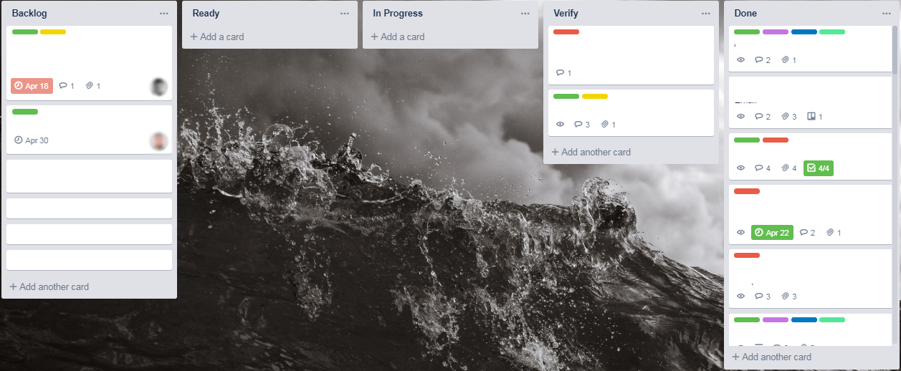

## How does the onboarding look like in JetThoughts?

*This is an [onboarding checklist](https://jtway.co/effective-project-onboarding-checklist-87b95fce256b) replication built relying on my own experience in [**JetThoughts](https://www.jetthoughts.com/)**. We created our process, which could be less stressful and more enjoyable at the same time.*

*If you follow these onboarding strategies thoroughly, you will grow both successful and happy employees. Here’s the [article](https://jtway.co/effective-project-onboarding-checklist-87b95fce256b) which I was relying on.*

 on [Unsplash](https://unsplash.com/search/photos/helping-hand?utm_source=unsplash&utm_medium=referral&utm_content=creditCopyText)](file_0.jpeg)

## Who is this ‘Buddy’ and which qualities should he have?

When I started working, [*JetThoughts](http://jetthoughts.com)*introduced*Buddy *to assist me.

*Buddy* is a helping person. It’s about supporting another person’s learning through a one-to-one relationship. It’s a practice for transferring knowledge and promoting the best practices at work.

*Buddy* is responsible for introducing the employee to the rest of the team. The *Buddy* could arrange a tour on the project and serve as a resource for any of the newcomers’ questions. Also, he ought to explain mistakes, reduce any misunderstanding, etc.

 on [Unsplash](https://unsplash.com/search/photos/friend?utm_source=unsplash&utm_medium=referral&utm_content=creditCopyText)](file_1.jpeg)

## Clarify ‘who-does-what’ questions

*Buddy* plays a big part in your onboarding. For the first time, he/she explains everything you’re working on, gives you some tasks, checks how your job is done.

### Which channel(s) is better to use?

[Trello](http://www.trello.com/‎) is a collaboration tool that gives you a visual overview of what is being worked on, who is working on it, and how far they’ve gotten. [Trello](http://www.trello.com/‎) is based on the Kanban system of project and task management. It uses boards, lists, and cards to create a more straightforward visual system of project management. These three essential elements provide a visual layout of your work for high-level decision-making.

[Discord](https://discordapp.com/) is a proprietary freeware VoIP application that specializes in the text, image, video and audio communication between users in a chat channel. The [**JetThoughts](https://www.jetthoughts.com/)**’ members use [Discord](https://discordapp.com/) for all kinds of communication (calls, screen sharing, chatting) every day.

### How and who creates task lists and assigns tasks?

Usually, PM (the project manager) sets the goals and *Buddy* splits these goals up into smaller tasks during the onboarding process. Then, you will split these goals by yourself and discuss them together within a team.

### What is better to use for the task verification?

[Trello](http://www.trello.com/‎). Go to the dashboard. Open the right card. All created tasks should be in the column called *Backlog*.

When you discuss the tasks in a team, you can move the proper cards into the column called *Ready*. Then, when you start working on a task, you can move it to the column called *In Progress*.

When the task is done, you should move it to column *Verify* and be waiting for a review. If everything is correct, PM moves it to the column *Done*, if no, he/she explains to you, what’s the problem and you revise and redo the task.

*Remember*: There should be no more than two cards *In Progress*and no more than three cards in *Verify* at the same time!

*Rule*: By default, the task shouldn’t take more than 1.5 days. If you don’t succeed in achieving this, you should designate it as a problem, write the status of what has been done at the moment and what decisions have been made and choose a solution: split task, continue for some more time or cancel the task execution.

### How does the completed job look like?

The tasks are very different; that’s why the completed job can look different. You should write all of the details about the task on the card. By doing that, all the information will be clear for everyone reading it.

It should be as descriptive as you can get it. For approval, you need a third person in a team who gives his/her opinion about it. The completed task goes to the *Done* column.

## What about the working schedule?

The work is asynchronous at [**JetThoughts](https://www.jetthoughts.com/)**, so that’s why people should be informed about the schedule of each other. Everyone chooses the working hours and works in the most suitable time for themselves.

 on [Unsplash](https://unsplash.com/search/photos/laptop?utm_source=unsplash&utm_medium=referral&utm_content=creditCopyText)](file_3.jpeg)

### How much time and which tools are better to use for meetings?

Meetings are typically held the same time each day. Ideally, a daily meeting is held in the morning, as it helps set the tasks for the working day. Usually, it takes 15- 30 min every day. Discord is an excellent variant for such kind of communication.

### Stand-Ups

When you work remotely, you want to have some kind of a standup meeting regularly. In our team, we settled with text-based, asynchronous standups every day. Stand up should be held every day in the morning. Everyone should write their goals for a day, as well as what he/she did the day before.

Good luck with growing out your teams and successfully onboarding your new employees. It may require a bit of trial and error to nail down the best process for your organization, but it is time and effort well spent to make sure you set the right tone with new employees.

**Ruslana** is a Lead Generation Manager at [JetThoughts](https://www.jetthoughts.com/). Follow her on [LinkedIn](https://www.linkedin.com/in/ruslana-brykaliuk-970016135/).
> *If you enjoyed this story, we recommend reading our [latest tech stories](https://jtway.co/latest) and [trending tech stories](https://jtway.co/trending).*
