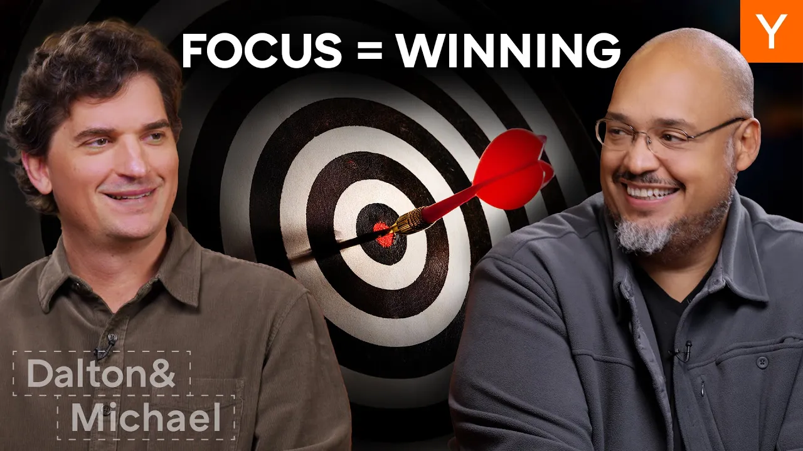

When it comes to building a successful startup, focus is critical. But how do you know if you’re spending time on the right things? In this episode, Dalton and Michael share advice for how to break through the noise and zero in on solving the problems that matter most for your business.

### Key Takeaways

*   Focus is essential for success in startups.
*   Complexity can distract from what really matters.
*   Founders have unique superpowers that can drive results.
*   Regular reflection and prioritization are key to maintaining focus.

### The Importance Of Focus

Focus is the name of the game in the startup world. Founders often get pulled in many directions. They might feel pressure to juggle multiple tasks, but the truth is, **success comes from focusing on a few key areas**. When things go wrong, it’s often because the focus was misplaced.

Think back to school. Remember how homework felt like a mountain? You’d come up with every excuse to avoid it. But the moment you sat down and focused, it got done. The same principle applies to startups. You can’t tackle everything at once. You need to zero in on what truly matters.

### Complexity Vs. Simplicity

It’s funny how many people think that complexity equals success. You see big names like Warren Buffett and Jeff Bezos thrive on simple strategies. Yet, many startups fall into the trap of overcomplicating things. They think having multiple products or features is the way to win. But often, it’s the opposite.

*   **Simplicity is powerful.** Focus on what works and do it well.
*   **Audit your time.** Are you really focused, or just busy?

### The Founder’s Superpower

Founders have a unique ability to drive their companies forward. They can achieve what takes others much longer. But here’s the catch: they can’t do everything. They need to choose where to focus their energy.

For example, some founders excel in sales. They can close deals that would take a team of salespeople to achieve. This is because they connect with decision-makers directly. When a founder focuses on sales, they can often produce results that seem impossible.

### The Danger Of Distraction

As companies grow, distractions multiply. Founders might feel the need to take credit for everything. This can lead to a dilution of focus. Instead of honing in on a few key initiatives, they might try to juggle too many. This is where things can go wrong.

*   **Identify your top priorities.** What are the three things that will move the needle?
*   **Avoid the shiny object syndrome.** Just because something seems important doesn’t mean it is.

### Personas Of Focus

Let’s look at a couple of personas to illustrate focus in action:

1.  **The Aspiring Founder**: They want to start a business but get lost in ideas. They need to ask themselves:
2.  **The YC Alum**: They’ve been through the program and had success. But now they’re overwhelmed with options. They need to remember what worked during their batch and stick to it.

### Reflection And Year-End Changes

As the year wraps up, it’s a great time to reflect. Founders should take a step back and think about their goals. What worked? What didn’t? This is the time to **audit your focus**. Get rid of what isn’t important.

*   **Set clear goals.** What do you want to achieve this year?
*   **Give yourself permission to let go.** It’s okay to not do everything.

### The Power Is In Your Hands

The beauty of focus is that it’s entirely in the founder’s control. There’s no authority figure telling you what to do. You can choose to focus on what matters. When you do, you inspire others to do the same.

In conclusion, focus is winning. It’s about clarity and simplicity. When you know what you’re doing and why, everything else falls into place. So, take a moment, breathe, and get back to what really matters. Good luck!
