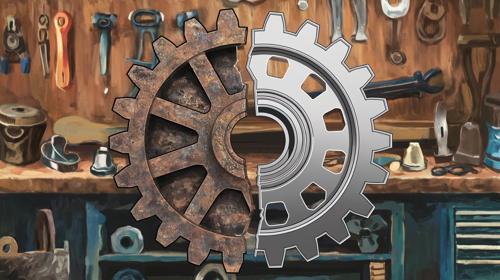
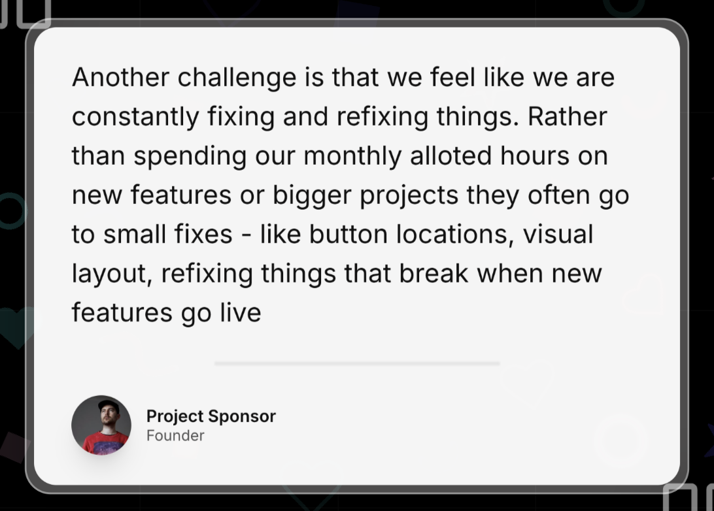
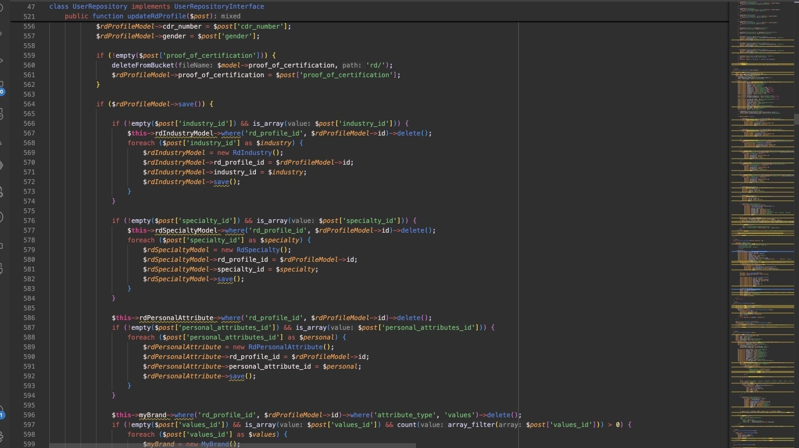

**Are bugs pushing your customers away?**

Maybe your app breaks at the worst times. Maybe its design confuses users. These problems aren't rare. They're probably hurting your business more than you think.

Here's a story about a company in that exact spot. They were losing clients left and right. Bugs piled up. The vendor they trusted wasn't delivering. The owner wasn't technical and felt lost. We stepped in as a fractional CTO, found the real issues, and turned things around. Here's what happened.

---

### The Chaos: No System, Bad Vendor

The company had no system in place. Their vendor's development was a mess. Reactive, not proactive. Code went live without proper testing. Bugs got fixed only after causing real damage. That's not sustainable.

We started by mapping out who was involved. It became clear where things were breaking down. The project manager missed the client's problems. There was zero coordination. No discovery sessions. No engagement with stakeholders. Everyone worked in the dark.

Surprisingly, the most effective person on the client's side was a customer support rep. We suggested cutting the project manager, QA, and status update roles. They weren't just unnecessary—they were creating confusion and wasting time.

---

### The Real Gaps

Communication with the vendor was the biggest gap. The client didn't know the technical details. The project manager assumed the vendor was testing the app, but there was no formal testing at all. Neither side knew how to collaborate effectively.

Our deep dive showed a lack of experience across the board. The team wasn't equipped to work together. This made the app's problems even worse.

Without proper processes or documentation, the vendor couldn't keep up. They were always putting out fires. The app's code was fragile due to poor quality and lack of testing. Clients were fed up. Many had already left.

At its worst, the app's uptime dropped to 80%. Downtime and bugs led to a 15% revenue loss from client churn and complaints.

---

### The Fix: Stepping In as Fractional CTO

We needed quick changes. The vendor had to go. We brought in a new full-stack developer. Someone skilled in Test-Driven Development (TDD) and Continuous Integration/Continuous Deployment (CI/CD). These practices catch bugs early.

Take the login bug, for example. It lingered for weeks before. The new developer fixed it in two days. They wrote automated tests to ensure login issues wouldn't reach users again.

We also cut the project manager, QA, and status update roles. They added more problems than they solved. The customer support rep moved into a product management role. They were the best at keeping communication clear.

In three months, app stability jumped by 35%. Client complaints dropped by half.

---

### The Outcome: A Reliable Product and Happy Clients

After the changes, the app stabilized. Bugs went down by 40%. Client complaints halved. Uptime improved from 80% to 95% in a few months. Frustrated clients began to trust the product again.

With clear communication and a solid process, the new team could focus on delivering value. The app became something clients could rely on.

The company won back 15% of lost clients. User engagement rose by 30% as new features rolled out smoothly.

---

### What You Can Learn as a Non-Technical Founder

#### Don't Wait for Problems to Pile Up

Fixing bugs after they hurt you is a losing game. Even if you're not technical, you need the right processes.

Invest in tools like CI/CD pipelines and testing protocols. They prevent costly mistakes and keep clients from leaving. If you don't know how to set this up, hire someone who does.

#### Choose the Right People

Your team makes all the difference. You need developers who understand TDD, CI/CD, and clear communication. A **fractional CTO** can guide you here. They help you vet vendors and build a solid development team. It's often cheaper and more effective than hiring a full-time CTO.

---

### Moving Forward

Making smart changes now saves you headaches later. If you're feeling lost, it's not too late. Even if clients have left, a structured approach can win them back.

We restructured the team. Cut out roles that added confusion. A **fractional CTO** can guide your team, set up suitable systems, and make your product reliable.

**Don't wait for more clients to leave.** [Reach out today](https://jetthoughts.com/contact-us/). Let's strengthen your development team and make your product something clients can trust. A fractional CTO gives you the technical support you need—without the full-time cost.

---

This case shows that the right strategies—like breaking down silos and improving collaboration—can stabilize your product and rebuild client trust. Facing similar issues? Get in touch. We can help you turn things around.