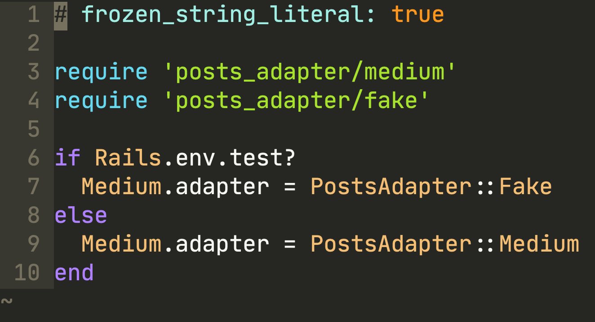

> ### Do you have difficulties in adding the new tests and their readability decreased due to mocks and stubs? Let’s try to get rid of external requests in tests.



The main idea is to override implementation dynamically during the call of external service. In other words, to use different sources for receiving data for different environments. Suppose for production environments, you get the data from a third-party server, and for a test environment, the source can simply return an object of the desired format.

### Bridge Pattern: class with abstraction

First of all, we separate responsibilities in different classes. According to the *Bridge pattern*, it needs to decouple an abstraction from its implementation.

Here we implement the abstraction with the external service call, and here we will introduce the dependency:

```ruby
class Medium
  cattr_accessor :source
  
  def initialize(name = nil)
    @client = source.new(name)
  end
  
  def posts
    @client.user_posts
  end
end
```

cattr_accessor: source allows us to determine which class will participate in the loading of posts.

### Bridge Pattern: the Implementators

We need to have implementations: one for the real external service call, another will be called in tests.

Call to real API will look like:

```ruby
module PostsSource
  class Remote
    def initialize(username)
      @client = MediumAPI.new(username)
    end
    
    def user_posts
      @client.posts
    end
  end
end
```

And the fake implementation:

 ```ruby
module PostsSource
  class Fake
    def initialize(username)
      @client = OpenStruct.new(
        posts: [
          {
            title: 'Signal v Noise exits Medium[Fake source]',
            ...
          }
        ]
      )
    end
    
    def user_posts
      @client.posts
    end
  end
end
```

**Note**: All source implementations must have the same interface.

### How does it work

When we need to use the external service:

```ruby
posts = Medium.new('dhh')
posts.source = PostsSource::Remote
posts.user_posts
```

To use Fake implementation:

```ruby
posts = Medium.new
posts.source = PostsSource::Fake
posts.user_posts
```

### Settings for various environments

According to Ruby on Rails way, the settings for various environments need to be placed in the initializer.

First, let’s set the default value for the source:

```ruby
class Medium
  cattr_accessor :source
  self.source = PostsSource::Remote
  …
end
```

For the convenience of testing the code associated with the Medium class, you can make a separate class that will manage the source attribute.

```ruby
require 'posts_source/fake'

class Medium::Testing
  def self.fake!
    Medium.source = PostsSource::Fake
  end
end
```

Now in the *initializers* folder, let’s create the file with necessary configurations:

```ruby
# frozen_string_literal: true

require 'posts_source/remote'
require 'medium/testing'

Medium::Testing.fake! if Rails.env.test?
```

In this way `PostsSource::Fake will` be used for the test environment and `PostsSource::Medium` the other environment.

### Benefits received

The real response still needs to be tested, and most likely, it will be stubbed. But dependency injection allows decreasing the number of stubbing usages in the tests.

**Paul Keen** is an Open Source Contributor and a Chief Technology Officer at [JetThoughts](https://www.jetthoughts.com). Follow him on [LinkedIn](https://www.linkedin.com/in/paul-keen/) or [GitHub](https://github.com/pftg).
>  *If you enjoyed this story, we recommend reading our [latest tech stories](https://jtway.co/latest) and [trending tech stories](https://jtway.co/trending).*
