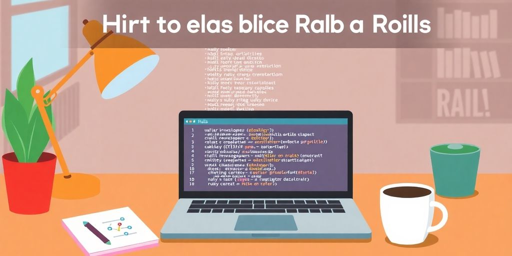

Hiring a Ruby on Rails developer can feel overwhelming, especially with so many options out there. You want someone who not only understands the framework but also fits well with your project needs and team culture. This guide will walk you through the essential steps to find the right developer, from understanding what Ruby on Rails is all about to crafting an effective job description and conducting interviews. Let’s get started!

### Key Takeaways

*   Clearly define your project requirements before starting the hiring process.
*   Craft a job description that highlights key skills and uses relevant keywords.
*   Explore various platforms to find Ruby on Rails developers, including freelance sites and networking events.
*   During interviews, focus on both technical skills and cultural fit to ensure a good match.
*   Avoid common pitfalls like skipping reference checks and solely focusing on cost.

## Understanding Ruby On Rails Development

### What Makes Ruby On Rails Special?

So, you're thinking about using Ruby on Rails? Smart move! It's not just another _framework_; it's a way to build web apps quickly and efficiently. Think of it as a set of tools that make web development less of a headache.

*   It is popular among developers.
*   It is flexible for different project needs.
*   It helps maintain code quality.

> Rails follows the "convention over configuration" philosophy. This means it makes assumptions about how you want to do things, reducing the amount of code you need to write. Less code, fewer bugs, right?

### Common Use Cases for Ruby On Rails

Rails isn't a one-trick pony. It's used for all sorts of web applications. Need an e-commerce site? Rails can handle it. Building a social network? Rails has your back. Want a content management system? You guessed it, Rails is a solid choice. It's like the Swiss Army knife of web development. Many companies use [RoR syntax](https://jetthoughts.com/blog/tags/hiring/) for their projects.

### Benefits of Using Ruby On Rails for Your Project

Why pick Rails over other options? Well, for starters, it can save you time and money. **Rails promotes rapid development**, so you can get your project off the ground faster. Plus, it has a huge community of developers who can offer support and resources. And let's not forget the built-in security features. Nobody wants a website full of holes, right?

| Benefit | Description |
| --- | --- |
| Speed | Faster development cycles mean quicker time to market. |
| Community | A large and active community provides support and resources. |
| Security | Built-in features help protect your application from common vulnerabilities. |

## Defining Your Project Needs

Before you even think about posting a job, you need to figure out what you _actually_ need. It's like trying to bake a cake without a recipe. You might end up with something... but will it be good? Probably not. Let's nail down those project needs.

### Identifying Key Skills Required

What skills does your dream Rails developer have? Are you looking for someone who can build a whole app from scratch, or do you need someone to maintain existing code? Maybe you need a front-end whiz who also knows Rails. List out the _specific_ skills. Don't just say "Rails experience." Think about things like:

*   Specific gems (Devise, CanCanCan, etc.)
*   Front-end frameworks (React, Vue, etc.)
*   Database experience (PostgreSQL, MySQL, etc.)
*   Testing frameworks (RSpec, Capybara, etc.)

Knowing the [key skills required](https://www.fullstack.com/labs/resources/blog/ruby-on-rails-developer-hiring-guide) will save you time and headaches later.

### Setting Clear Project Goals

What are you trying to achieve? This seems obvious, but it's easy to overlook. "Build an app" isn't a goal. "Increase user engagement by 20% in Q3" is a goal. Make sure your goals are SMART (Specific, Measurable, Achievable, Relevant, Time-bound). This helps you measure success and keeps everyone on the same page. Establish clear project requirements to avoid scope creep.

### Determining Your Budget

Let's talk money. How much are you willing to spend? Be realistic. Good Rails developers aren't cheap, but you also don't want to overpay. Consider these factors:

*   Developer experience level
*   Project complexity
*   Location (rates vary widely)
*   Timeline (rush jobs cost more)

> Remember, you often get what you pay for. Skimping on budget might mean sacrificing quality or experience. It's a balancing act, but knowing your budget upfront is essential. Don't forget to factor in potential maintenance costs down the line. A well-defined budget helps you find the right talent without breaking the bank.

## Crafting the Perfect Job Description

Okay, so you need a Ruby on Rails developer. Awesome! But before you start posting everywhere, let's talk about the job description. This is your first impression, so make it count. A good job description will attract the right people and save you time. Think of it as your sales pitch. You are selling the job to the _perfect_ candidate.

### Highlighting Essential Skills

First, list the skills you need. Be specific. Don't just say "Ruby on Rails." What version? Do you need experience with specific gems? What about front-end skills like JavaScript or React? Be clear about what's a must-have and what's a nice-to-have. This helps candidates self-select. If they don't have the _core skills_, they probably won't apply.

### Using the Right Keywords

Keywords are super important. They help candidates find your job posting. Think about what people search for when they're looking for a Ruby on Rails job. Use those words in your description. Obvious ones are "Ruby on Rails," "RoR," "Ruby developer," and "web development." But also include things like "RESTful APIs," "PostgreSQL," or "AWS," if those are relevant. **Keywords boost visibility.**

### Making It Attractive to Candidates

Now, make the job sound appealing. What's cool about working at your company? What kind of projects will they be working on? What are the benefits? Do you offer flexible hours or remote work? Do you have a fun company culture? Sell the dream! No one wants a boring job. Be honest, but put your best foot forward. Also, clearly outline the steps candidates should follow to apply for the position. Include information on submitting their resumes, cover letters, and any [coding tests](https://jetthoughts.com/blog/tags/beginners/) or exercises you require as part of the application process.

> A well-written job description is more than just a list of requirements. It's a chance to show candidates what it's like to work at your company and why they should be excited about the opportunity. It sets the tone for the entire hiring process.

## Where to Find Ruby On Rails Developers

So, you need a Ruby on Rails developer? Cool. Let's talk about where these coding wizards hang out. Finding the right person is key. It's like finding the perfect ingredient for your project's recipe. You want it to be just right.

### Exploring Freelance Platforms

Freelance platforms are a solid starting point. Think of sites like Upwork, Toptal, and Fiverr. These places are full of developers with different skill levels and rates. You can post your project and see who bites. Just be ready to sift through a lot of profiles. **Make sure to check their past work and reviews.** It's like online shopping, but for talent. You can find some real gems, but also some duds.

*   Upwork: Good for various skill levels.
*   Toptal: Known for top-tier talent, but pricier.
*   Fiverr: Can find affordable options for smaller tasks.

### Networking in Developer Communities

Don't underestimate the power of community. _Developer communities_ are goldmines. Check out sites like Stack Overflow, Reddit (r/ruby, r/rails), and specialized forums. These are places where developers ask questions, share knowledge, and sometimes, look for work. Get involved, ask around, and see who's looking for a project. It's like going to a tech conference, but without the bad coffee.

*   Stack Overflow: Great for finding developers active in the community.
*   Reddit: Subreddits dedicated to Ruby and Rails.
*   Local Meetups: Attend local tech events to meet developers in person.

### Considering Remote Talent

Think beyond your backyard. Remote developers can be a game-changer. You can tap into a global talent pool and often find skilled developers at competitive rates. Sites like [Indeed for remote positions](https://jetthoughts.com/blog/how-effectively-hire-ruby-developers-for-your-next-project/) and remote-specific job boards are your friends. Plus, many developers prefer the flexibility of remote work, so you might attract some top talent. It's like having an international team without the hassle of visas.

> Hiring remote developers can save you money. Developers in Eastern Europe or Latin America often charge less than those in the US or Western Europe. This doesn't mean lower quality. Many of these developers are highly skilled and experienced.

*   Wider talent pool.
*   Potentially lower costs.
*   Access to diverse skill sets.

## Interviewing Like a Pro

So, you've got a shortlist of Ruby on Rails developers. Now comes the fun part: figuring out who's _actually_ the right fit. It's more than just lines of code; it's about problem-solving, teamwork, and whether they'll vibe with your company culture. Let's get into how to conduct interviews that reveal the real deal.

### Asking the Right Questions

Forget the generic interview questions. You want to dig deep. Ask about past projects, challenges they faced, and how they overcame them. Get them to explain their thought process. Here are some questions to consider:

*   What are your biggest motivators as a professional?
*   Describe a time you disagreed with a colleague. How did you resolve it?
*   What are some advantages of using Ruby and Rails over another framework?

**The goal is to understand how they think and approach problems.** Don't just listen to the answers; listen for the _why_ behind them.

### Evaluating Technical Skills

Okay, time to put their _coding_ chops to the test. You can do this in a few ways:

*   **Coding Challenges:** Give them a small coding task to complete during the interview. Nothing too crazy, just something to see how they write code under pressure.
*   **Technical Questions:** Ask about Ruby on Rails best practices, design patterns, and common security vulnerabilities. See if they can explain complex concepts clearly.
*   **Code Review:** Have them walk you through a piece of code they've written. Ask them to explain their choices and how they would improve it.

> Remember, you're not just looking for the right answer. You're looking for someone who can explain their reasoning and think critically.

### Assessing Cultural Fit

Technical skills are important, but cultural fit is crucial. You want someone who will get along with your team and contribute positively to your company culture. Here's how to gauge that:

*   **Behavioral Questions:** Ask about how they handle pressure, work in a team, and deal with conflict. "Tell me about a time you failed" is a classic for a reason.
*   **Team Interaction:** If possible, have them meet with other members of the team. See how they interact and if they seem like a good fit.
*   **Company Values:** Explain your company's values and see how they align with the candidate's own values. Do they seem genuinely interested in what your company stands for?

Finding the right Ruby on Rails developer is a challenge, but with the right interview techniques, you can find someone who's not only technically skilled but also a great fit for your team. Remember to consider [remote talent](https://jetthoughts.com/blog/essential-strategies-hire-developers-for-your-startup-in-2025/) to broaden your search and find the perfect match.

## Common Mistakes to Avoid

Okay, so you're on the hunt for a Ruby on Rails developer. Awesome! But before you jump in, let's chat about some common pitfalls. Trust me, knowing these can save you a ton of headache (and money) down the road.

### Ignoring Technical Assessments

Resumes are cool and all, but they don't always tell the whole story. **Don't skip the technical assessments!** You need to see how a developer actually codes. Give them a practical task or a coding test. This shows their real skills with [Ruby on Rails](https://jetthoughts.com/blog/how-keep-clean-ruby-on-rails-views-with-null-object-pattern/). It's like test-driving a car before you buy it. You wouldn't buy a car without driving it, would you?

### Focusing Solely on Cost

We all love a good deal, but _cheapest_ isn't always best. Sure, you might save some cash upfront, but a less experienced or less skilled developer could end up costing you more in the long run. Think about bugs, delays, and just plain bad code. It's better to invest in quality. It's like buying a cheap tool that breaks after one use. You end up spending more to replace it.

### Neglecting Reference Checks

Skipping reference checks is like playing Russian roulette with your project. Talk to their previous employers or clients. Find out what they're like to work with. Were they reliable? Did they deliver on time? Did they communicate well? This is your chance to catch any red flags before it's too late. It's a simple step that can save you from a world of pain. Plus, you get to hear some stories. Who doesn't love a good story?

> Hiring the wrong developer can be a costly mistake. It's not just about the money. It's about the time, the effort, and the potential damage to your project. Take your time, do your research, and avoid these common pitfalls. Your future self will thank you.

## Building a Strong Hiring Process

So, you're ready to build a _rock-solid_ hiring process? Awesome! It's more than just posting a job and hoping for the best. It's about creating a system that attracts the right people and helps you make the best decision. Let's get into it.

### Creating a Transparent Hiring Funnel

Think of your hiring process like a funnel. You start with a wide pool of candidates and narrow it down to the perfect fit. **Transparency is key here.** Candidates should know what to expect at each stage. This shows respect for their time and helps manage expectations.

*   Define each stage clearly: application, screening, interview(s), technical assessment, offer.
*   Communicate timelines: Let candidates know when they can expect to hear back.
*   Provide feedback: Even if it's a no, a little feedback goes a long way.

> A transparent funnel not only attracts better candidates but also builds trust and strengthens your company's reputation. It's a win-win.

### Involving the Right Team Members

Hiring shouldn't be a solo mission. Get the right people involved. This could include HR, technical leads, and even team members the new hire will be working with. Fresh perspectives are always a plus. Make sure everyone knows their role in the process. Who's screening resumes? Who's conducting technical interviews? Who's making the final decision? Clear roles prevent confusion and ensure a smoother process. You can find [Ruby on Rails job opportunities](https://jetthoughts.com/blog/discover-exciting-ruby-on-rails-jobs/) near you.

### Setting Realistic Timelines

Don't drag things out. Candidates get antsy, and good ones get snatched up. But don't rush either. Find a balance. Be honest about how long the process will take. If there are delays, communicate them promptly. Consider these factors when setting timelines:

*   Time to review applications
*   Scheduling interviews
*   Completing technical assessments
*   Making the final decision

Remember, a well-structured and transparent hiring process shows candidates that you value their time and are serious about finding the right fit. Good luck!

Creating a solid hiring process is key to finding the right people for your team. It helps you attract the best candidates and ensures you make smart choices when hiring. If you want to learn more about how to improve your hiring process, visit our website for helpful tips and resources!

## Wrapping It Up

So there you have it! Hiring a Ruby on Rails developer doesn’t have to be a headache. Just keep in mind what you need, ask the right questions, and don’t rush the process. Take your time to find someone who not only knows their stuff but also fits well with your team. If you’re feeling overwhelmed, remember there are companies out there ready to help you find the right talent. Good luck, and may you find the perfect developer to bring your project to life!

## Frequently Asked Questions

### What is Ruby on Rails?

Ruby on Rails, often called RoR, is a framework that helps developers build web applications quickly and easily. It's known for its simplicity and speed.

### Why should I choose a Ruby on Rails developer?

Choosing a Ruby on Rails developer can be great because they are skilled in creating powerful and efficient applications. RoR is also popular for building websites that need to handle a lot of users.

### How do I find a good Ruby on Rails developer?

You can find a good Ruby on Rails developer by looking on freelance websites, asking in tech communities, or even through job postings on social media.

### What skills should I look for in a Ruby on Rails developer?

Look for skills like experience with Ruby programming, knowledge of web development, and familiarity with databases. Good problem-solving skills are also important.

### How much does it cost to hire a Ruby on Rails developer?

The cost can vary widely depending on the developer's experience and where they are located. On average, you might pay anywhere from $30 to $150 per hour.

### What common mistakes should I avoid when hiring?

Avoid rushing the hiring process, not checking references, and focusing only on cost. It's important to find a developer who fits well with your project needs.