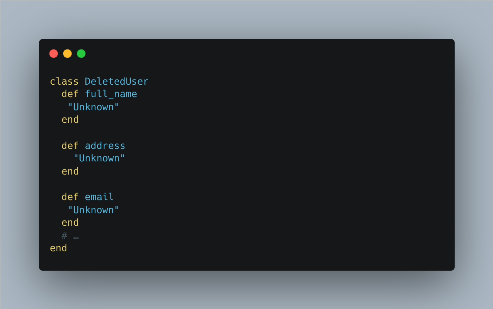

One of the most common errors developers encounter is NoMethodError. It occurs when code is executed according to a script not provided by the programmer.

Junior devs often try to solve this problem in a non optimal way. Let’s look at some examples of bad code:
```ruby
@user = User.find_by(email: "deleted@user.com")
@user.first_name
```
If the user is not in the database or is flagged as “deleted”.
Then we will get an error:
```ruby
undefined method `first_name' for nil:NilClass
```
A very common solution to this problem is this:
```ruby
@user.try(:first_name)
```
Or by using a conditional operator:
```ruby
if @user.exists?
 @user.first_name
end
```
This code doesn’t look very smart. The problem is that this check can occur in different places in the project and it is much more convenient to manage this behavior in one place. In addition, this code violates the Tell-Don’t-Ask principle. The **NullObject** pattern just solves these problems.

## Solution
First, let’s write a **NullObject** for a User type object:

```ruby
class DeletedUser
  def full_name
   "Unknown"
  end

  def address
    "Unknown"
  end
  
  def email
   "Unknown"
  end
  # …
end
```
So now we have an object that we can return when a user is not found:
```ruby
@user = User.find_by(email: "deleted@user.com") || DeletedUser.new
@user.first_name #=> "Unknown"
```
Now we are sure that the object will always respond to the methods we expect it to respond to.