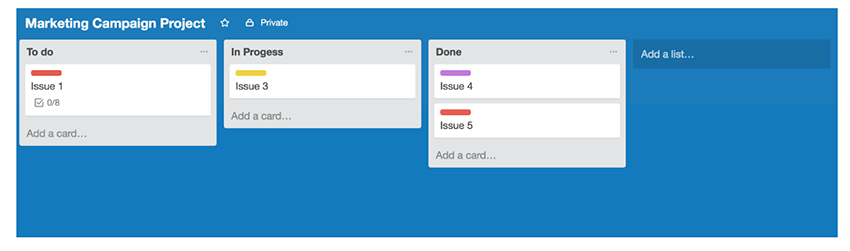

 on [Unsplash](https://unsplash.com/s/photos/clients?utm_source=unsplash&utm_medium=referral&utm_content=creditCopyText)](file_0.jpeg)

What techniques do you use to work with the team in an async, remote environment? How to collaborate effectively within the distributed team located in different timezones and deliver tangible results on top of that?

In [JetThoughts](https://www.jetthoughts.com/), we got some common tactics we use when dealing with clients. They were built having [these tips](https://jtway.co/checklist-for-the-non-tech-founder-5c638133f899) in mind.

> # It’s vital to built trust and rapport with the client, so here are some best practices on how to achieve that

### 1. Over-communication by everyday updates

Always listen and read what your client needs and provide feedback right away, use async text standups to keep your customer in the loop.

If something happens, e.g. bug on production occurred, always explain how the whole fixing process is going to look like and if the client is okay with it, provide timeframes and hourly updates during the fixing process.

All customer requests should be answered on time; it’s always better to go through something twice rather than not mentioning it at all.

### 2. Real-time progress visibility with Kanban Board

Kanban board on Trello or Github is a place where we track the progress. Every task goes through several stages before the actual approval.

Along with text standups, the board keeps everyone in a loop of what’s going and how the progress is tracked.

Big tasks should always be split into smaller ones. How to define big tasks? It’s easy if the job takes more than two days — and you confirmed it during sprint planning estimation — it should be organized into smaller ones.

### 3. Frequent releases and demos

Every sprint should be finished with a product demo — which shows off all the new features, bug fixes, UI changes that were done throughout the whole sprint.

When it comes to your sprint results, huge features, or significant changes in functionality need to be visualized and explained.
> **TIP:** We heavily use [Loom](https://www.loom.com/) for screencasts recording, both internally and externally. It’s always better to record a screencast one time and send the link to every member you’d like to get feedback from, rather than go through calls or chats and showing it during a screen sharing session, prepare visuals, etc.

### 4. Task-checking

Ideally, product owners or their representatives should be involved in the checking process and have everything they need to check all the tasks, except for really techy-ones, and the whole git-flow should be built around it. The last comment should mention them using ‘@' and the credentials along with test cases, checking algorithms should be provided.

> # This cheat-sheet will help you with managing your project even without prior experience and will help you to get a better understanding of how it works in practice

**Paul Keen** is an Open Source Contributor and a Chief Technology Officer at [JetThoughts](https://www.jetthoughts.com). Follow him on [LinkedIn](https://www.linkedin.com/in/paul-keen/) or [GitHub](https://github.com/pftg).
> *If you enjoyed this story, we recommend reading our[latest tech stories](https://jtway.co/latest) and trending [tech stories](https://jtway.co/trending).*
