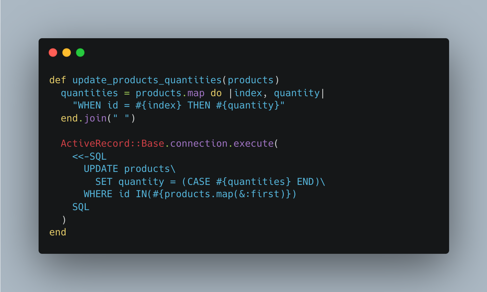

Recently in a project, we encountered the fact that sometimes we had a DB Deadlocks error. After some experiments, we realized that this is due to the fact that we have too large a transaction and it mixes searching creating, and updating actions.

_Code example (In the real project, the transaction was much larger):_

```ruby
ActiveRecord::Base.transaction do
  # 1. Creating a new order
  order = Order.create(user_id: current_user.id, total_price: 0)
  
  # 2. Adding products to the order
  products = Product.where(id: [1, 2, 3])
  products.each do |product|
    order_items = OrderItem.create(order_id: order.id, product_id: product.id, quantity: 1, price: product.price)
    order.total_price += order_items.price
  end
  
  # 3. Updating user balance
  user = User.find(current_user.id)
  user.balance -= order.total_price
  user.save!
  
  # 4. Updating product quantity in stock
  products.each do |product|
    product.update(quantity: product.quantity - 1)
  end
  
  # 5. Creating a new record in user's purchase history
  purchase_history = PurchaseHistory.create(user_id: current_user.id, order_id: order.id)
  
  # 6. Sending a notification to the user about a successful purchase
  message = "Thank you for your purchase! Your order №#{order.id} for the amount of #{order.total_price} rubles has been successfully placed."
  Notification.create(user_id: current_user.id, message: message)
end
```
If we execute queries to search or retrieve data before the start of the transaction, then we will reduce the likelihood of locking tables in the database and can speed up the transaction.

```ruby
# Get products that user wants to buy
products = Product.where(id: [1, 2, 3])

# Get user who is making the purchase
user = User.find(current_user.id)

# Check if user has enough balance to make the purchase
if user.balance < products.sum(:price)
  # If not, display an error message
  flash[:error] = "You don't have enough balance to make this purchase"
  redirect_to root_path
else
  ActiveRecord::Base.transaction do
    # 1. Creating a new order
    order = Order.create(user_id: user.id, total_price: 0)

    # 2. Adding products to the order
    products.each do |product|
      order_items = OrderItem.create(order_id: order.id, product_id: product.id, quantity: 1, price: product.price)
      order.total_price += order_items.price
    end

    # 3. Updating user balance
    user.balance -= order.total_price
    user.save!

    # 4. Updating product quantity in stock
    products.each do |product|
      product.update(quantity: product.quantity - 1)
    end

    # 5. Creating a new record in user's purchase history
    purchase_history = PurchaseHistory.create(user_id: user.id, order_id: order.id)

    # 6. Sending a notification to the user about a successful purchase
    message = "Thank you for your purchase! Your order №#{order.id} for the amount of #{order.total_price} rubles has been successfully placed."
    Notification.create(user_id: user.id, message: message)

    # Display a success message
    flash[:success] = "Your purchase has been successfully placed!"
    redirect_to root_path
  end
end
```

Let’s take a closer look at the 4th action within a transaction. We can apply a trick here and do everything in one request.

```sql
UPDATE products
  SET quantity = CASE 
    WHEN id = 1 THEN 5 
    WHEN id = 2 THEN 6 
    WHEN id = 3 THEN 11
   END
WHERE id IN(1,2,3)
```

We can generate such a query using the following function:

```ruby
    def update_products_quantities(products)
      quantities = products.map do |index, quantity|
        "WHEN id = #{index} THEN #{quantity}"
      end.join(" ")
      
      ActiveRecord::Base.connection.execute(
        <<-SQL
          UPDATE products\
            SET quantity = (CASE #{quantities} END)\
          WHERE id IN(#{products.map(&:first)})
        SQL
      )
    end
```
Now let’s use the new function in a transaction.

```ruby
# Get products that user wants to buy
products = Product.where(id: [1, 2, 3])

# Get user who is making the purchase
user = User.find(current_user.id)

# Check if user has enough balance to make the purchase
if user.balance < products.sum(:price)
  # If not, display an error message
  flash[:error] = "You don't have enough balance to make this purchase"
  redirect_to root_path
else
  ActiveRecord::Base.transaction do
    # 1. Creating a new order
    order = Order.create(user_id: user.id, total_price: 0)

    # 2. Adding products to the order
    products.each do |product|
      order_items = OrderItem.create(order_id: order.id, product_id: product.id, quantity: 1, price: product.price)
      order.total_price += order_items.price
    end

    # 3. Updating user balance
    user.balance -= order.total_price
    user.save!

    # 4. Updating product quantity in stock
    update_products_quantities(products.pluck(:id, :quantity))

    # 5. Creating a new record in user's purchase history
    purchase_history = PurchaseHistory.create(user_id: user.id, order_id: order.id)

    # 6. Sending a notification to the user about a successful purchase
    message = "Thank you for your purchase! Your order №#{order.id} for the amount of #{order.total_price} rubles has been successfully placed."
    Notification.create(user_id: user.id, message: message)

    # Display a success message
    flash[:success] = "Your purchase has been successfully placed!"
    redirect_to root_path
  end
end
```

I am sure that by using these tricks you will be able to further improve this transaction, for example, to predict the total cost of the order.