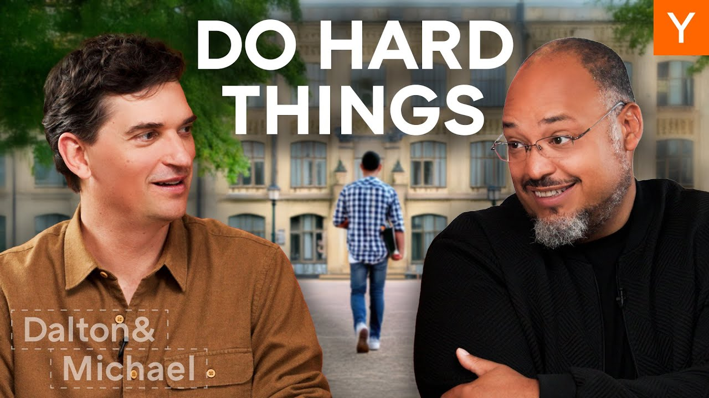

Your 20s are a unique time in life. It’s a decade filled with opportunities, risks, and self-discovery. Many people find themselves with fewer responsibilities, making it the perfect time to explore, take chances, and invest in personal growth. In this post, we’ll dive into how to navigate this pivotal decade effectively.

### Key Takeaways

*   Embrace the idea of the **hedonic treadmill** and learn to delay gratification.
*   Focus on doing the **hardcore things** early in your career.
*   Be **risk-seeking** rather than risk-averse.
*   Surround yourself with **positive influences** and like-minded people.
*   Consider the benefits of **long-term relationships** in your 20s.

### Understanding The Hedonic Treadmill

The **hedonic treadmill** is a concept that explains how we quickly adapt to new experiences. When you get something new, like a toy as a kid, it feels amazing at first. But soon, that excitement fades, and you find yourself wanting more. This cycle can lead to a constant chase for new experiences without ever feeling satisfied.

In your 20s, this can be dangerous. Social media amplifies this feeling. You see everyone living their best lives, and it can make you feel like you’re missing out. But remember, most of what you see online is curated. It’s essential to focus on your own journey and not get caught up in the comparison game.

### Do The Hardcore Things Early

One of the best pieces of advice for your 20s is to tackle the **hardcore things** early in your career. This means pushing yourself to work hard and take on challenges. It’s easier to mellow out later than to ramp up your ambition after years of taking it easy.

Here are some examples of what this might look like:

1.  **First Job**: Don’t settle for a job that’s too comfortable. Choose something that challenges you.
2.  **Living Situation**: Your first apartment doesn’t need to be a luxury space. Keep it simple to allow for growth later.
3.  **Travel**: Your first vacations can be budget-friendly. Save the luxury trips for later when you have more resources.

### Embrace Risk

Your 20s are a prime time to be **risk-seeking**. You likely have fewer responsibilities, making it easier to take chances. Many people avoid risks due to fear, often instilled by parents or societal expectations. But remember, the worst-case scenario often isn’t as bad as it seems.

When considering a risk, ask yourself:

*   What’s the worst that can happen?
*   If that happens, what can I do?
*   Can I find another job if needed?

By breaking down the fear, you may find that taking risks is worth it.

### The Importance Of Your Circle

Who you spend time with matters. Your personality is shaped by the people around you. If you want to grow, surround yourself with those who inspire you. This can mean changing your friend group or even moving to a new city.

Consider these points:

*   **Roommates**: The people you live with can significantly impact your mindset.
*   **Work Environment**: Seek out workplaces with talented individuals. This can open doors for you.
*   **Networking**: Attend events or join groups that align with your interests. You never know who you might meet.

### Relationships In Your 20s

A controversial piece of advice is to seek **long-term relationships** in your 20s. While some may argue against tying yourself down, having a supportive partner can be beneficial. A strong relationship can recharge you and provide stability as you pursue your goals.

Here’s why:

*   **Support System**: A partner can help you navigate challenges.
*   **Practice Stability**: Being in a stable relationship can prepare you for future commitments.
*   **Shared Goals**: Working towards common goals can strengthen your bond.

### Final Thoughts

As you navigate your 20s, remember that this decade is crucial for laying the foundation for your future. Don’t be the person who looks back and wonders where the time went. Embrace challenges, take risks, and surround yourself with positive influences. Your 20s are a time to explore and grow, so make the most of them!