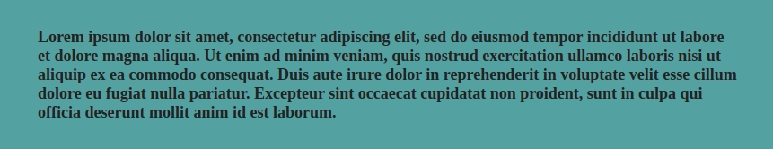
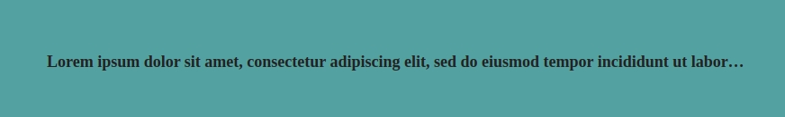

```html
<p>Lorem ipsum dolor sit amet, consectetur adipiscing elit, sed do eiusmod tempor incididunt ut labore et dolore magna aliqua. Ut enim ad minim veniam, quis nostrud exercitation ullamco laboris nisi ut aliquip ex ea commodo consequat. Duis aute irure dolor in reprehenderit in voluptate velit esse cillum dolore eu fugiat nulla pariatur. Excepteur sint occaecat cupidatat non proident, sunt in culpa qui officia deserunt mollit anim id est laborum.</p>
```


There is no native CSS property for truncating text. However, you can use the ellipsis character to display truncated text.
```css
p {
  max-width: 800px;
  overflow: hidden;
  white-space: nowrap;
  text-overflow: ellipsis;
}
```


Note we have given the element a fixed width. This is made because the element needs a certain width. 