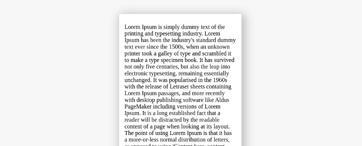

In order for the scroll to appear, you need to limit its `height` by adding height or `max-height` properties.

```css
.scroll-area {
  overflow-y: auto;
  max-height: 400px;
}
```

If you do not add this, your block will stretch to the entire height.





