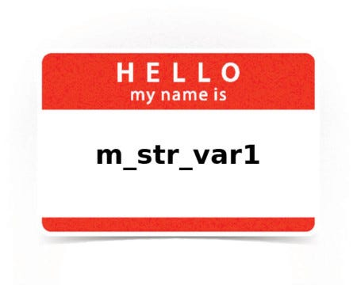

## How To Name Variables And Methods In Ruby


> # What’s in a name? that which we call a rose
> #By any other name would smell as sweet.
> # *― William Shakespeare, Romeo and Juliet*

Junior developers often struggle to choose good names for variables and methods they write. Or even dismiss the need in proper names without any struggle at all. I blame computer science education with its strange love for one-letter variables (or, when all letters are taken, then one-letter-and-a-number).

I remember being taught to declare variables a, b, c or s1, s2, s3 or functions f1, f2, and explain their purpose in comments. (Excessive use of comments to justify unreadable code is another problem area of CS education)

## Now I know my ABC’s next time won’t you sing with me

One-letter names are bad because they don’t tell anything except *“here’s this particular address in the memory where I store some value”,* and a reader of the code where such name is used has to exert mental effort on finding and keeping in mind what the name associated with. At first choosing, good names also take mental effort, but it eventually pays off, unlike the efforts of those who try to figure out unmeaningful names you wrote.

Naming variables by the first letter of the concept they represent is a good start, but it shouldn’t stop there.

```ruby
# bad
c = post.comments.where(published: true)
m = c.max_by(&:rating)

# good
post_comments = post.comments.where(published: true)
top_rated_comment = post_comments.max_by(&:rating)
```

Note how the second line in a *“good”* example tells you the complete story without the need to look at the first line. While in the *“bad”* example, there’s no way to figure out what happens in the second line without looking at the first one.

There are some exceptions, like using e for an exception in rescue-block, or i for a numeric index, or f for FormBuilder instance inside a view, or k, v for key-value pairs (although this one is often misused).


## The naming of cats is a difficult matter

Like cats in the famous poem, entities in our programs can be described by different names. It’s important to choose, depending on the context, one that represents the entity best for this context.

Consider this report on the coat patterns of cats in our database:

```ruby
hash = Cat.group(:coat).count
# => { 'tabby' => 99, 'black' => 11, 'calico' => 20, 'tuxedo' => 1 }

hash.each do |k, v|
  puts "Coat: #{k}"
  puts "Count: #{v}"
  puts "-" * 10
end
```

What’s wrong with that? The result of the query is indeed a Hash, and we iterate over its keys and values (and it’s okay to call them k, v). Right?

No. What’s wrong is that we named the variables by properties, irrelevant to the context. The line
```
    hash.each do |k, v|
```
tells us we’re iterating over some Hash while the following line implies that this hash has some “coat” for keys (still not clear what this is without looking at the top of the code), and the line after that tells that the values are some “count”.

But if we choose relevant names, each line tells the full story:

```ruby
cat_counts_by_coat = Cat.group(:coat).count
# => { 'tabby' => 99, 'black' => 11, 'calico' => 20, 'tuxedo' => 1 }
cat_counts_by_coat.each do |coat, count|
  puts "Coat: #{coat}"
  puts "Count: #{count}"
  puts "-" * 10
end
```

So, name your variables not just by what they represent, but by what is relevant for the context.

Following this advice, you may end up with really long and specific names, like neutered_cat_without_flees_counts_by_coat, because every part of that name is important for the context of your too-detailed report.

Such long names are actually a good thing, but not because it’s good to have such long names (it’s not), but because they indicate a problem with the context. They show that the class or method is trying to handle too many things at once, and you have to split it into smaller parts with as little dependencies as possible.


## Though this be madness, yet there is method in ‘t
> # *It may be necessary to use methods other than constitutional ones*
> # *― Robert Mugabe*

The first and the only president of Zimbabwe justified the use of unconstitutional methods in his struggle to move away from white minority rule of Rhodesia, but it turned out dreadful for the people, resulting in total corruption and poor economy.

If methods in your code will be unconstitutional (breaking coding conventions and denying common sense), you will also end up with a poor and corrupt code base.

So the general rules of meaningfulness should also apply to method names, but with several caveats.

Instance methods can be loosely divided into four groups: *accessor*, *mutator*, *imperative* and *predicate*.

**Accessor**(getter) methods return properties of the object or some representation of them. They are best named by the property they return. That’s usually a noun with some optional adjectives or possessive nouns. For example, User#first_name, Book#rating, Report#results.

Properties that describe some action that was performed on the entity are named with a verb in simple past tense, preposition and optionally a noun when it’s not evident by whom was the action performed. For example Account#created_at, Post#published_by, Article#referenced_in_indices. In some languages, specifically Java, such methods are prefixed with get_, but in Ruby, it’s not appreciated.

Also, note that method names take the class name into account, so if the class is named User, there is no point in having a method named user_email in that class. It’s just User#email. It makes sense to have an entity as a part of the method name only when this entity is represented by another class, or when it refers to other instance of the class, not the same we’re calling the method on. For example, Book#author_name, User#invited_by_user.

**Mutator **(setter) methods are ones that used to assign properties of the object. In Java, they are usually named as set_<property_name>, but in Ruby, it’s just <property_name>=(value). Namely, User#email=(value), Comment#body=(value) etc.

If your mutator method has to accept two or more arguments, you can’t have a method ending in =. Well, technically you can, but to invoke it you’ll have to use metaprogramming tricks. In that case, you have to strongly reconsider your approaches, and why you need a setter with multiple arguments in the first place. You probably need to create a separate class for that property at this point. Again, a good choice of names guides your application design.

**Imperative **methods either change some state (of the object, the app or even the outside world), or return some new data or transform existing data without mutating it.

They are usually named with a verb or a phrase in an imperative mood. Like Report#generate, Document#write_to_file(path), MessageService#send(from, to, body).

When you want to provide both a *“safe”* and a *“dangerous”* way of doing the same thing, name the *“dangerous”* method same as the *“safe”*, but with an *“!”* (exclamation mark) at the end.

Examples of *“safe”* and *“dangerous”* methods are Array#sort and Array#sort! from Ruby Core library, where the first method returns a new sorted array, leaving the original intact (which is considered *“safe”*, unless you take your RAM very seriously). And the other mutates the original array (which is in turn considered *“dangerous”*, because you may lose some data).

Other such examples are #update and #update! from ActiveRecord::Persistence, first one returning false in a case of validation errors and saving those errors in the model, and the second one raising an exception if the record is invalid. But if you don’t provide safe alternatives and all methods in the class are dangerous, there’s little point in using exclamation marks then.

**Predicate **methods always return *boolean*. They describe the object status in a yes/no manner, or if it’s a private method they can contain a named part of some long conditional. Their names should always end with a question mark.

Grammatically the names can be anything from adjectives like TrafficLight#green? to full-fledged sentences like WeatherService#should_i_take_an_umbrella?.

The general rule of thumb for picking a name for a predicate method: it should be something you can read in a question intonation, and it would make sense.

Of course, there may be methods that don’t fit into any of these four categories, and we did not cover class methods here at all, but in general, it’s all the same: the name should make sense and it should contain just the right amount of context to be clear — not more and not less.

**Paul Keen** is an Open Source Contributor and a Chief Technology Officer at [JetThoughts](https://www.jetthoughts.com). Follow him on [LinkedIn](https://www.linkedin.com/in/paul-keen/) or [GitHub](https://github.com/pftg).
>  If you enjoyed this story, we recommend reading our [latest tech stories](https://jtway.co/latest) and [trending tech stories](https://jtway.co/trending).
