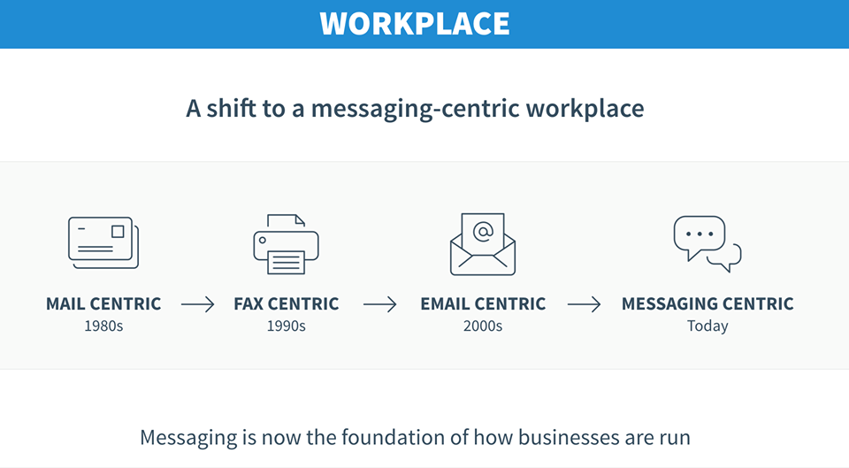
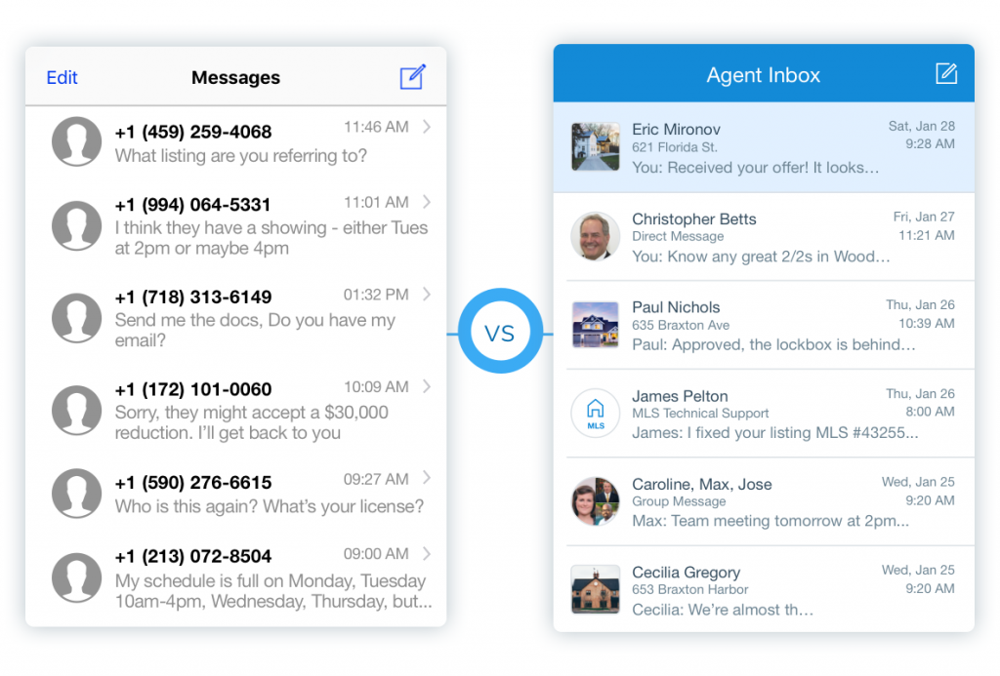
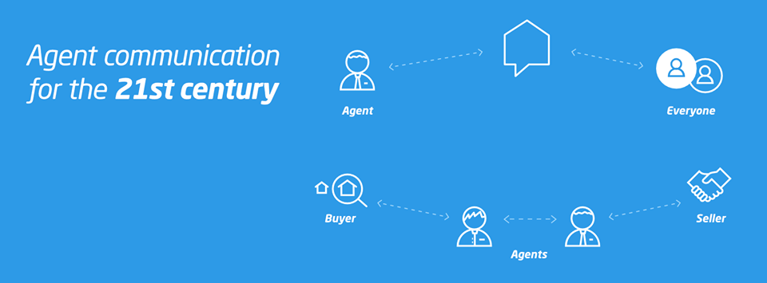
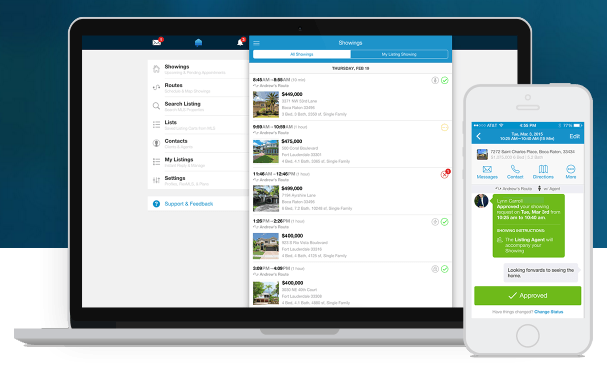

## **How Our Expertise Helped Curb Real Estate Communication Chaos**

*The story of building Agent Inbox’s mobile and desktop messaging platform.*

If you asked [*Elliot Koolik](https://www.linkedin.com/in/elliotkoolik/)* for one complaint about his job, he’d have an answer ready for you in an instant. ***Inefficient communication.***

[*Koolik](https://www.linkedin.com/in/elliotkoolik/)* had been selling real estate in sunny [Boca Raton, Florida](https://en.wikipedia.org/wiki/Boca_Raton,_Florida) for nearly 25 years. He enjoyed the fast-paced nature of the industry, with properties going on and off the market, showings happening all over the town, and constantly evolving deals.
> # But he struggled to keep up with the communication necessary to maximize his productivity every day.

Too much time was spent checking email, deciphering text messages, and sifting through various messaging apps in an attempt to keep up with the multiple conversations happening at once.

He and business partner *Tyler Gordon *vented frustrations before turning that energy into ideas for how to transform communication in the real estate industry. They wondered: *What if there was a way to centralize all communication into one platform?*

This was the start of what would become [Agent Inbox](https://www.jetthoughts.com/agentinbox), the world’s leading real estate messaging platform. We were hired to build and deliver mobile versions for the [Apple App Store](https://itunes.apple.com/us/app/hello-show/id938410567) and Google Play, as well an enterprise version for desktop.

At launch, [Agent Inbox](https://www.jetthoughts.com/agentinbox) became recognized for facilitating easy, seamless communication between agents, brokerages, and customers powered by [Multiple Listing Service (MLS)](https://www.investopedia.com/terms/m/multiple-listing-service-mls.asp) data.

## The Importance of Eliminating Client Uncertainty in Development

We know the development process can be filled with uncertainty, especially when approached without necessary technical expertise. After an initial phase of development, [Agent Inbox](https://www.jetthoughts.com/agentinbox) had run into a dead end. At that point, we were hired with an overarching goal to step in and reduce client uncertainty by using proven technologies and stable coding practices, as well as focusing on clear communication and the implementation of an aggressive but realistic timeline for launch.

We immediately began development of an initial product that [Agent Inbox](https://www.jetthoughts.com/agentinbox) could showcase on the market, and within two months, we’d cleaned the [MLS](https://en.wikipedia.org/wiki/Multiple_listing_service) data, organized and optimized its integration for reduced [cycle time](https://www.isixsigma.com/dictionary/cycle-time/), and were able to deliver the first [MVP](https://www.agilealliance.org/glossary/mvp/). This gave the founders and sales team the ability to attract investors and customers, which in turn, helped scale up the development process.

The team grew from 1 to 6 developers within the first year and we gained trust as a development provider. In total, we worked with [Agent Inbox](https://www.jetthoughts.com/agentinbox) over a 4-year period, and a portion of that time was dedicated to company growth. We introduced code review, integrated automatized tests, and eliminated inefficiencies, all of which significantly reduced the cost of onboarding new developers with future company growth in mind.

## Technical Triumphs and Challenges

We went through our fair share of ups and downs during a 4-year period. But by far, the ups outweighed the downs. We’re proud to say we helped [Agent Inbox](https://www.jetthoughts.com/agentinbox) launch mobile and desktop versions of its messaging platform, filled with features that were beloved by users, and even helped them reach 100,000 users in under a year, which surpassed expectations.

On the back end, we worked to migrate data from [Spark](https://sparkplatform.com/docs) (a data processing engine) to a custom, in-house [RETS ](https://en.wikipedia.org/wiki/Real_Estate_Transaction_Standard)(real estate transaction standard) aggregator, which helped dramatically grow the customer base. We also moved [Agent Inbox](https://www.jetthoughts.com/agentinbox) to a hybrid solution using [React.js](https://reactjs.org/) and [Ruby on Rails](https://rubyonrails.org/), replacing their [single-page-application](https://en.wikipedia.org/wiki/Single-page_application) solution with [server-side rendering](https://flaviocopes.com/react-server-side-rendering/) to improve project stability and speed. (This move came from our experience knowing that small teams working on various platforms simultaneously often end up inadvertently wasting time and money.)

On the front end, users were able to make the most of our foundational messaging capabilities, including secure file and document sharing and a seamless way to keep track of detailed conversations.

We designed a non-trivial algorithm for finding the best routes so agents can plan out their busy days to include traffic-related travel time, meeting duration, lunch breaks, and more. Being aware of how often plans can change throughout the day, especially in real estate, we also developed push notifications to alert them of any shifts in schedule.

With all of this in mind — and with a powerful, custom messaging solution on the market — we’re confident that if you asked [*Elliot Koolik](https://www.linkedin.com/in/elliotkoolik/)* again about his #1 job complaint, inefficient communication would no longer be his answer.

**Paul Keen** is an Open Source Contributor and a Chief Technology Officer at [JetThoughts](https://www.jetthoughts.com). Follow him on [LinkedIn](https://www.linkedin.com/in/paul-keen/) or [GitHub](https://github.com/pftg).
>  If you enjoyed this story, we recommend reading our [latest tech stories](https://jtway.co/latest) and [trending tech stories](https://jtway.co/trending).
