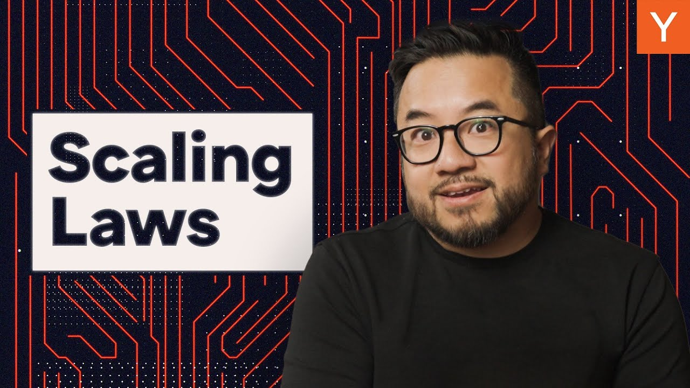

In recent years, AI labs have embraced a strategy of scaling up large language models (LLMs). By increasing parameters, data, and compute power, they have seen consistent improvements in model performance. However, the AI community is now debating whether we have reached the limits of this approach or if a new paradigm is on the horizon.

### Key Takeaways

*   Scaling laws have driven improvements in AI models.
*   Larger models require more data and compute.
*   Recent research suggests previous models may have been undertrained.
*   New paradigms in AI scaling could lead to breakthroughs in intelligence.

## The Rise of Large Language Models

Large language models are getting bigger and smarter. Over the past few years, AI labs have found a winning strategy: **more parameters, more data, and more compute**. This approach has led to significant improvements in model performance, akin to Moore's Law, but with a faster doubling rate.

In November 2019, OpenAI released GPT-2, boasting 1.5 billion parameters. The following summer, GPT-3 arrived, over 100 times larger and more capable. This marked the true arrival of scaling laws in AI.

## Understanding Scaling Laws

Think of training AI models like cooking. You need three main ingredients:

1.  **The Model**: The architecture and parameters.
2.  **The Data**: The information used for training.
3.  **Compute Power**: The hardware that runs the training.

The scaling laws paper revealed that increasing all three ingredients leads to consistent improvements in performance. The results showed that performance depends more on scale than on the algorithm itself.

## The Chinchilla Breakthrough

In 2022, Google DeepMind introduced a new perspective on scaling laws. They found that it’s not just about making models bigger; it’s also about training them on enough data. They trained over 400 models of varying sizes and data amounts. Surprisingly, they discovered that previous models like GPT-3 were undertrained.

They introduced **Chinchilla**, a model less than half the size of GPT-3 but trained on four times more data. Chinchilla outperformed models twice or even three times its size. This finding shifted the focus from merely increasing model size to ensuring adequate training data.

## Are We Hitting a Wall?

Despite the successes, there’s growing concern in the AI community. Some experts argue that we may have reached the limits of scaling laws. The latest models are larger and more expensive, but the improvements in capabilities seem to be plateauing.

Recent leaks from major labs indicate issues with training runs and diminishing returns. There’s also a worry about running out of high-quality data to train new models. If the old scaling laws are losing their edge, what comes next?

## A New Paradigm for AI

OpenAI's new class of reasoning models hints at a potential shift. These models, like **01** and its successor **03**, learn to think through complex problems. The longer they think, the better they perform. 03 has already smashed benchmarks in various fields, suggesting a new direction for AI scaling.

Instead of just increasing model size, researchers may focus on scaling the compute available during the model's reasoning process. This approach, known as **test time compute**, allows models to leverage more compute power when tackling tougher problems.

## The Future of AI Scaling

While large language models may be in their midgame, the early game for scaling other modalities is just beginning. The principles of scaling apply to various models, including image diffusion, protein folding, and robotics.

As we look ahead, it’s clear that the journey of AI is far from over. The potential for breakthroughs in intelligence is vast, and the next steps in scaling could unlock capabilities we never thought possible. Buckle up; the future of AI is just getting started!