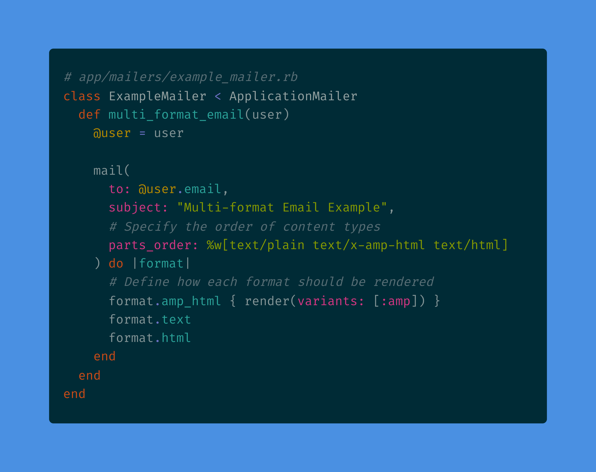

## Introduction

This comprehensive guide is designed for Ruby on Rails developers who need to implement custom email content types in their applications. We'll demonstrate how to enhance your Ruby on Rails development skills by implementing AMP for Email as an example, though these techniques apply to any custom content type you might need in your projects.



## Step 1: Register the MIME Type in Your Ruby on Rails Application

The first essential step is to register your custom MIME type in the Rails configuration.

Add the following to `config/initializers/mime_types.rb`:

```ruby
# config/initializers/mime_types.rb
Mime::Type.register "text/x-amp-html", :amp_html
```

This code instructs your Rails application about the new content type and associates it with a symbol (`:amp_html`), which is a core Rails development practice for extending functionality in your applications.

## Step 2: Set Up Your Mailer

Create a mailer that supports multiple content types:

```ruby
# app/mailers/example_mailer.rb
class ExampleMailer < ApplicationMailer
  def multi_format_email(user)
    @user = user
    
    mail(
      to: @user.email,
      subject: "Multi-format Email Example",
      # Specify the order of content types
      parts_order: %w[text/plain text/x-amp-html text/html]
    ) do |format|
      # Define how each format should be rendered
      format.amp_html { render(variants: [:amp]) }
      format.text
      format.html
    end
  end
end
```

## Step 3: Create View Templates

Create templates for each format. Rails will look for templates based on the format and variant:

```
app/views/example_mailer/
├── multi_format_email.html.erb           # Regular HTML version
├── multi_format_email.text.erb           # Plain text version
└── multi_format_email.html+amp.erb       # AMP HTML version
```

## Step 4: Create the Layout (Optional)

If you need a special layout for your custom content type:

```
app/views/layouts/
└── mailer.html+amp.erb
```

Example layout for AMP emails:

```erb
<!DOCTYPE html>
<html ⚡4email>
<head>
  <meta charset="utf-8">
  <style amp4email-boilerplate>body{visibility:hidden}</style>
  <script async src="https://cdn.ampproject.org/v0.js"></script>
  <%= yield :head %>
</head>
<body>
  <%= yield %>
</body>
</html>
```

## Step 5: Create View Content

Example of a view template with custom content type:

```erb
<%# app/views/example_mailer/multi_format_email.html+amp.erb %>
<% content_for :head do %>
  <%# Add any format-specific resources %>
  <script async custom-element="amp-list" src="https://cdn.ampproject.org/v0/amp-list-0.1.js"></script>
<% end %>

<div>
  <h1>Hello <%= @user.name %></h1>
  <%# Your email content here %>
</div>
```

## Ruby on Rails Development Best Practices for Email Implementation

When implementing custom email content types in your Ruby on Rails projects, follow these industry standards practiced by seasoned developers:

1. **Implement Robust Fallbacks**: Professional Rails developers always provide both HTML and plain text versions of all emails to ensure deliverability for clients that don't support your custom format.

2. **Optimize Content Type Order**: A key technique used by experienced Ruby on Rails developers is to specify the `parts_order` in your mailer to control which version clients prioritize:

   ```ruby
   parts_order: %w[text/plain text/x-amp-html text/html]
   ```

3. **Follow Rails Template Organization Conventions**: Senior developers structure their codebase using the `+variant` suffix for variant-specific templates (e.g., `email.html+amp.erb`), which is critical for maintainable code in large development teams.

4. **Implement Comprehensive Testing**: Quality-focused Ruby on Rails developers always test how emails render across different email clients, ensuring a consistent user experience.

## Common Patterns

### Template Variants

Use variants to keep your templates organized:

```ruby
# In your mailer
format.amp_html { render(variants: [:amp]) }

# In your view
<%= render partial: "content", variants: [:amp] %>
```

## Debugging Tips for Ruby on Rails Developers

For effective email functionality development, experienced Ruby on Rails developers rely on these debugging techniques:

1. **Verify Email Content Types**: Ensure proper format implementation with this Rails console command:

   ```ruby
   email = ExampleMailer.multi_format_email(user)
   email.parts.map(&:content_type)
   ```

2. **Configure Development Environment for Email Testing**: Set up your Rails development environment to preview emails:

   ```ruby
   # config/initializers/development.rb
   config.action_mailer.preview_path = "#{Rails.root}/spec/mailers/previews"
   ```

3. **Implement Continuous Testing**: Professional Ruby on Rails developers establish consistent testing protocols across different email clients, as support for custom content types varies widely.

## Advanced Tips for Ruby on Rails Developers

### Performance Optimization

Experienced developers know that email rendering can impact application performance. Consider using background jobs for email generation:

```ruby
# app/jobs/send_custom_email_job.rb
class SendCustomEmailJob < ApplicationJob
  queue_as :default
  
  def perform(user_id)
    user = User.find(user_id)
    ExampleMailer.multi_format_email(user).deliver_now
  end
end

# Usage
SendCustomEmailJob.perform_later(user.id)
```

### Development Environment Setup

For a smooth development workflow, configure your Rails environment:

```ruby
# config/environments/development.rb
config.action_mailer.perform_deliveries = true
config.action_mailer.raise_delivery_errors = true
config.action_mailer.delivery_method = :letter_opener
```

## Conclusion for Ruby on Rails Developers

This guide provides Rails developers with the knowledge needed to implement custom email content types efficiently. By following these Ruby on Rails-specific practices, developers can create more dynamic, interactive email experiences while maintaining compatibility across email clients. Whether you're enhancing an existing Rails application or building new functionality, these techniques represent current best practices in Ruby on Rails development and will help you stand out as a skilled Rails developer.
