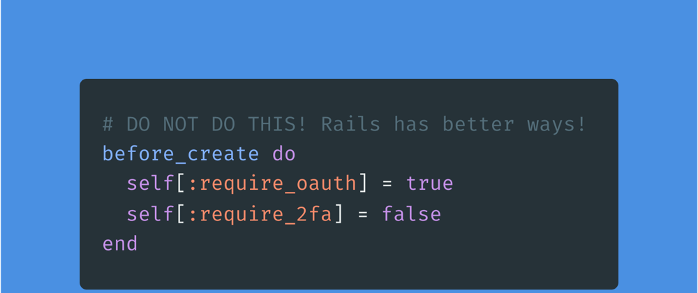

_Have you ever thought setting default values for attributes in Ruby on Rails could be problematic?_





Since attributes are uninitialized when a new model is created without any parameters, default values will be set according to the attribute type.

This idea is perfect if we don't want to fill the database with unnecessary information.

Ruby on Rails provides many options for adding default values, but not all of them are good.

Here is a list of good examples of how you should add default values:

- Option 1: Set the default value directly in the database via migrations.
- Option 2: Use `after_initialize` callback.
- Option 3: Use `before_validate` callback. Set the default value in the model, but only if it is nil.

## Option 1: Set the default value directly in the database via migrations

In Ruby on Rails, you can set default values for database attributes by including them in your migration.

The syntax is `default: 'value'`.

This is useful if you want to define many attributes at once. When looking at your `db/schema.rb` file, it's easy to see the default value at a glance.

```ruby
class CreateUsers < ActiveRecord::Migration
  def change
    create_table :users do |t|
      t.string :name, default: "First Last", null: false
    end
  end
end
```

## Option 2: Use `after_initialize` callback

There is `after_initialize` callback to help a developer to set default values,
especially if they are required to do some computation.

This callback is invoked after initiating the model so the developer can access default values before updating it.

For example, let's say we want to set a default name for our user in our app:

```ruby
class User < ApplicationRecord
  after_initialize :set_defaults

  def set_defaults
    name = "First Last"
  end
end
```

## Option 3: Use `before_validate` callback. Set the default value in the model when it is missed

In Ruby on Rails, you can use `before_validation` to set default values for model attributes.

This is a great way to ensure that your models always have valid attributes, and it's elementary to do:

```ruby
class User < ApplicationRecord
  before_validation :set_defaults
  
  private

  def set_defaults
    name = "First Last" if name.blank?
  end
end
```

## Option 4: Through Rails Attributes API 

And last most ideal way is to use [Rails Attributes API](https://api.rubyonrails.org/classes/ActiveRecord/Attributes/ClassMethods.html#method-i-attribute). You can add default value in the model like `attribute :my_string, :string, default: "new default"`

```ruby
# db/schema.rb
create_table :store_listings, force: true do |t|
  t.string :my_string, default: "original default"
end

StoreListing.new.my_string # => "original default"

# app/models/store_listing.rb
class StoreListing < ActiveRecord::Base
  attribute :my_string, :string, default: "new default"
end

StoreListing.new.my_string # => "new default"

class Product < ActiveRecord::Base
  attribute :my_default_proc, :datetime, default: -> { Time.now }
end

Product.new.my_default_proc # => 2015-05-30 11:04:48 -0600
sleep 1
Product.new.my_default_proc # => 2015-05-30 11:04:49 -0600
```

And that's it!

## It is worth mentioning:
- Do not override with default values original changes, which breaks the ActiveRecord contract:
```ruby
def set_defaults
  name = "First Last"
end
```
(This unexpected behavior will confuse developers)

- Do not set defaults after validations. Prefer to add default values only before validation to make sure that we support consistency
```ruby
before_save :set_defaults

private

def set_defaults
  name = nil if name.blank?
end
```
(This will add invalid data in the DB or raise Runtime Error)

---

**Paul Keen** is an Open Source Contributor and a Chief Technology Officer at [JetThoughts](https://www.jetthoughts.com). Follow him on [LinkedIn](https://www.linkedin.com/in/paul-keen/) or [GitHub](https://github.com/pftg).
> If you enjoyed this story, we recommend reading our latest tech stories and trending [tech stories](https://jetthoughts.com/blog/).