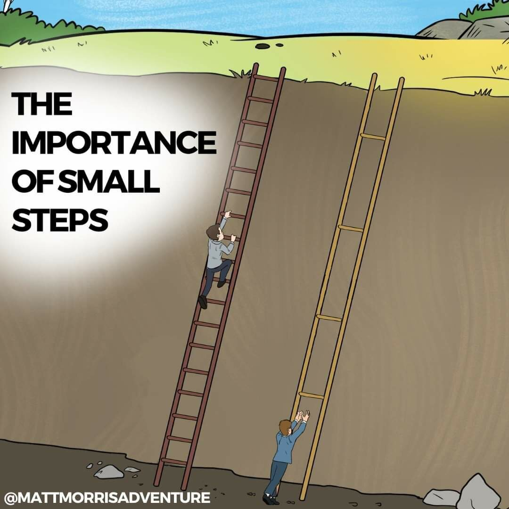

In many companies, teams work together to achieve big goals. One way to keep the team productive is by focusing on small pull requests (PRs). But what does that mean, and how does it help?

### What is a Small PR?

A small PR is a bite-sized change made to the code or project. Instead of making one huge update, a team member focuses on a smaller, more manageable piece of work. This change is easy to review, understand, and merge with the main project.

### How Does It Help?

1.  **Faster Reviews:** A tiny PR is quicker to check. The team can spot mistakes faster and offer feedback without delay, keeping things moving smoothly.
2.  **Less Stress:** Working on smaller tasks is less overwhelming. Team members feel confident knowing they can finish their work without too much pressure. Focusing on one thing at a time also helps reduce bugs.
3.  **Better Collaboration:** Small PRs encourage team members to talk more often. They can review each other's work, offer advice, and improve the project together. It builds trust and enhances the quality of the project.
4.  **Fewer Conflicts:** With large PRs, it's easy to have conflicts when two people work on the same parts of a project. Small PRs reduce this risk. Each piece of work fits in more quickly, keeping the project stable.

### How to Start

Encourage your team to break down tasks into smaller parts. Set a rule to keep PRs small and focused. This easy change can have a big impact on productivity.

By embracing small PRs, teams can work faster, reduce stress, and create better projects. Try it and see the difference in your team's productivity!