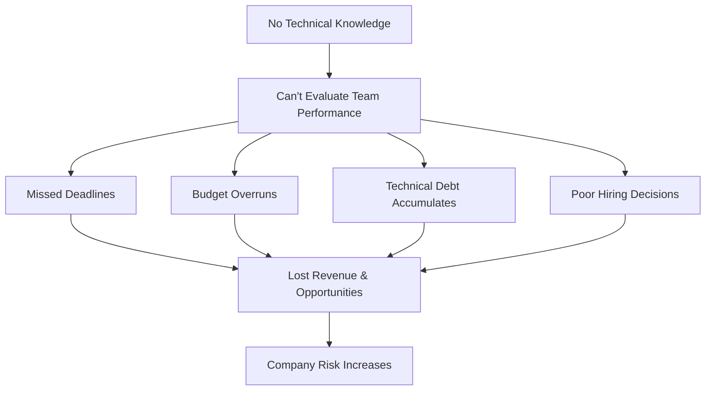
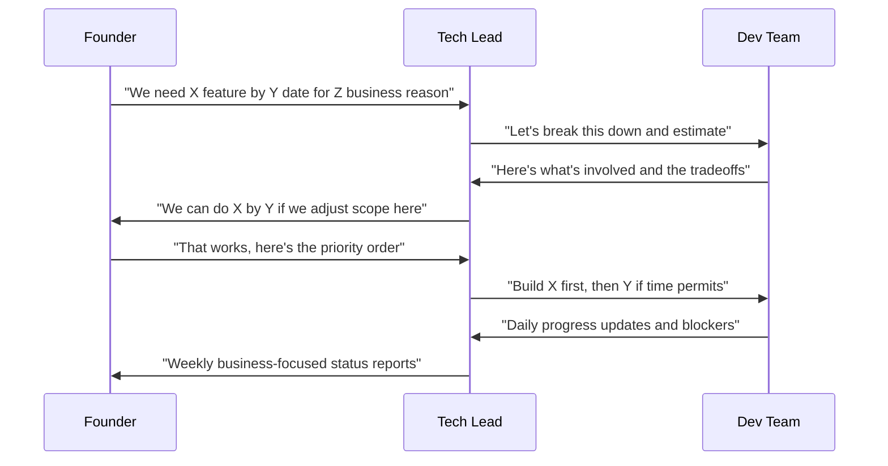

Your dev team says they need two months. Is that reasonable? You have no idea.

This scenario plays out in thousands of startups every day. You're brilliant at your business domain – maybe you're a killer salesperson, a design genius, or an industry expert. But when your technical co-founder left or you're hiring your first dev team, you're suddenly responsible for managing people who speak in acronyms and seem to live in a world of mysterious complexity.

We've seen this exact situation 200+ times with clients at JetThoughts.

Here's the truth: you don't need to code to manage developers effectively. You need the right framework, clear communication patterns, and metrics that translate technical work into business outcomes.

## The visibility problem that's costing you money

When you can't evaluate your development team's work, everything becomes a black box. You're flying blind, and that has real consequences:

The companies we work with typically lose 20-30% of their development budget to inefficiencies before implementing proper management frameworks. That's not just money – it's missed opportunities, delayed launches, and competitive disadvantage.

## What actually matters: the essential metrics framework

Forget about lines of code or technical jargon. Here are the 4 metrics that'll give you real insight into your team's performance:

### 1. Feature cycle time

**What it is**: How long it takes from "we should build this" to "customers are using it"

**Why it matters**: This is your team's throughput. If simple features take months, you've got problems.

**Good benchmark**: Small features (1-2 weeks), medium features (2-4 weeks), large features (4-8 weeks)

**Red flags**: Everything takes "just a few more days" or estimates are consistently off by 2x or more

### 2. Deployment frequency

**What it is**: How often your team releases new code to customers

**Why it matters**: Frequent deployments mean faster feedback, fewer bugs, and better customer responsiveness.

**Good benchmark**: Daily to weekly deployments for most businesses

**Red flags**: Monthly or less frequent deployments, "big bang" releases, fear of deploying on Fridays

### 3. Bug escape rate

**What it is**: How many bugs customers find vs. how many your team catches internally

**Why it matters**: Customer-found bugs are expensive – they hurt your reputation and require emergency fixes.

**Good benchmark**: 80% of bugs caught before customers see them

**Red flags**: Constant firefighting, customer complaints about quality, emergency patches every week

### 4. Developer happiness scores

**What it is**: Regular check-ins on team satisfaction, challenges, and career growth

**Why it matters**: Happy developers are productive developers. Unhappy ones leave, taking all their knowledge with you.

**Good benchmark**: Monthly team retrospectives, quarterly one-on-ones, annual satisfaction surveys

**Red flags**: High turnover (developers leaving after 6-12 months), complaints about "legacy code," developers saying they "can't add features without breaking things," or team requests for training being consistently denied

## The communication framework that actually works

The biggest failure point isn't technical – it's communication. Here's how to bridge the gap between business needs and technical constraints:

### Weekly business review template

Here's the exact template we use with our clients for weekly dev team reviews:

**Business impact this week:**
- Features delivered to customers
- Customer-facing bugs fixed
- Progress toward quarterly goals

**Upcoming deliverables:**
- What's completing next week
- What might be at risk and why
- Decisions needed from leadership

**Resource needs:**
- Blockers requiring business input
- Dependencies on other teams
- Budget or tool requests

**Team health:**
- Any departures or new hires
- Training or conference requests
- Process improvements implemented

## Your 30-day action plan

### Week 1: Baseline assessment

**Day 1-2**: Talk to each developer individually
- What's working well with our current process?
- What's frustrating or blocking you?
- If you could change one thing, what would it be?

**Day 3-4**: Review your current tracking
- How do you currently track development work?
- What metrics do you collect (if any)?
- How do you know if a project is on track?

**Day 5**: Establish baselines
- Average time from feature request to customer delivery
- Current deployment frequency
- Recent bug/customer complaint patterns

### Week 2: Communication systems

**Day 1-2**: Set up regular meetings
- Weekly business review (30 minutes max)
- Monthly retrospectives with the whole team
- Quarterly strategic planning sessions

**Day 3-4**: Create request templates
- Feature request template with business justification
- Bug report template with customer impact
- Change request process for scope adjustments

**Day 5**: Align on definitions
- What counts as "done"?
- How do we prioritize competing requests?
- What's our process for handling emergencies?

### Week 3: Metrics implementation

**Day 1-2**: Choose your tracking tools
- Feature tracking: Linear, Jira, or Trello
- Communication: Slack threads or dedicated channels
- Documentation: Notion, Confluence, or shared docs

**Day 3-4**: Start measuring
- Begin tracking cycle times for new features
- Document deployment frequency
- Set up bug tracking and customer feedback loops

**Day 5**: First metrics review
- Review the data you've collected
- Identify patterns and outliers
- Adjust tracking as needed

### Week 4: Review and adjust

**Day 1-2**: Team feedback session
- What's working with the new processes?
- What feels like overhead without value?
- What would make the team more effective?

**Day 3-4**: Business impact assessment
- Are you getting better visibility?
- Can you make more informed decisions?
- What questions do you still have?

**Day 5**: Plan improvements
- Refine your processes based on feedback
- Set goals for the next 30 days
- Schedule regular review cycles

## When to get outside help

Even with the best framework, you might need expert guidance. Here are the warning signs that suggest bringing in engineering management consultants:

**Immediate red flags:**
- Multiple missed deadlines without clear explanations
- Team turnover above 25% annually
- Customer complaints about bugs or performance
- Developers expressing frustration with technical debt

**Strategic concerns:**
- Planning a major technical initiative (new platform, scaling challenges)
- Evaluating whether to build in-house vs. outsource
- Preparing for due diligence or technical audits
- Growing from 5 to 15+ developers

**Growth planning:**
- Hiring your first engineering manager
- Deciding between technical and non-technical leadership
- Setting up processes for remote or distributed teams
- Planning multi-year technical roadmaps

## Your next steps

Managing developers without coding experience isn't just possible – it's exactly what hundreds of successful founders do every day. The key isn't learning to code; it's learning to translate between business needs and technical reality.

Start with one metric this week. Pick feature cycle time, set up a simple tracking spreadsheet, and measure three features from request to customer delivery. You'll be surprised how much clarity this brings to what felt like chaos.

Want to accelerate your progress? We've created a comprehensive **Developer Performance Scorecard** that helps non-technical founders evaluate their teams objectively. It includes:

- 15-minute team assessment framework
- Red flag identification checklist
- Benchmark comparisons for your industry
- Action plan templates for common issues
- Interview questions for hiring technical talent



Remember: your job isn't to become technical. It's to create an environment where technical people can do their best work while driving business outcomes. With the right framework, you can do that without writing a single line of code.

---

**Need help implementing these systems?** Our [Emergency CTO services](/services/emergency-cto) are designed specifically for non-technical founders managing development teams. We'll work with you to establish metrics, improve communication, and optimize your team's performance – no coding required.

---

**The JetThoughts Content Team** specializes in translating complex technical concepts into actionable business guidance. With 18+ years of experience helping non-technical founders scale their development teams, we've seen every challenge you're facing. Connect with us on [LinkedIn](https://linkedin.com/company/jetthoughts).